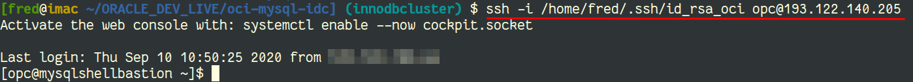
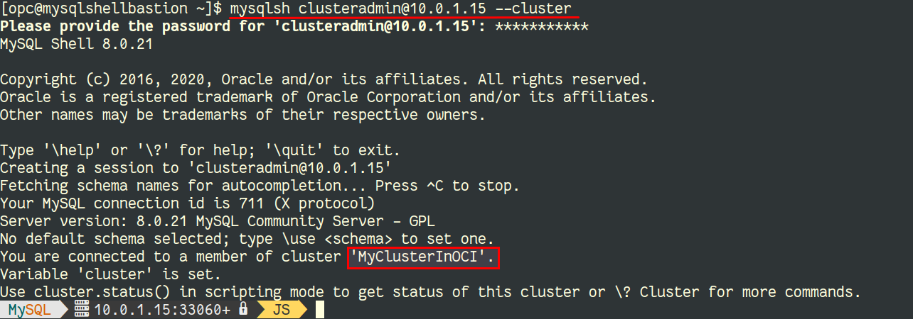

# MySQL InnoDB Cluster

## Introduction

In this lab, you will connect to the bastion host to check the status of your MySQL InnoDB Cluster.

Estimated Lab Time: 10 minutes

## Task 1: SSH to Bastion Host

1. To connect to the bastion host, we use ssh with the user **opc** on the public IP and the ssh key you created earliers.

    💡 The public IP was returned by `terraform apply` and is also available on OCI's Dashboard when checking the Compute Instances.

    

## Task 2: MySQL Shell

1. MySQL Shell is an advanced client and code editor for MySQL Server. It also allows you to manage a MySQL InnoDB Cluster via the [AdminAPI](https://dev.mysql.com/doc/dev/mysqlsh-api-python/8.0/group___admin_a_p_i.html).

2. When connected to the bastion host, you can use MySQL Shell (`mysqlsh`) with the `clusteradmin` user on one of the private IPs for your cluster nodes (see `terraform appy`'s output):

    

    ⚠️ please use your IPs, they should be in the range `10.0.1.0/24`.

## Task 3: MySQL InnoDB Cluster - Status

1. You can now check the status of the cluster or the router, using `cluster.status()` and `cluster.listRouters()`:

    

    

*You can proceed to the next lab…*

## Acknowledgements

- **Author** - [Frédéric Descamps](https://lefred.be)
- **Contributors** - Kamryn Vinson, Database Product Management
- **Last Updated By/Date** - Frédéric Descamps, September 2020

