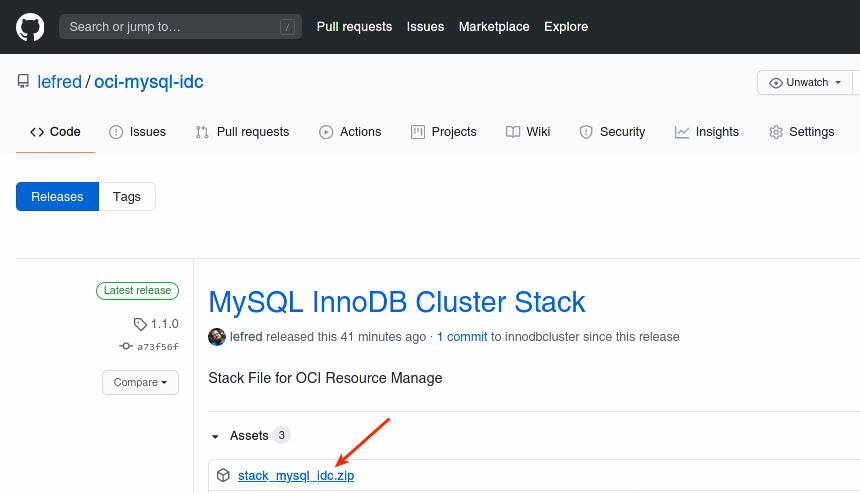
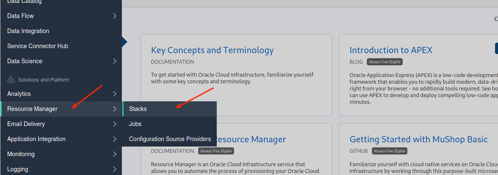
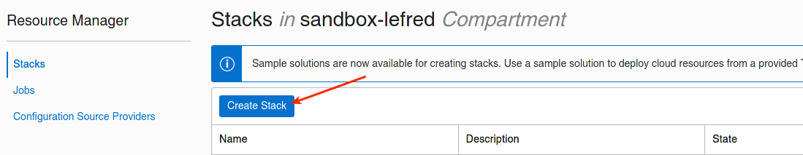
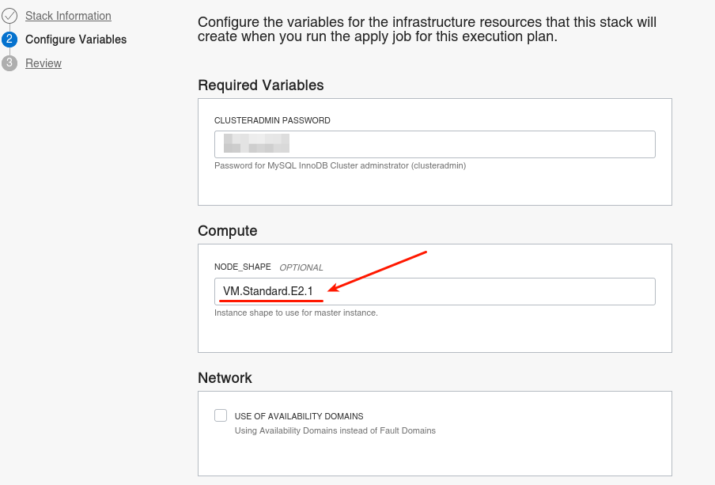
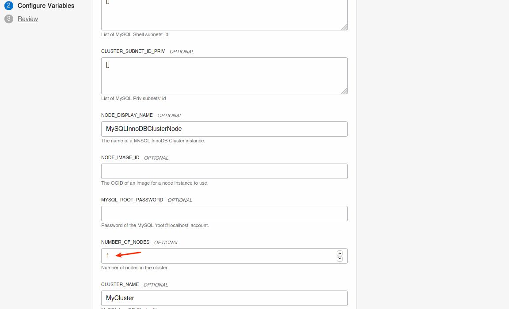
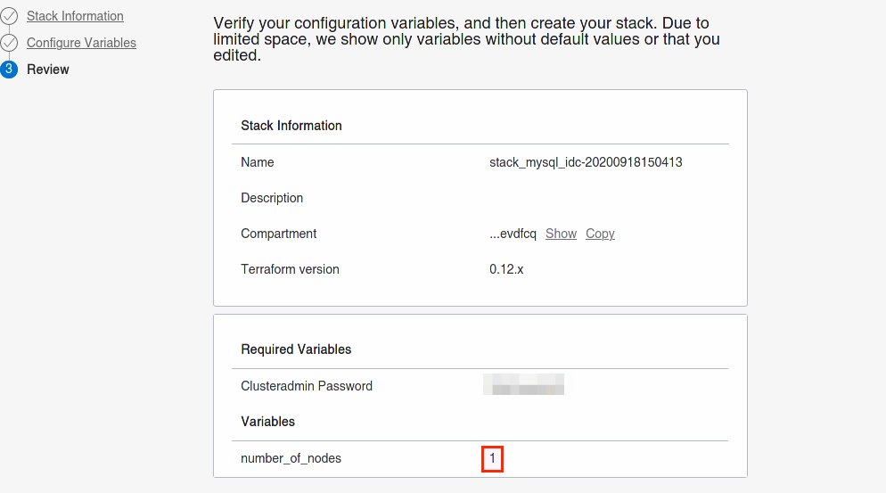
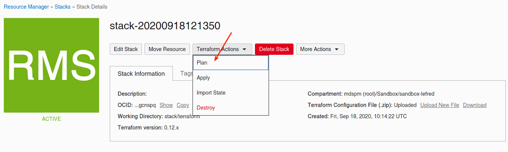
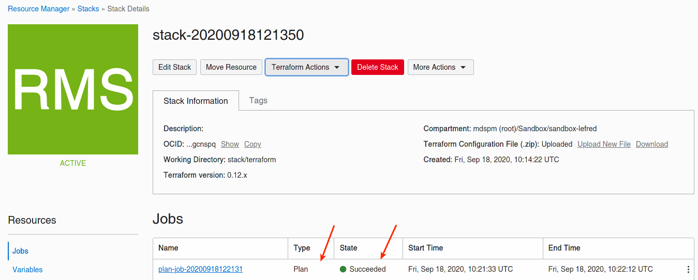
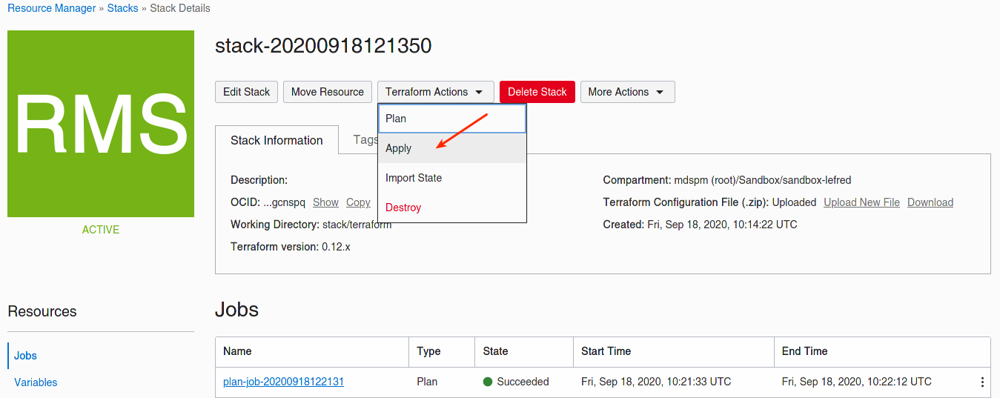

# Resource Manager - Stack

## Introduction

In this final lab, you will use OCI Resource Manager and deploy a stack to create a MySQL InnoDB Cluster.

Estimated Lab Time: 10 minutes

## Task 1: Download the stack

You need to download the stack package (zip file) and save it on your disk.

1. Download **`stack_mysql_idc.zip`** from [GitHub](https://github.com/lefred/oci-mysql-idc/releases/tag/1.1.0).

    

## Task 2: Create the stack

1. Please go in OCI's dashboard and select **Resource Manager** and then **Stacks**:

    

    

2. Select **My Configuration**, choose the **.ZIP FILE** button, click the **Browse** link and select the stack_mysql_idc.zip zip file that you downloaded. Click **Select**.

    


3. Now you need to fill some variables:

    


## Task 3: Plan

1. As Resource Manager is also using Terraform, you can plan the new created stack. This will create a new job:

    

    

## Task 4: Apply

1. We can now apply our stack:

    

2. Logs are shown almost in realtime:

    

3. This time as we didn't enter any SSH key, the apply job will output one you have to use to connect to your bastion host:

    

## Task 5: Connection

1. You can now copy the returned SSH private key and connect to the bastion host:

    ```
    $ vi priv.key
    <-- paste the content in the file and save it -->
    $ chmod 600 priv.key
    $ ssh -i priv.key opc@130.61.xx.xx
    [opc@mysqlshellbastion ~]$
    ```

    💡 The public IP was returned by the apply job and is also available on OCI's Dashboard when checking the Compute Instances. You can always returned to the output logs of the job.

## Task 6: Use your MySQL InnoDB Cluster

You can now use MySQL Shell like you did in Step 2 & 3 of Lab 4.

   ```
   mysql-js> cluster=dba.getCluster()
   mysql-js> cluster.status()
   ...
   ```

Thank you for attending this MySQL InnoDB Cluster & OCI hands-on lab.


## Acknowledgements

- **Author** - [Frédéric Descamps](https://lefred.be)
- **Contributors** - Kamryn Vinson, Database Product Management
- **Last Updated By/Date** - Frédéric Descamps, September 2020

