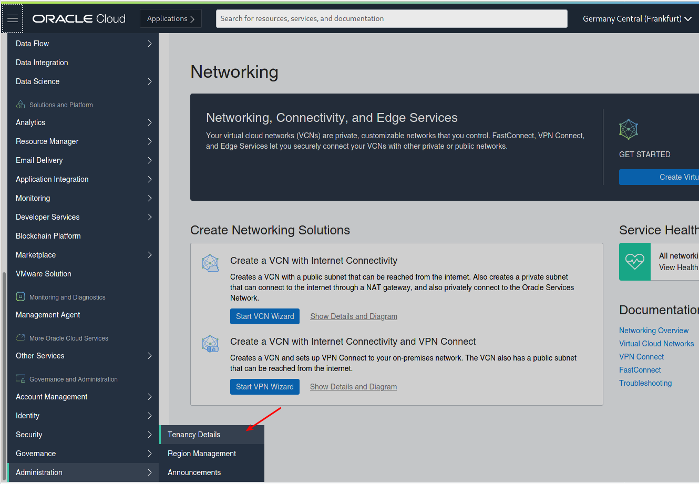
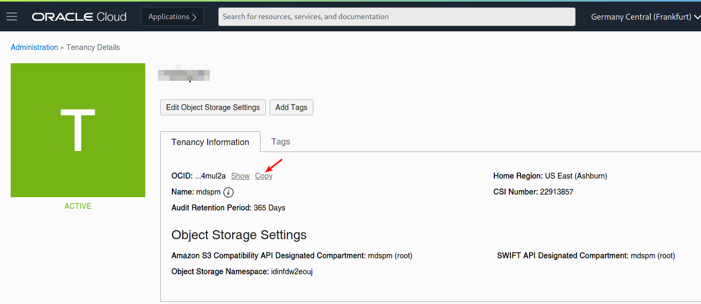
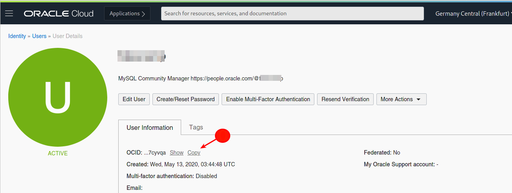
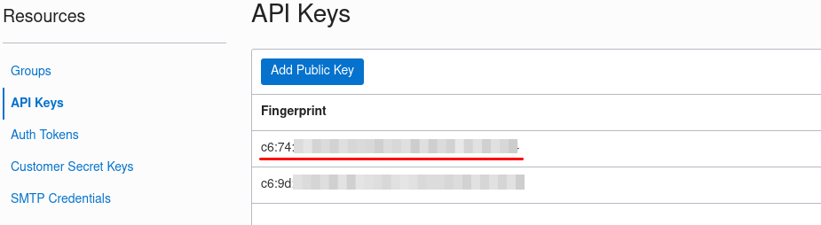
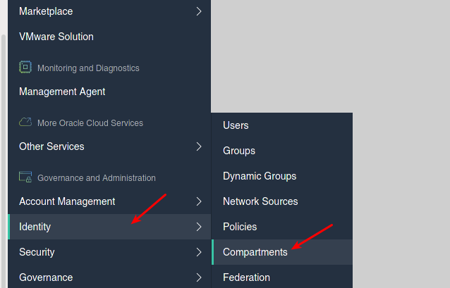
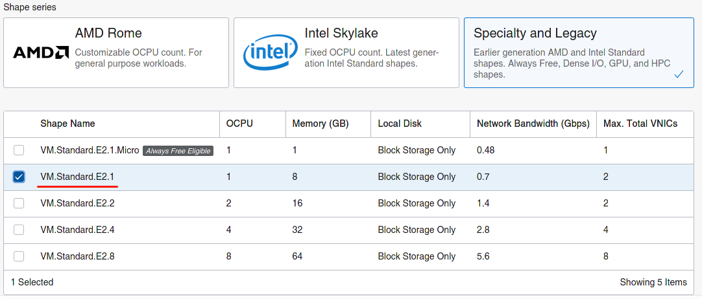

# Terraform Environment

## Introduction

In this lab, you will retrieve the code for the Terraform infrastructure and learn how to configure it to use it with Oracle Cloud Infrastructure.

Estimated Lab Time: 20 minutes
 
## Task 1: Getting the code

1. The code to use with Terraform is located in github [here](https://github.com/lefred/oci-mysql-idc.git)

    ```
    $ git clone https://github.com/lefred/oci-mysql-idc.git
    ```

💡 those commands need to be run in the **bash** console (from git for Windows) if you are using that operating system.

## Task 2: Creating terraform.tfvars

1. The repository includes a template for `terraform.tfvars`, you can copy it to start editing it:

    ```
    $ cd oci-mysql-idc
    $ cp terraform.tfvars.template terraform.tfvars
    ``` 

    We now have something like this: 

    ```
    tenancy_ocid = "<REPLACE_ME>"
    user_ocid = "<REPLACE_ME>"
    fingerprint= "RE:PL:AC:E_:ME:__:RE:PL:AC:E_:ME:__:XX:XX:XX:XX"
    private_key_path = "<REPLACE_ME>.pem"

    region = "<REPLACE_ME>"

    compartment_ocid = "<REPLACE_ME>"

    ssh_authorized_keys_path = "<REPLACE_ME>"
    ssh_private_key_path = "<REPLACE_ME>"

    clusteradmin_password = "<REPLACE_ME>"
    cluster_name = "MyClusterInOCI"

    number_of_nodes = "3"

    node_shape = "VM.Standard.E2.1"
    ```

## Task 3: tenancy_ocid

1. You need to edit the new created `terraform.tfvars` file with required information to reach your OCI environment.

    We start with the `tenancy_ocid`:

      

    

## Task 4: user_ocid

1. We also need to provide the `user_ocid`:

    

## Task 5: fingerprint and API Key

1. The private\_key\_path value is the path of oci\_api\_key.pem:

    ```
    private_key_path = "/home/fred/.oci/oci_api_key.pem"
    ```

    💡 On Windows relative paths seem to better work:

    ```
    private_key_path = "../.oci/oci_api_key.pem"
    ```

2. The fingerprint is shown on OCI's dashboard:

    

## Task 6: region

1. The region of your Free Tier account.

    Examples:

    ```
    region = "us-ashburn-1"
    ```

    or 

    ```
    region = "eu-frankfurt-1"
    ```

## Task 7: compartment_ocid

1. You certainly not have any sandbox created, but in case you do, you can go down the compartment tree and pick to one you need. Today you only need to choose one:

    

    

## Task 8: SSH Keys

1. You need to specify the keys that will allow you to connect in ssh to the compute instances (only via the bastion host to the MySQL InnoDB Cluster nodes).

2. Pay attention to provide the right path (absolute or private) and to verify that the private keys are those **without** .pub !

    ```
    ssh_authorized_keys_path = "/home/fred/.ssh/id_rsa_oci.pub"
    ssh_private_key_path = "/home/fred/.ssh/id_rsa_oci"
    ```

## Task 9: Cluster Information

1. You need to provide some information related to the cluster:

    * `clusteradmin_password`: the password for the user called `clusteradmin`. This is the user that will manage the cluster.

    * `cluster_name`: a name for your cluster. In the slides we use **"MyClusterInOCI"**.

    * `number_of_nodes`: the amount of nodes to deploy in your MySQL InnoDB Cluster. To achieve automatic HA, 3 nodes are required. For testing the deployment, only one is enough.


## Task 10: Node Shape

1. Finally, you need to specify the Compute Instance's Shape. Of course it depends on your limits.

    The different shapes can be found on OCI Dashboard:

    

You can get more info [here](https://docs.cloud.oracle.com/en-us/iaas/Content/Compute/References/computeshapes.htm).

*You can proceed to the next lab…*

## Acknowledgements

- **Author** - [Frédéric Descamps](https://lefred.be)
- **Contributors** - Kamryn Vinson, Database Product Management
- **Last Updated By/Date** - Frédéric Descamps, September 2020

