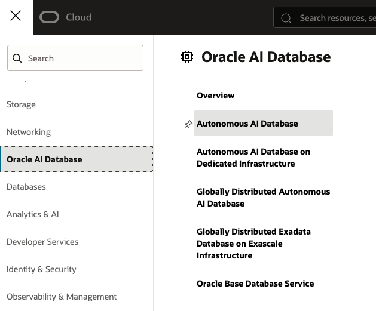
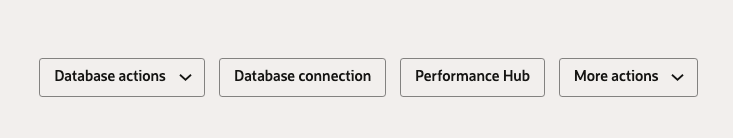
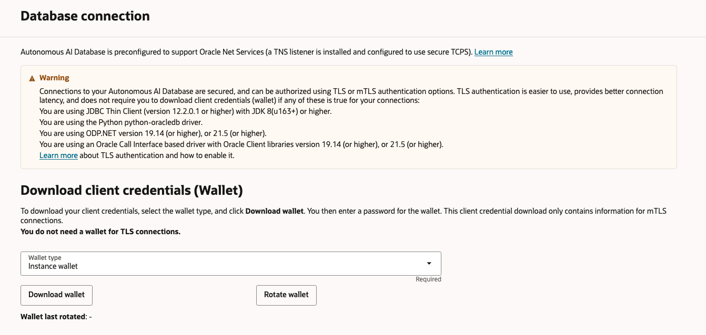

# Get started - Oracle AI Database on Oracle Cloud Infrastructure (OCI)

## Introduction

This lab configures up your local environment for a mTLS connection between Oracle Autonomous AI Database and the OKafka client.

Estimated Time: 15 minutes

### Objectives

* Download your Oracle Autonomous AI Database Wallet
* Configure the Database Wallet for OKafka
* Configure your OKafka environment to connect to Oracle Autonomous AI Database

### Prerequisites

This lab assumes you have:

* Completed the "Get Started" lab, and have access to an Oracle Autonomous AI Database instance.
* `git` installed and on your PATH.

## Task 1: Download the Oracle Autonomous AI Database Wallet

From the sandbox account, navigate to Oracle AI Database, and choose Autonomous AI Database.



Select your database instance, and then navigate to and click the "Database connection" button to open connection options.



In the Database connection dialogue, click "Download wallet". You will be prompted to enter a password for the wallet, which can be any password of your choosing.



Confirm and download the wallet ZIP file to your computer.
## Task 2: Configure The Wallet For OKafka

Unzip and inspect the database wallet, which should contain the following files used for authentication to Oracle AI Database:

```
/wallet
├── cwallet.sso
├── cwallet.sso.lck
├── ewallet.p12
├── ewallet.p12.lck
├── ewallet.pem
├── keystore.jks
├── ojdbc.properties -- You will need to modify this file!
├── README
├── sqlnet.ora
├── tnsnames.ora
└── truststore.jks
```

The `ojdbc.properties` file containers connection parameters for the Oracle JDBC driver. Open this file in a code editor, and configure the database password, and keystore/truststore passwords:

`ojdbc.properties`:
```properties
<copy>
# This user is automatically created for the lab.
user = TESTUSER
# Your database password is randomly generated for the lab,
# and is available in the lab info.
password = <your database user password
# Connection property while using Oracle wallets.
oracle.net.wallet_location=(SOURCE=(METHOD=FILE)(METHOD_DATA=(DIRECTORY=${TNS_ADMIN})))
# Set the correct password for both trustStorePassword and keyStorePassword.
# It's the password you specified when downloading the wallet from OCI Console or the Service Console.
javax.net.ssl.trustStore=${TNS_ADMIN}/truststore.jks
javax.net.ssl.trustStorePassword=<your keystore/truststore password>
javax.net.ssl.keyStore=${TNS_ADMIN}/keystore.jks
javax.net.ssl.keyStorePassword=<your keystore/truststore password>
</copy>
```

## Task 3: Clone The Lab Code

run the following command to checkout the lab code from GitHub:

```bash
<copy>
git clone --filter=blob:none --no-checkout https://github.com/oracle/microservices-datadriven.git
cd microservices-datadriven
git sparse-checkout init --cone
git sparse-checkout set code-teq/okafka-lab
git checkout main
</copy>
```

You may also view the lab code here: [OKafka Lab](https://github.com/oracle/microservices-datadriven/tree/main/code-teq/okafka-lab)

## Task 4: Set Environment Variables For OKafka

The sample application uses specific environment variables to configure the OKafka database connection.

Set the following environment variables using your database TNS alias and the path where you downloaded your database wallet:

```bash
<copy>
export TNS_ADMIN=<Database TNS Alias>
export WALLET_DIR=<Path to downloaded wallet>
export SECURITY_PROTOCOL="SSL"
</copy>
```

In the next labs, you may need to re-enter these environment variables if you create a new terminal. Save them for easy access later.

You may now **proceed to the next lab**.

## Acknowledgements

* **Author** - Anders Swanson, Developer Evangelist, November 2025
* **Contributors** - Anders Swanson
* **Last Updated By** - Anders Swanson, November 2025
