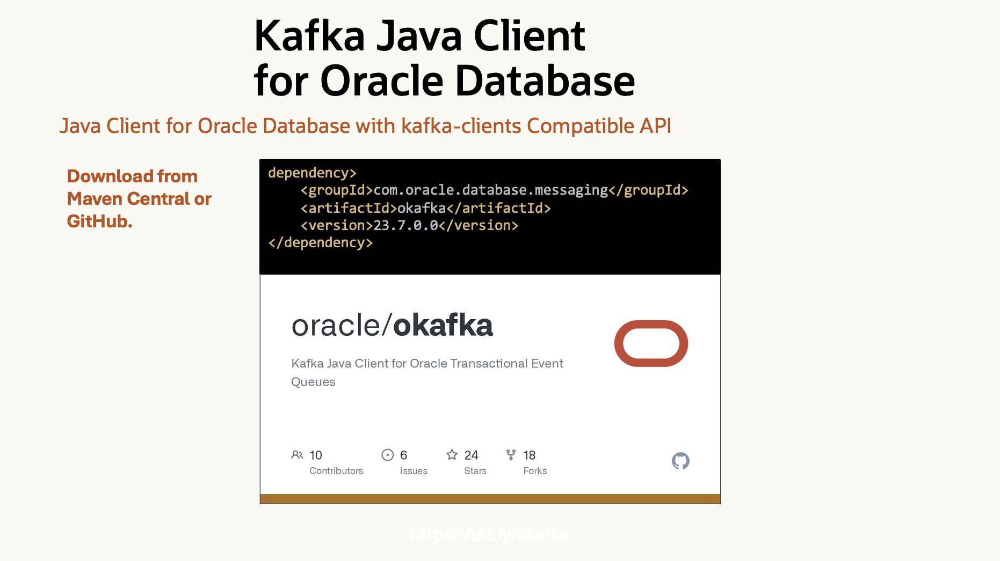
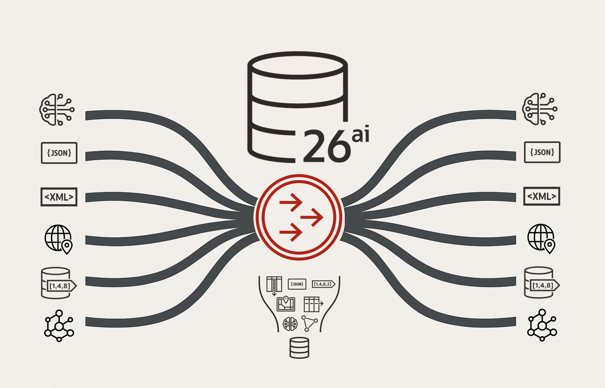

# Introduction

## About this Workshop

This workshop introduces you to the [Kafka Java Client for Oracle AI Database Transactional Event Queues (OKafka)](https://github.com/oracle/okafka), a kafka-clients compatible API for high-throughput event streaming in Oracle AI Database.

You get all the power of a message broker in Oracle AI Database, without provisioning or managing an external service.

Transactional Event Queues (TxEventQ) is a database-native, asynchronous messaging system that allows applications to publish and consume messages reliably within Oracle AI Database. 

TxEventQ provides similar functionality to external message brokers like Apache Kafka, but with full integration with database transactions. This means you can produce or consume messages as part of the same transaction as your DML operations (INSERT, UPDATE, DELETE), ensuring atomicity and consistency.

How TxEventQ Works:
- Producers enqueue messages to a topic (or queue) within the database. 
- Messages persist in the queue table, stored durably. 
- Consumers subscribe to queues and process messages asynchronously. 
- Both message consumption and database changes can occur in the same transaction. 
- If an error occurs, the transaction rolls back, ensuring neither database updates nor message offsets are committed.

Use Cases:
- Microservices messaging: Replace or supplement Kafka/RabbitMQ with a database-native event bus.
- Event sourcing: Persist domain events directly in Oracle Database. 
- Transactional workflows: Guarantee consistency for operations that involve both messages and DML. 
- Decoupled processing: Enable asynchronous background tasks triggered by database events.

Estimated Time: 120 minutes

### Objectives

In this workshop, you will learn how to:

* Connect to Oracle Database from the Oracle Database Kafka Java Client (OKafka)
* Create and run OKafka producers and consumers
* Run transactional producers to send messages and run DML in the same transaction
* Run transactional consumer to process messages run run DML in the same transaction

### Prerequisites

This lab assumes you have:

* A basic understanding of developing Java applications
* Java 21+
* Maven 3.9+

You may now **proceed to the next lab**.

## Acknowledgements

* **Author** - Anders Swanson, Developer Evangelist, November 2025
* **Contributors** - Anders Swanson
* **Last Updated By** - Anders Swanson, November 2025
