# Implementing Data Quality Control

## Introduction
This lab describes how to implement data quality control. An introduction to data integrity control is provided.

*Note*: ODI provides very basic quality checks. For complex use cases use Enterprise Data Quality (EDQ)

*Estimated Lab Time*: 60 minutes

### About Data Integrity Control
Data integrity control is essential in ensuring the overall consistency of the data in your information systems applications. Application data is not always valid for the constraints and declarative rules imposed by the information system. You may, for instance, find orders with no customer, or order lines with no product, and so forth.

Oracle Data Integrator provides a working environment to detect these constraint violations and to store them for recycling or reporting purposes. There are two different types of controls: *Static Control* and *Flow Control*. Refer to the Appendix section for more.

### Objectives
Some data in our source may be inconsistent. There may be constraints in the target table that are not implemented in the source table or there may be supplementary rules that you wish to add. In our case we have two constraints that we want to enforce on the SRC\_CUSTOMER table:
  * *Customers must be over 21 years of age.* However there could be some records corresponding to younger customers in the input table.
  * *The CITY\_ID column must refer to an entry in the SRC\_CITY table.* However there could be some values that do not exist in the city table.

We want to determine which rows do not satisfy these two constraints and automatically copy the corresponding invalid records into an error table for analysis.

Enforcing these types of rules requires the use of a *check constraint* (also referred to as a *condition*), as well as a *reference constraint* between the SRC\_CITY and SRC\_ CUSTOMER tables.

### Prerequisites
This lab assumes you have:
- Basic knowledge of Oracle Database
- A Free Tier, Paid or LiveLabs Oracle Cloud account
- You have completed:
    - Lab: Prepare Setup (*Free-tier* and *Paid Tenants* only)
    - Lab: Environment Setup
    - Lab: Initialize Environment

## Task 1: Creating Constraints
This step describes how to create the following constraints:

  * Age Constraint
  * Reference Constraint

Creating an age constraints consists in adding a data validity condition on a column. To create the age constraint:

1. In the Models accordion in Designer Navigator, expand the *Orders Application* model.
2. Expand the SRC\_CUSTOMER datastore.
3. Right-click the Constraints node and select **New Condition**

    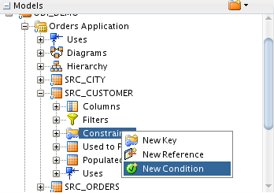  

4. In the Definition tab of the Condition Editor:
    * In the Name field, enter the name of your condition. For example: AGE \> 21.
    * From the Type list, select **Oracle Data Integrator Condition**.
    * In the Where clause field, enter the following SQL code: SRC\_CUSTOMER.AGE \> 21
    * In the Message field, specify the error message as it will appear in your error table:

    **Note:** You can enter this text directly in the Where clause field or you can use the Expression Editor. To open the Expression Editor click **Launch the expression editor** in the Where clause toolbar menu. The constraints created by Oracle Data Integrator are not actually created on the database. The constraints are stored in the ODI Repository.

    ```
    Customer Age is not over 21
    ```

    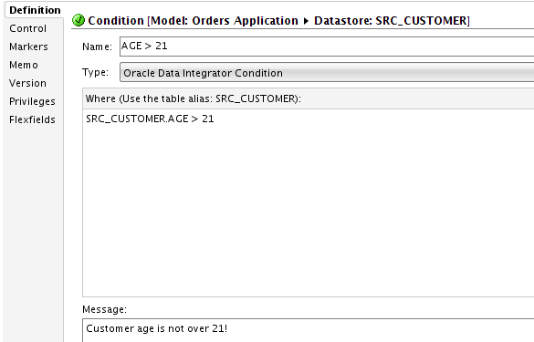

5.  From the File main menu, select **Save** to save the condition.

6. Reference Constraint

  This section describes how to create a reference constraint based on the CITY\_ID column between the SRC\_CUSTOMER table and the SRC\_CITY table. This constraint allows checking that customers are located in a city that exists in the SRC\_CITY table.

  To create the reference constraint:

    * In the Models accordion in Designer Navigator, expand the *Orders Application* model.
    * Expand the SRC\_CUSTOMER datastore.
    * Right-click the Constraints node and select **New Reference** as:

    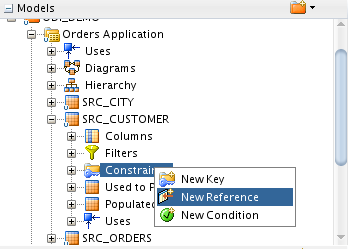

7.  In the Definition tab of the Reference Editor:
    * From the Type list, select **User Reference**.
    * From the Model list in the Parent Model/Table section, select **Orders Application**. This is the data model containing the table you want to link to.
    * From the Table list, select **SRC\_CITY**. This is the table you want to link to.

    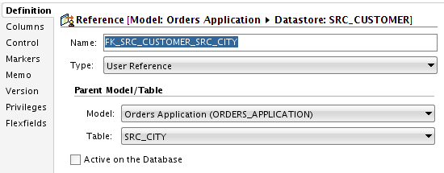  

8.  In the Reference Editor, go to the Attributes tab.

9.  On the Columns tab, click **Add**:

    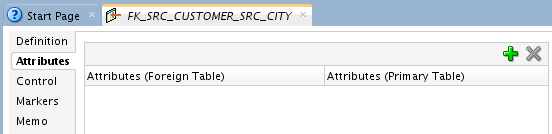

  A new row is inserted in the columns table.

10.  In this step you define the matching columns:
    * Click on the row that appears. This will bring up a drop-down list containing all of the columns in the appropriate table.
    * From the Columns (Foreign Table) list, select **CITY\_ID**.
    * From the Columns (Primary Table) list, select **CITY\_ID**.

    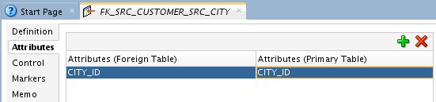

    *Note*: that in this example the Foreign Table is SRC\_CUSTOMER and the Primary Table is SRC\_CITY. Note also that it is not required for foreign keys that the column names of the Foreign Table and the Primary Table match. It just happens that they do in this example.

11.  Select **File** \> **Save** to save this reference.

## Task 2: Run the Static Control

Running the static control verifies the constraints defined on a datastore. You can now verify the data in the SRC\_CUSTOMER datastore against the constraints defined in *Creating Constraints*.

To run the static control:

1.  In the Models accordion in Designer Navigator, right-click the SRC\_CUSTOMER datastore.
2.  Select **Control** \> **Check**.
3.  The Execution dialog is displayed as shown:

  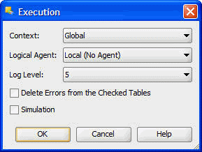

4.  Click **OK** in the Execution dialog.
5.  The Information Dialog is displayed as shown in Figure 5--8.

  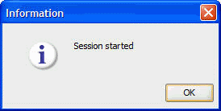

6.  Click **OK** in the Information Dialog.

Oracle Data Integrator automatically generates all of the code required to check your data and start an execution session.

## Task 3: Follow the Execution of the Control in Operator Navigator

Through Operator Navigator, you can view your execution results and manage your development executions in the sessions.
To view the execution results of your control:

1.  In the Session List accordion in Operator Navigator, expand the All Executions node.

The Session List displays all sessions organized per date, physical agent, status, keywords, and so forth.

2.  Refresh the displayed information clicking **Refresh** in the Operator Navigator toolbar.

The log for one execution session appears as shown:

  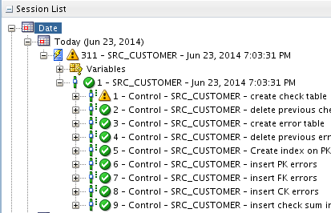

The log comprises 3 levels:
  * Session (corresponds to an execution of a scenario, a mapping, a package or a procedure undertaken by an execution agent)
  * Step (corresponds to a checked datastore, a mapping, a procedure or a step in a package or in a scenario)
  * Task (corresponds to an elementary task of the mapping, process or check)

## Task 4: Interpreting the Results in Operator Navigator
This section describes how to determine the invalid records. These are the records that do not satisfy the constraints and has been rejected by the static control.

1. Determining the Number of Invalid Records
    * In the Session List accordion in Operator Navigator, expand the All Executions node and the SRC\_CUSTOMER session.
    * Double-click the SRC\_CUSTOMER step to open the Session Step Editor.
    * The Record Statistics section details the changes performed during the static control. These changes include the number of inserts, updates, deletes, errors, and the total number of rows handled during this step.

  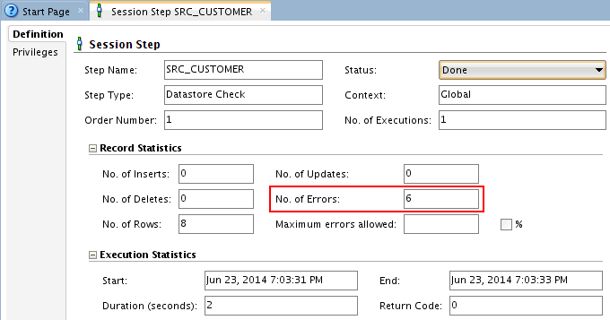

The number of invalid records is listed in the No. of Errors field. Note that the static control of the SRC\_CUSTOMER table has revealed **6** invalid records. These records have been isolated in an error table. See next section on *Reviewing the Invalid Records* for more information.

## Task 5: Reviewing the Invalid Records
You can access the invalid records by right-clicking on the table in your model and selecting **Control** \> **Errors\...**
To review the error table of the static control on the SRC\_CUSTOMER table:

1.  In Designer Navigator, expand the *Orders Application* model.
2.  Right-click the SRC\_CUSTOMER datastore.
3.  Select **Control** \> **Errors\...**
4.  The Error Table Editor is displayed as shown in Figure 5--11.

  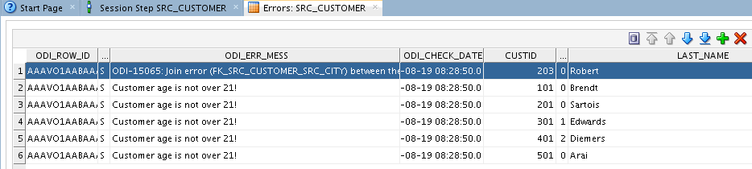

The records that were rejected by the check process are the following:
  * **5** records in violation of the AGE \> 21 constraint (the actual age of the customer is 21 or younger, see the AGE column for details).
  * **1** record in violation of the FK\_CITY\_CUSTOMER constraint (The CITY\_ID value does not exist in the SRC\_CITY table).

You can view the entire record in this Editor. This means that you can instantly see which values are incorrect, for example the invalid CITY\_ID value in the top record.
Note that the error message that is displayed is the one that you have defined when setting up the AGE \> 21 constraint in *Age Constraint*, earlier.

## **Appendix:** Data Integrity Control
Oracle Data Integrator provides a working environment to detect constraint violations and to store them for recycling or reporting purposes. There are two different types of controls: *Static Control* and *Flow Control*.

1. Static Control

Static Control implies the existence of rules that are used to verify the integrity of your application data. Some of these rules (referred to as constraints) may already be implemented in your data servers (using primary keys, reference constraints, etc.)
With Oracle Data Integrator, you can enhance the quality of your data by defining and checking additional constraints, without declaring them directly in your servers. This procedure is called **Static Control** since it allows you to perform checks directly on existing, *static*, data.

2. Flow Control
The information systems targeted by transformation and integration processes often implement their own declarative rules. The **Flow Control** function is used to verify an application's incoming data according to these constraints before loading the data into these targets. The flow control procedure is detailed in the *Mapping* lab.

3. Benefits
The main advantages of performing data integrity checks are the following:

  * *Increased productivity* by using the target database for its entire life cycle. Business rule violations in the data slow down application programming throughout the target database's life-cycle. Cleaning the transferred data can therefore reduce application programming time.
  * *Validation of the target database's model*. The rule violations detected do not always imply insufficient source data integrity. They may reveal a degree of incompleteness in the target model. Migrating the data before an application is rewritten makes it possible to validate a new data model while providing a test database in line with reality.
  * *Improved quality of service* for the end-users. Ensuring data integrity is not always a simple task. Indeed, it requires that any data violating declarative rules must be isolated and recycled. This implies the development of complex programming, in particular when the target database incorporates a mechanism for verifying integrity constraints. In terms of operational constraints, it is most efficient to implement a method for correcting erroneous data (on the source, target, or recycled flows) and then to reuse this method throughout the enterprise.

4. SRC\_CUSTOMER Control Example
This example guides you through the data integrity audit process (Static Control).
The *Orders Application* contains data that does not satisfy business rule constraints on a number of different levels. The objective is to determine which data in this application does not satisfy the constraints imposed by the information system.

You may now [proceed to the next lab](#next).

## Learn More
- [Oracle Data Integrator](https://docs.oracle.com/en/middleware/fusion-middleware/data-integrator/index.html)

## Acknowledgements

- **Author** - Narayanan Ramakrishnan, December 2020
- **Contributors** - Srivishnu Gullapalli
- **Last Updated By/Date** - Rene Fontcha, LiveLabs Platform Lead, NA Technology, January 2021
