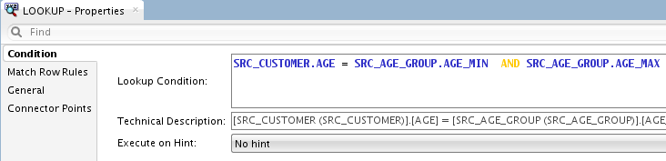

# Mapping 5 - Reusable Mapping

## Introduction

This chapter describes how to work with mappings in Oracle Data Integrator.

*Estimated Lab Time*: 60 minutes

#### Objectives
The demonstration environment includes several example mappings. In this chapter you will learn how to create the following mappings:

  * Load Customer: This is a reusable mapping where the SRC\_CUSTOMER table in the *Orders Application* model is joined to the SRC\_AGE\_GROUP.TXT in the *Parameters* model with a few transformations like filter and lookup.
  * Load TRG\_CUSTOMER: Join the output of the reusable mapping *Load Customer* with the SRC\_SALES\_PERSON.TXT file in the *Parameters* model and then load the data into the TRG\_CUSTOMER target table in the *Sales Administration* model.

### Prerequisites
This lab assumes you have:
- Basic knowledge of Oracle Database
- A Free Tier, Paid or LiveLabs Oracle Cloud account
- You have completed:
    - Lab: Prepare Setup (*Free-tier* and *Paid Tenants* only)
    - Lab: Environment Setup
    - Lab: Initialize Environment

## Task 1: Load Customer Re-usable Mapping Description

This section contains the following topics:

  - Purpose
  - Mapping Definition

1. Purpose

  The purpose of this is to create a reusable mapping which can later be used in a reused in a regular mapping. The SRC\_CUSTOMER table in the *Orders Application* model is joined to the SRC\_AGE\_GROUP.TXT in the *Parameters* model.
    - A lookup is used to retrieve the age range of the customers (with file SRC\_AGE\_GROUP.TXT).
    - Let's insert a filter (to be executed before the lookup) and concatenate first name and last name for the customer name column.
    - Then use this re-usable mapping in a regular mapping.

2. Mapping Definition

  This section describes the mapping Load Customer that will be created in this example. The Load Customer mapping uses the following data and transformations:

    * Two source datastores.

  | Model                 | Datastore          | Description                                     | Type        |
  |-----------------------|--------------------|------------------------------------------------------|--------------|
  | Orders Application    | SRC\_CUSTOMER    | Customer table in the source systems              | Oracle Table |
  | Parameters    | SRC\_AGE\_GROUP  | Age bracket file         | File delimited by semicolons |

    * One **Filter**

  | Description                      | SQL Rule                                  |
  |----------------------------------|-------------------------------------------|
  | Only retrieve Customers with ID less than 105  | SRC\_CUSTOMER.CUSTID<105                |

    * One **Lookup** table:

  | Lookup                   | Description   | SQL RULE                                                        |
  |--------------------------|---------------------------------------------|-----------------------------------|
  | Customers and age range  | The customers age must be between the min and max ages in the file | SRC\_CUSTOMER.AGE between SRC\_AGE\_GROUP.AGE\_MIN and SRC\_AGE\_GROUP.AGE\_MAX  |

    * Several transformation rules:

  | Target Column  | Origin                               | SQL Rule(Expression)                                                       |
  |----------------|--------------------------------------|----------------------------------------------------------------------------|
  | CUST\_ID       | SRC\_CUSTOMER.CUSTID                 | SRC\_CUSTOMER.CUSTID      |
  | DEAR           | SRC\_CUSTOMER.DEAR| SRC\_CUSTOMER.DEAR |
  | CUST\_NAME     | Concatenation of SRC\_CUSTOMER.FIRST\_NAME and SRC\_CUSTOMER.LAST\_NAME in upper case | TRIM(SRC\_CUSTOMER.FIRST\_NAME) \|\| ' ' \|\| UPPER(TRIM(SRC\_CUSTOMER.LAST\_NAME))    |
  | ADDRESS        | SRC\_CUSTOMER.ADDDRESS                | SRC\_CUSTOMER.ADDRESS   |
  | CITY\_ID       | SRC\_CUSTOMER.CITY\_ID                | SRC\_CUSTOMER.CITY\_ID   |
  | PHONE          | SRC\_CUSTOMER.PHONE                   | SRC\_CUSTOMER.PHONE     |
  | AGE            | SRC\_CUSTOMER.AGE                     | SRC\_CUSTOMER.AGE       |
  | AGE\_RANGE     | SRC\_AGE\_GROUP.AGE\_RANGE            | SRC\_AGE\_GROUP.AGE\_RANGE|
  | SALES\_PERS\_ID    |  SRC\_CUSTOMER.SALES\_PERS\_ID   | SRC\_CUSTOMER.SALES\_PERS\_ID  |

## Task 2: Creating the Re-usable Mapping

This section describes how to create the Load Customer re-usable mapping. To create the Load Customer mapping perform the following procedure:  

To create a new mapping:

1. In Designer Navigator, expand the Demo project node in the Projects accordion.
2. Expand the Sales Administration node.
3. In the Sales Administration folder, right-click the Reusable Mapping node and select **New Reusable Mapping**:

  

4. Enter the name of your mapping (Load Customer) in the Name field:

  

5. Ensure the *Create Default Input Signature* option is not selected and *Create Default Output Signature* option is checked.

## Task 3: Define the Target

The target of this mapping is the Output Signature which we have checked while creating the mapping.

1. If you do not create the re-usable mapping with the *Default output signature* option, you can always add an output signature by selecting the appropriate output signature component from the component palette.

## Task 4: Define the Source

The source datastores contain data used to load the target datastore. Two types of datastores can be used as a mapping source: datastores from the models and reusable mappings. This example uses datastores from the *Orders Application* and *Parameters* models.

To add source datastores to the Load Customer mapping:

1. Under models, drag the following source datastores into the Source Diagram:

     * SRC\_CUSTOMER from the *Orders Application* model
     * SRC\_AGE\_GROUP from the *Parameters* model

2. The Mapping should look like:

  

## Task 5: Define the Filter

In this example, only completed orders should be retrieved. A filter needs to be defined on the SRC\_ORDERS datastore. To define the filter:

1.  In the mapping, select the CUSTID column of the SRC\_CUSTOMER datastore and drag it onto the Mapping Diagram.

2.  The filter appears as shown:

  

3.  Select the filter in the Source Diagram to display the filter properties in the Property Inspector.

4.  In the Condition tab of the Property Inspector, modify the filter rule by typing:

  ```
  <copy>
  SRC_CUSTOMER.CUSTID<105
  </copy>

  ```

  

5. Click **Save**.

## Task 6: Define the Lookup

This section describes how to create a lookup that defines that the customer's age must be between the minimum and maximum ages in the file. A lookup is a datastore (from a model or the target datastore of a map) - called the *lookup table* - associated to a source datastore - the *driving table* - via a join expression and from which data can be fetched and used in mappings. Lookup tables are added with the Lookup Component.

To create a lookup in the Load Customer mapping:

1.  From the Components panel, drag **Lookup** into the mapping as shown:

  

2.  From the Parameters model, drag the SRC\_AGE\_GROUP datastore into the Mapping. The SRC\_AGE\_GROUP datastore will be used as a lookup table.

3.  Drag the following source columns into the Lookup:

    * Age from the SRC\_CUSTOMER source datastore
    * AGE\_MIN from the SRC\_AGE\_GROUP datastore
    * AGE\_MAX from the SRC\_AGE\_GROUP datastore

4.  Select the LOOKUP, click **Condition** in the LOOKUP -- Properties as shown:

  

5.  Modify the Condition by replacing the '=' with the string 'between'. You should have the following in the Lookup Condition:

  ```
  <copy>
  SRC_CUSTOMER.AGE between SRC_AGE_GROUP.AGE_MIN and SRC_AGE_GROUP.AGE_MAX
  </copy>

  ```

  This corresponds to a join between the SRC\_CUSTOMER and the SRC\_AGE\_GROUP datastore and defines that the customer's age must between the minimum and maximum ages in the file.

  

6.  Click **Save**.

## Task 7: Define the Target Expressions

To Auto Map columns from the sources to the target, the connector points need to be dragged and dropped between components.  

1. Drag and drop the output connector of the LOOKUP component onto the input connector of the OUTPUTSIGNATURE component.

  

2. When prompted for your selection for attributes matching options, keep the default values.

  

3. The Mapping should look as shown below

  

4. Now select the LAST\_NAME, AGE\_MIN and AGE\_MAX columns in the OUTPUSIGNATURE and Delete them.

  Keep the Ctrl key pressed to select more than one column at a time, and right-click to display  the menu and select Delete, or hit the Delete key on your keyboard.

  

5. Now lets rename some of the output columns and perform mappings. Click on the caption of the OUTPUTSIGNATURE to display the list of attributes and their mappings, and rename the following columns:

    - CUSTID becomes CUST_ID
    - FIRST\_NAME becomes CUST\_NAME

  

6. Now modify the mapping Expressions as follows:

  Click on the column CUST\_NAME to edit the expression. Click on the button inside the Expression field to display the expression editor. Change the expression to the following:

  ```
  <copy>
  InitCap(SRC_CUSTOMER.FIRST_NAME) || ' ' || InitCap(SRC_CUSTOMER.LAST_NAME)
  </copy>

  ```

  

  You can now save and close the re-usable mapping. In the next step we will use it in a regular mapping.

## Task 8: Load TRG\_Customer Mapping Description

This section describes how to create a standard mapping and use a reusable mapping as one of the sources.

This section describes the mapping Load TRG\_Customer that will be created in this example. The Load TRG\_Customer mapping uses the following data and transformations:

1. Two source datastores.

  | Model                 | Datastore          | Description                                     | Type        |
  |-----------------------|--------------------|------------------------------------------------------|--------------|
  | Re-usable Mapping   | Load Customer  | The output of the Load Customer Re-usable Mapping             | |
  | Parameters    | SRC\_SALES\_PERSON  | Salesperson file         | File delimited by semicolons |

2. One target datastore.

  | Model                 | Datastore     | Description |  Type        |
  |-----------------------|---------------|-------------|--------------|
  | Sales Administration  | TRG\_CUSTOMER |    Customer Target table          | Oracle Table |

3. One Join:

  | Join                  | Description                                | SQL RULE                   |
  |-----------------------|--------------------------------------------|----------------------------|
  | Sales Representatives and Customers | Join SRC\_SALES\_PERSON and Load Customer | Load Customer.SALES\_PERS\_ID = SRC\_SALES\_PERSON.SALES\_PERS\_ID |

4. Several transformation rules:

  | Target Column  | Origin                               | SQL Rule(Expression)                                                       |
  |----------------|--------------------------------------|----------------------------------------------------------------------------|
  | CUST\_ID       | Load Customer.CUSTID                 | Load Customer.CUSTID      |
  | DEAR           | Load Customer.DEAR| Load Customer.DEAR |
  | CUST\_NAME     | Load Customer.CUST\_NAME | Load Customer.CUST\_NAME    |
  | ADDRESS        | Load Customer.ADDDRESS                | Load Customer.ADDRESS   |
  | CITY\_ID       | Load Customer.CITY\_ID                | Load Customer.CITY\_ID   |
  | PHONE          | Load Customer.PHONE                   | Load Customer.PHONE     |
  | AGE            | Load Customer.AGE                     | Load Customer.AGE       |
  | AGE\_RANGE     | Load Customer.AGE\_RANGE            | Load Customer.AGE\_RANGE|
  | SALES\_PERS   |  Concatenation of SRC\_SALES\_PERSON.FIRST\_NAME and SRC\_SALES\_PERSON.LAST\_NAME in upper case  | InitCap(rtrim(SRC_SALES_PERSON.FIRST_NAME)) || ' ' || InitCap(rtrim(SRC_SALES_PERSON.LAST_NAME)  |
  | CRE\_DATE      | Today's date                         | SYSDATE                 |
  | UPD\_DATE      | Today's date            | SYSDATE                 |

## Task 9: Creating a Mapping

This section describes how to create the Load TRG\_CUSTOMER mapping. To create the Load TRG\_CUSTOMER mapping perform the following procedure:

1. In Designer Navigator, expand the Demo project node in the Projects accordion.
2. Expand the Sales Administration node.
3. In the Sales Administration folder, right-click the Mapping node and select **New Mapping**:

 

4. Enter the name of your mapping (Load TRG\_CUSTOMER) in the Name field:

 

5. Ensure the *Create Empty Dataset* option is not selected.

## Task 10: Define the Source

The source datastores contain data used to load the target datastore. Two types of datastores can be used as a mapping source: datastores from the models and reusable mappings. This example uses datastore from the *Parameters* model and also the *Load Customer* reusable mapping.

To add source datastores to the Load TRG\_CUSTOMER mapping:

1.  Under models, drag SRC\_SALES\_PERSON datastore from the *Parameters* model into the Source Diagram. Also, from the reusable mappings section under Sales Administration node in Demo project node drag *Load Customer* reusable mapping.

2.  The Mapping should look like:

 

## Task 11: Define Joins between the Source Datastores

This section describes how to define joins between the source datastores. To create the join defined earlier in the mapping definition:

1. Drag the JOIN component into the mapping from the Components palette

2. Drag the SALES\_PERS\_ID column of the Load Customer reusable mapping into the JOIN.

3. Drag the SALES\_PERS\_ID column of the SRC\_SALES\_PERSON source into the JOIN.

 A join linking the two datastores appears. This is the join on the Sales Person ID. The join has the following expression:

  ```
  <copy>
  Load Customer.SALES\_PERS\_ID=SRC\_SALES\_PERSON.SALES\_PERS\_ID
  </copy>
  ```

  

## Task 12: Define the Target

The target is the element that will be loaded by the mapping. To insert the target in the Load TRG\_CUSTOMER mapping:

1.  Verify you are in the Logical tab of the Mapping Editor.

2.  In the Designer Navigator, expand the Models accordion and the *Sales Administration* model.

3.  Select TRG\_CUSTOMER datastore under the *Sales Administration* model and drag it into the mapping editor

  

## Task 13: Define the Target Expressions

1. To Auto Map from the sources to the target, drag and drop the output connector of the JOIN component onto the input connector of the TRG_CUSTOMER target

  

2. An Attribute matching dialog is displayed, keep the defaults and click **OK**.

  

3. The unmapped columns are identified with a white arrow. Click on the TRG_CUSTOMER table to list the attributes as we will modify the remaining mappings using the editor.

  

4. Click on the expression for the column SALES_PERS and use the expression editor to build this expression:

  ```
  <copy>
  InitCap(rtrim(SRC_SALES_PERSON.FIRST_NAME)) || ' ' || InitCap(rtrim(SRC_SALES_PERSON.LAST_NAME)
  </copy>

  ```
  This will map the concatenated value of the first name and uppercase last name of each salesperson

 

5. In the Target Datastore, select CRE\_DATE to display the mapping properties in the Property Inspector. In the Expression field, enter the following mapping expression:

  ```
  <copy>
  SYSDATE
  </copy>

  ```
  Verify that **Active** is selected and **Update** is unselected. The mapping will be performed only on Insert.

6. In the Target Datastore, select UPD\_DATE to display the mapping properties in the Property Inspector. In the Expression field, enter the following mapping expression:

  ```
  <copy>
  SYSDATE
  </copy>

  ```
  Verify that **Active Mapping** is selected and **Insert** is unselected. The mapping expression will be performed only on Update.

7. Your transformation rules appear in the Target Datastore Attributes panel:

 

## Task 14: Setting the Integration Type
Select the target table. In the *properties* window for the target table, go to Target tab and set Integration Type to *Incremental Update*.

 

## Task 15: Define the Data Loading Strategies (LKM)

In the Physical tab, Oracle Data Integrator indicates the various steps that are performed when the map is executed. In the Physical tab you define how to load the data of the source tables into your target environment with a Loading Knowledge Module (LKM).

To define the loading strategies:

1. You can select the LKMs by clicking on the access points. All access points are located in the target group. There are 3 access points in your mapping:

    *	FILTER\_AP for the data extracted from the SRC\_CUSTOMER table
    *	SRC\_AP for the data extracted from the SRC\_SALES\_PERSON.TXT file.
    *	SRC\_AP\_L for the data extracted from the SRC\_AGE\_GROUP.TXT file

2. Click on FILTER\_AP.In the Property Inspector, set the LKM to **LKM Oracle to Oracle Pull(DB Link).GLOBAL** using the LKM Selector list as shown:

  

3. Click on SRC\_AP.In the Property Inspector, set the LKM to **LKM File to SQL** using the LKM Selector list as shown:

  

4. Click on SRC\_AP\_L.In the Property Inspector, set the LKM to **LKM SQL to SQL (Built-In).GLOBAL** using the LKM Selector list as shown:

  

5. Select all the three access points , in the properties section it appears as below:

  

## Task 16: Define the Data Integration Strategies (IKM)

After defining the loading phase, you need to define the strategy to adopt for the integration of the data into the target table.

To define the integration strategies:

1. In the Physical tab of the Mapping Editor, select the Target object, TRG\_CUSTOMER. The Property Inspector should display the properties of the target.

2. In the Property Inspector, set the IKM to **IKM Oracle Merge.GLOBAL** using the IKM Selector list.

  

**Note:** Only the built-in Knowledge Modules or the ones you imported to your Project appear in the KM Selector lists. The demonstration environment already includes the Knowledge Modules required for the getting started examples. You do not need to import KMs into the demonstration Project.

## Task 17: Run the Mapping

In this section , lets save and run the mapping we created to check how the data load is performed.

1. Save the Mapping.

2. Click on the Green Play button on the taskbar to run the Mapping.


3. Run box will appear on screen to select the agent and log level. Select the default values and when clicked ok , the Session starts.


 

4. Go to the operator tab and by drilling down on date the job status is shown. We can see that the Job is successfully run.


  Since the data load is successfully performed , lets verify the data in the target datastores.

5. In the Designer Navigator, expand the Models accordion and the *Sales Administration* model.

6. select the TRG\_CUSTOMER datastore , right-click and select View data.

    

7. As seen below the data is loaded from the source to the target datastore.

    

This concludes the lab on Reusable Mappings. You may now [proceed to the next lab](#next).

## Learn More
- [Oracle Data Integrator](https://docs.oracle.com/en/middleware/fusion-middleware/data-integrator/index.html)

## Acknowledgements

- **Author** - Narayanan Ramakrishnan, December 2020
- **Contributors** - Srivishnu Gullapalli
- **Last Updated By/Date** - Rene Fontcha, LiveLabs Platform Lead, NA Technology, January 2021
