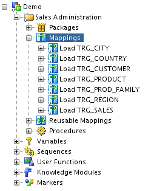
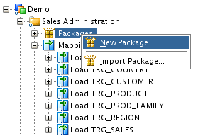
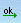
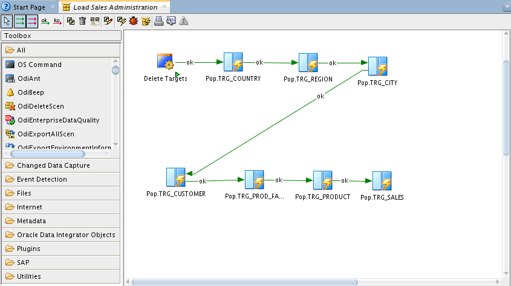
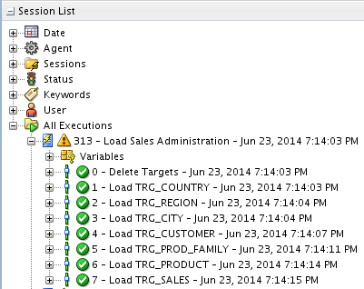
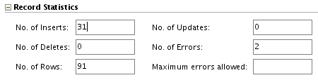
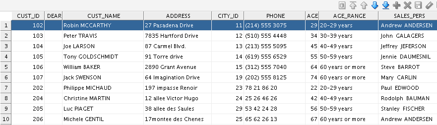
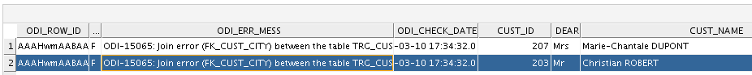

# Working with Packages - Part 1

## Introduction

This chapter describes how to work with Packages in Oracle Data Integrator.

*Estimated Lab Time*: 60 minutes

#### Objective
The *Load Sales Administration* package is used as an example. An introduction to Packages and automating data integration between applications is provided.

This chapter includes the following sections:
  * Introduction
  * Load Sales Administration Package Example

### Prerequisites
This lab assumes you have:
- Basic knowledge of Oracle Database
- A Free Tier, Paid or LiveLabs Oracle Cloud account
- You have completed:
    - Lab: Prepare Setup (*Free-tier* and *Paid Tenants* only)
    - Lab: Environment Setup
    - Lab: Initialize Environment

## Task 1: Load Sales Administration Package Example
This section contains the following topics:
  * Purpose
  * Developments Provided with Oracle Data Integrator
  * Problem Analysis
  * Creating the Package

1. Purpose

  The purpose of the Load Sales Administration package is to define the complete workflow for the loading of the Sales Administration application and to set the execution sequence.

  **Mappings Provided with Oracle Data Integrator**

  The demo repository is delivered with a number of Mappings. The Demo project now contains the following objects as shown below:
    * **Load TRG\_CITY**: a mapping that populates the TRG\_CITY table. This mapping is delivered with the demo repository.
    * **Load TRG\_COUNTRY**: a mapping that populates the TRG\_COUNTRY table. This mapping is delivered with the demo repository.
    * **Load TRG\_CUSTOMER**: a mapping that populates the TRG\_CUSTOMER table. This mapping is created in Lab *Load TRG\_CUSTOMER Mapping*.
    * **Load TRG\_PRODUCT**: a mapping populates the TRG\_PRODUCT table. This mapping is delivered with the demo repository.
    * **Load TRG\_PROD\_FAMILY**: a mapping that populates the TRG\_PROD\_FAMILY table. This mapping is delivered with the demo repository.
    * **Load TRG\_REGION**: a mapping that populates the TRG\_REGION table. This mapping is delivered with the demo repository.
    * **Load TRG\_SALES**: a mapping that populates the TRG\_SALES table. This mapping is created in Lab *Load TRG\_SALES Mapping*.

  **One procedure:**
  The **Delete Targets** procedure empties all of the tables in the *Sales Administration* application. This operation is performed by using a *Delete* statement on each table.

  

2. Problem Analysis

  In order to load the *Sales Administration* application correctly (in accordance with the referential integrity constraints), the tasks must be executed in the following order:

    - Empty the Sales Administration tables with the Delete Targets procedure
    - Load the TRG\_COUNTRY table with the Load TRG\_COUNTRY mapping
    - Load the TRG\_REGION table with the Load TRG\_REGION mapping
    - Load the TRG\_CITY table with the Load TRG\_CITY mapping
    - Load the TRG\_PROD\_FAMILY table with the Load TRG\_PROD\_FAMILY mapping
    - Load the TRG\_PRODUCT table with the Load TRG\_PRODUCT mapping
    - Load the TRG\_CUSTOMER table with the Load TRG\_CUSTOMER mapping
    - Load the TRG\_SALES table with the Load TRG\_SALES mapping

  Such an integration process is built in Oracle Data Integrator in the form of a Package.

3. Creating the Package

  To create a new Package:

    - In Designer Navigator, expand the Demo project node in the Projects accordion.
    - Expand the Sales Administration node.
    - In the Sales Administration folder, right-click the Packages node and select **New Package** as shown:

    

  The Package Editor is started.

    - Enter the name of your Package 'Load Sales Administration' in the Name field.

4. Insert the Steps in the Package

  To insert the steps in the Load Sales Administration Package, Select the following components one by one from the Projects accordion and drag-and-drop them into the diagram:
    * Delete Targets (Procedure)
    * Load TRG\_COUNTRY
    * Load TRG\_REGION
    * Load TRG\_CITY
    * Load TRG\_CUSTOMER
    * Load TRG\_PROD\_FAMILY
    * Load TRG\_PRODUCT
    * Load TRG\_SALES

    These components are inserted in the Package and appear as steps in the diagram. Note that the steps are not sequenced yet.

5. Define the Sequence of Steps in the Package

  Once the steps are created, you must reorder them into a data processing chain. This chain has the following rules:
    * It starts with a unique step defined as the *First Step*.
    * Each step has two termination states: Success or Failure.
    * A step in failure or success can be followed by another step, or by the end of the Package.
    * In case of failure, it is possible to define a number of retries.

  A Package has one entry point, the First Step, but several possible termination steps. The Load Sales Administration Package contains only steps on Success.

6. Defining the First Step**

  To define the first step in the Load Sales Administration Package:

  **Note:** If you have dragged and dropped the Package components in the order defined above, the Delete Target procedure is already identified as the first step and the first step symbol is displayed on the step's icon. If this is the case, define the next steps on success.

    - Select and right-click the *Delete Target* procedure step.
    - Select **First Step** from the contextual menu. A small green arrow appears on this step.

7. Defining the Next Steps on Success

  To define the next steps on success:
    - In the Package toolbar tab, select **Next Step on Success**.

       

    - Select the Delete Targets step.
    - Keep the mouse button pressed and move the cursor to the icon of the step that must follow in case of a success (here the Load TRG\_COUNTRY step) and release the mouse button. A green arrow representing the success path between the steps, with an ok label on it appears.
    - Repeat this operation to link all your steps in a success path sequence. This sequence should be:
      * Delete Targets (First Step)
      * Load TRG\_COUNTRY
      * Load TRG\_REGION
      * Load TRG\_CITY
      * Load TRG\_CUSTOMER
      * Load TRG\_PROD\_FAMILY
      * Load TRG\_PRODUCT
      * Load TRG\_SALES

  The resulting sequence appears in the Package diagram as shown:

     

  5.  From the File main menu, select **Save**. The package is now ready to be executed.

## Task 3: Executing Your Development
This section describes how to execute the Load Sales Administration Package you have just created and the mappings Load TRG\_CUSTOMER and Load TRG\_SALES you have created in the lab *Working with Mappings*. This section also describes how to follow the execution and how to interpret the execution results.

1. Executing the Load Sales Administration Package

    - In Designer Navigator, expand the Packages node under the Sales Administration node.
    - Select the Load Sales Administration Package.
    - Right-click and select **Run**.
    - In the Run Dialog, leave the default settings and click **OK**.
    - The Session Started Information Dialog is displayed. Click **OK**.

  Oracle Data Integrator now starts an execution session.

2. Follow the Execution of the Package in Operator Navigator

  Through Operator Navigator, you can view your execution results and manage your development executions in the sessions. To view the execution results of the Load Sales Administration Package:

    - In the Session List accordion in Operator Navigator, expand the All Executions node.
    - Refresh the displayed information by clicking **Refresh** in the Operator Navigator toolbar. The Refresh button is:

  

    - The log for the execution session of the Load Sales Administration Package appears as shown:

  

## Task 4: Reviewing your Results

**Interpreting the Results of the Load TRG\_CUSTOMER Session Step**

This section describes how to determine the invalid records detected by the Load TRG\_ CUSTOMER mapping. These are the records that do not satisfy the constraints and have been rejected by the flow control of the Load TRG\_CUSTOMER mapping.

1. Determining the Number of Processed Records

  To determine the number of records that have been processed by the Load TRG\_ CUSTOMER mapping (this is the number of inserts, updates, deletes, and errors):
    - In the Session List accordion in Operator Navigator, expand the All Executions node.
    - Refresh the displayed information clicking **Refresh** in the Operator Navigator toolbar menu.
    - Expand the Load Sales Administration Package Session and open the Session Step Editor for the Load TRG\_CUSTOMER step. This is step 4.
    - On the Definition tab of the Session Step Editor, you can see in the Record Statistics section that the loading of the TRG\_CUSTOMER table produced 31 inserts and isolated 2 errors in an error table.

  **Note** Your individual results may vary. This is fine as long as the overall execution is successful.

  

2. Viewing the Resulting Data
  In this example, the resulting data are the 31 rows that have been inserted in the TRG\_ CUSTOMER table during the mapping run. To view the data resulting of your mapping run:
    - In Designer Navigator, expand the Models accordion and the *Sales Administration* model.
    - Select the TRG\_CUSTOMER datastore.
    - Right-click and select **View Data** to view the data in the target table.

  Note that you can also select **Data\...** to view and edit the data of the target table. The View Data Editor is displayed as shown

  

3. Reviewing the Invalid Records and Incorrect Data
  You can access the invalid records by right-clicking on the datastore in your model and selecting **Control** \> **Errors\...**

  To review the error table of the TRG\_CUSTOMER datastore:
    - In Designer Navigator, expand the *Sales Administration* model.
    - Select the TRG\_CUSTOMER datastore.
    - Right-click and select **Control** \> **Errors\...**
    -  The Error Table Editor is displayed:

  

  The mapping that you have executed has identified and isolated **2** invalid records in an error table that was automatically created for you. In this error table, you can see that the mapping rejected:
    * Records that did not satisfy the FK\_CUST\_CITY constraint (for example, the CITY\_ID value does not exist in the table of cities TRG\_CITY table).

    You can use the ODI\_CHECK\_DATE field to identify the records rejected for your latest execution. The invalid records were saved into an error table and were not integrated into the target table.

## **Appendix 1:**  More on Automating Data Integration using Package
This section provides an introduction to automating data integration using packages in Oracle Data Integrator.

1. Automating Data Integration Flows
The automation of the data integration is achieved by sequencing the execution of the different steps (mappings, procedures, and so forth) in a package and by producing a production scenario containing the ready-to-use code for each of these steps.

This lab describes how to sequence the execution of the different steps. How to produce the production scenario is covered in the Lab *Deploying Integrated Applications*.

**Packages**
A *Package* is made up of a sequence of steps organized into an execution diagram. Packages are the main objects used to generate scenarios for production. They represent the data integration workflow and can perform, for example, the following jobs:
  * Start a reverse-engineering process on a datastore or a model
  * Send an email to an administrator
  * Download a file and unzip it
  * Define the order in which mappings must be executed
  * Define loops to iterate over execution commands with changing parameters

In this Getting Started exercise, you will load your *Sales Administration* application using a sequence of mappings. Since referential constraints exist between tables of this application, you must load target tables in a predefined order. For example, you cannot load the TRG\_CUSTOMER table if the TRG\_CITY table has not been loaded first.

In the Lab *Load Sales Administration Package Example*, you will create and run a package that includes mappings that are included in the Demo project and mappings that you've created in the lab *Working with Mappings*.

**Scenarios**
A *scenario* is designed to put source components (mapping, package, procedure, variable) into production. A scenario results from the generation of code (SQL, shell, and so forth) for this component. Once generated, the code of the source component is frozen and the scenario is stored inside the Work repository. A scenario can be exported and then imported into different production environments.

**Note:** Once generated, the scenario's code is frozen, and all subsequent modifications of the package and/or data models which contributed to its creation will not affect it. If you want to update a scenario - for example because one of its mappings has been changed, then you must generate a new version of the scenario from the package or regenerate the existing scenario.
Refer to *Working with Scenarios* in the *Oracle Fusion Middleware Developer's Guide for Oracle Data Integrator* for more information.

In the lab *Deploying Integrated Applications*, you will generate the *LOAD\_SALES\_ADMINISTRATION* scenario from a package and run this scenario from Oracle Data Integrator Studio.

You may now [proceed to the next lab](#next).

## Learn More
- [Oracle Data Integrator](https://docs.oracle.com/en/middleware/fusion-middleware/data-integrator/index.html)

## Acknowledgements

- **Author** - Narayanan Ramakrishnan, December 2020
- **Contributors** - Srivishnu Gullapalli
- **Last Updated By/Date** - Rene Fontcha, LiveLabs Platform Lead, NA Technology, January 2021
