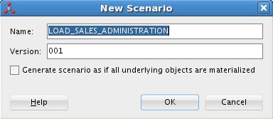
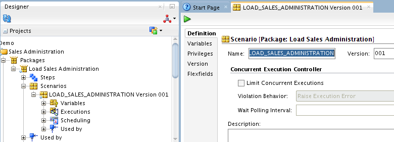
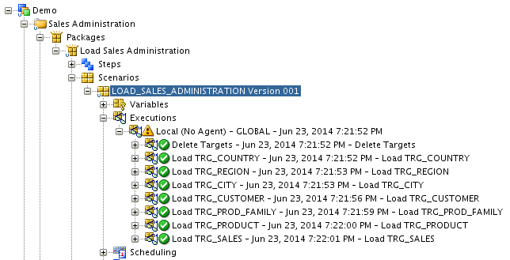

# Deploying Integrated Applications

## Introduction
This lab describes how to run the Load Sales Administration Package in a production environment.

*Estimated Lab Time*: 30 minutes

### Objectives
  * Introduction
  * Scenario Creation
  * Run the Scenario
  * Follow the Execution of the Scenario

### About Data Integration Flows
The automation of the data integration flows is achieved by sequencing the execution of the different steps (mappings, procedures, and so forth) in a package and by producing a production scenario containing the ready-to-use code for each of these steps.
Lab *Working with Packages* describes the first part of the automation process: sequencing the execution of the different processes in a Package.

This Lab describes the second part: how to produce a scenario that runs automatically the Load Sales Administration Package in a production environment.

### Prerequisites
This lab assumes you have:
- Basic knowledge of Oracle Database
- A Free Tier, Paid or LiveLabs Oracle Cloud account
- You have completed:
    - Lab: Prepare Setup (*Free-tier* and *Paid Tenants* only)
    - Lab: Environment Setup
    - Lab: Initialize Environment

## Task 1: Scenario Creation
To generate the LOAD\_SALES\_ADMINISTRATION scenario that executes the Load Sales Administration Package:

1.  In the Project accordion, expand Sales Administration and then Packages.

2.  Right click on Load Sales Administration and select **Generate Scenario...** The New Scenario dialog appears

  

3.  The Name and Version fields of the Scenario are preset. Leave these values and click **OK**.

4.  Oracle Data Integrator processes and generates the scenario. The new scenario appears on the Scenarios tab of the Package Editor and in the Demo Project:

  

## Task 2:Run the Scenario
Scenarios can be executed in several ways:
  * Executing a Scenario from ODI Studio
  * Executing a Scenario from a Command Line
  * Executing a Scenario from a Web Service.

This Lab describes how to execute a scenario from ODI Studio. See *Executing a Scenario* in the *Oracle Fusion Middleware Developer's Guide for Oracle Data Integrator* for more information about how to execute a scenario from a command line and a web service.

**Executing a Scenario from ODI Studio**
You can start a scenario from Oracle Data Integrator Studio from Designer or Operator Navigator.

To start the LOAD\_SALES\_ADMINISTRATION scenario from Oracle Data Integrator Studio:

1. Select the LOAD\_SALES\_ADMINISTRATION scenario in the Projects accordion (in Designer Navigator) or the Load Plans and Scenarios accordion (in Designer and Operator Navigator.

2. Right-click, then select **Run**.

3. In the Execution Dialog, leave the default settings and click **OK**.

4.  The Session Started Information Dialog is displayed. Click **OK**. The scenario is executed.

## Task 3: Follow the Execution of the Scenario
You can review the scenario execution in Operator Navigator, and find the same results as those obtained when the package was executed as described in Lab *Run the Package*.
It is also possible to review the scenario execution report in Designer Navigator.

To view the execution results of the LOAD\_SALES\_ADMINISTRATION scenario in Designer Navigator:

1. In the Projects accordion in Designer Navigator, expand the Scenarios node under the Load Sales Administration package.

2. Refresh the displayed information by clicking **Refresh** in the Designer Navigator toolbar menu.

3.  The log for the execution session of the LOAD\_SALES\_ADMINISTRATION scenario appears as shown:

  

## Summary
Congratulations! You have now completed an ETL project and learned about the fundamentals of Oracle Data Integrator.

In this workshop, you learned how to:

  * Create mappings to load the data from the *Orders Application* and *Parameters* applications into the *Sales Administration* data warehouse (Lab: *Working with Mappings* *1&2*)
  * Define and implement data integrity rules in the *Orders Application* application (Lab: *Implementing Data Quality Control*)
  * Sequence your developments (Lab: *Working with Packages*)
  * Prepare your process for deployment (Lab: *Deploying Integrated Applications*)

Congratulations, you have completed the workshop!

## Learn More
- [Oracle Data Integrator](https://docs.oracle.com/en/middleware/fusion-middleware/data-integrator/index.html)

## Acknowledgements

- **Author** - Narayanan Ramakrishnan, December 2020
- **Contributors** - Srivishnu Gullapalli
- **Last Updated By/Date** - Rene Fontcha, LiveLabs Platform Lead, NA Technology, January 2021
