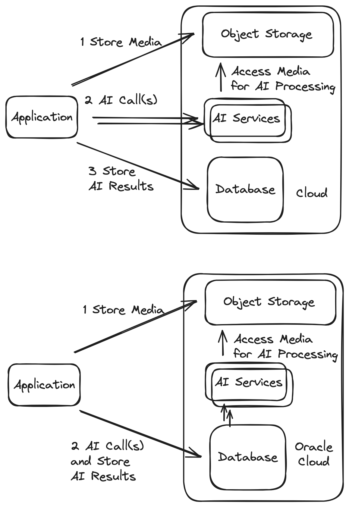

# Run AI App and Overview of DBMS_CLOUD, JavaScript, and Java calls from the Oracle Database

## Introduction

This lab will show you how to use Oracle Database JSON features to story, analyze, etc. your Open AI other data.

Estimated Time:  3 minutes


### Objectives

-   Use Oracle Database JSON features to story, analyze, etc. your Open AI other data.

### Prerequisites

- Completion of Setup lab

## Task 1: Verify env.properties file content and decide whether to use maven and Java build or docker image.

After having completed the setup lab, you should now have a fully populated env.properties file with all values populated

the env.properties file in the root directory in a text editor. You will populate the values in this file as part of this lab. It will look something like this:

`OCICONFIG_FILE=~/.oci/config
OCICONFIG_PROFILE=DEFAULT
COMPARTMENT_ID=ocid1.compartment.oc1..mycompartmentvalue
OBJECTSTORAGE_NAMESPACE=myobjectstorenamespacename
OBJECTSTORAGE_BUCKETNAME=myobjectstorebucketname
ORDS_ENDPOINT_URL=https://myordsendpointurl
ORDS_ENDPOINT_URL=https://rddainsuh6u1okc-aidatabaseworkshop.adb.us-ashburn-1.oraclecloudapps.com/ords/aiuser/_sdw/
OCI_VISION_SERVICE_ENDPOINT=https://vision.aiservice.myregion.oci.oraclecloud.com
OCI_SPEECH_SERVICE_ENDPOINT=https://speech.aiservice.myregion.oci.oraclecloud.com
OCI_GENAI_SERVICE_ENDPOINT=https://genai.aiservice.us-chicago-1.oci.oraclecloud.com`

* Note that you populate the OCI_GENAI_SERVICE_ENDPOINT for image generation functionality only and can use other services such Stable Diffusion, Deep Floyd IF, etc. on platforms such as Hugging Face or on OCI itself as is shown in Lab 10 of this workshop.

The application can be built and run in a couple ways:
    
1. Built and run as a Java application directly using Maven. This requires Java and Maven exist on your machine.  Please see Task 2.
2. Built and run as a Docker image. This only requires Docker exist on your machine. Please see Task 3. 

You can of course also run these within a VM/Compute Instance on the cloud.

## Task 2: Build and run as a Java application directly using Maven

1. Open a terminal/shell.
2. cd to the directory where the workshop src (and thus `env.properties`) exists, ie `cd [workspace_src_directory]`.
3. Issue the following to build the application

     ```text
     <copy>./build.sh</copy>
     ```

4. Issue the following to run the application

     ```text
     <copy>./run.sh</copy>
     ```


## Task 3: Build and run as a Docker image

1. Open a terminal/shell.
2. cd to the directory where the workshop src (and thus `env.properties`) exists, ie `cd [workspace_src_directory]`.
3. Issue the following to build the application

     ```text
     <copy>./build_docker.sh</copy>
     ```

4. Issue the following to run the application

     ```text
     <copy>./run_docker.sh</copy>
     ```


## Task 4: Quick overview of DBMS_CLOUD, JavaScript, and Java calls from the Oracle Database

Each lab will elaborate on how calls to Oracle AI Services, other OCI services, and external services can be made from within database forming a powerful architectural. We will just touch on a few points here.
 
* It is possible to make calls using Java from inside the database and more information can be found here: https://docs.oracle.com/en/database/oracle/oracle-database/21/jjdev/Java-introduction.html
* It is possible to make calls using JavaScript from inside the database and extra conveniences (eg fetch API) have been added to do this in 23c of the database. An example that calls AI services be found here: https://blogs.oracle.com/developers/post/how-to-call-hugging-face-ai-from-within-an-oracle-database-using-javascript-store-and-access-results-using-sql-json-and-rest
* DBMS_CLOUD is a convenience package in the Oracle Database to make calls to any Oracle Cloud Services (AI or otherwise) and examples of it are used in this workshop.  Examples of it's usage can be seen in the related labs that follow. 

The following diagram shows a couple different AI application architectures.  Notice the advantages in functional and efficiency of using the Oracle Database at the heart of the architecture related to security, network traffic, analysis and processing, etc.



You may now **proceed to the next lab.**..

## Acknowledgements

* **Author** - Paul Parkinson, Architect and Developer Evangelist
* **Last Updated By/Date** - Paul Parkinson, 2023
