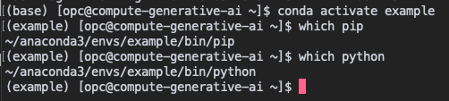

# Deploy Your Own AI Model On OCI

## Introduction

This lab walks you through the steps to deploy your own Chat GPT model on OCI. First, you will create a compute instance. Next, you will create a Conda environment and install dependencies. Then, you will download the Groovy model and GitHub examples. Finally, you will run an example, which will deploy the model on your OCI compute instance.


Estimated Time: 30 minutes

### Objectives

In this lab, you will:
- Create a compute instance on OCI
- Connect your SSH client to your compute instance
- Create a Conda environment, download the Groovy model, and download the GitHub repository
- Run the example

### Prerequisites

This lab assumes you have:
- An Oracle Cloud account
- SSH Keys

<!-- IMAGES NEED TO BE PULLED FROM SETUP COMPUTE -->
## Task 1: Setup Compute Instance on OCI

1. Click the **Navigation Menu** in the upper left, navigate to **Compute**, and select **Instances**.

    

2. Click **Create Instance**.

3. Enter a **name** for the instance. For this lab, use **compute\_generative_ai**.

    

4. Select the **compartment** and **availability domain** to create the instance in.

5. In the **Image and shape section**, click **Change image**.

    

6. Select **Marketplace** as the image source and then select either of the data science images below:

    - **AI 'all-in-one' Data Science Image Intel/AMD**
    - **AI 'all-in-one' Data Science Image for GPU**

   Alternatively, you may select Ubuntu as the image source and use either of the images below:

    - Canonical Ubuntu 20.04
    - Canonical Ubuntu 22.04

   Click **Select image**.

    

7. In the **Image and shape section**, click **Change shape**.

    

8. For the data science images, select **Virtual machine** as the **Instance type**, **AMD** or **Intel** processors as the **shape series**, and **VM.Standard3.Flex** as the **shape name**. The number of OCPUs and amount of memory may be left as the defaults.

   Click **Select shape**.

    

9. In the Networking section, select **Create new virtual cloud network**. The other options may be left as the default.

    

10. In the Add SSH keys, select **Paste Public Keys** and paste your public ssh key.

    

11. In the Boot volume section, configure the size and encryption options for the instance's boot volume. Select the **Specify a custom boot volume size** check box. Then, enter **128** as the **boot volume size (GB)**.

    

12. Click **Create**.

## Task 2: Connect to Your Instance

There are multiple ways to connect to your cloud instance.  Choose the way to connect to your cloud instance that matches the SSH Key you generated.  *(i.e If you created your SSH Keys in cloud shell, choose cloud shell)*

- Oracle Cloud Shell
- MAC or Windows CYCGWIN Emulator
- Windows Using Putty
- Windows Using MobaXterm

### Oracle Cloud Shell

1. To re-start the Oracle Cloud shell, go to your Cloud console and click **Cloud Shell** at the top right of the page.
    >**Note:** Make sure you are in the region you were assigned

    
    

2.  Enter the command below to login into your instance.
    ````text
    ssh -i ~/.ssh/<sshkeyname> opc@<Your Compute Instance Public IP Address>
    ````

3.  When prompted, answer **yes** to continue connecting.

### MAC or Windows CYGWIN Emulator

1.  Open up a terminal (MAC) or cygwin emulator. Enter the command below to log in to your instance. Enter yes when prompted.

    ```text
    ssh -i ~/.ssh/<sshkeyname> opc@<Your Compute Instance Public IP Address>
    ```

### Windows using Putty

1.  Open up putty and create a new connection.

2.  Enter a name for the session and click **Save**.

3. Click **Connection** > **Data** in the left navigation pane and set the Auto-login username to **root**.

4. Click **Connection** > **SSH** > **Auth** in the left navigation pane and configure the SSH private key to use by clicking **Browse** under the Private key file for authentication.

5. Navigate to the location where you saved your SSH private key file, select the file, and click **Open**.

6. The file path for the SSH private key file now displays in the Private key file for the authentication field.

7. Click **Session** in the left navigation pane, then click **Save** in the Load.

8. Click **Open** to begin your session with the instance.

### Windows using MobaXterm

1. In MobaXterm, we need to create a new SSH session to our newly-created OCI Compute Instance:

    

1. We fill this menu with our data: our `IP` address, username `opc` and an additional `advanced` SSH option to use public-private key cryptography as the authentication mechanism when connecting into the machine.**

    

3. Now, we select the ssh key that we downloaded while creating the OCI Compute Instance as the private key to use in our SSH connection:

    

4. Now that our SSH connection is configured, let's **access** our Compute Instance:

    

   Congratulations!  You now have a fully functional Linux instance running on Oracle Cloud Compute.

## Task 3: Create a Conda environment, download the Groovy model, and download the GitHub repository

After connecting to your instance, you will create a Conda environment and install python dependencies, which are going to be used in projects to install and use the GPT models. Then, you will download the Groovy model and the repository from GitHub with the examples to use.

1. Create a new conda environment.

  	```
    <copy>conda create -n "example" python=3.10</copy>
    ```

    

2. Activate the environment.

  	```
    <copy>conda activate example</copy>
    ```

3. Check which pip and python paths are being used.

  	```
    <copy>which pip</copy>
    ```

  	```
    <copy>which python</copy>
    ```

    

4. Install the dependencies.

  	```
    <copy>pip install nomic</copy>
    ```

    

  	```
    <copy>pip install gpt4all</copy>
    ```

    

5. Download the Groovy model

  	```
    <copy>curl -O  https://gpt4all.io/models/ggml-gpt4all-j-v1.3-groovy.bin</copy>
    ```

    

6. Clone the GitHub repository.

  	```
    <copy>git clone https://github.com/jasperan/oci-gpt4</copy>
    ```

    

   You now have an environment with everything installed to run your models.

## Task 4: Run the example

1. Navigate to the oci-gpt4 directory.

  	```
    <copy>cd oci-gpt4/</copy>
    ```

2. Navigate to the examples directory.

  	```
    <copy>cd examples/</copy>
    ```

    

3. Run the ask\_generations_nomic.py file. This file will load the model and start making predictions on some questions.

  	```
    <copy>python ask_generations_nomic.py</copy>
    ```

    

<!-- ## Learn More

*(optional - include links to docs, white papers, blogs, etc)*

* [URL text 1](http://docs.oracle.com)
* [URL text 2](http://docs.oracle.com)  -->


## Acknowledgements
* **Author** - Hannah Nguyen, Solution Engineer, NACI Engineering Specialists
<!-- * **Contributors** -  <Name, Group> -- optional -->
* **Last Updated By/Date** - Hannah Nguyen, August 2023
