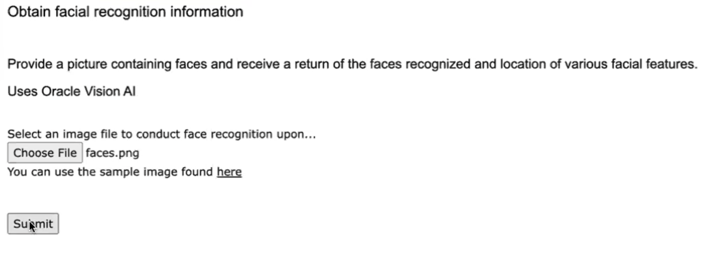

# Face Detection For Gaze and Head Pose Estimation

## Introduction

This lab will show you how to use Oracle AI Database and OCI Vision AI Face Recognition
The use case involves detecting both gaze and head pose estimation for various analysis use case such as rescue, medical, education, etc.

Estimated Time:  3 minutes

### Objectives

-   Use Oracle AI Database and OCI Vision AI

### Prerequisites

- Completion of Setup lab and "Run AI App" lab

## Task 1: Run the application

   1. Open http://localhost:8080 in a browser to access the application home page and click `Face Recognition`.
   
   2. Select an image file with faces in it such as the sample file provided and click `Submit`.
   
   3. View the results of the analysis indicated various facial features and there coordinates in the image.
   

You may now **proceed to the next lab.**..

## Acknowledgements

* **Author** - Paul Parkinson, Architect and Developer Advocate
* **Last Updated By/Date** - Paul Parkinson, 2024
