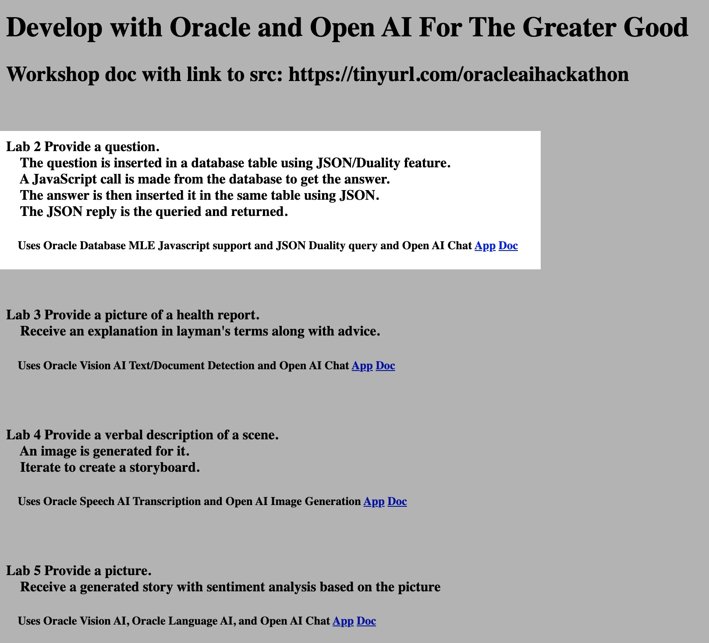

# Use Oracle Database JavaScript support and JSON features such as JSON Duality

## Introduction

This lab will show you how to use Oracle Database JSON features to story, analyze, etc. your Open AI other data.

Estimated Time:  3 minutes

### Objectives

-   Use Oracle Database JSON features to story, analyze, etc. your Open AI other data.

### Prerequisites

- Completion of Setup lab

## Task 1: Review the description on the home page at http://localhost:8080/ and click the Lab 2 app link.  Follow the directions to understand and execute the app.

You may now **proceed to the next lab.**..

## Acknowledgements

* **Author** - Paul Parkinson, Architect and Developer Evangelist
* **Last Updated By/Date** - Paul Parkinson, 2023
