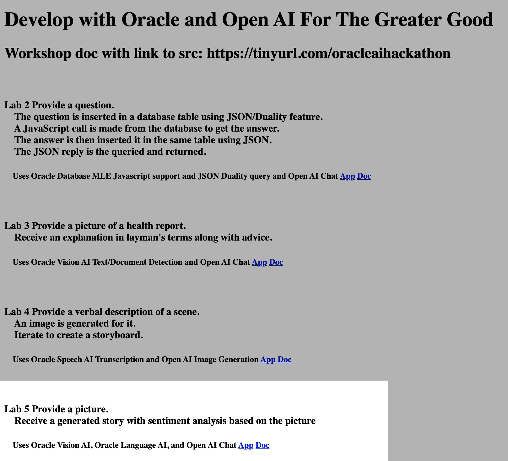

# Use Oracle Database, OCI Vision Service and OCI Speech Service, and OpenAI conversation/chat

## Introduction

This lab will show you how to use Oracle Database, OCI Vision Service and OCI Speech Service, and OpenAI conversation/chat
The use case involves
detect objects in an image and write a sentence using those objects, including sentiment generation and analysis as an educational use case for kids.

Estimated Time:  3 minutes

### Objectives

-   Use Oracle Database, OCI Vision Service and OCI Speech Service, and OpenAI conversation/chat

### Prerequisites

- Completion of Setup lab

## Task 1: Review the description on the home page at http://localhost:8080/ and click the Lab 5 app link. Follow the directions to understand and execute the app.

You may now **proceed to the next lab.**..

## Acknowledgements

* **Author** - Paul Parkinson, Architect and Developer Evangelist
* **Last Updated By/Date** - Paul Parkinson, 2023
