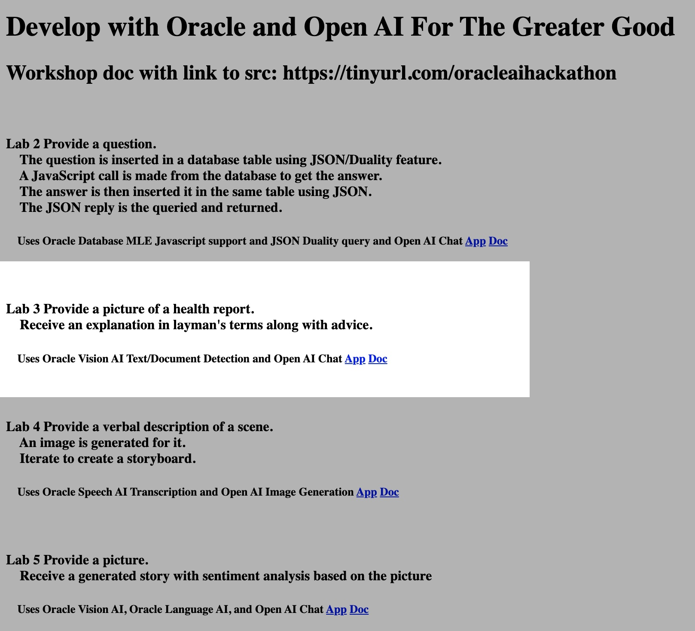

# Use Oracle Database, OCI Vision AI Text Detection and Open AI Chat

## Introduction

This lab will show you how to use Oracle Database, OCI Vision AI Text Detection and Open AI Chat
The use case involves the interpretation health test results and recommended steps for everyday individuals.

Estimated Time:  3 minutes

### Objectives

-   Use Oracle Database, OCI Vision AI Text Detection and Open AI Chat

### Prerequisites

- Completion of Setup lab

## Task 1: Review the description on the home page at http://localhost:8080/ and click the Lab 3 app link.  Follow the directions to understand and execute the app.

You may now **proceed to the next lab.**..

## Acknowledgements

* **Author** - Paul Parkinson, Architect and Developer Evangelist
* **Last Updated By/Date** - Paul Parkinson, 2023
