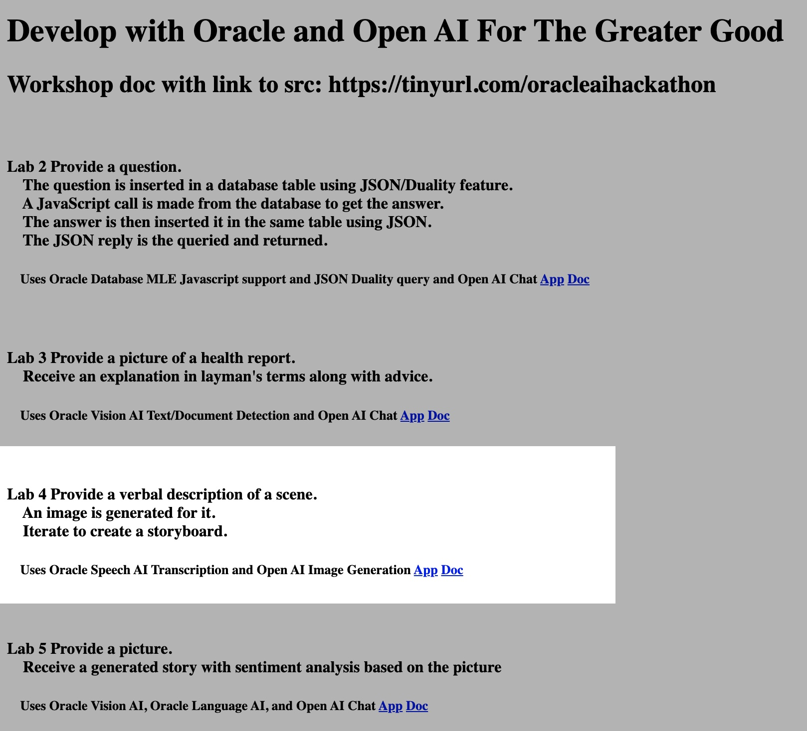

# Use Oracle Database, OCI Speech Service, Open AI code and image generation

## Introduction

This lab will show you how to use Oracle Database, OCI Speech Service, Open AI code and image generation
The use case involves the creation webpages and storyboards using only voice commands for individuals with impaired motor control.

Estimated Time:  3 minutes

### Objectives

-   Use Oracle Database, OCI Speech Service, Open AI code and image generation

### Prerequisites

- Completion of Setup lab

## Task 1: Review the description on the home page at http://localhost:8080/ and click the Lab 4 app link.  Follow the directions to understand and execute the app.

 

You may now **proceed to the next lab.**..

## Acknowledgements

* **Author** - Paul Parkinson, Architect and Developer Evangelist
* **Last Updated By/Date** - Paul Parkinson, 2023
