# Oracle Machine Learning For Healthcare

## Introduction

This lab will show you how to use Oracle Autonomous Database and Oracle Machine Learning's AutoML to create and test a model for healthcare. 
Patient vitals will be used to score the current health of a patient.

Estimated Time:  20 minutes

### Objectives

-   Create an Oracle Autonomous Database
-   Create an OML Notebook
-   Create an AutoML experiment
-   Test the Model in OML Notebook

### Prerequisites

- Completion of Setup lab

## Task 1: Create an Oracle Autonomous Database

   1. Log in to your Oracle Cloud account.

       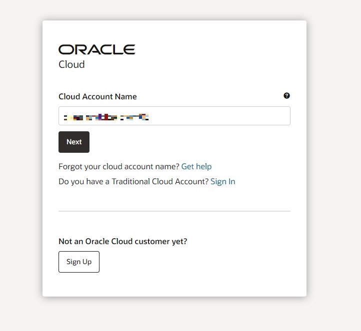 

   2. Navigate to **Autonomous Database** and click **Create Autonomous Database**. Make sure you are in your correct compartment.
   
       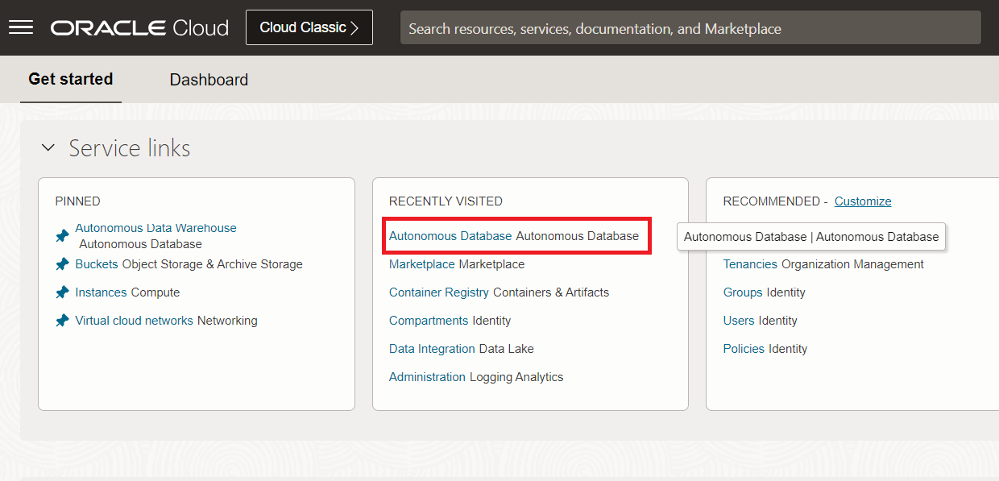 

   3. Configure your ADB, including choosing a name, password, and workload type. Click **Create Autonomous Database** after completed.

       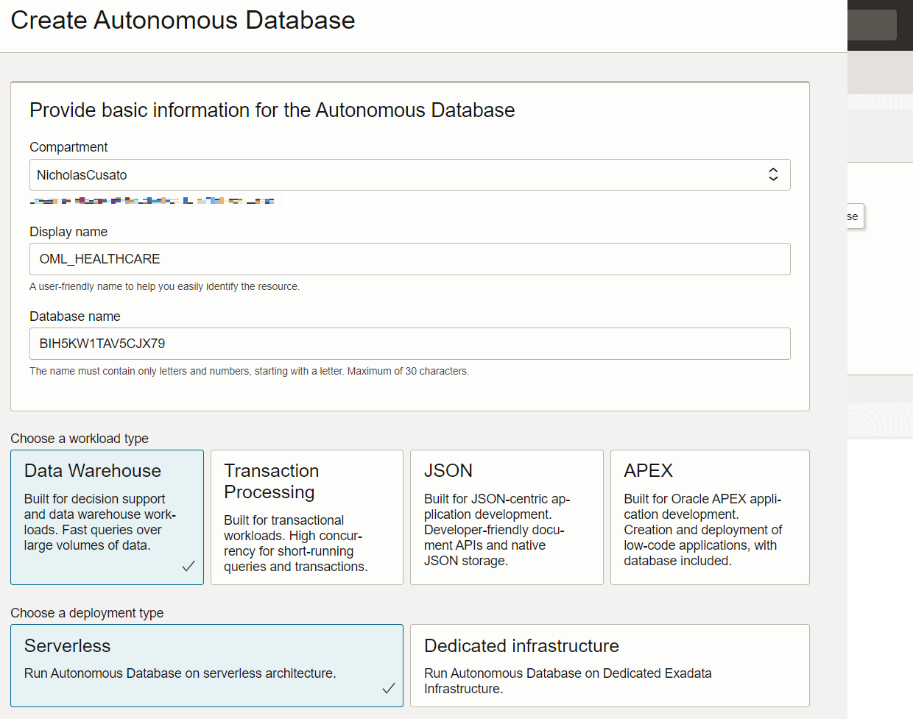 

   4. Wait for the ADB to be provisioned.

## Task 2: Create an OML Notebook


   1. Click on your newly provisioned ADB.

   2. Select **Database actions** drop-down menu and select **Database Users**.

       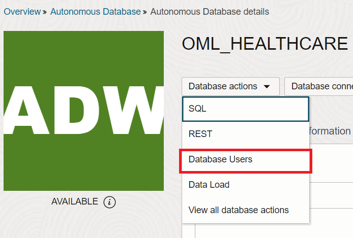 

   3. Select **Create User**.

       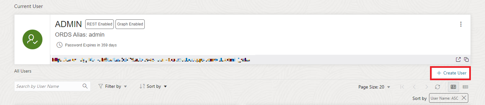 

   4. Provide a name, password, and select the **OML toggle button**. Click **Create User** to save the information.

      - User Name: HCDEMOUSER
      - Password: W#lcome12345

      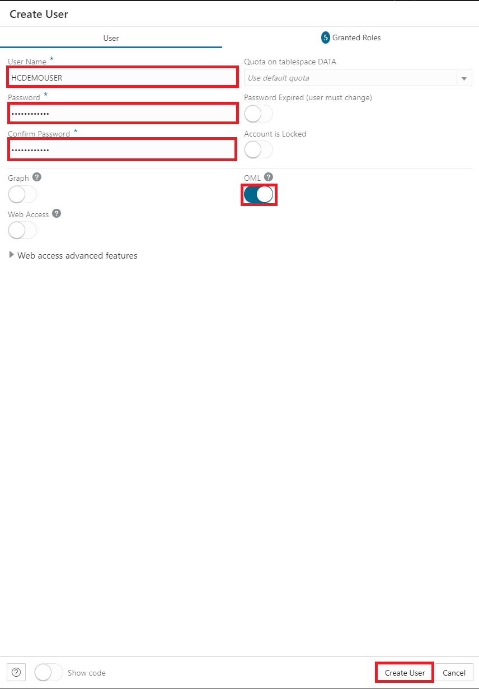 

   5. Navigate to SQL Development Console and enter the following command:

      ```text
          <copy>
          GRANT CREATE TABLE, CREATE SEQUENCE TO HCDEMOUSER;
          ALTER USER HCDEMOUSER QUOTA UNLIMITED ON HCDEMOUSER;
          </copy>
      ```

   6. Sign out of the console and sign back in with your new user. Copy, paste, and select **Data Loading** and **Upload Data into New Table...**.

   7. Upload the vitals_subset_training.csv and vitals_synthetic.csv files in the `datasets` directory of the source code repository you cloned/downloaded during the setup lab.
    
    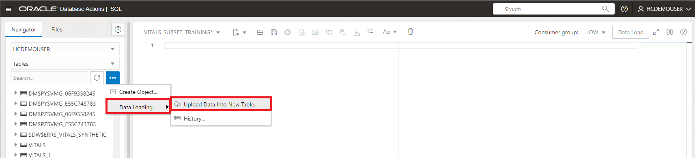 

    * These datasets are generated and are completely anonymous, comply with GDPR, free of licensing, etc.

   8. Click the **Green Button** to run the loading process and close the console after completing.

    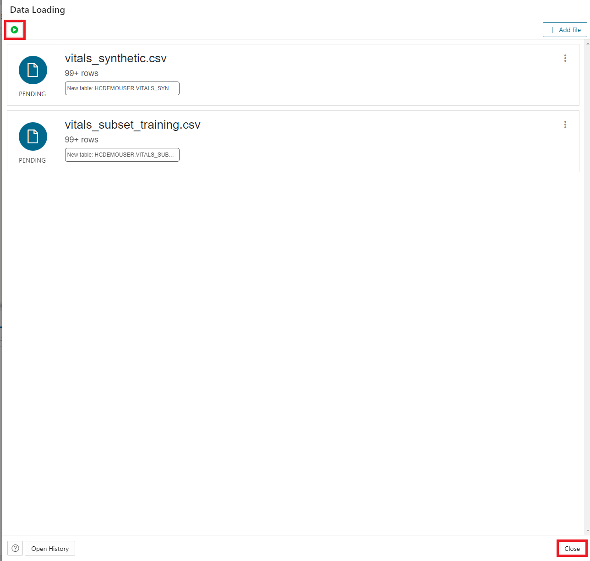 

   9. Navigate back to the OCI console in your window tabs.

## Task 3: Create an AutoML experiment

   1. Access the link to OML by clicking **Tool Configuration**. Paste the link in a new tab and login with your new user credentials.

    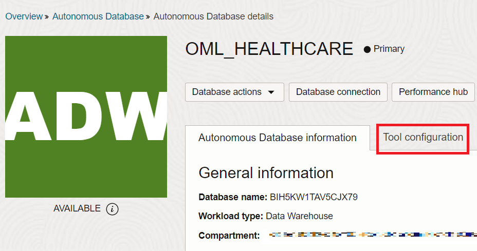 

   2. Navigate to the OML Console and create an AutoML experiment.

    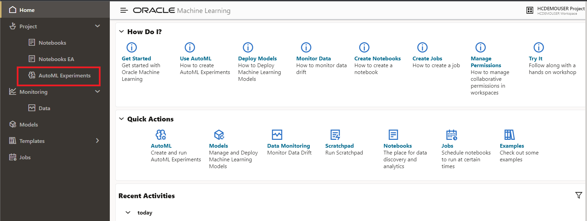

   3. Provide the experiment with a name, select the following from the drop-down options, Select **Start**, and choose **Faster Results**.
      - Name: Vitals_demo
      - Data Source: HCDEMOUSER.VITAL_SUBSET_TRAINING
      - Predict: RISK_SCORE
      - Case ID: CASE_ID

          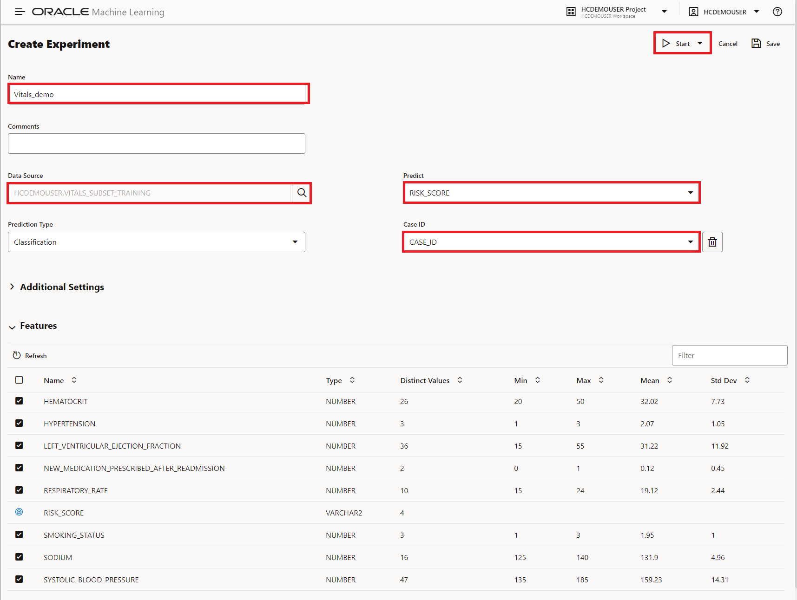

   4. Wait for completion and when completed, analyze the results. Notice the Leader Board and the top candidate models. Here we can see the **Decision Tree** model is at the top. We can deploy, rename, create a notebook, or see metrics of the model by clicking on it and selecting one of the options above it. This is helpful if we want to deploy the model in OML Services and use it via a REST API in Oracle APEX, GoldenGate Streaming Analytics, Oracle Analytics, or any custom web application.

    
   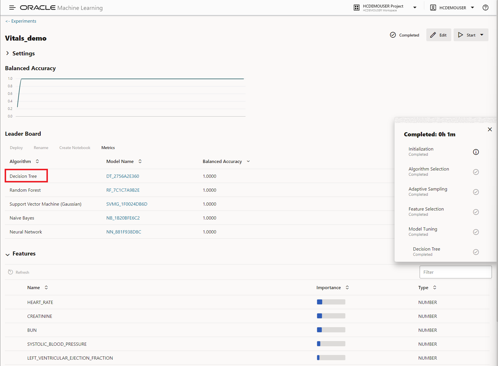


## Task 4: Test the Model in OML Notebook

   1. Expand the hamburgher menu on the top left and select **Notebooks**.

   2. Select **Create** and give your notebook a name.

   3. Copy and paste the following in the notebook text editor.

       ```
       <copy>
       %python
   
       import warnings
       warnings.filterwarnings('ignore')
   
       import pandas as pd
       import oml
   
       DEMO = oml.sync(table = "VITALS_SUBSET_TRAINING", schema = "HCDEMOUSER")
       z.show(DEMO.head())
       </copy>
       ```

   4. Press the playbutton (or shift + enter) to run the section. The results should display the first 5 rows of the table that we previously imported.

   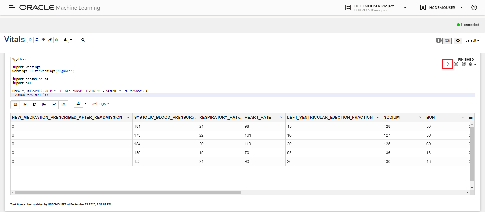

   5. Copy and paste the following in the next empty section below.

       ```
       <copy>
       %python
   
       TRAIN, TEST = DEMO.split(ratio = (0.6,0.4))
       TRAIN_X = TRAIN.drop('RISK_SCORE')
       TRAIN_Y = TRAIN['RISK_SCORE']
       TEST_X = TEST
       TEST_Y = TEST['RISK_SCORE']
       dt_settings = {
       'TREE_TERM_MINPCT_NODE' : '0.05' , 'TREE_IMPURITY_METRIC' : 'TREE_IMPURITY_GINI' , 'CLAS_MAX_SUP_BINS' : '32' , 'CLAS_WEIGHTS_BALANCED' : 'OFF' , 'TREE_TERM_MINPCT_SPLIT' : '0.1' , 'TREE_TERM_MAX_DEPTH' : '7' , 'ODMS_DETAILS' : 'ODMS_ENABLE' , 'ODMS_TEXT_POLICY_NAME' : 'AML_dt_9da80b87999940998281'
       }
       
       dt_mod = oml.dt(**dt_settings) 
       dt_mod = dt_mod.fit(TRAIN_X, TRAIN_Y , case_id = 'CASE_ID')
   
       mod_predict = dt_mod.predict(DEMO ,supplemental_cols = DEMO[:, ['RISK_SCORE']]).pull()
       y_true = mod_predict['RISK_SCORE']
       y_pred = mod_predict['PREDICTION']
       dt_mod
       </copy>
       ```

   6. Press the **play button** and analyze the results, which displays the model settings.

      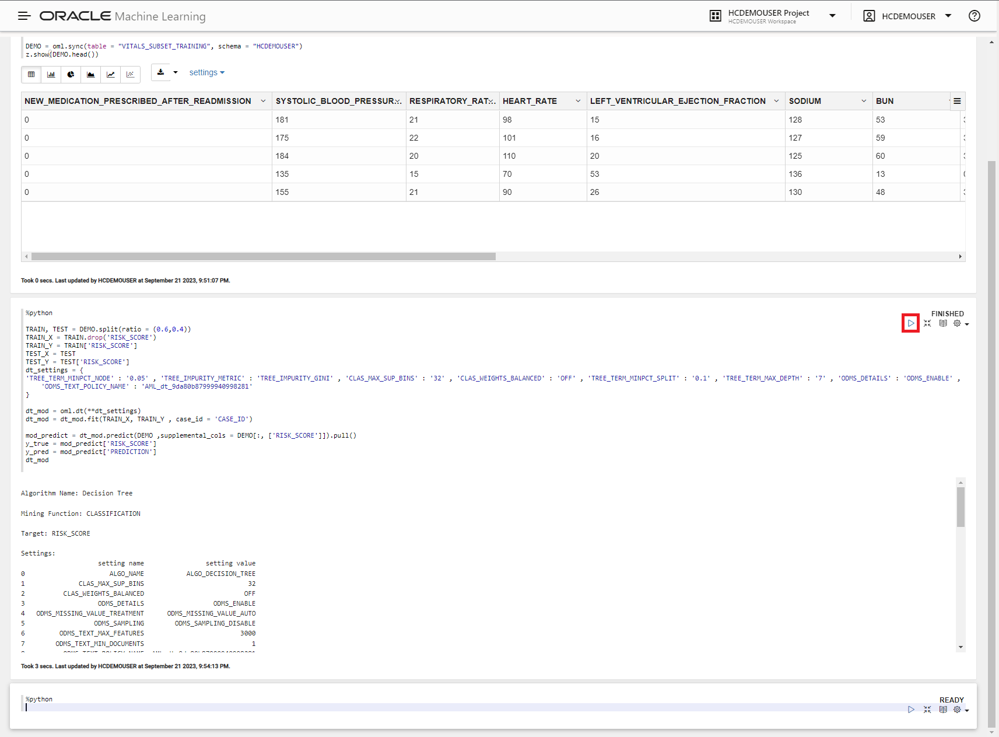

   7. Copy and paste the following the next empty section below.

       ```
       <copy>
       %python
   
       import sklearn as skl
       metric_score = skl.metrics.balanced_accuracy_score(y_true, y_pred)
       print(metric_score.round(4))
       </copy>
       ```

   8. Press the **play button** to run the section. This should display the accuracy of the model.

      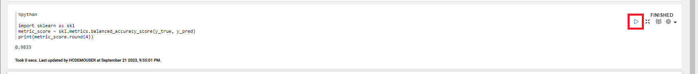

   9.  Copy and paste the following the next empty section below.

       ```
       <copy>
       %python
   
       DEMO2 = oml.sync(table = "VITALS_SYNTHETIC", schema = "HCDEMOUSER")
       RES_DF = dt_mod.predict(DEMO2, supplemental_cols = DEMO2[:,:], topN_attrs = True)
       z.show(RES_DF.head())
       </copy>
       ```

   10. Press the **play button** to run the section. This will display The Synthetic data previously uploaded to test the model in production, along with the Risk Score, Prediction, and associated top features and weights if you scroll to the right. 

      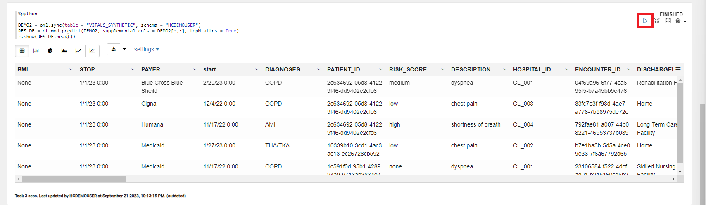

You may now **proceed to the next lab.**..

## Acknowledgements

* **Author** - Nicholas Cusato, Cloud Engineer
* **Last Updated By/Date** - Nicholas Cusato,  2023