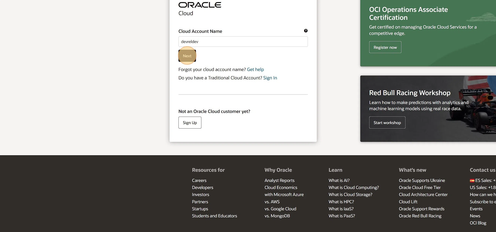
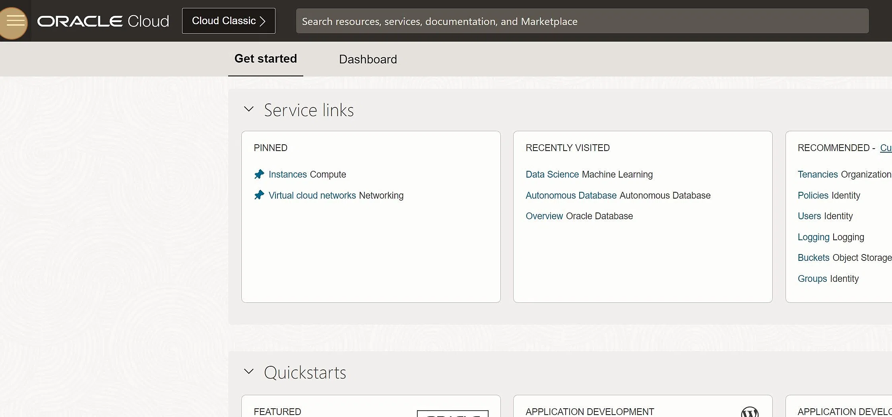
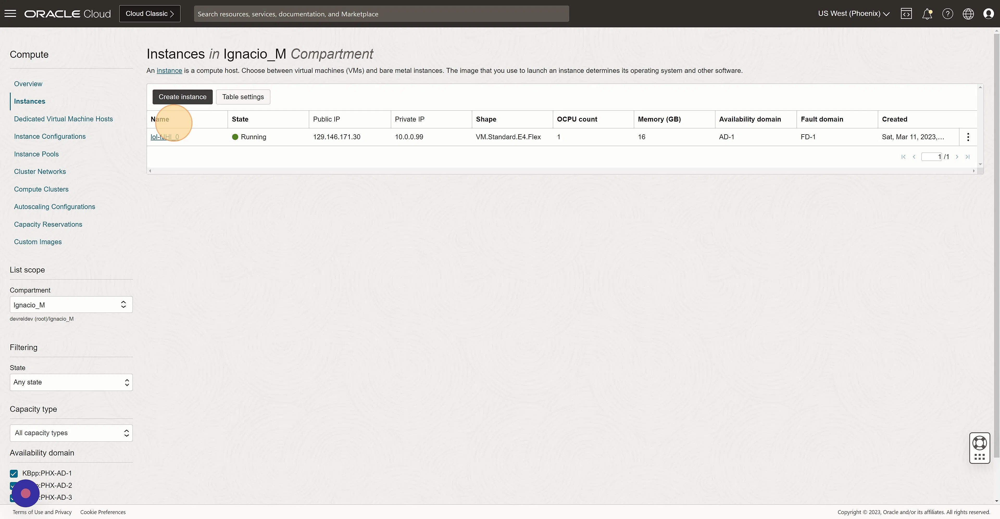
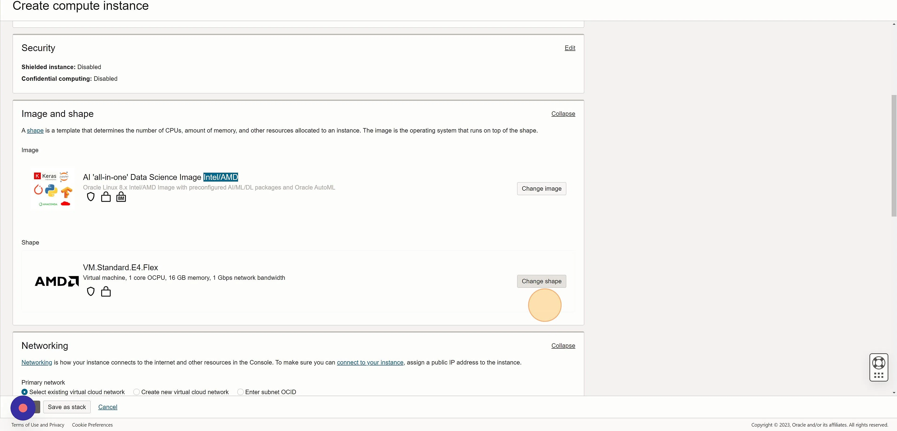
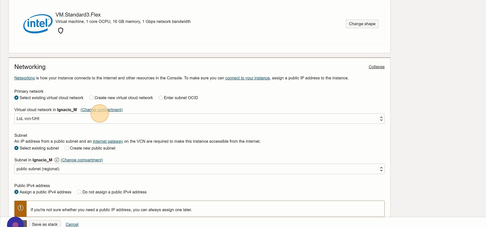
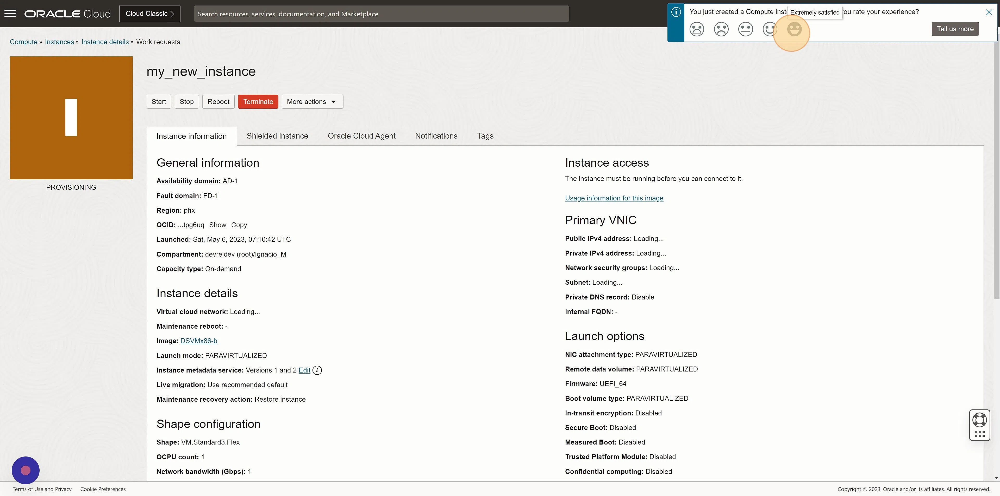

#  Creating an OCI Compute Instance

**1. Navigate to https://www.oracle.com/cloud/sign-in.html**

**2. Click "Next"
Click this button.
Click here.**

**3. Click here.
Click "Compute"
Click "Instances"**

**4. Click "Create instance"
Click the "Name" field.
Click here.
Click "Change image"
Click "Marketplace"
Click this checkbox.
Click "Select image"
Click "AI 'all-in-one' Data Science Image Intel/AMD"

5. Click "Change shape"
Click "Flexible OCPU count. Current generation Intel processors."
Click this checkbox.
Click the "Number of OCPUs" field.
Click the "Amount of memory (GB)" field.
Click the "Number of OCPUs" field.
Click "Select shape"

6. Click "Create new virtual cloud network"
Click "Save private key"
Click "Save public key"
Click the "Specify a custom boot volume size" field.
Click the "Boot volume size (GB)" field.
Click "Create"

7. Click here.
Click this icon.
Double-click "PROVISIONING"

8. Click "Copy
Copy to clipboard"

