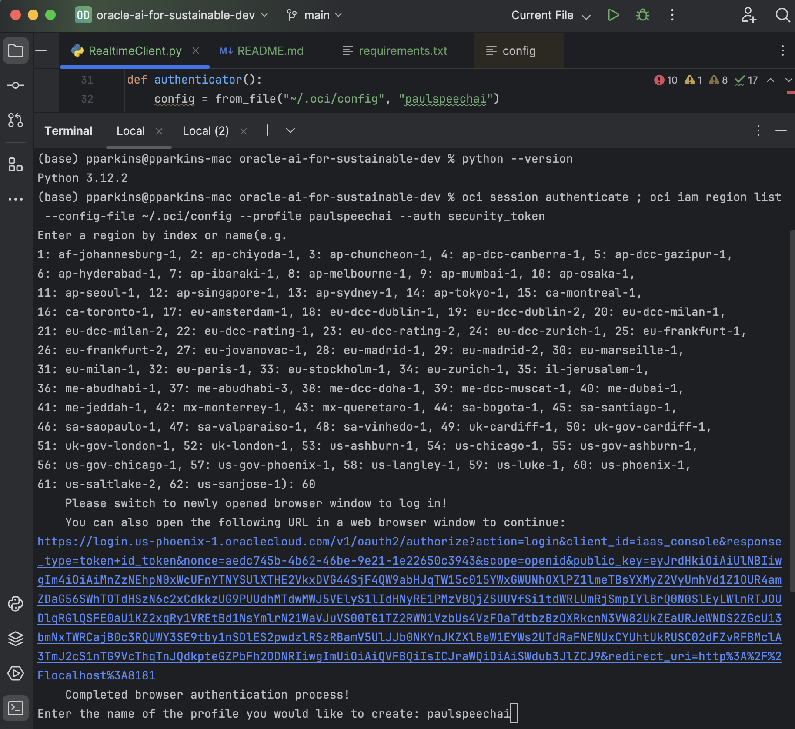
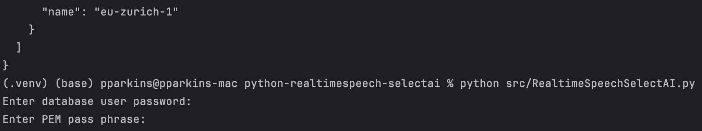
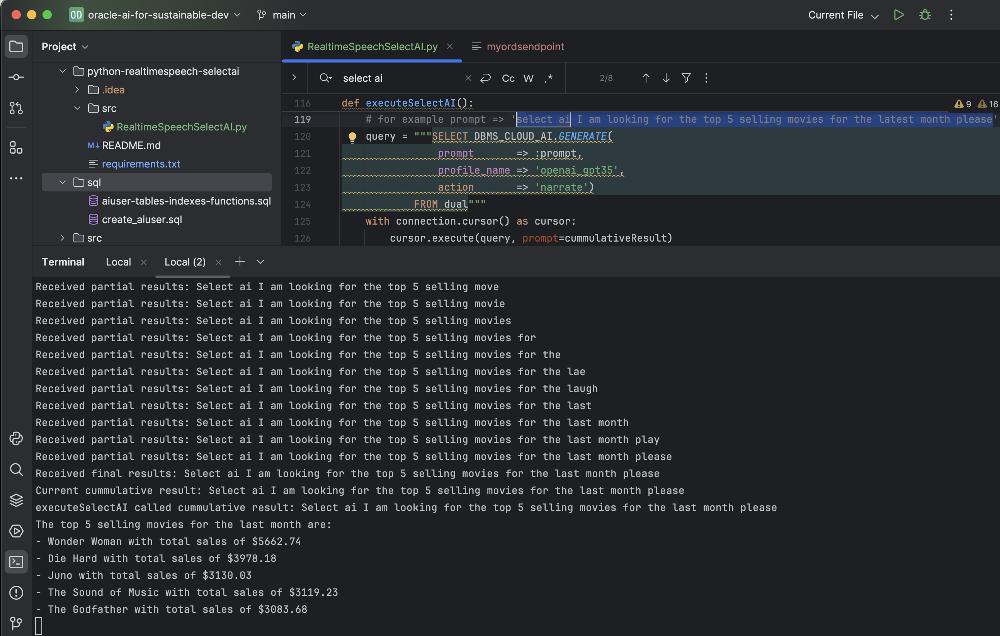

# Real-time Speech Transcription and NL2SQL/Select AI for doctor-patient conversations and EHRs

## Introduction

This lab will show you how to use OCI Real-time Speech Transcription in conjunction with Oracle Database NL2SQL/Select AI to `narrate`, `chat`, `showsql`, and `runsql` based on realtime voice instructions.


Healthcare Communication and Management (Goal 3 of the UN Sustainable Goals: Good Health and Well-being)

 - Application: Use speech transcription and NLP to transcribe and analyze doctor-patient conversations in real-time, generating structured data for Electronic Health Records (EHRs).
 - Benefit: This can improve patient care by ensuring accurate and detailed medical records, enhancing diagnosis and treatment through better data analysis.
 - Goal: Ensure healthy lives and promote well-being for all at all ages.

Estimated Time:  25 minutes


### Objectives

-   Develop a Python application that uses OCI Real-time Speech Transcription in conjunction with Oracle Database NL2SQL/Select AI to `narrate`, `chat`, `showsql`, and `runsql` based on realtime voice instructions.

### Prerequisites

- Completion of Setup lab

## Task 1: Do the setup in the "Chat with Your Data in Autonomous Database Using Generative AI" workshop and 

   1.  Go here: https://livelabs.oracle.com/pls/apex/r/dbpm/livelabs/run-workshop?p210_wid=3831

   2.  Download the wallet for the database created in the workshop in step 1 (click `Database Connection` on the `Autonomous Oracle Database` page of the database that was created). Note the password you use to download the wallet.  More info can be found here: https://docs.oracle.com/en/cloud/paas/autonomous-database/serverless/adbsb/connect-download-wallet.html

   3.  The Oracle real-time transcription services is currently in beta and will be released in August.  Setup simply involves setting speech AI policy/permissions as described in the setup lab.  More details can be found here: https://www.oracle.com/artificial-intelligence/speech/

## Task 2: Build and run Python application

   1. Open a terminal/shell.

   2. cd to the `python-realtimespeech-selectai` directory where the workshop src exists, ie `cd [workspace_src_directory]/python-realtimespeech-selectai`.

   3. Generate a `security_token_file` and an oci config profile entry that contains it.
      Simply issue the following command (providing the correct values for `--config-file` and `--profile`)
      
      This technique bring up a browser for you to authenticate and receive and write the token file locally and update your .oci/config file with the same..

      When  prompted, provide the name of the profile you would like to create:

       ```text
       <copy>oci session authenticate ; oci iam region list --config-file /Users/YOURHOMEDIR/.oci/config --profile MYSPEECHAIPROFILE --auth security_token</copy>
       ```
      
      

      * Note: After some period of time, if the token is not renewed, `AUTHENTICATION_FAILURE: Could not authenticate` will be thrown and this command will need to be re-run.
      * More information can be found here: https://docs.oracle.com/en-us/iaas/Content/API/SDKDocs/clitoken.htm

   4. Update RealtimeSpeechSelectAI.py, to provide your values for `compartment_id` and `config = from_file[...]`
      For example:
      `compartment_id="ocid1.compartment.oc1..YOURCOMPARMENTID",`
      `config = from_file("~/.oci/config", "paulspeechai")`

   5.  Install required Python libraries
   
      ```bash
      <copy>pip install -r requirements.txt</copy>
      ```

   6. Run Python app

      ```bash
        <copy>python src/RealtimeSpeechSelectAI.py</copy>
      ```
      
      You will be prompted for password for the database user as well as the password for the PEM file (that is `ewallet.pem`) . This is the password you provided when you downloaded the wallet in step 2 of Task 1 above. 

      
7. 
      More details can be found in the doc here: https://docs.oracle.com/en/cloud/paas/autonomous-database/serverless/adbsb/connecting-python-mtls.html

   8.  Allow access to the microphone if necessary and speak commands.
       You will see the words you speak in the console/terminal output of the application.

   9. Say a "Select AI " command such as "select ai I am looking for the top 5 selling movies for the latest month please" and then remain silent and notice the return from the database for that NL2SQL/Select AI query.

       

   10. Make changes in RealtimeSpeechSelectAI.py to further enhance the application...

        - modify the various parameters for the audio capture.
        - modify the various parameters for the realtime service. 
        - modify the Speech AI service endpoint if required.


You may now **proceed to the next lab.**..

## Acknowledgements

* **Author** - Paul Parkinson, Architect and Developer Advocate
* **Last Updated By/Date** - Paul Parkinson, 2024
