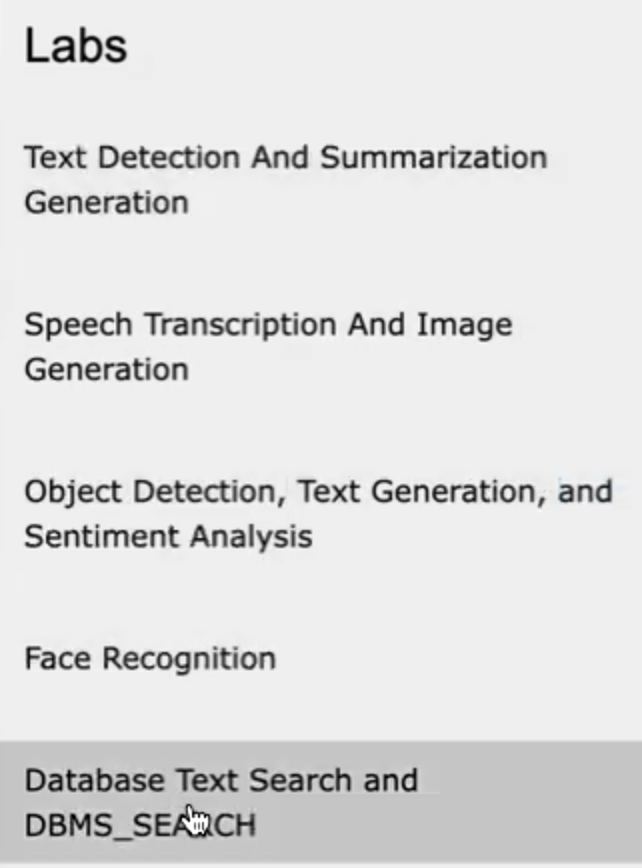
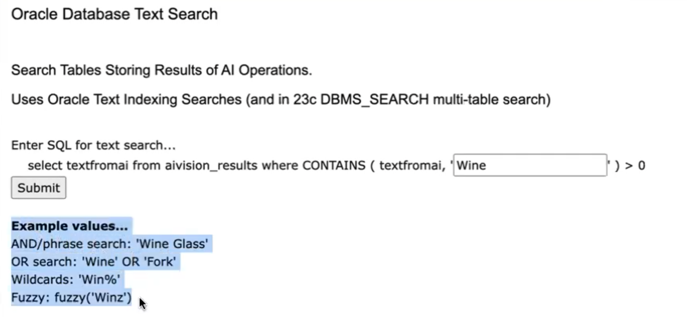
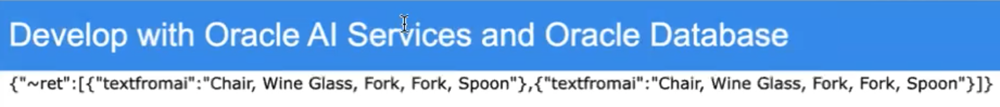

# Text Search and DBMS_SEARCH of AI results

## Introduction

This lab will show you how to use Oracle Database Text Search and DBMS_SEARCH to find records from the AI results obtained in the other labs in this workshop.
This allows for the optimal searching of AI text results and processing.

Estimated Time:  3 minutes

[//]: # ([](youtube:sCpUT5y6aR8))

### Objectives

-   Use Oracle Database Text Search and DBMS_SEARCH

### Prerequisites

- Completion of Setup lab and "Run AI App" lab

## Task 1: Run the application

1. Open http://localhost:8080 in a browser to access the application home page and click `Database Text Search and DBMS_SEARCH`.
   
2. Enter a CONTAINS query clause/parameter in the text field such as the examples provided and click `Submit`.
   
3. Notice the results of the query of the AI results obtained in the other labs in this workshop.
   
4. This should help you understand some syntax and power of Text Searches in the Oracle Database. Examine in the `sql/aiuser-tables-indexes-functions.sql` file how easy it was to create the index to enable this.

```
CREATE TABLE aivision_results
    (id RAW (16) NOT NULL,
     date_loaded TIMESTAMP WITH TIME ZONE,
     label varchar2(20),
     textfromai varchar2(32767),
     jsondata CLOB
     CONSTRAINT ensure_aivision_results_json CHECK (jsondata IS JSON));
/

create index aivisionresultsindex on aivision_results(textfromai) indextype is ctxsys.context;
/
```

DBMS_SEARCH is new functionality in 23c.  It is suggested that you try the [Easy Text Search over Multiple Tables and Views with DBMS_SEARCH in 23c workshop](https://apexapps.oracle.com/pls/apex/r/dbpm/livelabs/view-workshop?wid=3721) to learn more.

You may now **proceed to the next lab.**..

## Acknowledgements

* **Author** - Paul Parkinson, Architect and Developer Evangelist
* **Last Updated By/Date** - Paul Parkinson, 2023
