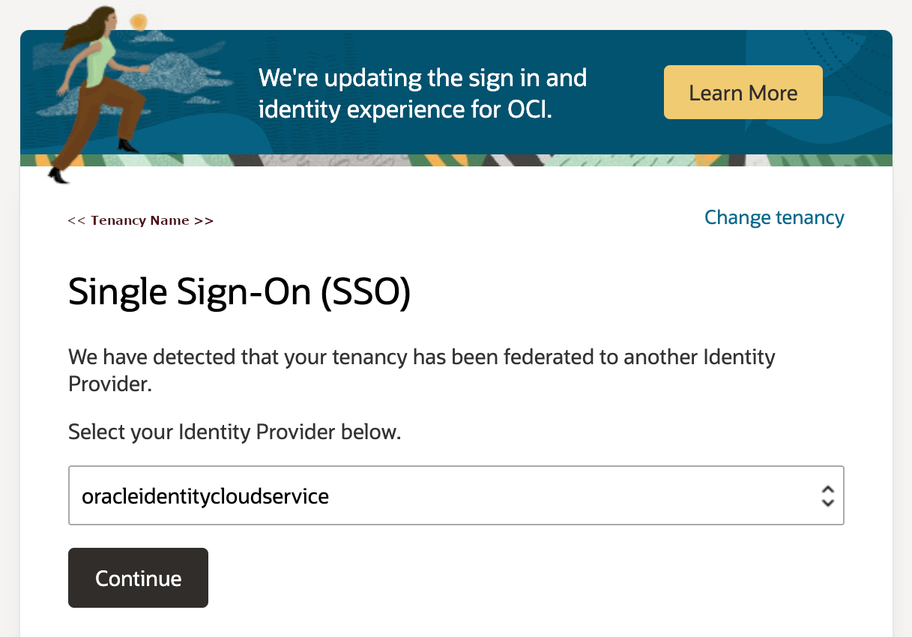
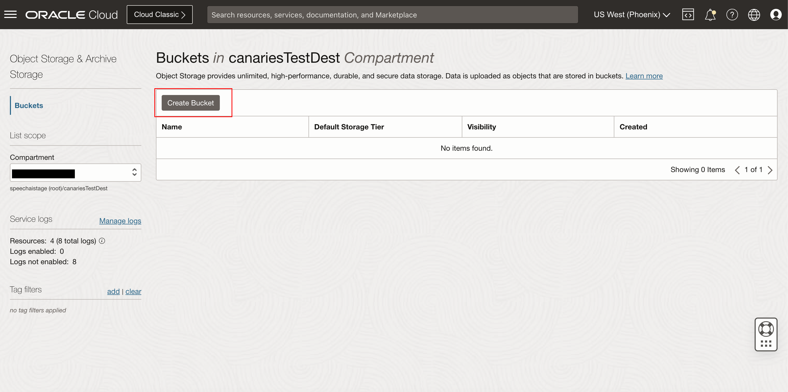
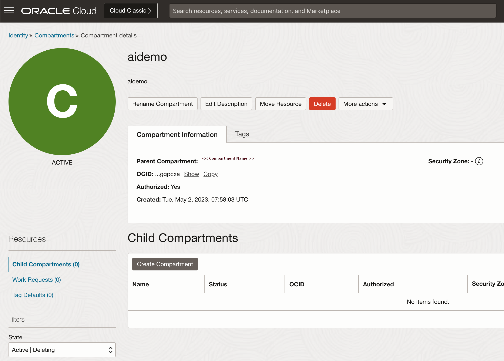
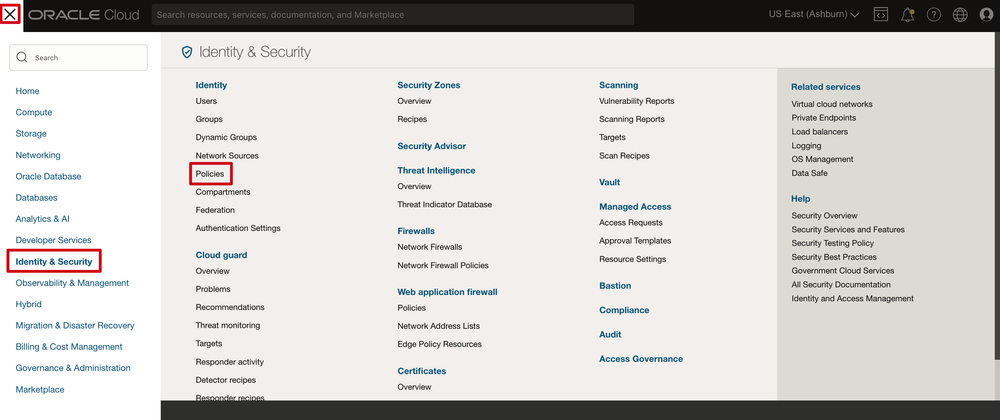
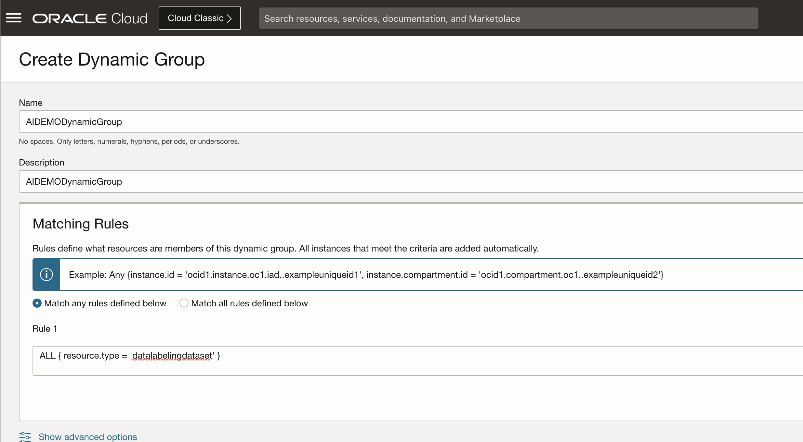

# Setup environment

## Introduction

In this lab, we will set up the required policies to run through the workshop as non-administrative users. However, you can skip most parts of this lab if you have administrative access.

### About OCI Policies

If you're just trying out Oracle Cloud Infrastructure or doing a proof-of-concept project with infrastructure resources, you may not need more than a few administrators with full access to everything. In that case, you can simply create any new users you need and add them to the Administrators group. The users will be able to do anything with any kind of resource. And you can create all your resources directly in the tenancy (the root compartment). You don't need to create any compartments yet, or any other policies beyond the Tenant Admin Policy, which automatically comes with your tenancy and can't be changed.

Please read more about [OCI Policies](https://docs.oracle.com/en-us/iaas/Content/Identity/Concepts/policygetstarted.htm) before creating or changing any OCI policies.

Estimated time: 30 minutes

### Objectives

In this lab, you will:

* Clone the workshop source code
* Create OCI Bucket
* Create a new compartment
* Setup policies for Compartment management
* Setup policies for OCI AI Services
* Create the Oracle Database
* Create database user, tables, and functions/stored procedures and expose as ORDS Rest endpoints
* Configure access to Oracle Cloud services including keys and config file
* Provide the application with the information needed to access the Oracle Database and Oracle AI Services.


### Prerequisites

This lab assumes:

* You have an Oracle Cloud account with OCI and Tenancy administration privileges to create policies and compartments. 

    > **Note 1:**  Policies are only required if you cannot create or use a OCI resources. If you are a tenancy administrator, you will have access to all the resources, and you can **optionally skip policy creations in this lab**. 
    > **Note 2:**  If you have an existing Oracle database, it may be reused and it is only necessary to follow the steps to create the user, tables, and functions/stored procedures and expose as ORDS Rest endpoints
x 
## Task 1: Log into OCI 

1. Login into OCI

    > **Note 3:**  Set up policies based only on the OCI Services that you want to use. For example, a policy on Anomaly Detection would not be required if you want to try a lab on OCI Speech AI.

    To setup environment, you need OCI administrator's privileges. If you've got these privileges, login into OCI at [cloud.oracle.com](https://www.oracle.com/cloud/sign-in.html). the below image indicates SSO Login as an administrative user. If you have administrative previleges and complete access over a tenancy then you need not create any of the policies below steps.

    

    If you do not have administrative privileges into tenancy, you might have to login as federated user, that is the user created by the administrator

    

    In case you haven't got OCI administrator's privileges, you should ask your OCI administrator to perform the rest of the tasks in this lab.

## Task 2: Create OCI Bucket
  
You need to upload the audio files into Oracle object storage, to be used in the transcription job(s) in next steps.

1. Create an Object Storage Bucket (This step is optional in case the bucket is already created)

    First, From the OCI Services menu, click Object Storage.
    

    Then, Select Compartment from the left dropdown menu. Choose the compartment matching your name or company name.
    

    Next click Create Bucket.
    

    Next, fill out the dialog box:
    * Bucket Name: Provide a name <br/>
    * Storage Tier: STANDARD

    Then click Create
    

## Task 3: Create a new compartment

You will use one compartment for all required objects in this workshop, hence you need to create one.

1. Navigate to Compartments page

    In OCI console, open the **Navigator** menu. Navigate to **Identity & Security** and then choose **Compartments**.

    

2. Create a new compartment

    The list of all active compartments is displayed. Click **Create Compartment** to start creating a new compartment.

    

3. Review compartment details

    Make note of compartment OCID

    
    
## Task 4: Setup policies for Compartment management

You need to create a **policy** which grants manage privileges in a new compartment to the new OCI group.

1. Navigate to **Policies** page

    Once again use **Navigator** to navigate to **Identity & Security** and now choose **Policies**.

    

2. Create a new policy

    In the **Policies** page click **Create Policy**.

    

3. Define a new policy

    Provide a new Policy **Name** and **Description**.

    This policy is set at the *root* compartment level, therefore select the *root* compartment of your tenancy.

    In **Policy Builder** section, search for **Let compartment admins manage the compartment** in the **Common policy templates** pulldown list.

    Make sure **Groups** option is selected and then choose your newly created OCI Group from the list of available OCI Groups. For **Location**, select parent compartment which can also be *root* compartment.
 
    Your policy should look like this:

     ```text
     <copy>Allow group < group name > to manage all-resources in compartment < compartment name > </copy>
     ```
   
    for example, 

    ```text
     <copy>Allow group AIDEMOGroup to manage all-resources in compartment aidemo</copy>
    ```

## Task 5: Setup policies for OCI Data Labeling

One of the tasks in this workshop will be data labeling. This is a process in which all images from your training image library will be assigned a single label that describe that specific image.  To be able to perform your data labeling process, you must perform the following prerequisite steps to:

> **Note:** Please refer [OCI Data Labeling Policies](https://docs.oracle.com/en-us/iaas/Content/data-labeling/using/policies.htm) for more information related to this policy.
 
* Create one new dynamic group and
* Set required policies for data labeling
 
1. To find policy details navigate to **Analytics & AI** > **Machine Learning** > **Data Labeling** Service page
  
    

2. Open Datasets sub-page

    Click on **Datasets** link under **Data Labeling** on the left side of the page. This will open **Dataset list** page in selected Compartment (you might need to change compartment to the one you have created for this workshop).

    

3. Verify data labeling prerequisites

    Expand **Show more information** to display what prerequisites have to be met before you can start your data labeling exercise. If these are not met, then Data Labeling might not run properly.

    

    If you have already created a new OCI group creating a new OCI group is not needed. Continue with creating a new dynamic group.

4. Navigate to Dynamic Groups page

    From **Navigator** menu choose **Identity & Security** and then **Dynamic Groups**.

    

5. Create a new dynamic group

    Click **Create** and define a new **Dynamic Group**.

    Provide **Name**, **Description** and enter the following statement to the **Matching Rules**:

    ```text
    <copy>ALL { resource.type = 'datalabelingdataset' }</copy>
    ```

    

6. Set policies for data labeling

    From the **Navigator** menu select **Identity & Security** and then choose **Policies**.

    

7. Create a new policy for non-administrative users

    Make sure that you've selected your *root* compartment first. Then click **Create Policy**.

    The first policy is for non-administrative users. These users are members of previously created OCI Group.

    OCI Group needs the following privileges (assuming OCI Group is called **AIDEMOGroup** and compartment's name is **aidemo**):

    ```text
    <copy>allow group AIDEMOGroup to read buckets in compartment aidemo
    allow group AIDEMOGroup to manage objects in compartment aidemo
    allow group AIDEMOGroup to read objectstorage-namespaces in compartment aidemo
    allow group AIDEMOGroup to manage data-labeling-family in compartment aidemo</copy>
    ```

    
 
8. Create a new policy for dynamic group

    Repeat **Create Policy** for Dynamic Group you've created in the previous step. 

    Make sure that you've selected your *root* compartment.

    Enter the following statements (assuming Dynamic Group is called **AIDEMODynamicGroup** and compartment's name is **aidemo**):

    ```text
    <copy>allow dynamic-group AIDEMODynamicGroup to read buckets in compartment aidemo
    allow dynamic-group AIDEMODynamicGroup to read objects in compartment aidemo
    allow dynamic-group AIDEMODynamicGroup to manage objects in compartment aidemo where any {request.permission='OBJECT_CREATE'}</copy>
    ```
 
    You are now ready to start using Data Labeling service.
      
## Task 6: Setup policies for OCI Vision service

Similarly to Data Labeling service, you will require some privileges to use OCI Vision service. 

> **Note:** Please refer [OCI AI Vision Policies](https://docs.oracle.com/en-us/iaas/vision/vision/using/about_vision_policies.htm) for more information related to this policy.

1. Navigate to **Policies** page. In the **Navigator** to navigate to **Identity & Security** and now choose **Policies**.

    

2. Create a new policy

    In the **Policies** page click **Create Policy**.

    
  
3. Define policies to access Vision service

    Provide a name of a new policy and description in **Create Policy** dialog page. In the **Policy Builder** section enable **Show manual editor** and enter the following policy, You can provide any name and description for this policy

    Policy statement 
 
    ```text
    <copy>allow group AIDEMOGroup to manage ai-service-vision-family in tenancy
    allow group AIDEMOGroup to manage object-family in tenancy</copy>
    ``` 

    

    Click **Create**. 

    You are now ready to start using OCI Vision service.
  
## Task 7: Setup policies for OCI Document Understanding Service

Before you start using OCI Document Understanding, OCI policies should be setup for allowing you to access OCI Document Understanding Service. Follow these steps to configure required policies.

> **Note:** Please refer [OCI Document Understanding Policies](https://docs.oracle.com/en-us/iaas/document-understanding/document-understanding/using/about_document-understanding_policies.htm#about_vision_policies) for more information related to this policy.

1. Navigate to **Policies** page. In the **Navigator** to navigate to **Identity & Security** and now choose **Policies**.

    

2. Create a new policy

    In the **Policies** page click **Create Policy**.

    

3. Create Policy to grant users Document APIs access. Add the below statement to allow all the users in your tenancy to use document understanding:

    Policy statement -

    ```
    <copy>allow any-user to manage ai-service-document-family in tenancy</copy>
    ```

    

    If you want to limit access to a user group, create a policy with the below statement:

    ```
    <copy>allow group <group-name> to use ai-service-document-family in tenancy</copy>
    ```

4. Policy to access input document files in object storage 

  If your want to analyze documents stored in your tenancy's object storage bucket, add the below statement to grant object storage access permissions to the group:

    ```
    <copy>allow group <group_in_tenancy> to use object-family in tenancy</copy>
    ```
        
  If you want to restrict access to a specific compartment, you can use the following policy instead: 

    ```
    <copy>allow group <group_in_tenancy> to use object-family in compartment <compartment-ocid></copy>
    ```

6. Policy to access output location in object storage 

  Document Understanding Service stores results in your tenancy's object store. Add the following policy to grant object storage access permissions to the user group who requested the analysis to documents:

    ```
    <copy>allow group <group_in_tenancy> to manage object-family in compartment <compartment-ocid></copy>
    ```
   
## Task 8: Setup policies for OCI Speech

Before you start using OCI Speech, your tenancy administrator should set up the following policies by following below steps:

> **Note:** Please refer [OCI Speech Policies](https://docs.oracle.com/en-us/iaas/Content/speech/using/policies.htm) for more information related to this policy.

1. Create a new policy with the following statements:

    If you want to allow all the users in your tenancy to use speech service, create a new policy with the below statement:

    ```
    <copy>
    allow any-user to manage ai-service-speech-family in tenancy
    allow any-user to manage object-family in tenancy
    allow any-user to read tag-namespaces in tenancy
    allow any-user to use ons-family in tenancy
    allow any-user to manage cloudevents-rules in tenancy
    allow any-user to use virtual-network-family in tenancy
    allow any-user to manage function-family in tenancy
    </copy>
    ```
    

    If you want to limit access to a user group, first create a group

    Navigate to OCI groups:
        

    Click "Create Group"
        

    Add group name and description, click create
        

    To add users click "Add User to Group" and select user from dialog
        

    Create a new policy with the below statement, replace  group-name with your group name

    ```
        <copy>
        allow group <group-name> to manage ai-service-speech-family in tenancy
        allow group <group-name> to manage object-family in tenancy
        allow group <group-name> to read tag-namespaces in tenancy
        allow group <group-name> to use ons-family in tenancy
        allow group <group-name> to manage cloudevents-rules in tenancy
        allow group <group-name> to use virtual-network-family in tenancy
        allow group <group-name> to manage function-family in tenancy
        </copy>
        ```

     
  
## Task 9: Setup policies for OCI Anomaly Detection

Policy creation steps for this service is same as all other services defined in above tasks, only the statement would change

> **Note:** Please refer [Anomaly Detection Policies](https://docs.oracle.com/en-us/iaas/Content/anomaly/using/policies.htm) for more information related to this policy.

1. Before you start using Anomaly Detection service, your tenancy administrator should set up the following policies.

    ```
    <copy>
    allow any-user to manage ai-service-anomaly-detection-family in tenancy 
    </copy>
        ```

2. Policies at a Group level and compartment level (Optional)

    ```
    <copy>
    allow group <group-name> to manage ai-service-anomaly-detection-family in compartment <compartment-ocid> 
    </copy>
        ```
 

This concludes this lab. You can **proceed now to the next lab**.
   
## Learn More

* [OCI Documentation](https://docs.oracle.com/en-us/iaas/Content/home.htm)
* [Data Labeling Service](https://docs.oracle.com/en-us/iaas/data-labeling/data-labeling/using/about.htm)
* [Configure OCI CLI](https://docs.oracle.com/en-us/iaas/Content/API/SDKDocs/cliconfigure.htm)
* [OCI Speech Policies](https://docs.oracle.com/en-us/iaas/Content/speech/using/policies.htm)
* [OCI Object Storage](https://docs.oracle.com/en-us/iaas/Content/Object/Concepts/objectstorageoverview.htm)
* [Anomaly Detection Policies](https://docs.oracle.com/en-us/iaas/Content/anomaly/using/policies.htm)
 
## Acknowledgements

* **Author** - Madhusudhan Rao B M, Principal Product Manager, Oracle Database

* **Last Updated By/Date** - 11th August, 2023.