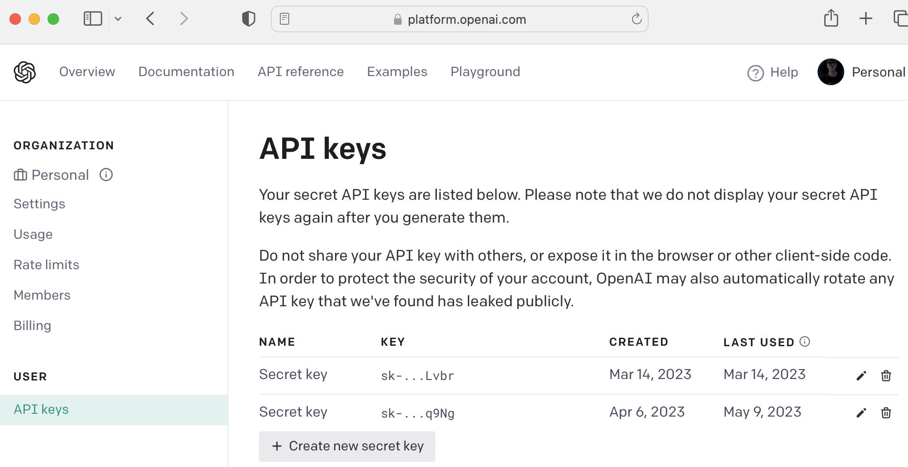

# Setup

## Introduction

In this lab, we will provision and setup everything that is needed to run all of the labs in the workshop

Estimated Time: 15 minutes

[](youtube:pONVT_J5E-M)

### Objectives

* Clone workshop code
* Provision an Oracle Database
* Install SQLcl client for convenient administration of database
* Run scripts in SQLcl to setup database user, tables, and JSON duality views, as well as JavaScript
* Configure access to Oracle Cloud services including keys and config file
* Obtain an OpenAI account and token
* Build the workshop code so that it is ready for later labs

### Prerequisites

- This workshop assumes you have an Oracle cloud account and have signed in to the account.

## Task 1: Download or clone the workshop source code

1.    Go to https://github.com/paulparkinson/openai-and-oracle-for-good and either download or `git clone https://github.com/paulparkinson/openai-and-oracle-for-good.git` the source.
      We will refer to the root directory of this repos as `[AI_WORKSHOP_SRC_ROOT]` .


## Task 2: Obtain and Start an Oracle Free 23c Database

1.    There are a number of ways to go about this which can be found here: https://www.oracle.com/database/free/get-started/

      Here we will use the docker container. Simply issue the following commands, replacing `Welcome12345` with your compliant password if you like.
      You can either use the container-registry.oracle.com container using the following command(s)...

   ```
    <copy>docker pull gvenzl/oracle-free; docker run --add-host docker.for.mac.host.internal:host-gateway -d -p 1521:1521 -e ORACLE_PASSWORD=Welcome12345 gvenzl/oracle-free</copy>
   ```

Optionally, you can add the `-v oracle-volume:/somedirectory` parameter (replacing `somedirectory` with an actual directory) to the run command to persist data across container restarts as otherwise it will be lost.

   ```
    <copy>docker pull gvenzl/oracle-free; docker run --add-host docker.for.mac.host.internal:host-gateway -d -p 1521:1521 -e ORACLE_PASSWORD=Welcome12345 -v oracle-volume:/somedirectory gvenzl/oracle-free</copy>
   ```

Should you wish to reset the sys password, you can do so by issuing docker ps -al to get the image id and then issue the `resetPassword` as shown here.

```
    <copy>docker ps -al | grep oracle</copy>
```

```
    <copy>docker exec [IMAGE_ID] resetPassword yournewpassword</copy>
```

## Task 3: Download SQLcl and install

1.    Download and install from this location https://www.oracle.com/database/sqldeveloper/technologies/sqlcl/download/
      This will provide in a `[SQLcl_INSTALL_DIR]/bin/sql` executable that we will use to administer the database. For convenience you may add `[SQLcl_INSTALL_DIR]/bin` to your PATH.

2.    Login  replacing `[SQLcl_INSTALL_DIR]` with the location of your SQLcl
      and replacing `Welcome12345` with the one you provided as `ORACLE_PASSWORD` when creating the database.
```
    <copy>[SQLcl_INSTALL_DIR]/bin/sql  sys/Welcome12345@//localhost:1521/freepdb1 as sysdba</copy>
```
3.    Type `exit` to exit SQLcl. We will return to it during setup.


## Task 4: Configure access to Oracle Cloud services including keys and config file

1. First create a location to store the keys and config file which is generally `~/.oci`

```
    <copy>mkdir ~/.oci</copy>
```

2. You will create a key_file and a `config` file and place them in this directory. The config file will take the following format.

```
    [DEFAULT]
      user=ocid1.user.oc1..<unique_ID>
      fingerprint=<your_fingerprint>
      key_file=~/.oci/oci_api_key.pem
      tenancy=ocid1.tenancy.oc1..<unique_ID>
      region=us-ashburn-1
```

3. Directions for creating the key and fingerprint can be found here: https://docs.oracle.com/en-us/iaas/Content/API/Concepts/apisigningkey.htm#apisigningkey_topic_How_to_Generate_an_API_Signing_Key_Console
   and the region, tenancy, and user OCIDs can be found in the OCI console. Simply paste them and save the `config` file.

   

## Task 5: Obtain OpenAI account and Key

1. Simply go to the https://platform.openai.com site to obtain an account and then generate and copy a key at https://platform.openai.com/account/api-keys



## Task 6: Provide the application with the information about the database, OCI config, and OpenAI config and build so that it is ready for later labs.

1. cd to the `[AI_WORKSHOP_SRC_ROOT]` directory.

2. Obtain the IP of the host machine and place it in sql/mlejs_openai_sproc.sql so the database can call out to it.

    The application that runs in the database will make calls out to our application. Since we are running the database in a container, it needs to be able to contact the host.  We can obtain the host IP using the following command

    ```
    <copy>ifconfig | grep 'inet 192'| awk '{ print $2}'</copy>
    ```

    Replace the `192.168.205.1` value in the sql/mlejs_openai_sproc.sql and sql/create_aijs_user.sql

3. Login to the database with SQLcl as was done in Task 2.

    ```
    <copy>[SQLcl_INSTALL_DIR]/bin/sql  sys/Welcome12345@//localhost:1521/freepdb1 as sysdba</copy>
    ```

4. At the SQLcl prompt execute the following scripts to create a user with appropriate privileges, switch to that user,

    ```
    <copy>@sql/create_aijs_user.sql</copy>
    ```

    ```
    <copy>@sql/conversation.sql</copy>
    ```

    ```
    <copy>@sql/mlejs_openai_sproc.sql</copy>
    ```

5. Replace the following values in `./build_and_run.sh` as necessary

    ```
   export OPENAI_KEY=asdf-yourkeyhere-asdfx
   export OCICONFIG_File=~/.oci/config
    ```

6. Issue the following command to build and run the Spring Boot Java application that is used for most of the labs in this workshop.

    ```
    <copy>./build_and_run.sh</copy>
    ```

You may now **proceed to the next lab.**..

## Acknowledgements

* **Author** - Paul Parkinson, Architect and Developer Evangelist
* **Last Updated By/Date** - Paul Parkinson, 2023
