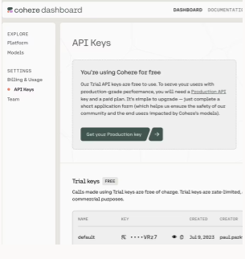
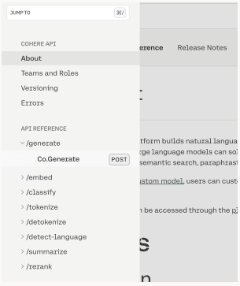
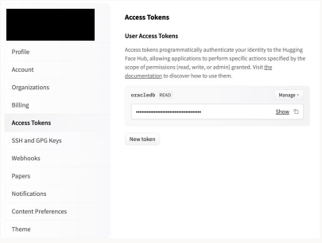
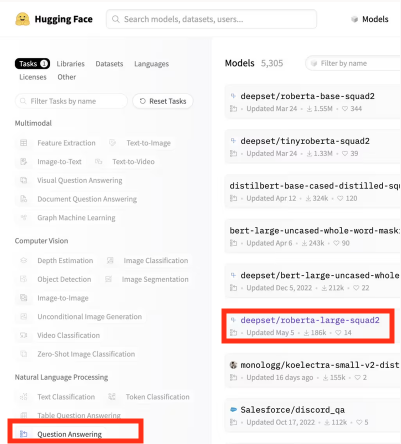
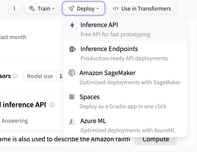
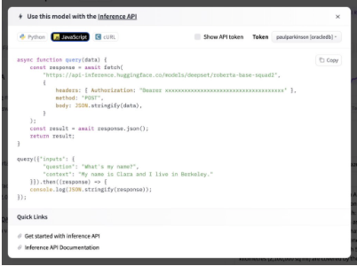
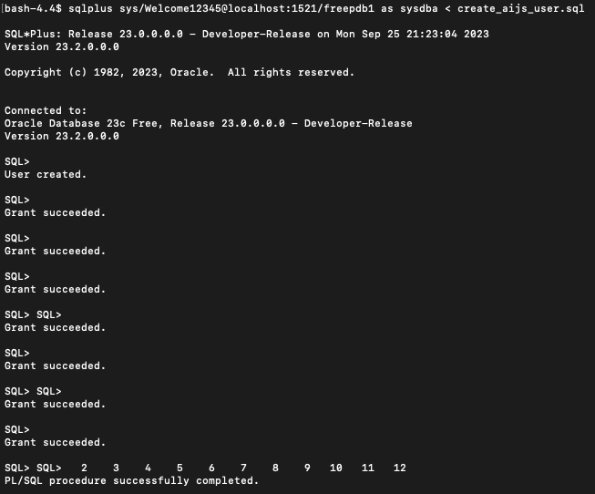

## Introduction

In this lab, we will provision and setup everything that is needed to run all of the labs in the workshop

Estimated Time: 15 minutes

[](youtube:pONVT_J5E-M)

### Objectives

- Gather Cohere AI account API keys
- Gather Hugging Face AI account API keys
- Create and configure the Oracle Database
- Create the database users with appropriate priviledges
- Configure access to Oracle Cloud services including keys and config file
- Provide the application with the information about the database, OCI config, and OpenAI config and build so that it is ready for later labs

### Prerequisites

- This workshop assumes you have an Oracle cloud account and have signed in to the account.

- `sql` folder containing the lab scripts downloaded to your **local computer** from Github using the following command:
    
    ```
    <copy>git clone https://github.com/ethan-shmargad/src.git</copy>
    ```
- Download the other source files using: `git clone https://github.com/paulparkinson/openai-and-oracle-for-good.git`. We will refer to the root directory of this repos as `[AI_WORKSHOP_SRC_ROOT]

- Docker installed on a local computer

## Task 1: Gather Cohere AI account API keys

1. Once logged in to https://cohere.com, click on **Dashboard**, then **API Keys**.

2. Create a key or use the trial keys, then copy its value for later use.

    

3. Select the **API Reference** then select the hmburger menu icon of the left of the page to view the API Reference list. Under the `/generate` section, select `Co.Generate`.

    

    This workshop will be using Cohere AI's Co.Generate model. This is a state-of-the-art large language model (LLM) that can generate text, translate languages, answer questions, and perform other tasks. It is trained on a massive dataset of text and code, and is able to generate high quality text.

4. Select **language** then select the **Javascript** option in order to see a sample code snippet to call the model. You will see this in later labs when using the Javascript module to call the model in database.

    


## Task 2: Gather Hugging Face AI account API keys

1. Once logged in to https://huggingface.co, go to your on **profile**, then select **settings**. From there, select **Access Tokens** then **Create**, and copy its value for later use.

    

2. Navigate back to the dashboard then select **Models**. Then, select a model (one with more views/downloads) under the **Natural Language Processing** section for **Question Answering**.

    

3. After selecting the model, notice the information in the *Model Card* on the left. After that, select the **Deploy** drop-down menu on the right and select **Inference API**. 

    

4. Select the **Javascript** option in order to see a sample code snippet to call the model.

    

  This workshop will be using a BERT-base-uncased model. This is is a pre-trained language model (LM) that can be used for a variety of natural language processing (NLP) tasks, such as text classification, question answering, and summarization. It is trained on a massive dataset of text and code, and is able to learn complex relationships between words and phrases.

## Task 3: Create and configure the Oracle Database

For this lab, we will use the Oracle 23c Free version via a docker container image locally.

1. Log into the terminal of your choice. Copy and paste the following command to pull the 23c docker image to your local computer.

    ```
    <copy>docker pull container-registry.oracle.com/database/free:latest</copy>

    ```

2. Run the container by executing one of the commands below depending on the operating system of your computer.

    **Windows:**

    ```
    <copy>docker run -d -p 1521:1521 -e ORACLE_PASSWORD=Welcome12345 container-registry.oracle.com/database/free:latest</copy>
    ```

    **Mac:**

    ```
    docker run -d -p 1521:1521 --add-host docker.for.mac.host.internal:host-gateway -e ORACLE_PASSWORD=Welcome12345 container-registry.oracle.com/database/free:latest
    ```

3. Type in the following docker command to view your running containers to confirm that the 23c image is up and running.

    ```
    <copy>docker ps</copy>
    ```

4. Copy and paste the following command to give read and write access to the `sql` directory on your local machine.

    ```
    <copy>chmod -R a+rw /path/to/sql/directory`</copy>
    ```

5. Use the following command to move the `sql` folder on your local desktop to the docker container.

    *Note:* path may be different/change depending on folder placement

    ```
    <copy>docker cp <FOLDER_PATH>/sql <CONTAINER_ID>:/home/oracle</copy>
    ```

6. Using either the `container_name` or `container_id`, copy and paste the following command to enter a bash instance in your container.

    ```
    <copy>docker exec -it <container_name>/<container_id> bash</copy>
    ```

7. Make sure the folder `sql` that was just copied is in the correct directory within the container using the following commands.

    ```
    <copy>cd /home/oracle/sql</copy>
    ```

    ```
    <copy>ls</copy>

    ...

    coherequery.sql	create_aijs_acl.sql	huggingfacequery.sql writefile.sql coherequeryfetchonly.sql create_aijs_user.sql huggingfacequeryfetchonly.sql
    ```

8. Use the following command to return back to the home directory:

    ```
    <copy>cd</copy>
    ```

9. Login to the database as `SYS` using the command below.

    ```
    <copy>sqlplus / as sysdba</copy>

    ...

    SQL>
    ```

10. Copy and paste the following command to open up `SYS` to the PDB (pluggabe Database) we will be using, `freepdb1`. 

    ```
    <copy>alter user sys identified by "Welcome12345" container=all;</copy>

    ...

    User Altered.
    ```

11. **Exit** from the SQL session back to the terminal session of your container, then log back into another SQL session within `freepdb1` using the following command to make sure the connection works.

    ```
    <copy>sqlplus sys/Welcome12345@localhost:1521/freepdb1 as sysdba</copy>
    ```

12. **Exit** from the SQL session back to the terminal session of your container.

## Task 4: Create the database users with appropriate priviledges

1. Within the terminal session of your docker container, run the sql script `create_aijs_user.sql`  in `freepdb1` to create the **aijs** user. **Exit** the `SQL` session once finished.

    ```
    <copy>sqlplus sys/Welcome12345@localhost:1521/freepdb1 as sysdba < create_aijs_user.sql</copy>
    ```

    ```
    <copy>Exit</copy>

    ...

    bash-$
    ```

    

2. Navigate back into the `sql` folder.

    ```
    <copy>cd ~/sql</copy>
    ```

3. Run the `create_aijs_acl.sql` script to give access to the `aijs` user.

    ```
    <copy>sqlplus sys/Welcome12345@localhost:1521/freepdb1 as sysdba < create_aijs_acl.sql</copy>

    ...

    bash-$
    ```

4. Connect back to `freepdb1`.

    ```
    <copy>sqlplus sys/Welcome12345@localhost:1521/freepdb1 as sysdba</copy>

    ...

    SQL>
    ```

5. Use the following SQL commands to create JSON tables for the responses from Cohere AI and/or Hugging Face AI.

    **Cohere AI:**

    ```
    <copy>create table coherejson (id json);</copy>

    ...

    Table created.
    ```

    **Hugging Face AI:**

    ```
    <copy>create table huggingfacejson (id json);</copy>

    ...

    Table created.
    ```

6. **Exit** out of the `SQL` session back to the bash of your container then navigate back to the home directory.

    ```
    SQL> EXIT

    ...

    Disconnected from Oracle Database 23c Free, Release 23.0.0.0.0 - Developer-Release
    Version 23.2.0.0.0

    bash-$
    ```

    ```
    <copy>cd</copy>
    ```

## Task 5: Configure access to Oracle Cloud services including keys and config file

1. First create a location to store the keys and config file which is generally `~/.oci`

```
    <copy>mkdir ~/.oci</copy>
```

2. You will create a key_file and a `config` file and place them in this directory. The config file will take the following format.

```
    [DEFAULT]
      user=ocid1.user.oc1..<unique_ID>
      fingerprint=<your_fingerprint>
      key_file=~/.oci/oci_api_key.pem
      tenancy=ocid1.tenancy.oc1..<unique_ID>
      region=us-ashburn-1
```

3. Directions for creating the key and fingerprint can be found here: https://docs.oracle.com/en-us/iaas/Content/API/Concepts/apisigningkey.htm#apisigningkey_topic_How_to_Generate_an_API_Signing_Key_Console
   and the region, tenancy, and user OCIDs can be found in the OCI console. Simply paste them and save the `config` file.

   


## Task 6: Provide the application with the information about the database, OCI config, and OpenAI config and build so that it is ready for later labs

1. cd to the `[AI_WORKSHOP_SRC_ROOT]` directory.

2. Obtain the IP of the host machine and place it in sql/mlejs_openai_sproc.sql so the database can call out to it.

    The application that runs in the database will make calls out to our application. Since we are running the database in a container, it needs to be able to contact the host.  We can obtain the host IP using the following command

    ```
    <copy>ifconfig | grep 'inet 192'| awk '{ print $2}'</copy>
    ```

    Replace the `192.168.205.1` value in the sql/mlejs_openai_sproc.sql and sql/create_aijs_user.sql

3. Login to the database with SQLcl as was done in Task 2.

    ```
    <copy>[SQLcl_INSTALL_DIR]/bin/sql  sys/Welcome12345@//localhost:1521/freepdb1 as sysdba</copy>
    ```

4. At the SQLcl prompt execute the following scripts as the `aijs` user.

    ```
    <copy>@sql/create_aijs_user.sql</copy>
    ```

    ```
    <copy>@sql/conversation.sql</copy>
    ```

    ```
    <copy>@sql/mlejs_openai_sproc.sql</copy>
    ```

5. Replace the following values in `./build_and_run.sh` as necessary

    ```
   export OPENAI_KEY=asdf-yourkeyhere-asdfx
   export OCICONFIG_File=~/.oci/config
    ```

6. Issue the following command to build and run the Spring Boot Java application that is used for most of the labs in this workshop.

    ```
    <copy>./build_and_run.sh</copy>
    ```

You may now **proceed to the next lab.**..

