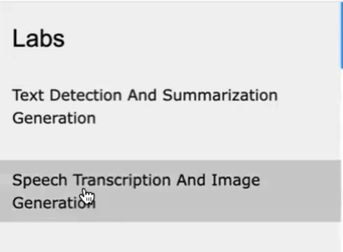
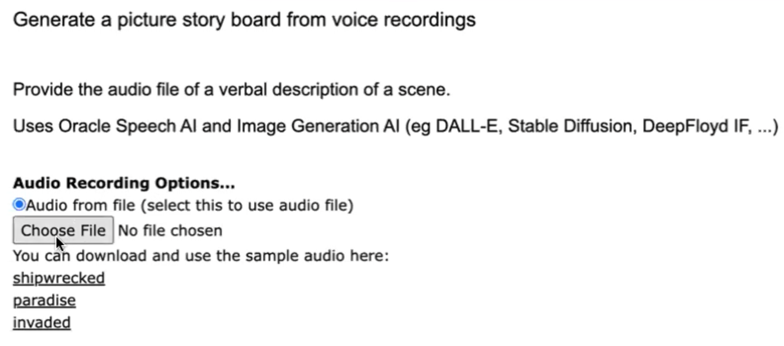
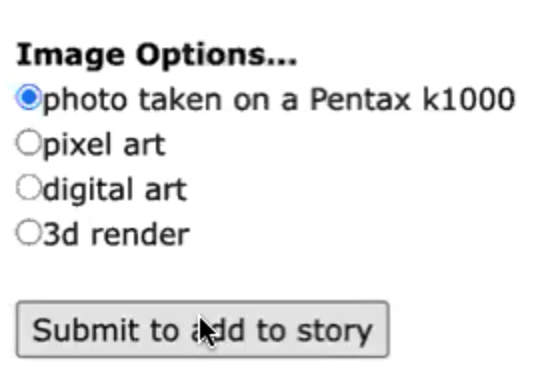
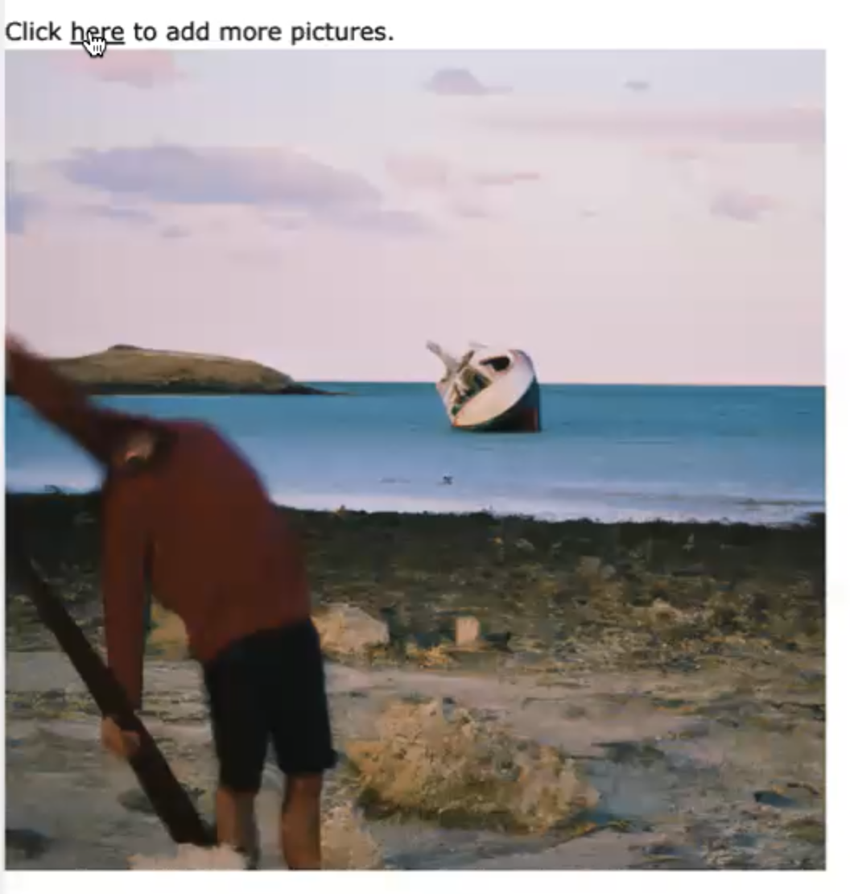

# Speech Transcription And Image Generation For Hands-Free Storyboarding

## Introduction

This lab will show you how to use Oracle Database, OCI Speech AI, and Gen AI
The use case involves the creation webpages and storyboards using only voice commands for individuals with impaired motor control.

Estimated Time:  3 minutes

### Objectives

-   Use Oracle Database, OCI Speech AI, and Gen AI

### Prerequisites

- Completion of Setup lab and "Run AI App" lab

## Task 1: Run the application

1. Open http://localhost:8080 in a browser to access the application home page and click `SpeechTranscription And Image Generation`.
   
2. Select an audio file with speech in it such as the `shipwrecked` file provided.
   
3. Select an option for the format of image to be generated based on the speech transcription and click `Submit`.
   
4. Notice the generated image. You can choose to add more pictures to create a story board based on the audio transcriptions (eg `paradise` and `invaded` continue a Robinson Crusoe themed storyline)
   

You may now **proceed to the next lab.**..

## Acknowledgements

* **Author** - Paul Parkinson, Architect and Developer Evangelist
* **Last Updated By/Date** - Paul Parkinson, 2023
