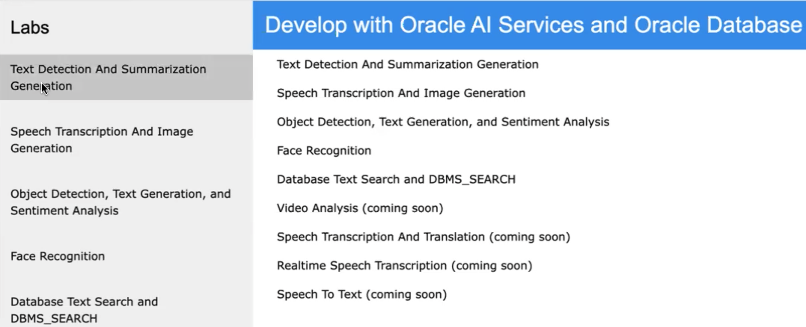
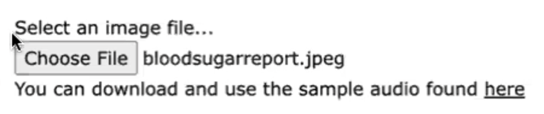
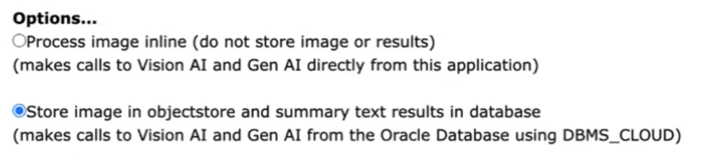
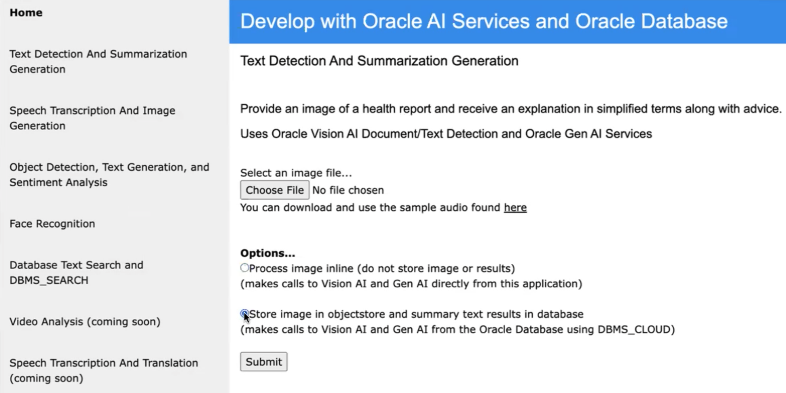
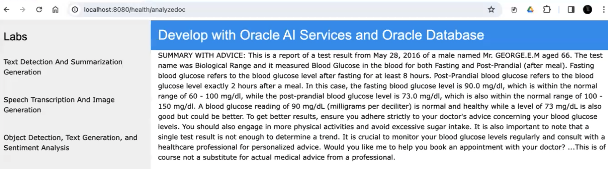

# Text Detection And Summarization For Health Report Results

## Introduction

This lab will show you how to use Oracle Database, OCI Vision AI Text Detection, and Oracle Gen AI services
The use case involves the interpretation health test results and recommended steps for everyday individuals.

Estimated Time:  3 minutes


### Objectives

-   Use Oracle Database, OCI Vision AI Text Detection, and Oracle Gen AI

### Prerequisites

- Completion of Setup lab and "Run AI App" lab

## Task 1: Run the application

   1. Open http://localhost:8080 in a browser to access the application home page and click `Text Detection And Summarization Generation`.
   
   2. Select an image file with text in it such as the sample blood sugar report file provided.
   
   3. Select the option to process the image inline (no storage) or store the image and AI results and click `Submit`.
   
   
   4. View the results which show a diagnosis summary in simple terms and suggestions for improvement (also stating that this is of course not a substitue for professional medical advice which should be consulted). 
   
   5. Notice the PL/SQL function code in the `sql/aiuser-tables-indexes-functions.sql` file that is called by this application and how it calls DBMS_CLOUD, parses the JSON, and stores the results, and also REST/ORDS enable the function.
        
        ``` <copy>
        CREATE OR REPLACE FUNCTION VISIONAI_TEXTDETECTION (
            p_endpoint VARCHAR2,
            p_compartment_ocid VARCHAR2,
            p_namespaceName VARCHAR2,
            p_bucketName VARCHAR2,
            p_objectName VARCHAR2,
            p_featureType VARCHAR2,
            p_label VARCHAR2
        ) RETURN VARCHAR2 IS
            resp DBMS_CLOUD_TYPES.resp;
            json_response CLOB;
            v_textfromai VARCHAR2(32767);
        BEGIN
            resp := DBMS_CLOUD.send_request(
                credential_name => 'OCI_KEY_CRED',
                uri => p_endpoint || '/20220125/actions/analyzeImage',
                method => 'POST',
                body => UTL_RAW.cast_to_raw(
                    JSON_OBJECT(
                        'features' VALUE JSON_ARRAY(
                            JSON_OBJECT('featureType' VALUE p_featureType)
                        ),
                        'image' VALUE JSON_OBJECT(
                            'source' VALUE 'OBJECT_STORAGE',
                            'namespaceName' VALUE p_namespaceName,
                            'bucketName' VALUE p_bucketName,
                            'objectName' VALUE p_objectName
                        ),
                        'compartmentId' VALUE p_compartment_ocid
                    )
                )
            );
            json_response := DBMS_CLOUD.get_response_text(resp);
            SELECT LISTAGG(text, ', ') WITHIN GROUP (ORDER BY ROWNUM)
            INTO v_textfromai
            FROM JSON_TABLE(json_response, '$.imageText.words[*]'
                COLUMNS (
                    text VARCHAR2(100) PATH '$.text'
                )
            );
            INSERT INTO aivision_results (id, date_loaded, label, textfromai, jsondata)
            VALUES (SYS_GUID(), SYSTIMESTAMP, p_label, v_textfromai, json_response);
            RETURN v_textfromai;
        EXCEPTION
            WHEN OTHERS THEN
                RAISE;
        END VISIONAI_TEXTDETECTION;
        /
        
        BEGIN
            ORDS.ENABLE_OBJECT(
                P_ENABLED      => TRUE,
                P_SCHEMA      => 'AIUSER',
                P_OBJECT      =>  'VISIONAI_TEXTDETECTION',
                P_OBJECT_TYPE      => 'FUNCTION',
                P_OBJECT_ALIAS      => 'VISIONAI_TEXTDETECTION',
                P_AUTO_REST_AUTH      => FALSE
            );
            COMMIT;
        END;
        /
        ```


You may now **proceed to the next lab.**..

## Acknowledgements

* **Author** - Paul Parkinson, Architect and Developer Advocate
* **Last Updated By/Date** - Paul Parkinson, 2023
