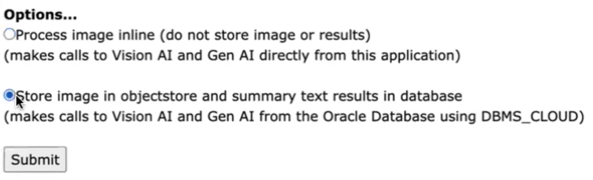

# Object Detection, Gen AI, And Sentiment Analysis For Situational Awareness And Creativity

## Introduction

This lab will show you how to use Oracle Database, OCI Vision Service and OCI Speech Service, and OpenAI conversation/chat
The use case involves detect objects in an image and write a sentence using those objects, including sentiment generation and analysis as an educational use case.

Estimated Time:  3 minutes

[Lab 6](videohub:1_14zkji84)

### Objectives

-   Use Oracle Database, OCI Vision Service and OCI Speech Service, and OpenAI conversation/chat

### Prerequisites

- Completion of Setup lab and "Run AI App" lab

## Task 1: Run the application

   1. Open http://localhost:8080 in a browser to access the application home page and click `Object Detection, Text Generation, and Sentiment Analysis`.
   
   2. Select an image file with objects in it such as the sample file provided.
   
   3. Select an option for the theme of the story that will be generated.
   
   4. Select the option to process the image inline (no storage) or store the image and AI results and click `Submit`.
   
   5. View the results which both the generated story and the sentiments found in the generated story.
   
   6. Notice the PL/SQL function code in the sql/aiuser-tables-indexes-functions.sql file that is called by this application and how it calls DBMS_CLOUD, parses the JSON, and stores the results, and also REST/ORDS enable the function.
   
      ``` <copy>
      CREATE OR REPLACE FUNCTION VISIONAI_OBJECTDETECTION (
          p_endpoint VARCHAR2,
          p_compartment_ocid VARCHAR2,
          p_namespaceName VARCHAR2,
          p_bucketName VARCHAR2,
          p_objectName VARCHAR2,
          p_featureType VARCHAR2,
          p_label VARCHAR2
      ) RETURN VARCHAR2 IS
          resp DBMS_CLOUD_TYPES.resp;
          json_response CLOB;
          v_textfromai VARCHAR2(32767);
      BEGIN
          resp := DBMS_CLOUD.send_request(
              credential_name => 'OCI_KEY_CRED',
              uri => p_endpoint || '/20220125/actions/analyzeImage',
              method => 'POST',
              body => UTL_RAW.cast_to_raw(
                  JSON_OBJECT(
                      'features' VALUE JSON_ARRAY(
                          JSON_OBJECT('featureType' VALUE p_featureType)
                      ),
                      'image' VALUE JSON_OBJECT(
                          'source' VALUE 'OBJECT_STORAGE',
                          'namespaceName' VALUE p_namespaceName,
                          'bucketName' VALUE p_bucketName,
                          'objectName' VALUE p_objectName
                      ),
                      'compartmentId' VALUE p_compartment_ocid
                  )
              )
          );
          json_response := DBMS_CLOUD.get_response_text(resp);
          SELECT LISTAGG(name, ', ') WITHIN GROUP (ORDER BY ROWNUM)
          INTO v_textfromai
          FROM JSON_TABLE(json_response, '$.imageObjects[*]'
              COLUMNS (
                  name VARCHAR2(100) PATH '$.name'
              )
          );
          INSERT INTO aivision_results (id, date_loaded, label, textfromai, jsondata)
          VALUES (SYS_GUID(), SYSTIMESTAMP, p_label, v_textfromai, json_response);
          RETURN v_textfromai;
      EXCEPTION
          WHEN OTHERS THEN
              RAISE;
      END VISIONAI_OBJECTDETECTION;
      /
   
      BEGIN
          ORDS.ENABLE_OBJECT(
              P_ENABLED      => TRUE,
              P_SCHEMA      => 'AIUSER',
              P_OBJECT      =>  'VISIONAI_OBJECTDETECTION',
              P_OBJECT_TYPE      => 'FUNCTION',
              P_OBJECT_ALIAS      => 'VISIONAI_OBJECTDETECTION',
              P_AUTO_REST_AUTH      => FALSE
          );
          COMMIT;
      END;
      /
      ```

You may now **proceed to the next lab.**..

## Acknowledgements

* **Author** - Paul Parkinson, Architect and Developer Advocate
* **Last Updated By/Date** - Paul Parkinson, 2024
