# Provisioning Autonomous Database (ADW, ATP and AJD)

## **Introduction**

This lab walks you through the steps to get started using the Oracle Autonomous Database (Autonomous Data Warehouse [ADW], Autonomous Transaction Processing [ATP] and Autonomous JSON Database [AJD]) on Oracle Cloud. Here, you will provision a new ATP instance and connect to the database using Oracle SQL Developer Web.

*Note: While this lab uses ATP, the steps are identical for creating and connecting to an ADW or AJD database.*

Estimated time: 5 minutes

### Objectives

- Learn how to provision a new Autonomous Database
- Learn how to connect to Autonomous Database with SQL Developer Web via the console

### Prerequisites
- This lab assumes you have completed the **Prerequisites** lab seen in the Contents menu on the right. The lab requires an [Oracle Cloud account](https://myservices.us.oraclecloud.com/mycloud/signup?language=en). You may use your own cloud account, a cloud account that you obtained through a trial, a Free Tier account, a LiveLabs account or a training account whose details were given to you by an Oracle instructor.

## Task 1: Choosing ADW or ATP from the Services Menu

1. Login to the Oracle Cloud, as shown in the previous lab.
2. Once you are logged in, you are taken to the cloud services dashboard where you can see all the services available to you. Click the navigation menu in the upper left to show top level navigation choices.

    __Note:__ You can also directly access your Autonomous Databases through the __Quick Actions__ section of the dashboard.

    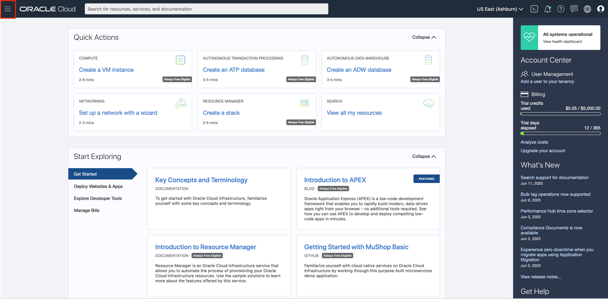

3. The following steps apply similarly to Autonomous Data Warehouse, Autonomous Transaction Processing or Autonomous JSON Database. This lab shows provisioning of an Autonomous Transaction Processing database, so click **Autonomous Transaction Processing**.

    

4. If you already have a list of databases, you can filter the list by the **State** of the databases (Available, Stopped, Terminated, and so on). You can also sort by __Workload Type__. Here, the __Transaction Processing__ workload type is selected.

    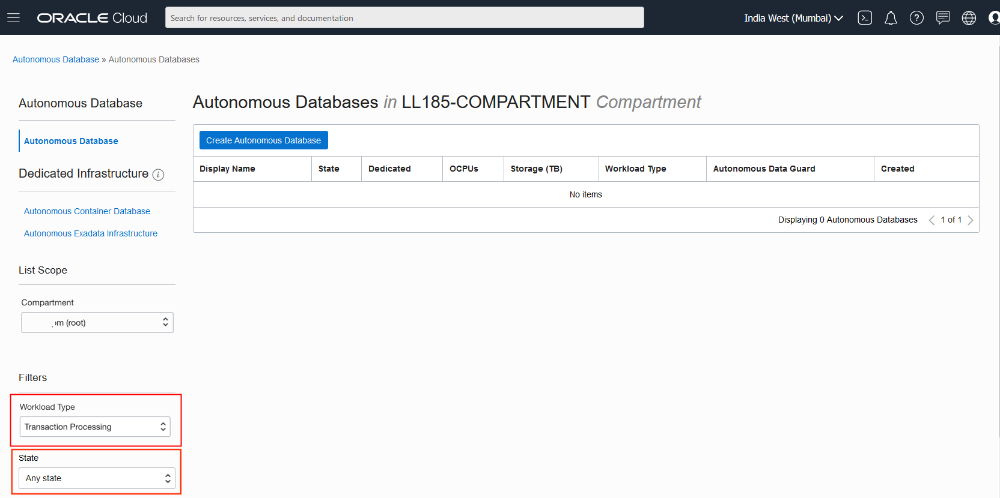

5. You can see your current default **region** in the top, right hand corner of the page. If you have been instructed to use a different region then the default one, please select it now.

    

## Task 2: Creating the ADB instance

1. Click **Create Autonomous Database** to start the instance creation process.

    

2. This brings up the __Create Autonomous Database__ screen where you will specify the configuration of the instance.
3. Provide basic information for the autonomous database:

    - __Choose a compartment__ - Select a compartment for the database from the drop-down list. For this lab, you may use your **root** compartment. Learn more about compartments [here](https://docs.cloud.oracle.com/en-us/iaas/Content/GSG/Tasks/choosingcompartments.htm)  

    *Note: Avoid the use of the ManagedCompartmentforPaaS compartment as this is an Oracle default used for Oracle Platform Services.*

    - __Display Name__ - Enter a memorable name for the database for display purposes. For this lab, use __JSONLab__.
    - __Database Name__ - Use letters and numbers only, starting with a letter. Maximum length is 14 characters. (Underscores not initially supported.) For this lab, use __JSONLab__.

    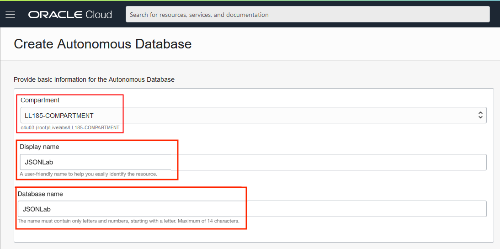

4. Choose a workload type. Select the workload type for your database from the choices:

    - __Transaction Processing__ - For this lab, choose __Transaction Processing__ as the workload type.
    - __Data Warehouse__ - Alternatively, you could have chosen Data Warehouse as the workload type.
    - __JSON__ - Alternatively, you could have chosen JSON as the workload type.

    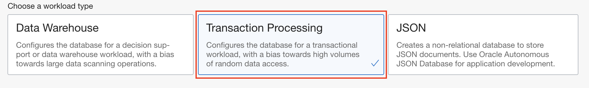

5. Choose a deployment type. Select the deployment type for your database from the choices:

    - __Shared Infrastructure__ - For this lab, choose __Shared Infrastructure__ as the deployment type.
    - __Dedicated Infrastructure__ - Alternatively, you could have chosen Dedicated Infrastructure as the deployment type.

    

6. Configure the database:

    - __Always Free__ - For this lab you may select this option to create an always free autonomous database. An always free database limits the options below and comes with 1 CPU and 20 GB of storage.
    - __Choose database version__ - Select a database version 19c from the available versions.
    - __OCPU count__ - Number of CPUs for your service. If you chose an Always Free database, it automatically comes with 1 CPU. If not, for this lab, specify __1 CPU__.
    - __Storage (TB)__ - Select your storage capacity in terabytes. For this lab, specify __1 TB__ of storage. If you choose an Always Free database, it comes with 20 GB of storage.
    - __Auto Scaling__ - You may keep auto scaling enabled, to allow the system to automatically use up to three times more CPU and IO resources to meet workload demand. This is not an option in an always free database.
    - __New Database Preview__ - If a checkbox is available to preview a new database version, do **not** select it.

    *Note:* You cannot scale up/down an Always Free autonomous database. You may only create one always free ATP and ADW database each, per tenancy

    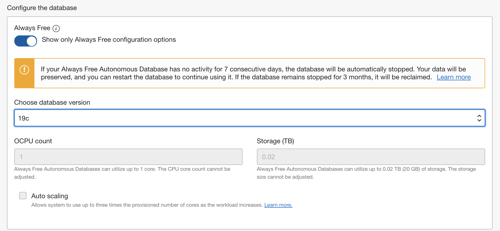

7. Create administrator credentials:

    - __Password and Confirm Password__ - Specify the password for ADMIN user of the service instance. The password must meet the following requirements:
    - The password must be between 12 and 30 characters long and must include at least one uppercase letter, one lowercase letter, and one numeric character.
    - The password cannot contain the username.
    - The password cannot contain the double quote (") character.
    - The password must be different from the last 4 passwords used.
    - The password must not be the same password that is set less than 24 hours ago.
    - Re-enter the password to confirm it. Make a note of this password.

    
8. Choose network access:
    - For this lab, accept the default, "Allow secure access from everywhere".
    - If you want a private endpoint, to allow traffic only from the VCN you specify - where access to the database from all public IPs or VCNs is blocked, then select "Virtual cloud network" in the Choose network access area.
    - You can control and restrict access to your Autonomous Database by setting network access control lists (ACLs). You can select from 4 IP notation types: IP Address, CIDR Block, Virtual Cloud Network, Virtual Cloud Network OCID).

    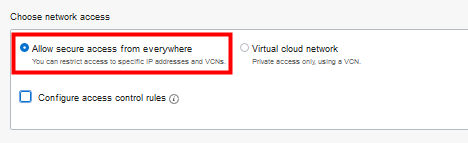

9. Choose a license type. For this lab, choose __License Included__. The two license types are:

    - __Bring Your Own License (BYOL)__ - Select this type when your organization has existing database licenses.
    - __License Included__ - Select this type when you want to subscribe to new database software licenses and the database cloud service.

10. Click __Create Autonomous Database__.

    

11.  You will be taken to your database OCI console and your instance will begin provisioning. In a few minutes, the state will turn from Provisioning to Available. At this point, your Autonomous Transaction Processing database is ready to use! Have a look at your instance's details here including its name, database version, OCPU count and storage size.

    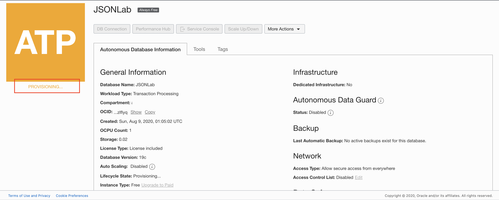

## Task 3: Connect to your ADB with SQL Developer Web

While you can also connect to your autonomous database using local PC desktop tools like Oracle SQL Developer (see this [ADB lab](https://oracle.github.io/learning-library/data-management-library/autonomous-database/shared/adb-advanced-workshop/freetier/?lab=lab-6-using-wallets-for-secure) for an example), you can now conveniently access the browser-based SQL Developer Web directly from your ADW or ATP console.

1.  While in your database **OCI console** from Step 2, click the **Tools** tab.

    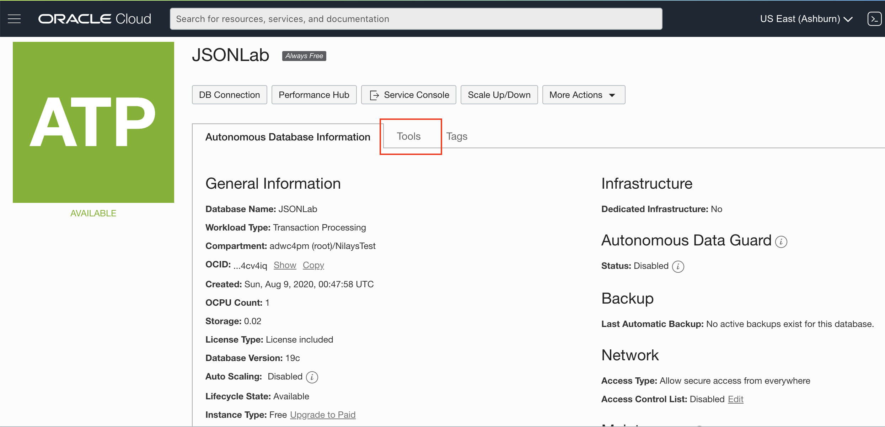

3.  The Tools page provides you access to SQL Developer Web, Oracle Application Express, Oracle ML User Administration, etc. In the SQL Developer Web box, click **Open SQL Developer Web**.

    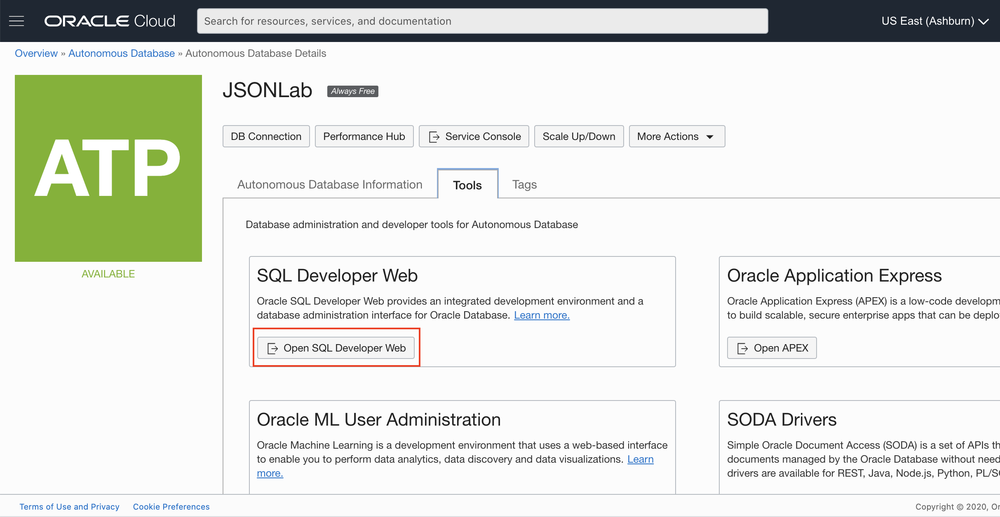

4.  A sign-in page opens for the SQL Developer Web. For this lab, simply use your database instance's default administrator account, **Username - ADMIN**, and with the admin **Password** you specified when creating the database. Click **Sign in**.

    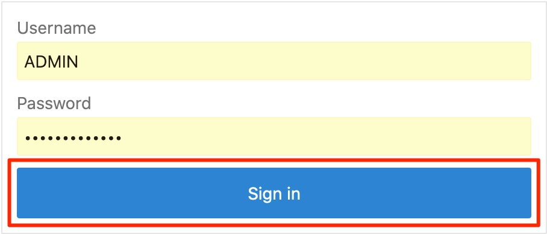

5.  SQL Developer Web opens on a worksheet tab. The first time you open the SQL Developer Web, a series of pop-up informational boxes introduce you to the main features. If you are familiar with the desktop version of SQL Developer, many of the same [shortcut keys](https://docs.oracle.com/en/database/oracle/sql-developer-web/19.2.1/sdweb/worksheet-page.html#GUID-3B651F54-DE41-42BD-B643-19741A25213A) can be used in this browser-based version too.

Copy and run this dummy query in your worksheet to see that you are now connected to your Autonomous Database!

    <copy>
    select * from dual;
    </copy>

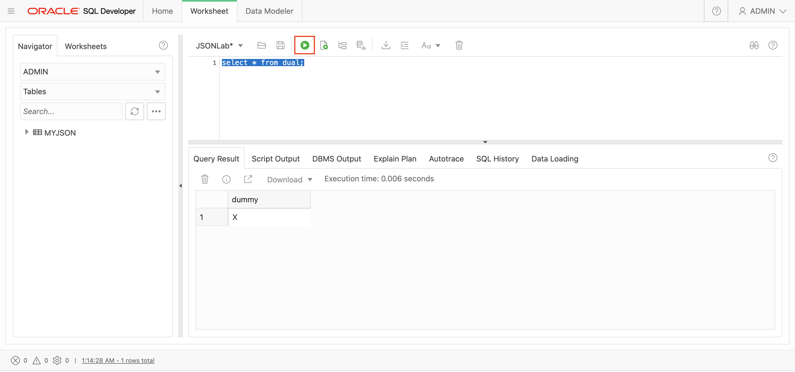

## Want to Learn More?

Click [here](https://docs.oracle.com/en/cloud/paas/atp-cloud/atpug/autonomous-workflow.html#GUID-5780368D-6D40-475C-8DEB-DBA14BA675C3) for documentation on the typical workflow for using Autonomous Database.

You can also watch this video demonstration to learn more about Autonomous Database.

*Note: Interfaces in this video may look different from the updated interfaces you may see.*

You may now proceed to the following lab.

## **Acknowledgements**

- **Author** - Nilay Panchal, ADB Product Management
- **Adapted for Cloud by** - Richard Green, Principal Developer, Database User Assistance
- **Contributors** - Oracle LiveLabs QA Team (Jeffrey Malcolm Jr, Intern | Arabella Yao, Product Manager Intern)
- **Last Updated By/Date** - Nilay Panchal, August 2020

