# Advanced JSON in Autonomous Database

## **Introduction**

This workshop aims to help you understanding JSON data and how you can use SQL and PL/SQL with JSON data stored in Oracle Database.  

Estimated time: This lab takes approximately 30 minutes.

### About JSON in the Oracle Database

**JavaScript Object Notation (JSON)** is defined in standards ECMA-404 (JSON Data Interchange Format) and ECMA-262 (ECMAScript Language Specification, third edition). The JavaScript dialect of ECMAScript is a general programming language used widely in web browsers and web servers.  **Oracle Database** supports **JavaScript Object Notation (JSON)** data natively with relational database features, including transactions, indexing, declarative querying, and views.

### Prerequisites

This lab assumes you have completed the following labs:
* Prerequisites
* Lab: Provision and connect to Autonomous Database
* Lab: JSON in the Oracle DB

### Lab User Schema

For this lab we will use the *Sales Histroy (SH)* sample schema that is provided by default with an Autonomous Database.

## Task 1: Connect to ADB with SQL Developer Web

1.  Open up your SQL Developer Web worksheet, which is connected to your Autonomous Database, from your database OCI Console as you did in [Lab 1](?lab=lab-1-provision-connect-autonomous#STEP3:ConnecttoyourADBwithSQLDeveloperWeb). Sign in, if necessary; here, we are using the **ADMIN** user.

    

## Task 2: Retrieve Sub-Regions Information In JSON Format

1.  Using a cursor, and the query you like most, we can run a loop, to retrieve the sub-regions for every region in Spain. This procedure will store a JSON document in our table, with the sub-regions, for each region (19 documents).

    ````
    <copy>
    declare
      cursor c1 is
      WITH ids ( GEONAMES, start_pos, end_pos ) AS
        ( SELECT GEONAMES, 1, INSTR( GEONAMES, ',' ) FROM
      (SELECT substr(j.doc.geonames.geonameId, 2, length(j.doc.geonames.geonameId)-2) as GEONAMES
      FROM MYJSON j WHERE j.doc.geonames.fcode like '%ADM1%')
        UNION ALL
        SELECT GEONAMES,
          end_pos + 1,
          INSTR( GEONAMES, ',', end_pos + 1 )
        FROM ids
        WHERE end_pos > 0
        )
      SELECT SUBSTR(GEONAMES, start_pos, DECODE(end_pos, 0, LENGTH( GEONAMES ) + 1, end_pos) - start_pos) AS geonameId
      FROM ids;
    begin
      FOR subregionID in c1
      LOOP
          insert into MYJSON (doc) values (get_subdivision(subregionID.geonameId, 'full'));
      END LOOP;
    commit;
    end;
    /
    </copy>
    ````

    

2.  Query the regions and sub-regions stored in these 19 documents, retrieving them as relational data.

  The **JSON\_TABLE** function, introduced with Oracle Database Release 12.1, enables the creation of an inline relational view of JSON content. The JSON_TABLE operator uses a set of JSON path expressions to map content from a JSON document into columns in the view. Once the contents of the JSON document have been exposed as columns, all of the power of SQL can be brought to bear on the content of the JSON document. The **NESTED** clause allows you to flatten JSON values in a nested JSON object or JSON array into individual columns in a single row along with JSON values from the parent object or array. You can use this clause recursively to project data from multiple layers of nested objects or arrays into a single row. This path expression is relative to the SQL/JSON row path expression specified in the *JSON\_TABLE* function.

    ````
    <copy>
    SELECT jt.countryName Country,
          convert(jt.adminName1,'WE8ISO8859P1','AL32UTF8') Region,
          convert(jt.toponymName,'WE8ISO8859P1','AL32UTF8') Title,
          convert(jt.name,'WE8ISO8859P1','AL32UTF8') Name, jt.adminCode1, jt.adminCode2 FROM MYJSON,
    JSON_TABLE(DOC, '$' COLUMNS
      (NESTED PATH '$.geonames[*]'
        COLUMNS (countryName VARCHAR2(80) PATH '$.countryName',
                  adminName1 VARCHAR2(80) PATH '$.adminName1',
                  toponymName VARCHAR2(120) PATH '$.toponymName',
                  name VARCHAR2(80) PATH '$.name',
                  adminCode1 VARCHAR(8) PATH '$.adminCode1',
                  adminCode2 VARCHAR(8) PATH '$.adminCode2',
                  fcode VARCHAR2(6) PATH '$.fcode')))
    AS jt  WHERE (fcode = 'ADM2');
    </copy>
    ````

    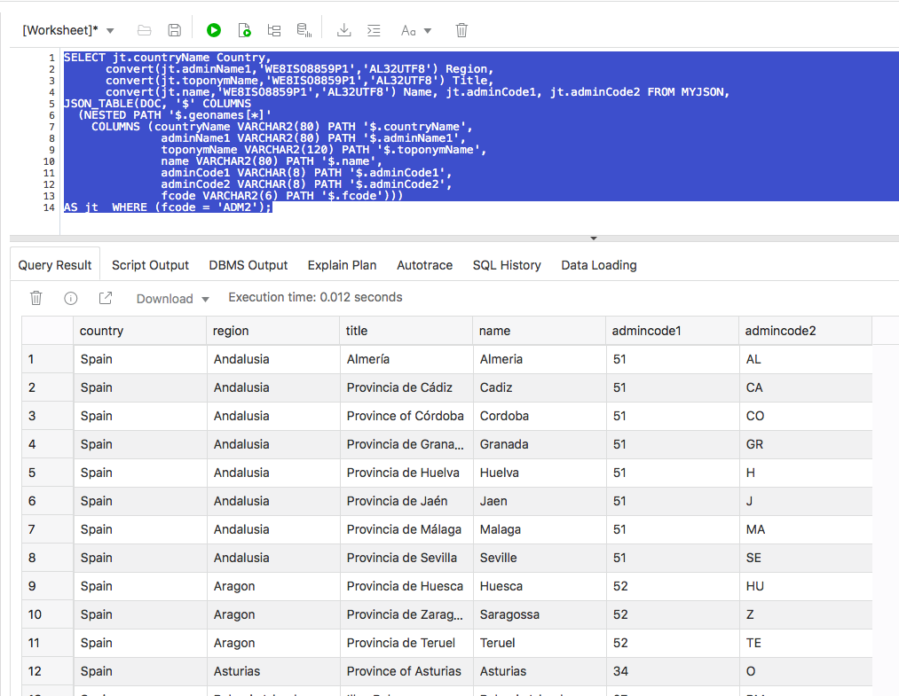

    Now we have the entire geographic division.


## Task 3: Indexing

1. Above, in Step 2, the *JSON\_TABLE* function unnests the JSON structure into rows with scalar column values. You can also use JSON\_TABLE to extract embedded JSON data from an array. The following JSON_TABLE example extracts every JSON object inside the 'geonames' array. Note the 'FORMAT JSON' expression for the 'geo' column. The expression '$.geonames[\*]' (known as a path expression) iterates over every item (\*) in the 'geonames' array. The column path expression '$' selects the entire item without further navigation. Run the following query which shows this behaviour.


      ````
      <copy>
      SELECT jt.geo
      FROM MYJSON,
      JSON_TABLE(DOC, '$.geonames[*]' COLUMNS
        (geo VARCHAR2(4000) FORMAT JSON PATH '$' ))
      AS jt;
      </copy>
      ````


      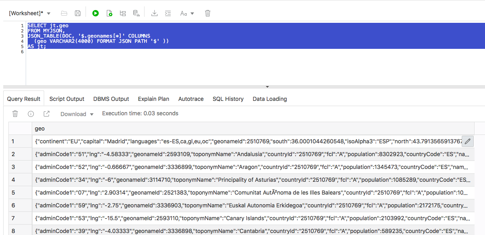

2. Let us use the above query to create a new table *allGeos*

      ````
      <copy>
      create table allGeos as
      select jt.geo
      from MYJSON,
      JSON_TABLE(DOC, '$.geonames[*]' COLUMNS
        (geo VARCHAR2(4000) FORMAT JSON PATH '$' )) AS jt;
      </copy>
      ````

      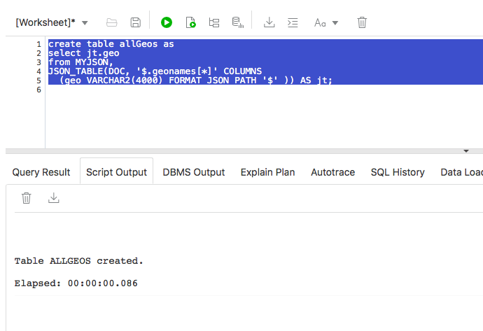


3. Let us alter our *allGeos* table to add an **IS JSON** check constraint; this enables the [simplified dot-notation syntax](https://docs.oracle.com/en/database/oracle/oracle-database/12.2/adjsn/simple-dot-notation-access-to-json-data.html#GUID-7249417B-A337-4854-8040-192D5CEFD576) we learned about in the previous lab.

      ````
      <copy>
      alter table allGeos add constraint ensureJSON check (geo IS JSON);
      </copy>
      ````

      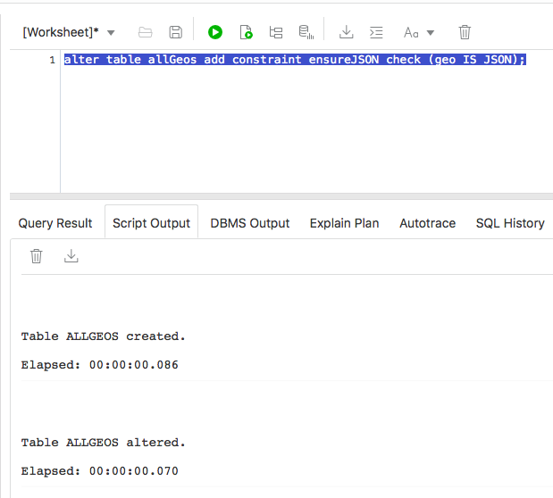

4. We can now query this data with either the simple dot notation or the SQL/JSON operator JSON_VALUE. In addition to executing these queries, take a look at the execution plan as shown below.

      ````
      <copy>
      select a.geo.name from allGeos a where a.geo.name = 'Cadiz';

      select geo from allGeos where JSON_VALUE(geo, '$.name') = 'Cadiz';
      </copy>
      ````

      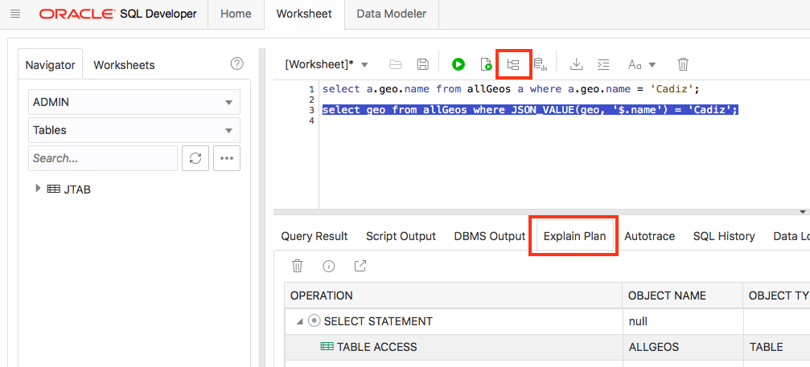

5. If you are going to frequently filter JSON documents, you may want to consider an index. Let's start with a *function based index*. We use **JSON_VALUE** to extract a path-specific value to populate an index. In this example, we are indexing the 'name' field.

      ````
      <copy>
       create index name_ix on allGeos (JSON_VALUE(geo, '$.name' ERROR ON ERROR   NULL ON EMPTY));
      </copy>
      ````

      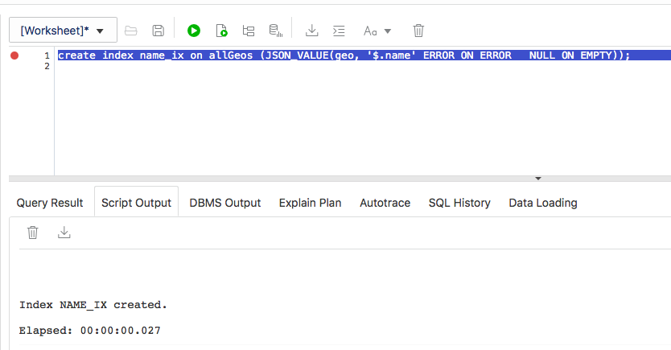

6. The optional keywords 'ERROR ON ERROR' and 'NULL ON EMPTY' define what to do if a value is missing (e.g. If a geo object has no name). Instead of raising an error, we want to index a NULL value, in this case, to allow for a missing name field.

  If we now execute the same query, with a filter on the name field, we see the index being used.

        <copy>
        select geo from allGeos where JSON_VALUE(geo, '$.name') = 'Cadiz';
        </copy>


  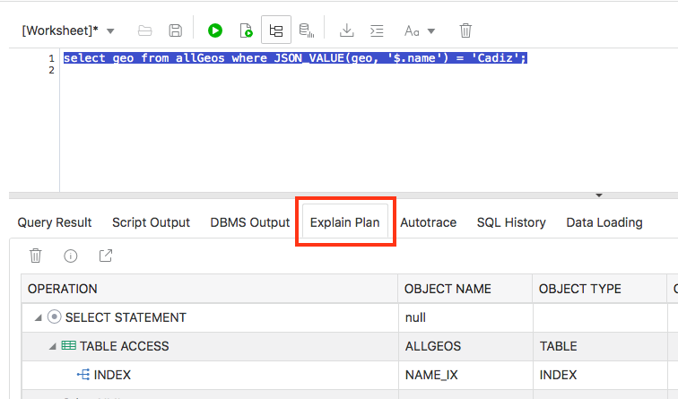

7. By default, JSON\_Value returns a text value of type **(VARCHAR2(4000))**. For numeric JSON values, we want the index to be created with number values too so that range queries use numeric ordering (instead of alphanumeric ordering). For this, we override the default of JSON_VALUE.

      ````
      <copy>
      create index pop_ix on allGeos (JSON_VALUE(geo, '$.population' RETURNING NUMBER ERROR ON ERROR   
      NULL ON EMPTY));
      </copy>
      ````
      ````
      <copy>
      select a.geo from allGeos a where JSON_VALUE(geo, '$.population' RETURNING NUMBER) > 7000000;
      </copy>
      ````

      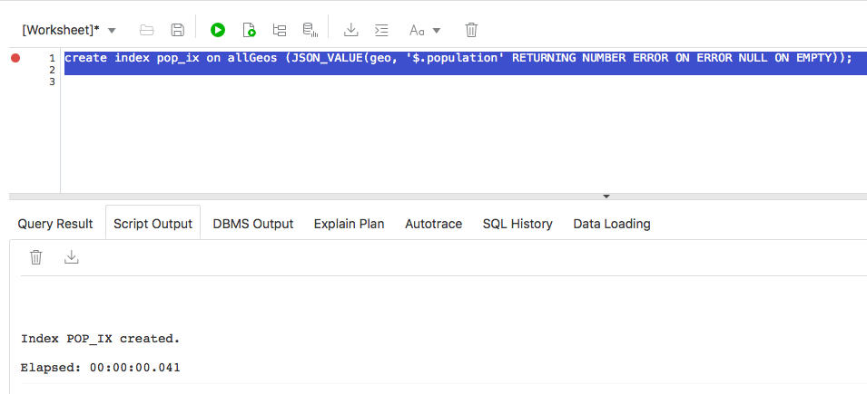
      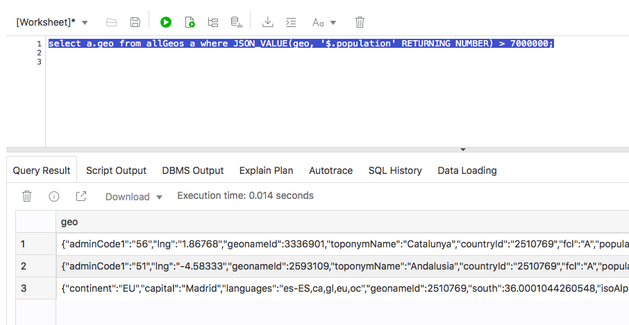

      The **execution plan** of this query shows that the index is used for this range query.


      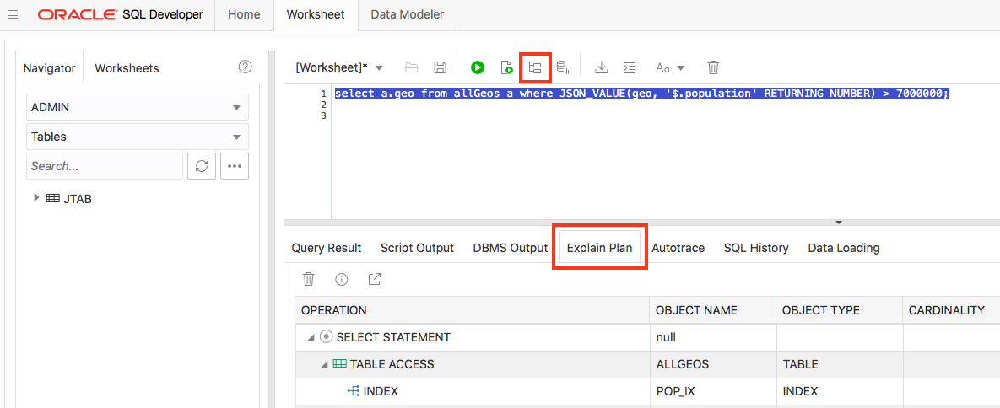


8. A function-based index is indexing the result of one function – a JSON_Value function with one specific path expression in this case. A function-based index is not suitable for random, ad-hoc queries containing arbitrary fields. It is also not suitable to index multiple values inside an array. For these, we use a [JSON Search Index](https://docs.oracle.com/en/database/oracle/oracle-database/12.2/adjsn/indexes-for-json-data.html#GUID-8A1B098E-D4FE-436E-A715-D8B465655C0D). This is an index that captures the entire JSON document.

      ````
      <copy>
      create SEARCH index geo_search_idx ON allGeos (geo) FOR JSON;
      </copy>
      ````


      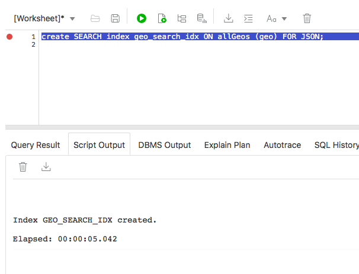


    9. The **explain plan** shows the [DOMAIN INDEX](https://docs.oracle.com/cd/B28359_01/appdev.111/b28425/dom_idx.htm) 'geo\_search\_idx' being used for queries without a function-based index. If present, a function-based index will be preferred.

    *Note:* To see the query plan, use the **Explain Plan** button as highlighted in the screenshots

      ````
      <copy>
      select geo from allGeos where JSON_VALUE(geo, '$.toponymName') = 'Catalunya';
      </copy>
      ````

      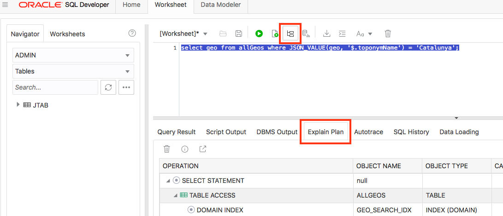


## Task 4: JSON_DATAGUIDE - Discover information about the structure and content of JSON documents

The following shows the **JSON_DATAGUIDE**, a function that analyzes one or more JSON values and provides a schema - a structural summary of the data, the field names, how they are nested and their data type.

JSON data-guide information can be saved persistently as part of the JSON search index infrastructure, and this information is updated automatically as new JSON content is added. This is the case by default, when you create a JSON search index: data-guide information is part of the index infrastructure.

You can use a data guide:

 * As a basis for developing applications that involve data mining, business intelligence, or other analysis of JSON documents.
 * As a basis for providing user assistance about requested JSON information, including search.
 * To check or manipulate new JSON documents before adding them to a document set (for example: validate, type-check, or exclude certain fields).

1. So far, we have worked with the JSON data without having a full understanding of all it's field names, data type and hierarchy. This is common when you work with JSON, as JSON generally has no schema defining it (unlike XML). To get some understanding of the data, lets run the JSON_Dataguide. This function scans the entire data and returns a summary consisting of the field names, data type and structure (object or array) – a JSON Schema.

    ````
    <copy>
    select JSON_DATAGUIDE(geo, dbms_json.FORMAT_HIERARCHICAL) from allGeos;
    </copy>
    ````

    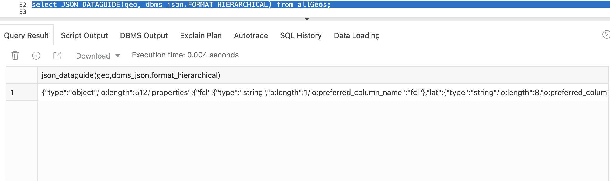


2. As the returned value is not printed in a user legible, manner let's use JSON_Serialize to pretty print it

   ````
   <copy>
   select JSON_Serialize(JSON_DATAGUIDE(geo, dbms_json.FORMAT_HIERARCHICAL) pretty)
    from allGeos;
   </copy>
   ````


   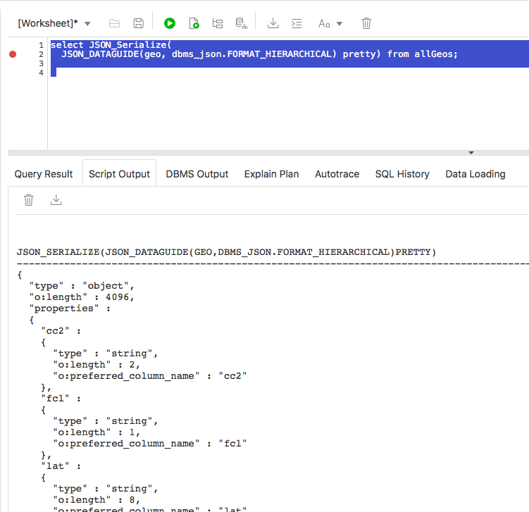

3. Given this JSON schema information we can automatically create a view using the dbms_json.create_view function:

    ````
    <copy>
    declare
        dg clob;
      begin
        select JSON_DATAGUIDE(geo, dbms_json.FORMAT_HIERARCHICAL) into dg from allGeos;
        dbms_json.create_view('geoview', 'allgeos', 'geo', dg, resolveNameConflicts => TRUE);
      end;
    /
    </copy>
    ````

    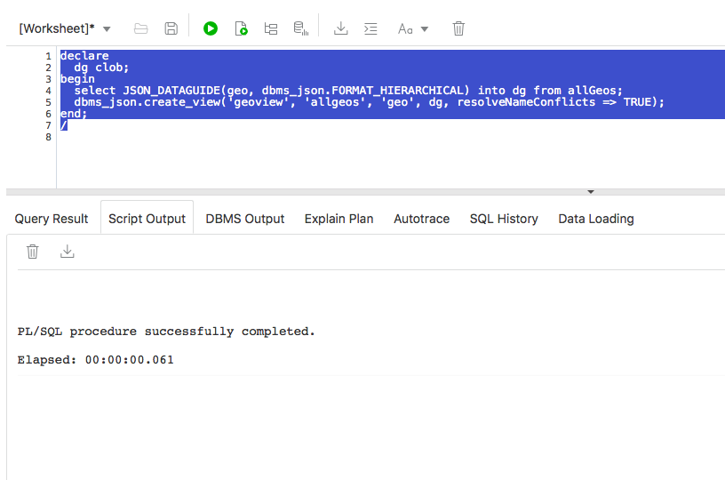


4. We can now describe the view and query it like a regular relational table.


    ````
    <copy>
      desc geoview;
    </copy>
    ````
    ````
    <copy>
      select DISTINCT "name", "population" from geoview order by "population";
    </copy>
    ````


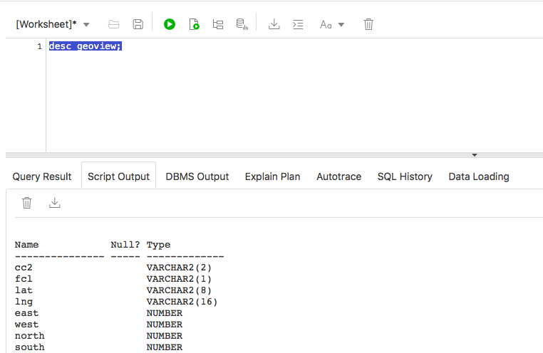

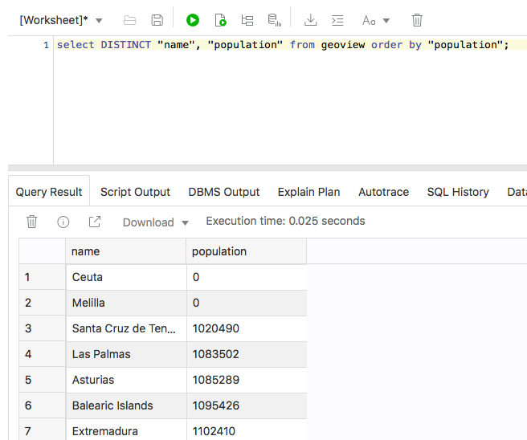


## Task 5: Retrieve Castles Information In JSON Format

  1. In order to retrieve information about castles from GeoNames web service, we have to create a new function. The input for this function is the ISO country code, the code of the region, and the code of the sub-region. The output is a JSON document with all castles in that sub-region.

    *Note*: Remember to replace ***&YourGeoNameUsername*** with the username of your account on GeoNames, or fill in your username in the popup dialog. The URL_HTTP package in Autonomous Database supports only HTTPS requests with an SSL wallet for added security.


        <copy>
        create or replace function get_castles (country in VARCHAR2, adminCode1 in VARCHAR2, adminCode2 in VARCHAR2) return clob   
          is
            t_http_req  utl_http.req;
            t_http_resp  utl_http.resp;
            t_response_text clob;
          begin
            UTL_HTTP.SET_WALLET('');
          	t_http_req:= utl_http.begin_request('https://secure.geonames.org/searchJSON?formatted=true&' || 'lang=en&' || 'featureCode=CSTL' || '&' || 'country=' || country || '&' || 'adminCode1=' || adminCode1 ||  '&' || 'adminCode2=' || adminCode2 || '&' || 'style=full&' || 'username=&YourGeoUsername','GET','HTTP/1.1');
     		    UTL_HTTP.SET_HEADER(t_http_req, 'User-Agent', 'Mozilla/4.0');
            t_http_resp:= utl_http.get_response(t_http_req);
            UTL_HTTP.read_text(t_http_resp, t_response_text);
            UTL_HTTP.end_response(t_http_resp);
            return t_response_text;
          end;
        /
        </copy>


      

  2.  Test get_castles function, using as input *Valencia* region (adminCode1 : 60), and *Provincia de Alicante* sub-region (adminCode2: A).

      ````
      <copy>
      select get_castles('ES', 60, 'A') castles_document from dual;
      </copy>
      ````

      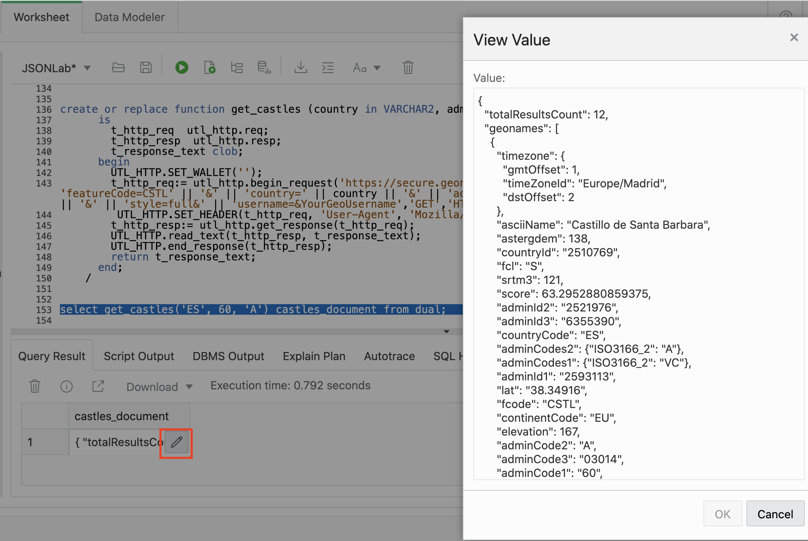

  3.  Use this function in a loop to retrieve castles from all sub-regions, as shown in the following example, storing the JSON documents inside the same table.

      ````
      <copy>
      declare
        cursor c1 is
          SELECT jt.adminCode1, jt.adminCode2 FROM MYJSON,
          JSON_TABLE(DOC, '$' COLUMNS
            (NESTED PATH '$.geonames[*]'
                COLUMNS (adminCode1 VARCHAR(8) PATH '$.adminCode1',
                        adminCode2 VARCHAR(8) PATH '$.adminCode2',
                        fcode VARCHAR2(6) PATH '$.fcode')))
            AS jt  WHERE (fcode = 'ADM2');
      begin
        FOR SubRegion in c1
        LOOP
            insert into MYJSON (doc) values (get_castles('ES', SubRegion.adminCode1, SubRegion.adminCode2));
        END LOOP;
      commit;
      end;
      /
      </copy>
      ````

      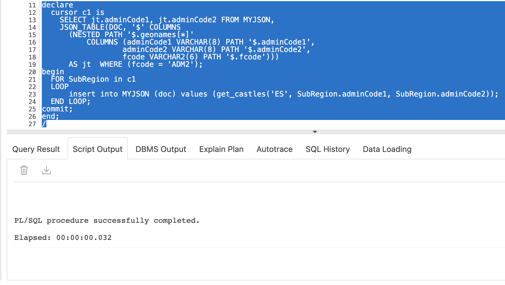

  4.  At this point we have enough JSON documents inside the database, and all the information to develop our application that provides information about medieval castles in Spain.

      ````
      <copy>
      SELECT jt.countryName Country,
            convert(jt.adminName1,'WE8ISO8859P1','AL32UTF8') Region,
            convert(jt.adminName2,'WE8ISO8859P1','AL32UTF8') Sub_Region,
            jt.fcode, convert(jt.toponymName,'WE8ISO8859P1','AL32UTF8') Title,
            convert(jt.name,'WE8ISO8859P1','AL32UTF8') Name FROM MYJSON,
      JSON_TABLE(DOC, '$' COLUMNS
        (NESTED PATH '$.geonames[*]'
          COLUMNS (countryName VARCHAR2(80) PATH '$.countryName',
                    adminName1 VARCHAR2(80) PATH '$.adminName1',
                    adminName2 VARCHAR2(80) PATH '$.adminName2',
                    toponymName VARCHAR2(120) PATH '$.toponymName',
                    name VARCHAR2(80) PATH '$.name',
                    adminCode1 VARCHAR(8) PATH '$.adminCode1',
                    fcode VARCHAR2(6) PATH '$.fcode')))
      AS jt  WHERE (fcode = 'CSTL');
      </copy>
      ````

      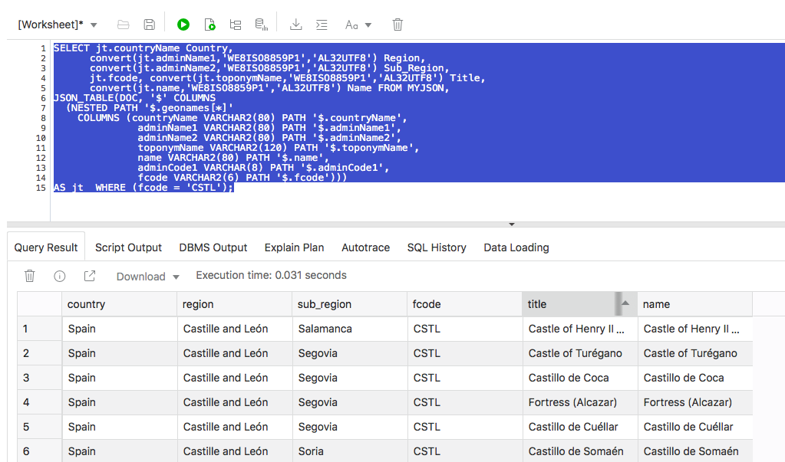

      This query should return 269 rows.


## Task 6: Syntax simplifications querying JSON Data

In Oracle Database 19c, there were some improvements in the simplicity of querying JSON documents using SQL. Other improvements were made as well in generating JSON documents on the fly from relational data.

1.  This is a basic example of generating JSON documents from a relational table, to be used in a web service. Through these web services, you can integrate heterogeneous applications within the enterprise, or expose business functions to third parties over the internet. All this can be done directly from the database, without any other components installed and configured.  Let’s consider **ORDERS** table from OE schema.

    ````
    <copy>
      desc sh.products;
    </copy>
    ````

    ````
    <copy>
      select * from sh.products;
    </copy>
    ````

    

    


2.  SQL/JSON function *JSON\_OBJECT* constructs JSON objects from relational (SQL) data. Using this function on a relational table to generate JSON, prior to 19c, it was necessary to specify for each column an explicit field name–value pair.

    ````
    <copy>
      select JSON_OBJECT (
        key 'id'    value PROD_ID,
        key 'name'  value PROD_NAME,
        key 'price' value PROD_LIST_PRICE ) "Orders"
      from sh.products;
    </copy>
    ````

    


    ````
    <copy>
      select JSON_OBJECT (prod_id, prod_name, prod_list_price)
        from sh.products;
    </copy>
    ````

    

 3. It is also possible to use the wildcard to select all columns.

     ````
     <copy>
      select JSON_OBJECT (*) from sh.products;
     </copy>
     ````

    

  4. It is very easy to use the JSON generation functions in a SQL expression with joins. The following example joins the product and sales tables and returns the number of sold items for every product as a separate JSON object.

    ````
    <copy>
      select JSON_Object('name' : p.prod_name, 'sold' : (
      select sum(quantity_sold)
      from sh.sales s
      where s.prod_id = p.prod_id
        ))
        from sh.products p;
    </copy>
    ````

    

  5. The previous query still returns a separate row/object for each product. It is also possible to return the same data in one JSON array.

    ````
    <copy>
    select JSON_ARRAYAGG(JSON_Object('name' : p.prod_name, 'sold' : (
      select sum(quantity_sold)
      from sh.sales s
      where s.prod_id = p.prod_id
    )) returning CLOB)
    from sh.products p;
    </copy>
    ````

    


## Task 7: Updating a JSON Document

You can now update a JSON document declaratively using the new SQL function **JSON_MERGEPATCH**. You can apply one or more changes to multiple documents by using a single statement. This feature improves the flexibility of JSON update operations.

### Updating Selected JSON Documents On The Fly

You can use *JSON_MERGEPATCH* in a SELECT list to modify the selected documents. The modified documents can be returned or processed further.

### Retrieve A Specific Value From JSON Document

1.  For example we can retrieve the entire JSON document containing the country description for Spain.

    ````
    <copy>
    select DOC from MYJSON j where j.doc.geonames.geonameId = '2510769';
    </copy>
    ````

    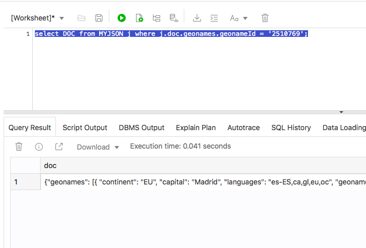

2.  JSON Merge Patch acts a bit like a UNIX patch utility — you give it:
    * a source document to patch and
    * a patch document that specifies the changes to make, and it returns a copy of the source document updated (patched).

    Here is a very simple example, changing one attribute in a two attributes JSON document.

    ````
    <copy>
    SELECT json_mergepatch('{"CountryName":"Spain", "Capital":"Madrid"}', '{"Capital":"Toledo"}' RETURNING CLOB PRETTY) Medieval FROM dual;
    </copy>
    ````

    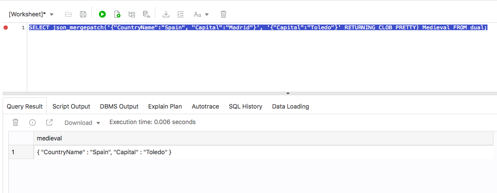

3.  However, you cannot use it to add, remove, or change array elements (except by explicitly replacing the whole array). For example, our documents received from GeoNames are all arrays.

    The Country description for Spain has one field geonames that has an array value. This array has one element (geonames[0]), which is an object with 17 fields
    - continent
    - capital
    - languages
    - geonameId
    - south
    - isoAlpha3
    - north
    - fipsCode
    - population
    - east
    - isoNumeric
    - areaInSqKm
    - countryCode
    - west
    - countryName
    - continentName
    - currencyCode

    ````
    <copy>
    SELECT j.doc.geonames[0] FROM MYJSON j where j.doc.geonames.geonameId = '2510769';
    </copy>
    ````

    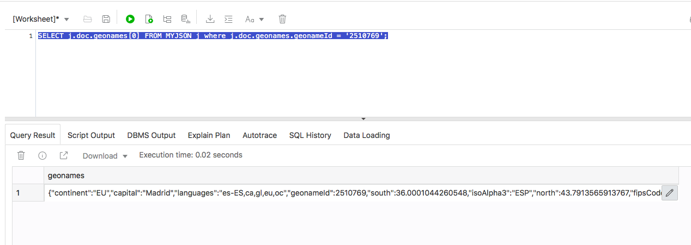

    Take a note of the capital attribute in that document — *"capital":"Madrid"*. There is always a solution.

### Update A Specific Value From JSON Document

4.  Change that attribute on the fly — *"capital":"Toledo"*. We can print the same result in a pretty format, just to highlight it more.

    ````
    <copy>
    SELECT json_mergepatch(j.doc.geonames[0], '{"capital":"Toledo"}' RETURNING CLOB PRETTY) Medieval
      FROM myjson j where j.doc.geonames.geonameId = '2510769';
    </copy>
    ````

    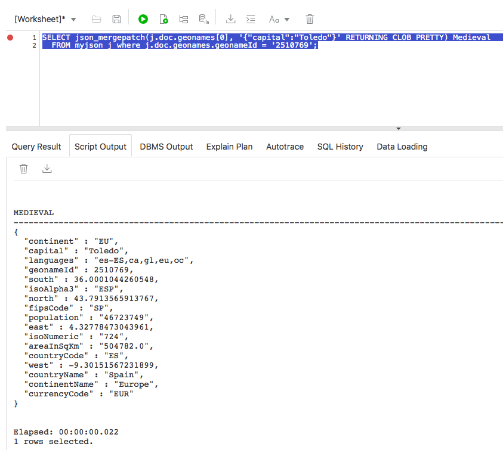

### Updating a specific element in a JSON Column using JSON Merge Patch

5. We will use the very first JSON document in our table, the one about the Oracle Workshop. This is a simple JSON document, with three fields. The third field is also a collection with three fields.


    ````
    <copy>
    select DOC from MYJSON where ID = 1;
    </copy>
    ````

    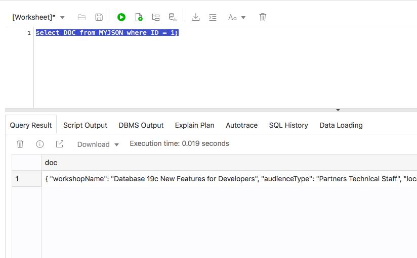


6.  We can update the JSON document's second field, using the plain UPDATE statement and *JSON_MERGEPATCH* function.

    Remember to commit changes if you want to keep them in the database.

    ````
    <copy>
    update MYJSON set DOC = json_mergepatch(DOC, '{"audienceType": "Developers and DBAs"}') where ID = 1;
    commit;
    </copy>
    ````

    

    Updating JSON documents inside the Oracle Database is that simple!

7. When running the same SELECT statement, we notice that the document is not pretty-printed any more.

    ````
    <copy>
    select DOC from MYJSON where ID = 1;
    </copy>
    ````

    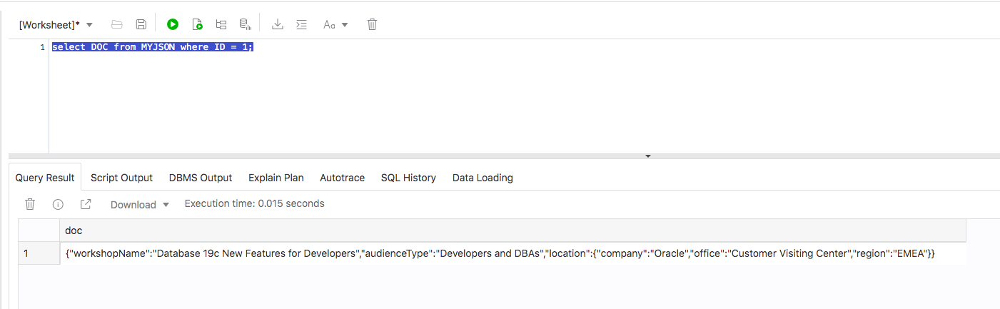

8. You can use JSON_SERIALIZE to **pretty** print the JSON data, this makes it easier to read. You may also store the JSON in pretty printed format but this will take up more space.

    This one is much more legible.

    ````
    <copy>
    select JSON_Serialize(DOC pretty) from MYJSON where ID = 1;
    </copy>
    ````

    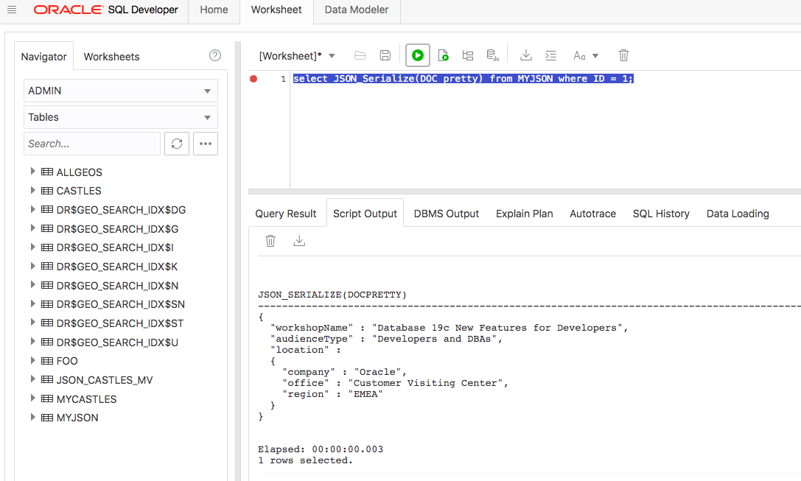


## Task 8: JSON Materialized View Support

Materialized views query rewriting has been enhanced so that queries with *JSON\_EXISTS*, *JSON\_VALUE* and other functions can utilize a materialized view created over a query that contains a *JSON\_TABLE* function.

This feature is particularly useful when the JSON documents in a table contain arrays. This type of materialized view provides fast performance for accessing data within those JSON arrays.

### Materialized View With Fast Refresh For Query Rewrite

As a performance enhancement in Oracle 19c, if you create a refresh-on-statement materialized view over json_table  and some other conditions apply then a query that matches the query defining the view can be rewritten to a materialized-view table access. You can use this feature instead of creating multiple functional indexes.

### Create A Materialized View

1.  Create a materialized view that will help us retrieve information about the medieval castles, using the *ON STATEMENT* clause. The *ENABLE QUERY REWRITE* clause is not mandatory, the performance enhancements apply even if it’s not specified. Notice the error and null handling is specified explicitly for each column.

    ````
    <copy>
    CREATE MATERIALIZED VIEW json_castles_mv
    REFRESH FAST ON STATEMENT
    ENABLE QUERY REWRITE
    AS
    SELECT j.id jsonID, jt.geonameId ID, jt.countryName Country,
          convert(jt.adminName1,'WE8ISO8859P1','AL32UTF8') Region,
          convert(jt.adminName2,'WE8ISO8859P1','AL32UTF8') Sub_Region,
          jt.fcode, convert(jt.toponymName,'WE8ISO8859P1','AL32UTF8') Title,
          convert(jt.name,'WE8ISO8859P1','AL32UTF8') Name FROM MYJSON j,
    JSON_TABLE(DOC, '$' COLUMNS
    (NESTED PATH '$.geonames[*]'
      COLUMNS (countryName VARCHAR2(80) PATH '$.countryName' ERROR ON ERROR NULL ON EMPTY,
              adminName1 VARCHAR2(80) PATH '$.adminName1' ERROR ON ERROR NULL ON EMPTY,
              adminName2 VARCHAR2(80) PATH '$.adminName2' ERROR ON ERROR NULL ON EMPTY,
              toponymName VARCHAR2(120) PATH '$.toponymName' ERROR ON ERROR NULL ON EMPTY,
              name VARCHAR2(80) PATH '$.name' ERROR ON ERROR NULL ON EMPTY,
              adminCode1 VARCHAR(8) PATH '$.adminCode1' ERROR ON ERROR NULL ON EMPTY,
              fcode VARCHAR2(6) PATH '$.fcode' ERROR ON ERROR NULL ON EMPTY,
              geonameId VARCHAR2(10) PATH '$.geonameId' ERROR ON ERROR NULL ON EMPTY)))
    AS jt;
    </copy>
    ````

    

2.  Test the materialized view with the following query. Optionally, use set timing on when running this query, and the query we used to retrieve information about castles after we retrieved all required JSON documents from the GeoNames web service, and compare the results. The difference may look insignificant, because there are only 269 castles, but imagine that we could have millions of rows in one application, and thousands of concurrent users.

    ````
    <copy>
    SELECT Country, Region, Sub_Region, Title, Name FROM json_castles_mv WHERE fcode = 'CSTL';
    </copy>
    ````

    

    In the following Step we will get into more details about performance.

### Performance Boost

Significant performance gains can often be achieved using query rewrite and materialized views, and in this exercise we will examine how these performance gains can be achieved without the need to change the application.

### Check Query Rewrite Mechanism

3.  We will use the following SELECT statement as an example. Run this query on the database. It returns the first castle in every sub-region, so it should list 45 castles.

    ````
    <copy>
    SELECT JSON_VALUE(doc, '$.geonames[0].fcode') Code,
          JSON_VALUE(doc, '$.geonames[0].countryName') Country,
          JSON_VALUE(doc, '$.geonames[0].adminName1') Region,
          JSON_VALUE(doc, '$.geonames[0].adminName2') Sub_Region,
          JSON_VALUE(doc, '$.geonames[0].toponymName') Title,
          JSON_VALUE(doc, '$.geonames[0].name') Name
    from MYJSON
      where JSON_VALUE(doc, '$.geonames[0].fcode') = 'CSTL'
      order by Region, Sub_Region;
    </copy>
    ````

    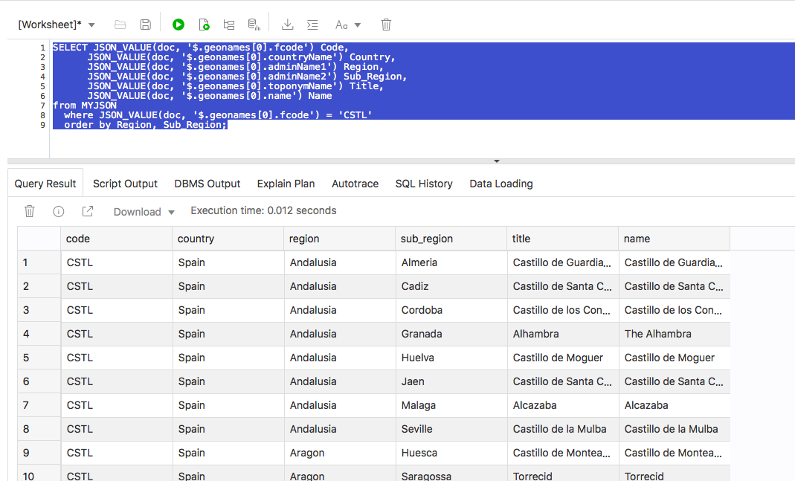

4.  View the plan for this query under the **Explain Plan** tab of the output. We can see the dot notation calls get rewritten as a *JSON\_TABLE* call, because we can see the *JSONTABLE EVALUATION* step in the plan (6), and we can see the data has been returned from the *JSON\_CASTLES\_MV* materialized view (4).

    *Note:* To see the query plan, use the **Explain Plan** button as highlighted in the screenshots

    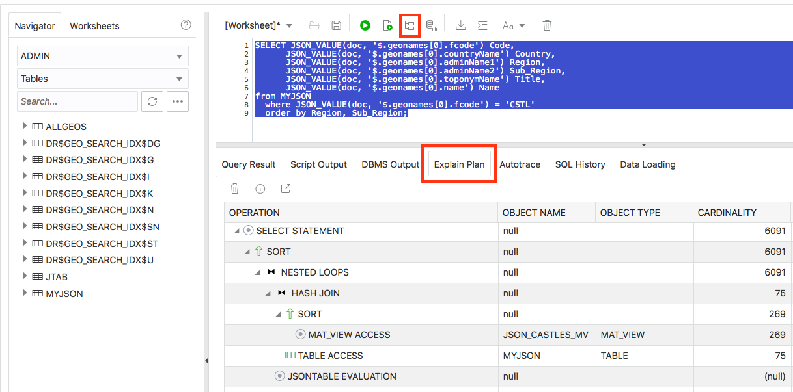

    If the query is too simple, there may not be a query rewrite, in this case it will not be eligible to be rewritten to use the materialized view.


This workshop is now complete.

## **Acknowledgements**

- **Author** - Valentin Leonard Tabacaru, Product Management
- **Contributors** - Beda Hammerschmidt (Architect), Nilay Panchal, Anoosha Pilli & Troy Anthony (Product Management), Dylan McLeod (LiveLabs QA Intern)
- **Last Updated By/Date** - Nilay Panchal, DB Product Management, August 2020
