# JSON in Autonomous Database

## **Introduction**

In this lab you will explore JSON data and the Orace Database.  You will execute SQL and PL/SQL against JSON data stored in Oracle Database.  

Estimated Lab Time: 20 minutes

### About JSON in the Oracle Database

*JavaScript Object Notation (JSON)* is defined in standards ECMA-404 (JSON Data Interchange Format) and ECMA-262 (ECMAScript Language Specification, third edition). The JavaScript dialect of ECMAScript is a general programming language used widely in web browsers and web servers.  Oracle Database supports JavaScript Object Notation (JSON) data natively with relational database features, including transactions, indexing, declarative querying, and views.

*Schemaless* development based on persisting application data in the form of JSON documents lets you quickly react to changing application requirements. You can change and redeploy your application without needing to change the storage schemas it uses. SQL and relational databases provide flexible support for complex data analysis and reporting, as well as rock-solid data protection and access control. This is typically not the case for NoSQL databases, which have often been associated with schemaless development with JSON in the past. Oracle Database provides all of the benefits of SQL and relational databases to JSON data, which you store and manipulate in the same ways and with the same confidence as any other type of database data.

### Objectives
* Register for Geonames
* Connect to SQL Developer Web
* Generate JSON Data
* Store JSON Documents
* Simple Dot Notation
* Retrieve Sample Data

### Prerequisites
* An Oracle Always Free/Free Tier, Paid or LiveLabs Cloud Account
* Lab: Provision ADB
<if type="21c">* Lab: Setup</if>

## Task 1:  Register for Geonames

We will be using data provided by Geonames for this lab.

1.  Open up a web browser and open the [Geonames](http://www.geonames.org/) link in your browser window
2.  Click '**login**' link on the upper right corner of GeoNames website and click **create a new account**.  *Note: When you create your GeoNames account you will receive an **email to activate the account** (check spam folder).*

  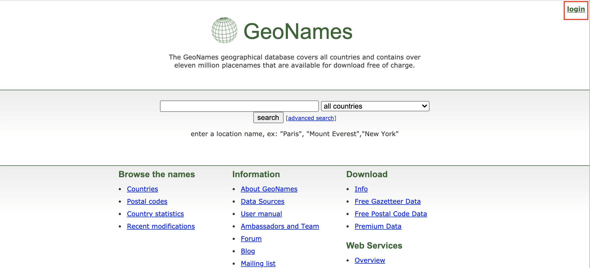

2.  **Enable** the account for **web services** on the account page [GeoNames Account Page](http://www.geonames.org/manageaccount).

    

    

## Task 2: Connect to ADB with SQL Developer Web
 
1.  Login to Oracle Cloud if you are not already logged in
2.  If you aren't still logged in, login to your ADB screen by clicking on the Hamburger Menu and selecting the Autonomous Database flavor you selected (ATP, ADW or AJD). Otherwise skip to the next step.
      

2.  If you can't find your ADB instance, ensure you are in the correct compartment, you have chosen the flavor of ADB you choose in the earlier lab and that you are in the correct region.
3.  Click on the **Display Name** to go to your ADB main page.
      

4.  Click on the **Tools** tab, select **Database Actions**, a new browser will open up.
      

5.  Click on the **SQL** button.
 3.  Sign in as the **ADMIN** user.

    


## Task 3: Generate JSON Data

Let us generate some JSON data into the database by retrieving sample documents from a web service. Oracle Database supports *JavaScript Object Notation (JSON)* data natively with relational database features, including transactions, indexing, declarative querying, and views.

This lab covers the use of database languages and features to work with JSON data that is stored in Oracle Database. In particular, it covers how to use SQL and PL/SQL with JSON data.

1.  Make sure you have activated your GeoNames account before continuing with this lab.

2.  Create Network Access Control List as our database needs to connect to a web service, and retrieve information over HTTPS, and this requires an *Access Control List (ACL)*. This ACL can be created by a user with SYSDBA privileges, **ADMIN** in this case, from your Autonomous Database by executing the following procedure.

    ````
    <copy>
    begin
      DBMS_NETWORK_ACL_ADMIN.append_host_ace (
        host       => 'secure.geonames.org',
        ace        => xs$ace_type(privilege_list => xs$name_list('http','connect','resolve'),
                                  principal_name => 'ADMIN',
                                  principal_type => xs_acl.ptype_db));
    end;
    /
    </copy>
    ````

    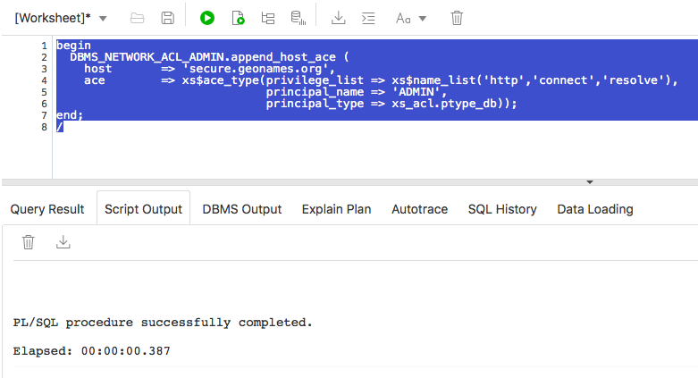

 Ensure the execution is successful.

3.  Test access to the external web service – in this case countryInfo web service from GeoNames. Copy and run the following script in your SQL Developer Web worksheet. The URL_HTTP package in Autonomous Database supports only HTTPS requests with an SSL wallet for added security.

    Note: Remember to replace ***&YourGeoNameUsername*** with the username of your account on GeoNames, or fill in your username in the popup dialog.

    ````
    <copy>
    set serveroutput on

    declare
        t_http_req  utl_http.req;
        t_http_resp  utl_http.resp;
        t_response_text clob;
    begin  
         UTL_HTTP.SET_WALLET('');

    t_http_req:= utl_http.begin_request('https://secure.geonames.org/countryInfoJSON?formatted=true&' || 'lang=en&' || 'country=ES&' || 'username=&YourGeoNameUsername&' || 'style=full','GET','HTTP/1.1');
    UTL_HTTP.SET_HEADER(t_http_req, 'User-Agent', 'Mozilla/4.0');
    t_http_resp:= utl_http.get_response(t_http_req);
    UTL_HTTP.read_text(t_http_resp, t_response_text);
    UTL_HTTP.end_response(t_http_resp);
    DBMS_OUTPUT.put_line(t_response_text);
    end;
    /
    </copy>
    ````

 If the request was successful you will see the following sample output below. Make sure you see a similar sample output before proceeding to the next step.

    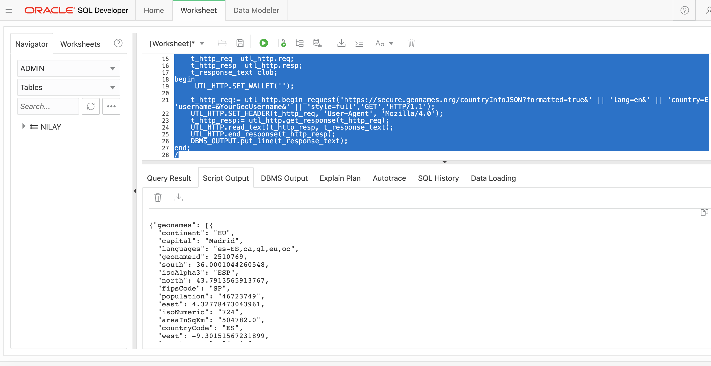


## Task 4: Store JSON Documents In Oracle Database

1.  Create a new table to store all JSON documents inside the pluggable database.

    ````
    <copy>
    CREATE TABLE MYJSON (
      id NUMBER GENERATED BY DEFAULT ON NULL AS IDENTITY (CACHE 5) PRIMARY KEY,
      doc CLOB CONSTRAINT valid_json CHECK (doc IS JSON));
    </copy>
    ````

    

2.  Using JSON inside Oracle database is very flexible, and does not require a predefined data structure, or specific schema. You can store any JSON document in a relational table, like the one we just created, with any internal document structure. Here is another JSON document example, with a totally different structure than the one we have received from GeoNames, and we can store it in the same table.

    ````
    <copy>
    INSERT INTO MYJSON (doc) VALUES (
    '{
      "workshopName": "Database 19c New Features for Developers",
      "audienceType": "Partners Technical Staff",
      "location": {
        "company": "Oracle",
        "office": "Customer Visiting Center",
        "region": "EMEA"
      }
    }');

    commit;
    </copy>
    ````

    

3.  Once stored, we can query these documents and retrieve the JSON values as traditional relational data.

    ````
    <copy>
    SELECT j.doc FROM MYJSON j;
    </copy>
    ````

    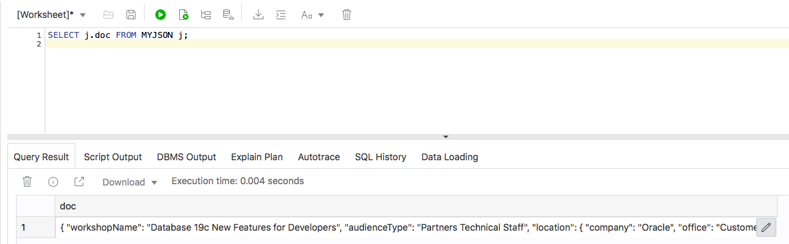


 4.  You can use the JSON_SERIALIZE function to pretty print the JSON output. This makes it easier to read.  *Note: Notice the difference in output between when you click **Run Statement** versus when you click **Run Script** on this highlighted query. Run Statement gives you a result in sortable, expandable table, whereas Run Script gives you the output in plain text, as in the screenshot below.*

     <copy>
     SELECT JSON_Serialize(j.doc pretty) FROM MYJSON j;
     </copy>


    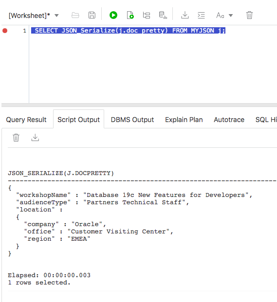


## Task 5:  Simple Dot Notation

Oracle Database SQL engine allows you to use a **simple-dot-notation (SDN)** syntax on your JSON data. With other words, you can write SQL queries that contain something like *TABLE\_Alias.JSON\_Column.JSON\_Property.JSON\_Property* which comes quite handy as the region attribute is an attribute of the nested object location within the JSON document. Remember, JSDN syntax is case sensitive.

The return value for a dot-notation query is always a string (data type VARCHAR2(4000)) representing JSON data. The content of the string depends on the targeted JSON data, as follows:
- If a single JSON value is targeted, then that value is the string content, whether it is a JSON scalar, object, or array.
- If multiple JSON values are targeted, then the string content is a JSON array whose elements are those values.

1.  Issue the query to choose the workshop name and region from the table you loaded earlier.

    ````
    <copy>
    SELECT j.doc.workshopName, j.doc.location.region FROM MYJSON j;
    </copy>
    ````

    

2.  Go ahead and test other queries of your choosing and review the output.

## Task 6: Retrieve Sample Data

The objective for our lab is to retrieve information about castles in Europe, and use them as JSON documents in different scenarios. Imagine you are starting the development of a new mobile application that provides recommendations for tourists.  For convenience and comfort, we can encapsulate the communication with a web service into a function. This way, we don’t have to write all the code required for a simple request, which in most of the cases is even more complicated than our simple example here, because they require a more complex authentication.


1.  Run this script to create a function to get country information from the GeoNames web service  *Note: Remember to replace ***&YourGeoNameUsername*** with the username of your account on GeoNames, or fill in your username in the popup dialog.*

    ````
    <copy>
    create or replace function get_country_info (countryCode in VARCHAR2) return clob
      is
        t_http_req  utl_http.req;
        t_http_resp  utl_http.resp;
        t_response_text clob;
      begin   
        UTL_HTTP.SET_WALLET('');

        t_http_req:= utl_http.begin_request('https://secure.geonames.org/countryInfoJSON?formatted=true&' || 'lang=en&' || 'country=countryCode&' || 'username=&YourGeoUsername&' || 'style=full','GET','HTTP/1.1');
        UTL_HTTP.SET_HEADER(t_http_req, 'User-Agent', 'Mozilla/4.0');
        t_http_resp:= utl_http.get_response(t_http_req);
        UTL_HTTP.read_text(t_http_resp, t_response_text);
        UTL_HTTP.end_response(t_http_resp);
        return t_response_text;
      end;
    /
    </copy>
    ````

   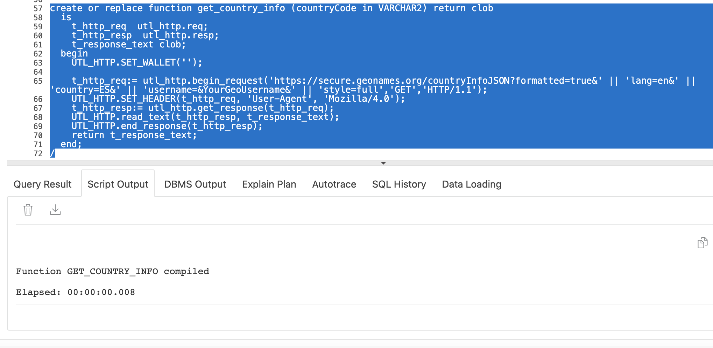

2.  The input of the function we just created is the ISO code of a country. Run this query to get information about Spain, for example. You may click or hover over the pencil icon in the row of your table to see the complete JSON.

    ````
    <copy>
    select get_country_info('ES') country_info from dual;
    </copy>
    ````

    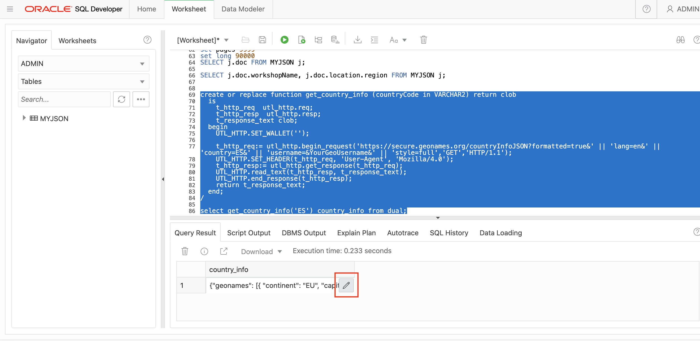

3.  Insert and commit the JSON document retrieved from the web service into the JSON column of that same table, even though this JSON document has a totally different structure.

    ````
    <copy>
    insert into MYJSON (doc) values (get_country_info('ES'));

    commit;
    </copy>
    ````

    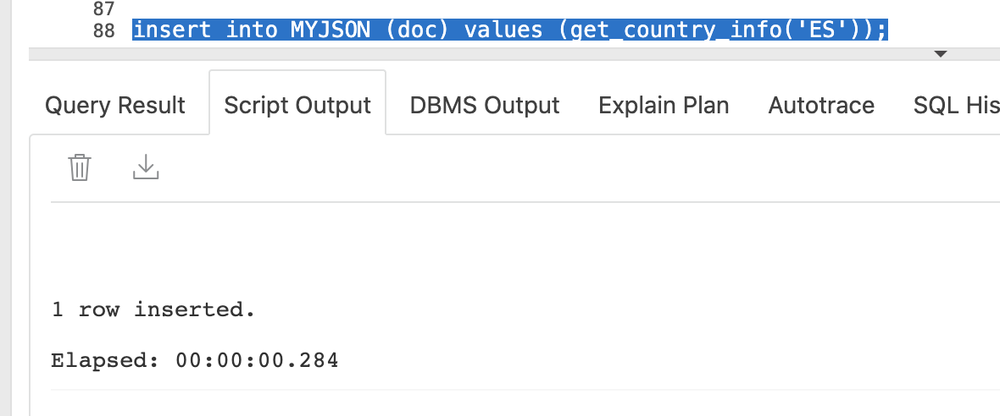

4.  Select the contents of that table, and notice we use the same column.

    ````
    <copy>
    select * from MYJSON;
    </copy>
    ````

    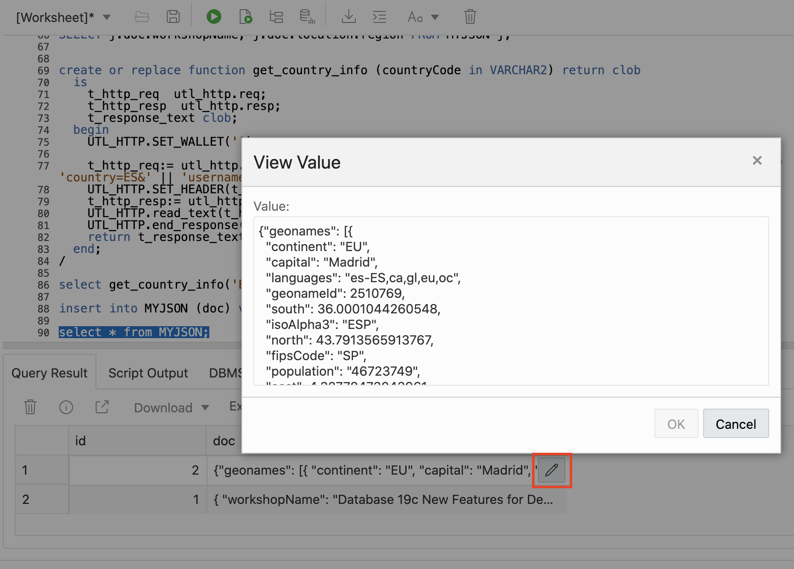

5.  Working with attributes, allows us to get the information we want from a specific document. We can assign default values for attributes that do not match, and treat the issue further from the application. The SQL/JSON function *JSON_VALUE* finds a specified scalar JSON value in JSON data and returns it as a SQL value.

    ````
    <copy>
    SELECT JSON_VALUE(doc, '$.geonames.geonameId' NULL ON ERROR) AS GeoNameID,
    JSON_VALUE(doc, '$.geonames.countryName' DEFAULT 'Not a country' ON ERROR) AS Country
    FROM MYJSON;
    </copy>
    ````

    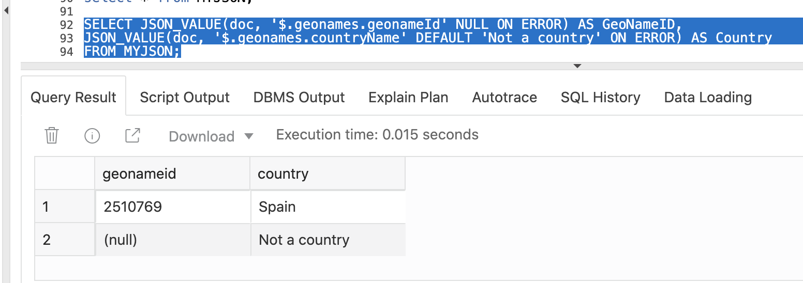

6.  Or we can filter the results to receive only the documents that are useful for the query, using the SDN syntax.

    ````
    <copy>
    select j.doc.geonames.geonameId GeoNameID, j.doc.geonames.countryName Country
        from MYJSON j where j.doc.geonames.isoAlpha3 IS NOT NULL;
    </copy>
    ````

    

7.  In both cases, we can see that Spain geonameId is 2510769. This value will be used in the following steps.  A new function is required to retrieve JSON documents with country regions information from GeoNames web service. This function requires the  **geonameId** of the country, and a style value used internally by GeoNames web service to specify the level of details. *Note: Remember to replace ***&YourGeoNameUsername*** with the username of your account on GeoNames, or fill in your username in the popup dialog.*

    ````
    <copy>
    create or replace function get_subdivision (geonameId in NUMBER, style in VARCHAR2) return clob
      is
        t_http_req  utl_http.req;
        t_http_resp  utl_http.resp;
        t_response_text clob;
      begin
        UTL_HTTP.SET_WALLET('');
        t_http_req:= utl_http.begin_request('https://secure.geonames.org/childrenJSON?formatted=true&' || 'lang=en&' || 'geonameId='                  || geonameId || '&' || 'username=&YourGeoUsername&' || 'style=' || style,'GET','HTTP/1.1');
        UTL_HTTP.SET_HEADER(t_http_req, 'User-Agent', 'Mozilla/4.0');
        t_http_resp:= utl_http.get_response(t_http_req);
        UTL_HTTP.read_text(t_http_resp, t_response_text);
        UTL_HTTP.end_response(t_http_resp);
        return t_response_text;
      end;
    /
    </copy>
    ````

    

8.  Test this function using the following inputs.

    ````
    <copy>
    select get_subdivision(2510769, 'medium') regions_document from dual;
    </copy>
    ````

    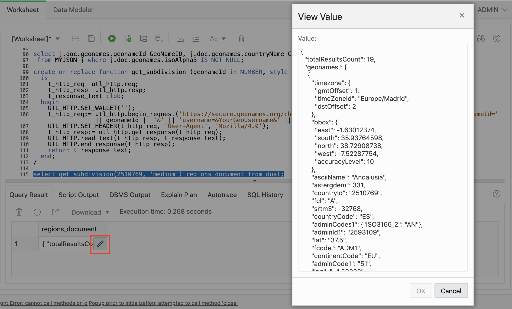

9. If the test is successful, insert and commit this new JSON document into your MYJSON table.

    ````
    <copy>
    insert into MYJSON (doc) values (get_subdivision(2510769, 'medium'));

    commit;
    </copy>
    ````

    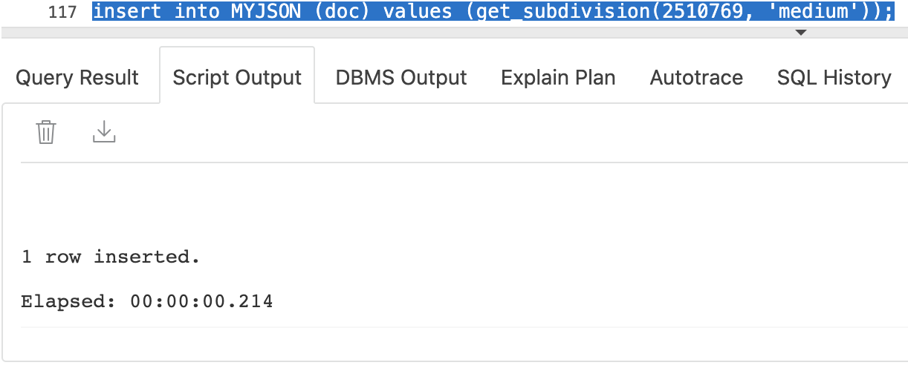

10. The SQL/JSON function *JSON\_TABLE* creates a relational view of JSON data. It maps the result of a JSON data evaluation into relational rows and columns. You can query the result returned by the function as a virtual relational table using SQL. The main purpose of *JSON\_TABLE* is to create a row of relational data for each object inside a JSON array and output JSON values from within that object as individual SQL column values.

  The **NESTED** clause allows you to flatten JSON values in a nested JSON object or JSON array into individual columns in a single row along with JSON values from the parent object or array. You can use this clause recursively to project data from multiple layers of nested objects or arrays into a single row. This path expression is relative to the SQL/JSON row path expression specified in the *JSON\_TABLE* function.

    ````
    <copy>
    SELECT jt.countryName Country, jt.fcode, convert(jt.toponymName,'WE8ISO8859P1','AL32UTF8') Title,
      convert(jt.name,'WE8ISO8859P1','AL32UTF8') Name, jt.geonameId GeoNameID FROM MYJSON,
      JSON_TABLE(DOC, '$' COLUMNS
        (NESTED PATH '$.geonames[*]'
          COLUMNS (countryName VARCHAR2(80) PATH '$.countryName',
                  toponymName VARCHAR2(120) PATH '$.toponymName',
                  geonameId VARCHAR2(20) PATH '$.geonameId',
                  name VARCHAR2(80) PATH '$.name',
                  fcode VARCHAR2(6) PATH '$.fcode')))
      AS jt  WHERE (fcode = 'ADM1');
    </copy>
    ````

    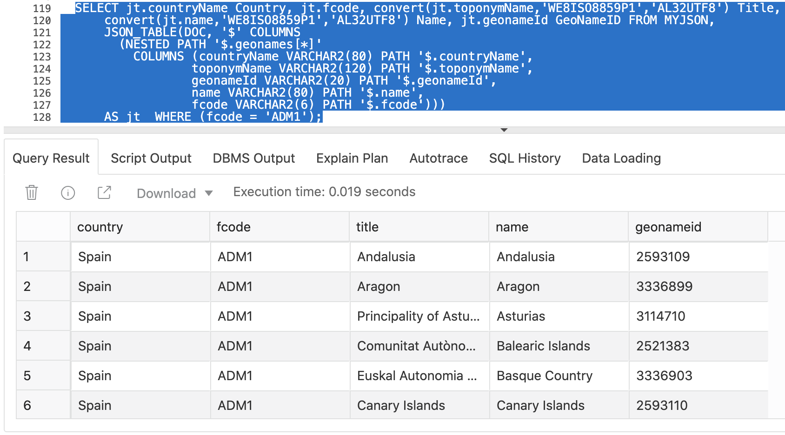

11. Having all regions from Spain, we can ask the GeoNames web service for more information about each region, for example Andalucia with **geonameId** 2593109.

    ````
    <copy>
    SELECT get_subdivision(2593109, 'full') sub_regions FROM dual;
    </copy>
    ````

    

12. Our next goal is to get more details about each region, and for that we need the geonameId for each region. One option is to use *JSON\_TABLE* to return only that column, or the following SDN syntax.

    ````
    <copy>
    SELECT j.doc.geonames.geonameId FROM MYJSON j WHERE j.doc.geonames.fcode like '%ADM1%';
    </copy>
    ````

    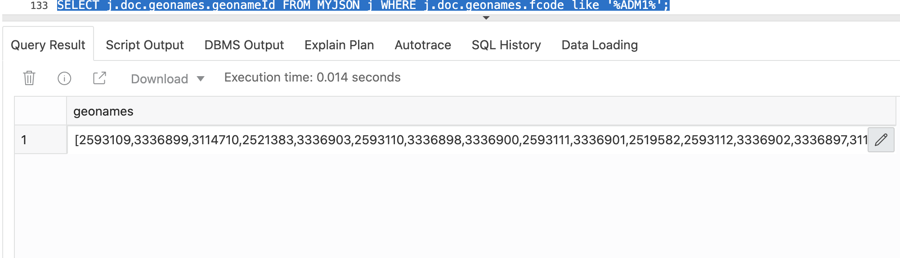

    The SDN syntax returns an *array*, not a relational view of JSON data in one column.

You may proceed to the following lab.

## Learn More

Watch this video to learn more about JSON in the Oracle Database.

[](youtube:OXxA6SFqlJ4)

GeoNames is licensed under a [Creative Commons Attribution 4.0 License](https://creativecommons.org/licenses/by/4.0/). You are free to:
- Share — copy and redistribute the material in any medium or format.
- Adapt — remix, transform, and build upon the material for any purpose, even commercially.


## **Acknowledgements**

- **Author** - Valentin Leonard Tabacaru, Product Management
- **Contributors** - Beda Hammerschmidt (Architect), Nilay Panchal, Anoosha Pilli & Troy Anthony (Product Management), Dylan McLeod (LiveLabs QA Intern)
- **Last Updated By/Date** - Nilay Panchal, DB Product Management, August 2020

