# Hybrid Partitioning

## Introduction
In this lab, you will explore Hybrid Partitioning, a new feature introduced in Oracle Database 19c.

Estimated Lab Time:  30 minutes

### About Partitioning

Partitioning can provide tremendous benefit to a wide variety of applications by improving performance, manageability, and availability. It is not unusual for partitioning to greatly improve the performance of certain queries or maintenance operations. Moreover, partitioning can greatly simplify common administration tasks.

Partitioning also enables database designers and administrators to solve some difficult problems posed by cutting-edge applications. Partitioning is a key tool for building multi-terabyte systems or systems with extremely high availability requirements.

### About Hybrid Partitioning

The Hybrid Partition Tables feature extends Oracle Partitioning by enabling partitions to reside in both Oracle Database segments and in external files and sources. This feature significantly enhances the functionality of partitioning for Big Data SQL where large portions of a table can reside in external partitions.

Watch the video below to get an explanation of Hybrid Partitioning.

[](youtube:Z21-Mc_s3a4)

Hybrid Partition Tables enable you to easily integrate internal partitions and external partitions into a single partition table. With this feature, you can also easily move non-active partitions to external files, such as Oracle Data Pump files, for a cheaper storage solution.
Partitions of hybrid partitioned tables can reside on both Oracle tablespaces and external sources, such as Linux files with comma-separated values (CSV) records or files on Hadoop Distributed File System (HDFS) with Java server. Hybrid partitioned tables support all existing external table types for external partitions: ORACLE\_DATAPUMP, ORACLE\_LOADER, ORACLE\_HDFS, ORACLE\_HIVE. External table types for external partitions use the following access driver types:
   - ORACLE\_DATAPUMP
   - ORACLE\_LOADER
   - ORACLE\_HDFS
   - ORACLE\_HIVE

For external partitions of ORACLE\_LOADER and ORACLE\_DATAPUMP access driver type, you must grant the following privileges to the user:
   - READ privileges on directories with data files
   - WRITE privileges on directories with logging and bad files
   - EXECUTE privileges on directories with pre-processor programs

### Prerequisites

This lab assumes you have completed the following labs:
* Lab: Login to Oracle Cloud
* Lab: Generate SSH Key
* Lab: Environment Setup
* Lab: Sample Schema Setup

## Task 1: Create External Directories

1.  Login to the instance using Oracle Cloud Shell and ssh.

    ````
    ssh -i ~/.ssh/<sshkeyname> opc@<Your Compute Instance Public IP Address>
    ````

2.  This lab uses the Sales History sample schema (SH). Create two new folders on disk (using the *opc* user). These folders will be used later as a location for some external partitions.

    ````
    <copy>
    sudo mkdir -p /u01/External/sales_1998
	sudo mkdir -p /u01/External/sales_1999

	sudo chown -R oracle:oinstall /u01/External

    ls -al /u01/External
    </copy>
    ````

    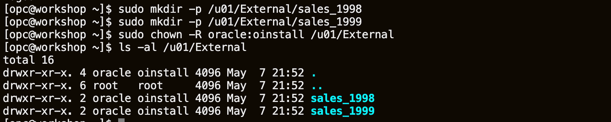

2.  Now, switch to the oracle user
    ````
    <copy>
    sudo su - oracle
    </copy>
    ````
    

3.  Set your oracle environment.  When prompted enter **[ORCL]**
    ````
    <copy>
    . oraenv
    </copy>
    ORACLE_SID = [ORCL] ? ORCL
    The Oracle base remains unchanged with value /u01/app/oracle
    ````
    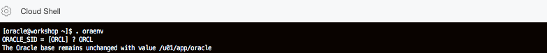

4.  Use SQLPlus to connect to the **PDB01** Pluggable database as SYS.

    ````
    <copy>
    sqlplus sys/Ora_DB4U@localhost:1521/orclpdb as SYSDBA
    </copy>
    ````

    

5.  Create two external directories and grant access to the SH user.

    ````
    <copy>
    CREATE DIRECTORY SALES_98 AS '/u01/External/sales_1998';

    GRANT READ,WRITE ON DIRECTORY SALES_98 TO sh;

    CREATE DIRECTORY SALES_99 AS '/u01/External/sales_1999';

    GRANT READ,WRITE ON DIRECTORY SALES_99 TO sh;
    </copy>
    ````

    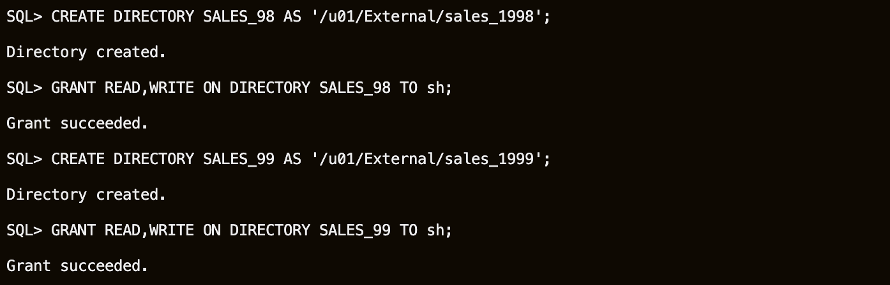

6.  Grant additional privileges to SH user.

    ````
    <copy>
    GRANT CREATE ANY DIRECTORY TO sh;

    GRANT EXECUTE ON dbms_sql TO sh;
    GRANT EXECUTE ON utl_file TO sh;
    </copy>
    ````

    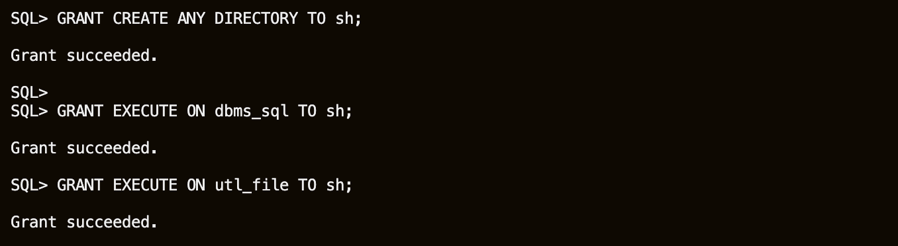

    The DBMS\_SQL package provides an interface to use dynamic SQL to parse any data manipulation language (DML) or data definition language (DDL) statement using PL/SQL. Using the UTL\_FILE package, PL/SQL programs can read and write operating system text files. UTL\_FILE provides a restricted version of the operating system stream file I/O. One use case is for exporting data into flat files, that will become external partitions.

## Task 2: Review the current SALES table

The Oracle environment is already set up so sqlplus can be invoked directly from the shell environment. Since the lab is being run in a pdb called orclpdb you must supply this alias when connecting to the ssh account.

1.  Login to the pdb as the *SH* user and set some formatting for SQL*Plus output.

    ````
    <copy>
    sqlplus sh/Ora_DB4U@localhost:1521/orclpdb
    </copy>
    ````

    ````
    <copy>
    set pages 9999

    set lines 200

	SET LINESIZE 120

    column TABLE_NAME format a27
    column PARTITION_NAME format a25
    column TABLESPACE_NAME format a15
    column DIRECTORY_NAME format a20
    column DIRECTORY_PATH format a80
    </copy>
    ````

    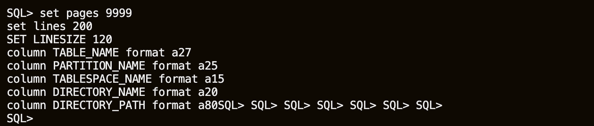

2.  Examine the Sales History schema.

    ````
    <copy>
    --QUERY

    select TABLE_NAME, NUM_ROWS, PARTITIONED, HYBRID from USER_TABLES ORDER BY TABLE_NAME;
    </copy>
    ````

    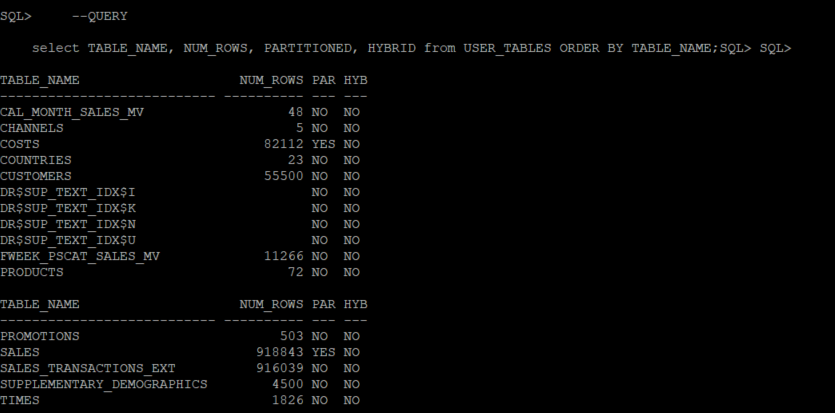

    Table SALES is partitioned and does not use hybrid partitioning. We will use this table as an example, to see how hybrid partitioning works.

3.  Examine the data in the table.

    ````
    <copy>
    column name format a30
    column owner format a20

    --QUERY

    select unique to_char(TIME_ID, 'YYYY') from SALES order by 1;
    </copy>
    ````

    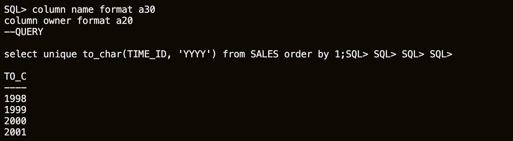

    There are 5 years of data in the SALES table: 1998, 1999, 2000, 2001, 2002. The data is partitioned in yearly quarters. *(Note that the 2003 partitions exist but are empty)*

    ````
    <copy>
    column name format a30
    column owner format a20

    --QUERY

    select TABLE_NAME, PARTITION_NAME, TABLESPACE_NAME, READ_ONLY, NUM_ROWS
    from USER_TAB_PARTITIONS
    where TABLE_NAME = 'SALES' and NUM_ROWS != 0
    order by substr(PARTITION_NAME, 10) || substr(PARTITION_NAME, 8, 1);
    </copy>
    ````

	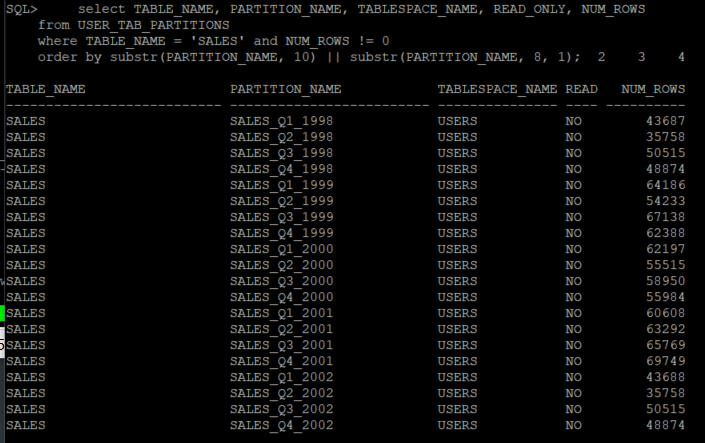

## Task 3: Rethink Storage Organization

You can convert a table with only internal partitions to a hybrid partitioned table. For example, the SALES table could be converted to a hybrid partitioned table by adding external partition attributes using an ALTER TABLE command, then add external partitions. Note that at least one partition must be an internal partition. However, in this lab you will create a new hybrid partitioned table, as a copy of the SALES table instead.

Let's create some external files initially.  The external partitions will be defined using comma-separated (CSV) data files stored in directories, that point to folders on disk. The CSV files are exported using existing internal partitions of the SALES table.

The following procedure will be used to export individual partitions of a table into CSV files on disk.

1.  Create this procedure in the SALES schema from your SQL*Plus session.

    ````
    <copy>
    create or replace PROCEDURE table_part_to_csv (
    p_tname in varchar2,
    p_pname in varchar2,
    p_dir in varchar2,
    p_filename in varchar2)
    is
    l_output utl_file.file_type;
    l_theCursor integer default dbms_sql.open_cursor;
    l_columnValue varchar2(4000);
    l_status integer;
    l_query varchar2(1000) default 'select * from '|| p_tname || ' partition (' || p_pname || ') where 1=1';
    l_colCnt number := 0;
    l_separator varchar2(1);
    l_descTbl dbms_sql.desc_tab;
    begin
    --create an empty file on disk
    l_output := utl_file.fopen( p_dir, p_filename, 'w','32760');
    execute immediate 'alter session set nls_date_format=''dd-mon-yyyy hh24:mi:ss'' ';
    dbms_sql.parse( l_theCursor, l_query, dbms_sql.native );
    dbms_sql.describe_columns( l_theCursor, l_colCnt, l_descTbl );
    --write column names into the new file
    for i in 1 .. l_colCnt loop
    utl_file.put( l_output, l_separator || '"' || l_descTbl(i).col_name || '"' );
    dbms_sql.define_column( l_theCursor, i, l_columnValue, 4000 );
    l_separator := ',';
    end loop;
    utl_file.new_line( l_output );
    --write data into the new file and close
    l_status := dbms_sql.execute(l_theCursor);
    while ( dbms_sql.fetch_rows(l_theCursor) > 0 ) loop
    l_separator := '';
    for i in 1 .. l_colCnt loop
        dbms_sql.column_value( l_theCursor, i, l_columnValue );
        utl_file.put( l_output, l_separator || '"' || l_columnValue || '"');
        l_separator := ',';
    end loop;
    utl_file.new_line( l_output );
    end loop;
    dbms_sql.close_cursor(l_theCursor);
    utl_file.fclose( l_output );
    END table_part_to_csv;
    /
    </copy>
    ````

    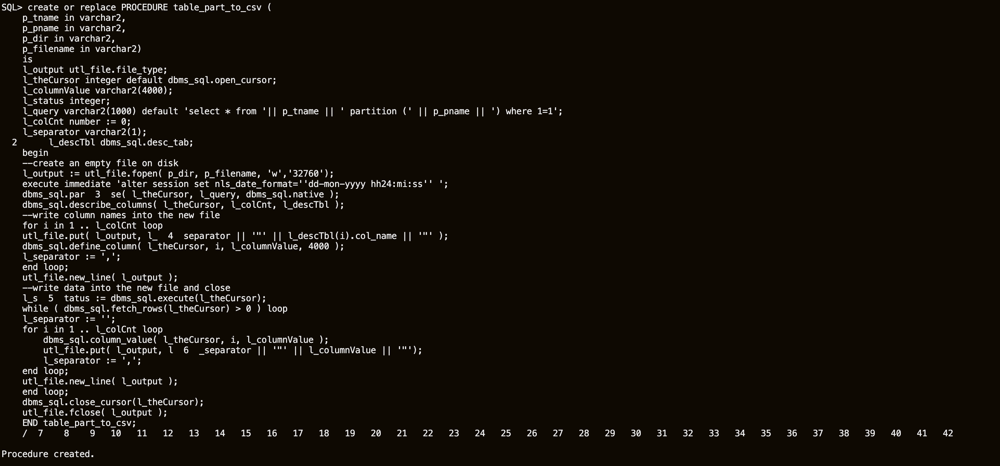

2.  Use the DIRECTORY objects created previously. Check they exist.

    ````
    <copy>
	-- QUERY

    SET LINESIZE 120

    column DIRECTORY_NAME format a20
    column DIRECTORY_PATH format a55

	select DIRECTORY_NAME, DIRECTORY_PATH from ALL_DIRECTORIES where DIRECTORY_NAME like 'SALES%';
    </copy>
    ````

    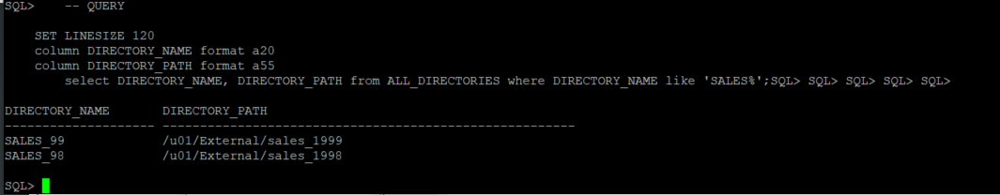

3.  Export partition SALES\_Q1\_1998 from table SALES as an external file SALES\_Q1\_1998.CSV placing the CSV file in the directory SALES\_98.

    ````
    <copy>
    exec table_part_to_csv('SALES','SALES_Q1_1998','SALES_98','SALES_Q1_1998.csv');
    </copy>
    ````

    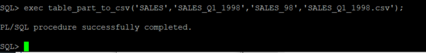

4.  Open another terminal window into your environment (Duplicate Putty session for example) and examine the CSV file. The following example uses vim, but any editor will suffice.

    ````
    <copy>
    vim /u01/External/sales_1998/SALES_Q1_1998.csv
    </copy>
    ````

    

5.  The first line of the file contains the names of the columns. All data fields are enclosed within double quotes and fields are separated by a comma. This format can be customized. For this lab session, we will use this same format for the rest of the SALES table partitions that store data for the years 1998 and 1999.

    ````
    <copy>
    exec table_part_to_csv('SALES','SALES_Q2_1998','SALES_98','SALES_Q2_1998.csv');
	exec table_part_to_csv('SALES','SALES_Q3_1998','SALES_98','SALES_Q3_1998.csv');
    exec table_part_to_csv('SALES','SALES_Q4_1998','SALES_98','SALES_Q4_1998.csv');
    exec table_part_to_csv('SALES','SALES_Q1_1999','SALES_99','SALES_Q1_1999.csv');
    exec table_part_to_csv('SALES','SALES_Q2_1999','SALES_99','SALES_Q2_1999.csv');
    exec table_part_to_csv('SALES','SALES_Q3_1999','SALES_99','SALES_Q3_1999.csv');
    exec table_part_to_csv('SALES','SALES_Q4_1999','SALES_99','SALES_Q4_1999.csv');
    </copy>
    ````

    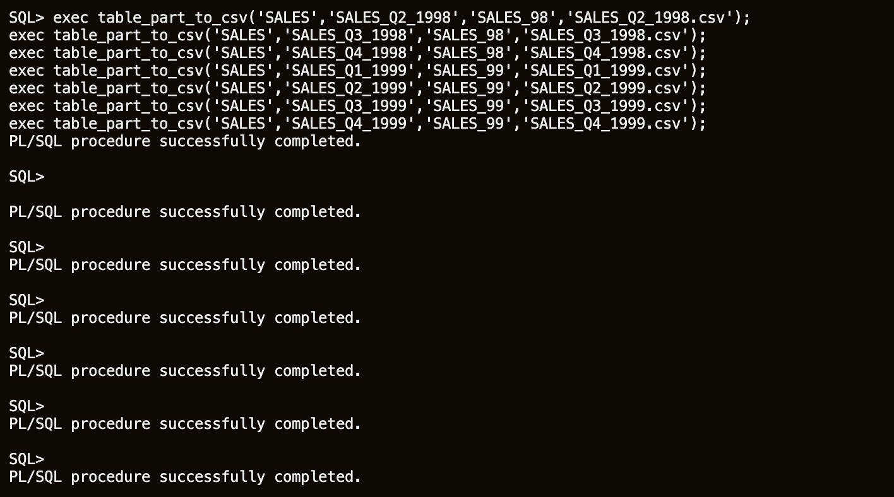

6.  In the other opened terminal window, ensure all partitions were exported.

    ````
    <copy>
    ls -alh /u01/External/sales_1998/
	ls -alh /u01/External/sales_1999/
    </copy>
    ````

    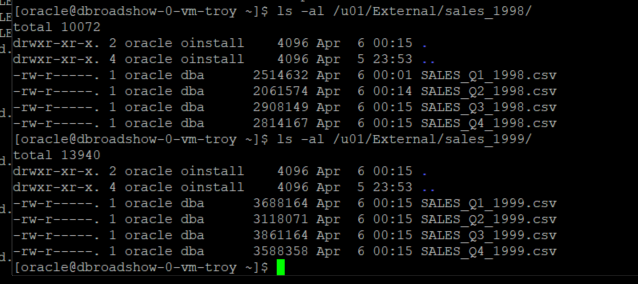

## Task 4: Implement Hybrid Partition Tables

In this example, we assume our OLTP application will continue to run on the original SALES table, and we can drop the partitions containing old data, for example, years 1998 and 1999. For reporting and compliancy, we will store old data outside the database, on a cheaper storage solution.

You will copy and then redefine a table (maintaining application transparency). The new table will have the same structure as the original SALES table, however, there are some restrictions for Hybrid Partition Tables we need to consider. Only single-level LIST and RANGE partitioning are supported, no column default value is allowed, and only RELY constraints are allowed. You will check the original table, and make sure all these restrictions are applied to the new table.

1.  As you will copy SALES, retrieve the DDL script from the database.

    ````
    <copy>
    sqlplus sh/Ora_DB4U@localhost:1521/orclpdb
    </copy>
    ````

    ````
    <copy>
	-- QUERY

    set pages 999

    set long 90000

    col definition format a120

	select dbms_metadata.get_ddl('TABLE','SALES','SH') definition from dual;
    </copy>
    ````

    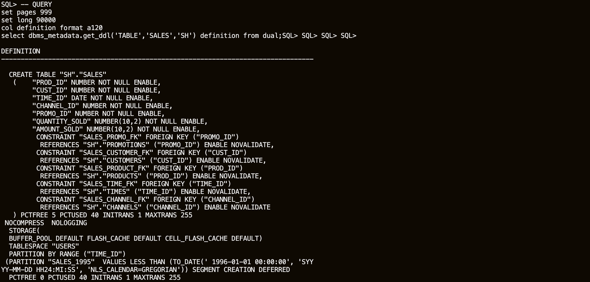

    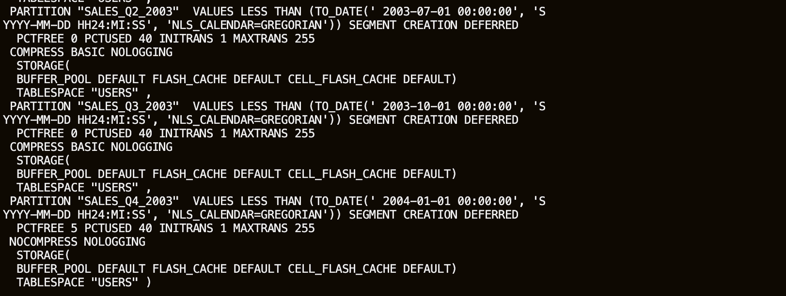

	You can edit the CREATE TABLE statement to create a TABLE named HYBRID_SALES where the partitions containing data from 1998 and 1999 reference the CSV files created previously. Or just use the example below. Note that the DDL retrieved from the database cannot be run directly to create a hybrid partitioned table; you must remove all Foreign Keys from the original statement, because of the restrictions on Hybrid Partitioned Tables, only RELY constraints are allowed.

	The hybrid range-partitioned table is created with eight external partitions and sixteen internal partitions. You can specify for each external partition different attributes than the default attributes defined at the table level, DIRECTORY for example.

	Range partitioning maps data to partitions based on ranges of values of the partitioning key that you establish for each partition. Range partitioning is the most common type of partitioning and is often used with dates. For a table with a date column as the partitioning key, a partition named January-2017, for example, would contain rows with partitioning key values from 01-Jan-2017 to 31-Jan-2017.

	Each partition has a VALUES LESS THAN clause, that specifies a non-inclusive upper bound for the partitions. Any values of the partitioning key equal to or higher than this literal are added to the next higher partition. All partitions, except the first, have an implicit lower bound specified by the VALUES LESS THAN clause of the previous partition.

	````
	<copy>
	CREATE TABLE "SH"."HYBRID_SALES"
      ("PROD_ID" NUMBER NOT NULL ENABLE,
        "CUST_ID" NUMBER NOT NULL ENABLE,
        "TIME_ID" DATE NOT NULL ENABLE,
        "CHANNEL_ID" NUMBER NOT NULL ENABLE,
        "PROMO_ID" NUMBER NOT NULL ENABLE,
        "QUANTITY_SOLD" NUMBER(10,2) NOT NULL ENABLE,
        "AMOUNT_SOLD" NUMBER(10,2) NOT NULL ENABLE
      ) PCTFREE 5 PCTUSED 40 INITRANS 1 MAXTRANS 255 NOCOMPRESS  NOLOGGING
     TABLESPACE "USERS"
	EXTERNAL PARTITION ATTRIBUTES (
	  TYPE ORACLE_LOADER
      DEFAULT DIRECTORY sales_98
      ACCESS PARAMETERS(
	    FIELDS TERMINATED BY ',' OPTIONALLY ENCLOSED BY '"'
		(prod_id, cust_id,
		time_id DATE 'DD-MON-YYYY HH24:MI:SS',channel_id,promo_id,quantity_sold,amount_sold)
      )
      REJECT LIMIT UNLIMITED
	)
    PARTITION BY RANGE ("TIME_ID")
     (PARTITION "SALES_Q1_1998"  VALUES LESS THAN
	  (TO_DATE(' 1998-04-01 00:00:00', 'SYYYY-MM-DD HH24:MI:SS', 'NLS_CALENDAR=GREGORIAN'))
	  EXTERNAL
       DEFAULT DIRECTORY SALES_98 LOCATION ('SALES_Q1_1998.csv') ,
     PARTITION "SALES_Q2_1998"  VALUES LESS THAN
	  (TO_DATE(' 1998-07-01 00:00:00', 'SYYYY-MM-DD HH24:MI:SS', 'NLS_CALENDAR=GREGORIAN'))
	  EXTERNAL
       DEFAULT DIRECTORY SALES_98 LOCATION ('SALES_Q2_1998.csv') ,
     PARTITION "SALES_Q3_1998"  VALUES LESS THAN
	  (TO_DATE(' 1998-10-01 00:00:00', 'SYYYY-MM-DD HH24:MI:SS', 'NLS_CALENDAR=GREGORIAN'))
	  EXTERNAL
       DEFAULT DIRECTORY SALES_98 LOCATION ('SALES_Q3_1998.csv') ,
     PARTITION "SALES_Q4_1998"  VALUES LESS THAN
	  (TO_DATE(' 1999-01-01 00:00:00', 'SYYYY-MM-DD HH24:MI:SS', 'NLS_CALENDAR=GREGORIAN'))
	  EXTERNAL
       DEFAULT DIRECTORY SALES_98 LOCATION ('SALES_Q4_1998.csv') ,
     PARTITION "SALES_Q1_1999"  VALUES LESS THAN
	  (TO_DATE(' 1999-04-01 00:00:00', 'SYYYY-MM-DD HH24:MI:SS', 'NLS_CALENDAR=GREGORIAN'))
	  EXTERNAL
       DEFAULT DIRECTORY SALES_99 LOCATION ('SALES_Q1_1999.csv') ,
     PARTITION "SALES_Q2_1999"  VALUES LESS THAN
	  (TO_DATE(' 1999-07-01 00:00:00', 'SYYYY-MM-DD HH24:MI:SS', 'NLS_CALENDAR=GREGORIAN'))
	   EXTERNAL
        DEFAULT DIRECTORY SALES_99 LOCATION ('SALES_Q2_1999.csv') ,
     PARTITION "SALES_Q3_1999"  VALUES LESS THAN
	  (TO_DATE(' 1999-10-01 00:00:00', 'SYYYY-MM-DD HH24:MI:SS', 'NLS_CALENDAR=GREGORIAN'))
	  EXTERNAL
        DEFAULT DIRECTORY SALES_99 LOCATION ('SALES_Q3_1999.csv') ,
     PARTITION "SALES_Q4_1999"  VALUES LESS THAN
	  (TO_DATE(' 2000-01-01 00:00:00', 'SYYYY-MM-DD HH24:MI:SS', 'NLS_CALENDAR=GREGORIAN'))
	  EXTERNAL
        DEFAULT DIRECTORY SALES_99 LOCATION ('SALES_Q4_1999.csv') ,
     PARTITION "SALES_Q1_2000"  VALUES LESS THAN
	  (TO_DATE(' 2000-04-01 00:00:00', 'SYYYY-MM-DD HH24:MI:SS', 'NLS_CALENDAR=GREGORIAN'))
	  SEGMENT CREATION IMMEDIATE
      PCTFREE 0 PCTUSED 40 INITRANS 1 MAXTRANS 255
      COMPRESS BASIC NOLOGGING
      STORAGE(INITIAL 8388608 NEXT 1048576 MINEXTENTS 1 MAXEXTENTS 2147483645
      PCTINCREASE 0 FREELISTS 1 FREELIST GROUPS 1)
      TABLESPACE "USERS" ,
     PARTITION "SALES_Q2_2000"  VALUES LESS THAN
	  (TO_DATE(' 2000-07-01 00:00:00', 'SYYYY-MM-DD HH24:MI:SS', 'NLS_CALENDAR=GREGORIAN'))
	  SEGMENT CREATION IMMEDIATE
      PCTFREE 0 PCTUSED 40 INITRANS 1 MAXTRANS 255
      COMPRESS BASIC NOLOGGING
      STORAGE(INITIAL 8388608 NEXT 1048576 MINEXTENTS 1 MAXEXTENTS 2147483645
      PCTINCREASE 0 FREELISTS 1 FREELIST GROUPS 1)
      TABLESPACE "USERS" ,
     PARTITION "SALES_Q3_2000"  VALUES LESS THAN
	  (TO_DATE(' 2000-10-01 00:00:00', 'SYYYY-MM-DD HH24:MI:SS', 'NLS_CALENDAR=GREGORIAN'))
	  SEGMENT CREATION IMMEDIATE
      PCTFREE 0 PCTUSED 40 INITRANS 1 MAXTRANS 255
      COMPRESS BASIC NOLOGGING
      STORAGE(INITIAL 8388608 NEXT 1048576 MINEXTENTS 1 MAXEXTENTS 2147483645
      PCTINCREASE 0 FREELISTS 1 FREELIST GROUPS 1)
      TABLESPACE "USERS" ,
     PARTITION "SALES_Q4_2000"  VALUES LESS THAN
	  (TO_DATE(' 2001-01-01 00:00:00', 'SYYYY-MM-DD HH24:MI:SS', 'NLS_CALENDAR=GREGORIAN'))
	  SEGMENT CREATION IMMEDIATE
      PCTFREE 0 PCTUSED 40 INITRANS 1 MAXTRANS 255
      COMPRESS BASIC NOLOGGING
      STORAGE(INITIAL 8388608 NEXT 1048576 MINEXTENTS 1 MAXEXTENTS 2147483645
      PCTINCREASE 0 FREELISTS 1 FREELIST GROUPS 1)
      TABLESPACE "USERS" ,
     PARTITION "SALES_Q1_2001"  VALUES LESS THAN
	  (TO_DATE(' 2001-04-01 00:00:00', 'SYYYY-MM-DD HH24:MI:SS', 'NLS_CALENDAR=GREGORIAN'))
	  SEGMENT CREATION IMMEDIATE
      PCTFREE 0 PCTUSED 40 INITRANS 1 MAXTRANS 255
      COMPRESS BASIC NOLOGGING
      STORAGE(INITIAL 8388608 NEXT 1048576 MINEXTENTS 1 MAXEXTENTS 2147483645
      PCTINCREASE 0 FREELISTS 1 FREELIST GROUPS 1)
      TABLESPACE "USERS" ,
     PARTITION "SALES_Q2_2001"  VALUES LESS THAN
	  (TO_DATE(' 2001-07-01 00:00:00', 'SYYYY-MM-DD HH24:MI:SS', 'NLS_CALENDAR=GREGORIAN'))
	  SEGMENT CREATION IMMEDIATE
      PCTFREE 0 PCTUSED 40 INITRANS 1 MAXTRANS 255
      COMPRESS BASIC NOLOGGING
      STORAGE(INITIAL 8388608 NEXT 1048576 MINEXTENTS 1 MAXEXTENTS 2147483645
      PCTINCREASE 0 FREELISTS 1 FREELIST GROUPS 1)
      TABLESPACE "USERS" ,
     PARTITION "SALES_Q3_2001"  VALUES LESS THAN
	  (TO_DATE(' 2001-10-01 00:00:00', 'SYYYY-MM-DD HH24:MI:SS', 'NLS_CALENDAR=GREGORIAN'))
	  SEGMENT CREATION IMMEDIATE
      PCTFREE 0 PCTUSED 40 INITRANS 1 MAXTRANS 255
      COMPRESS BASIC NOLOGGING
      STORAGE(INITIAL 8388608 NEXT 1048576 MINEXTENTS 1 MAXEXTENTS 2147483645
      PCTINCREASE 0 FREELISTS 1 FREELIST GROUPS 1)
      TABLESPACE "USERS" ,
     PARTITION "SALES_Q4_2001"  VALUES LESS THAN
	  (TO_DATE(' 2002-01-01 00:00:00', 'SYYYY-MM-DD HH24:MI:SS', 'NLS_CALENDAR=GREGORIAN'))
	  SEGMENT CREATION IMMEDIATE
      PCTFREE 0 PCTUSED 40 INITRANS 1 MAXTRANS 255
      COMPRESS BASIC NOLOGGING
      STORAGE(INITIAL 8388608 NEXT 1048576 MINEXTENTS 1 MAXEXTENTS 2147483645
      PCTINCREASE 0 FREELISTS 1 FREELIST GROUPS 1)
      TABLESPACE "USERS" ,
     PARTITION "SALES_Q1_2002"  VALUES LESS THAN
	  (TO_DATE(' 2002-04-01 00:00:00', 'SYYYY-MM-DD HH24:MI:SS', 'NLS_CALENDAR=GREGORIAN'))
	  SEGMENT CREATION IMMEDIATE
      PCTFREE 0 PCTUSED 40 INITRANS 1 MAXTRANS 255
      COMPRESS BASIC NOLOGGING
      STORAGE(INITIAL 8388608 NEXT 1048576 MINEXTENTS 1 MAXEXTENTS 2147483645
      PCTINCREASE 0 FREELISTS 1 FREELIST GROUPS 1)
      TABLESPACE "USERS" ,
     PARTITION "SALES_Q2_2002"  VALUES LESS THAN
	  (TO_DATE(' 2002-07-01 00:00:00', 'SYYYY-MM-DD HH24:MI:SS', 'NLS_CALENDAR=GREGORIAN'))
	  SEGMENT CREATION IMMEDIATE
      PCTFREE 0 PCTUSED 40 INITRANS 1 MAXTRANS 255
      COMPRESS BASIC NOLOGGING
      STORAGE(INITIAL 8388608 NEXT 1048576 MINEXTENTS 1 MAXEXTENTS 2147483645
      PCTINCREASE 0 FREELISTS 1 FREELIST GROUPS 1)
      TABLESPACE "USERS" ,
     PARTITION "SALES_Q3_2002"  VALUES LESS THAN
	 (TO_DATE(' 2002-10-01 00:00:00', 'SYYYY-MM-DD HH24:MI:SS', 'NLS_CALENDAR=GREGORIAN'))
	 SEGMENT CREATION IMMEDIATE
     PCTFREE 0 PCTUSED 40 INITRANS 1 MAXTRANS 255
     COMPRESS BASIC NOLOGGING
     STORAGE(INITIAL 8388608 NEXT 1048576 MINEXTENTS 1 MAXEXTENTS 2147483645
     PCTINCREASE 0 FREELISTS 1 FREELIST GROUPS 1)
     TABLESPACE "USERS" ,
     PARTITION "SALES_Q4_2002"  VALUES LESS THAN
	 (TO_DATE(' 2003-01-01 00:00:00', 'SYYYY-MM-DD HH24:MI:SS', 'NLS_CALENDAR=GREGORIAN'))
	 SEGMENT CREATION IMMEDIATE
     PCTFREE 0 PCTUSED 40 INITRANS 1 MAXTRANS 255
     COMPRESS BASIC NOLOGGING
     STORAGE(INITIAL 8388608 NEXT 1048576 MINEXTENTS 1 MAXEXTENTS 2147483645
     PCTINCREASE 0 FREELISTS 1 FREELIST GROUPS 1)
     TABLESPACE "USERS" ,
     PARTITION "SALES_Q1_2003"  VALUES LESS THAN
	  (TO_DATE(' 2003-04-01 00:00:00', 'SYYYY-MM-DD HH24:MI:SS', 'NLS_CALENDAR=GREGORIAN'))
	  SEGMENT CREATION IMMEDIATE
      PCTFREE 0 PCTUSED 40 INITRANS 1 MAXTRANS 255
      COMPRESS BASIC NOLOGGING
      STORAGE(INITIAL 8388608 NEXT 1048576 MINEXTENTS 1 MAXEXTENTS 2147483645
      PCTINCREASE 0 FREELISTS 1 FREELIST GROUPS 1)
      TABLESPACE "USERS" ,
     PARTITION "SALES_Q2_2003"  VALUES LESS THAN
	  (TO_DATE(' 2003-07-01 00:00:00', 'SYYYY-MM-DD HH24:MI:SS', 'NLS_CALENDAR=GREGORIAN'))
	  SEGMENT CREATION DEFERRED
      PCTFREE 0 PCTUSED 40 INITRANS 1 MAXTRANS 255
      COMPRESS BASIC NOLOGGING
      TABLESPACE "USERS" ,
     PARTITION "SALES_Q3_2003"  VALUES LESS THAN
	  (TO_DATE(' 2003-10-01 00:00:00', 'SYYYY-MM-DD HH24:MI:SS', 'NLS_CALENDAR=GREGORIAN'))  SEGMENT CREATION DEFERRED
      PCTFREE 0 PCTUSED 40 INITRANS 1 MAXTRANS 255
      COMPRESS BASIC NOLOGGING
      TABLESPACE "USERS" ,
     PARTITION "SALES_Q4_2003"  VALUES LESS THAN
	  (TO_DATE(' 2004-01-01 00:00:00', 'SYYYY-MM-DD HH24:MI:SS', 'NLS_CALENDAR=GREGORIAN'))
	  SEGMENT CREATION DEFERRED
      PCTFREE 5 PCTUSED 40 INITRANS 1 MAXTRANS 255
      NOCOMPRESS NOLOGGING
      TABLESPACE "USERS" );
	</copy>
	````

2.  Add Foreign Key constraints.

    Foreign Key constraints are constantly validated for all data coming into the SALES table. Using RELY constraints, it means that you can trust the original SALES table to provide clean data, instead of implementing constraints in the HYBRID_SALES table used for reporting.

	RELY constraints, even though they are not used for data validation, can enable more sophisticated query rewrites for materialized views, or enable other data warehousing tools to retrieve information regarding constraints directly from the Oracle data dictionary. Creating a RELY constraint is inexpensive and does not impose any overhead during DML or load. Because the constraint is not being validated, no data processing is necessary to create it.

    ````
	<copy>
    alter table "SH"."HYBRID_SALES" add CONSTRAINT "HYBRID_SALES_CHANNEL_FK" FOREIGN KEY ("CHANNEL_ID") REFERENCES "SH"."CHANNELS" ("CHANNEL_ID") RELY DISABLE NOVALIDATE;
    </copy>
    ````

3.  This statement assumes that the Primary Key is in the RELY state. If you get the following error.

    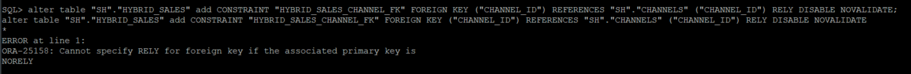

    Check the constraints associated with the CHANNELS table.

    ````
	<copy>
    select constraint_name, constraint_type, table_name, rely
    from user_constraints where table_name='CHANNELS';
    </copy>
    ````

    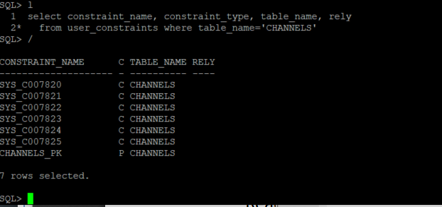

4.  Place the CHANNELS_PK constraint in RELY state.

	````
	<copy>
    alter table "SH"."CHANNELS" modify constraint CHANNELS_PK rely;
    </copy>
    ````

    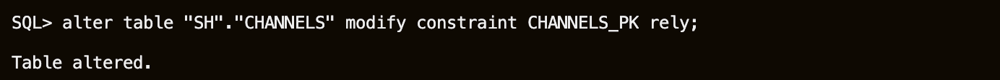

5.  Confirm the constraint state.

    ````
	<copy>
    select constraint_name, constraint_type, table_name, rely
    from user_constraints where table_name='CHANNELS';
    </copy>
    ````

    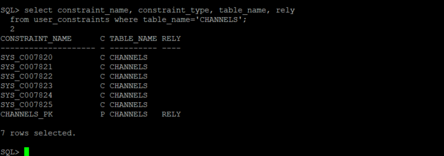

6.  Add the RELY Foreign Key constraint on the HYBRID\_SALES table.

    ````
	<copy>
	alter table "SH"."HYBRID_SALES" add CONSTRAINT "HYBRID_SALES_CHANNEL_FK" FOREIGN KEY ("CHANNEL_ID") REFERENCES "SH"."CHANNELS" ("CHANNEL_ID") RELY DISABLE NOVALIDATE;
    </copy>
    ````

    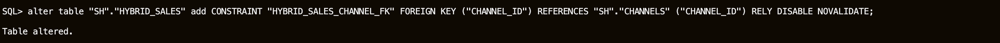

    Additional foreign key constraints from the original SALES table could be added to the HYBRID_SALES table using the same methodology.

## Task 5:  Compare internal and external partition operations

Hybrid Partitioned Tables support many partition level operations, including:
-	Creating a single level RANGE and LIST partitioning methods
-   Using ALTER TABLE .. DDLs such as ADD, DROP and RENAME partitions
-   Modifying for external partitions the location of the external data sources at the partition level
-   Altering an existing partitioned internal table to a hybrid partitioned table containing both internal and external partitions
-   Changing the existing location to an empty location resulting in an empty external partition
-   Creating global partial non-unique indexes on internal partitions
-	Creating materialized views that include external partitions in QUERY\_REWRITE\_INTEGRITY stale tolerated mode only
-	Full partition wise refreshing on external partitions
-   DML trigger operations on a hybrid partitioned table on internal partitions

1.  The first thing to notice is that data is already stored in the external partitions.

    ````
    <copy>
	--QUERY

	select count(*) from HYBRID_SALES partition (SALES_Q1_1998);

    select count(*) from HYBRID_SALES partition (SALES_Q3_1998);

    select count(*) from HYBRID_SALES partition (SALES_Q4_1999);
    </copy>
    ````

    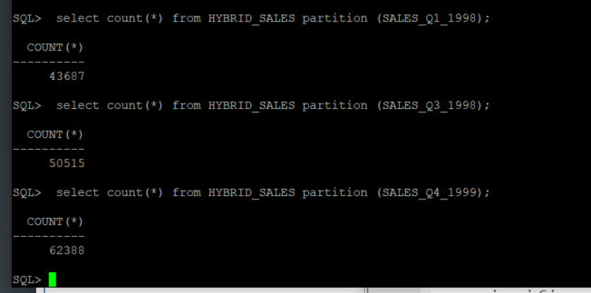

2.  But there is no data in the internal partitions.

    ````
    <copy>
	--QUERY

	select count(*) from HYBRID_SALES partition (SALES_Q1_2000);

    select count(*) from HYBRID_SALES partition (SALES_Q3_2002);
    </copy>
    ````

    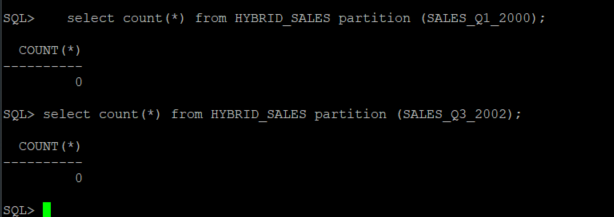

3.  You can insert rows into internal partitions from the original SALES table. Using the partition extension clause PARTITION (partition\_name), we can specify the name of the partition within the SALES table from which we want to retrieve data, in order to populate a given internal partition.

    ````
    <copy>
    insert into HYBRID_SALES (PROD_ID, CUST_ID, TIME_ID, CHANNEL_ID, PROMO_ID, QUANTITY_SOLD, AMOUNT_SOLD)
     select PROD_ID,CUST_ID,TIME_ID,CHANNEL_ID,PROMO_ID,QUANTITY_SOLD,AMOUNT_SOLD from
     SALES partition (SALES_Q1_2000);

	commit;
    </copy>
    ````

    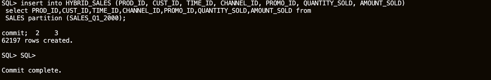

4.  Confirm the data was added.

    ````
    <copy>
    select count(*) from HYBRID_SALES partition (SALES_Q1_2000);
    </copy>
    ````

    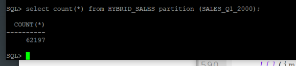

5.  Insert records into the new table. Verify individual records in the HYBRID\_SALES table, filtering on PROD\_ID (product id) and CUST\_ID (customer id).

    ````
    <copy>
    select * from HYBRID_SALES where PROD_ID = 136 and CUST_ID = 6033;
    </copy>
    ````

    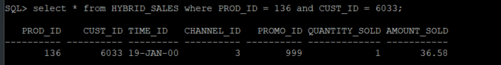

6.  Insert data into the new table. Notice that this will insert into an internal partition.

    ````
    <copy>
	insert into HYBRID_SALES (PROD_ID, CUST_ID, TIME_ID, CHANNEL_ID, PROMO_ID, QUANTITY_SOLD, AMOUNT_SOLD)
    values (136, 6033, TO_DATE('2000-02-01 00:00:00', 'YYYY-MM-DD HH24:MI:SS'), 3, 999, 2, 16.58);

    commit;
    </copy>
    ````

    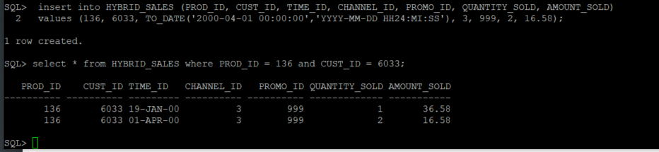

7.  We can also read data from an external partition.

    ````
    <copy>
    select * from HYBRID_SALES where PROD_ID = 13 and CUST_ID = 987;
    </copy>
    ````

    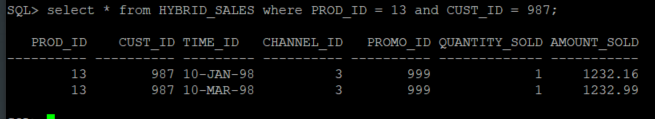

8.  However, if we try to insert or update data in an external partition, we get an error. Data in external partitions cannot be modified using traditional commands, it is as if we have specified the READ ONLY clause at the partition level in the CREATE TABLE statement.

    ````
    <copy>
    insert into HYBRID_SALES (PROD_ID, CUST_ID, TIME_ID, CHANNEL_ID, PROMO_ID, QUANTITY_SOLD, AMOUNT_SOLD)
     values (13, 987, TO_DATE('1998-04-15 00:00:00', 'YYYY-MM-DD HH24:MI:SS'), 3, 999, 2, 232.16);
    </copy>
    ````

    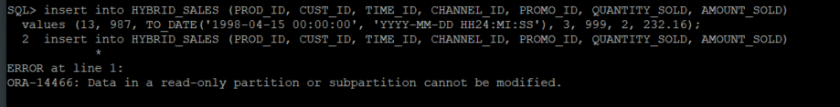

9.  An ALTER TABLE statement can not enable read-write mode on an external partition.

    ````
    <copy>
    alter table HYBRID_SALES modify partition SALES_Q2_1998 read write;
    </copy>
    ````

    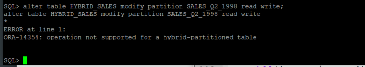

10. Only data in internal partitions can be updated or inserted.

    ````
    <copy>
    insert into HYBRID_SALES (PROD_ID, CUST_ID, TIME_ID, CHANNEL_ID, PROMO_ID, QUANTITY_SOLD, AMOUNT_SOLD)
    values (13, 987, TO_DATE('2003-04-15 00:00:00', 'YYYY-MM-DD HH24:MI:SS'), 3, 999, 2, 232.16);

    commit;
    </copy>
    ````

    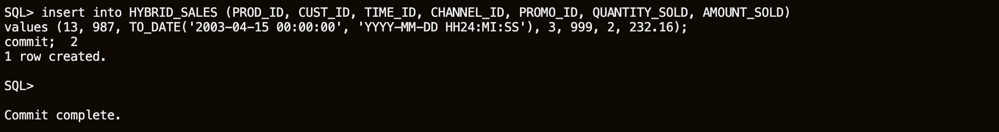

11. While queries can read and join data from both internal and external partitions.

    ````
    <copy>
    select * from HYBRID_SALES where PROD_ID = 13 and CUST_ID = 987;
    </copy>
    ````

    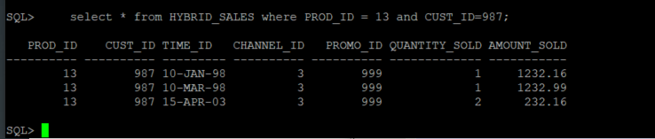

## Task 6: Gathering Statistics

1.  Gathering schema statistics for schemas with Hybrid Partitioned Tables is performed in the same way as usual.

    ````
    <copy>
    BEGIN
      DBMS_STATS.gather_schema_stats (
       ownname          => 'SH',
       cascade          => TRUE,
       options          => 'GATHER AUTO');
    END;
    /
    </copy>
    ````

	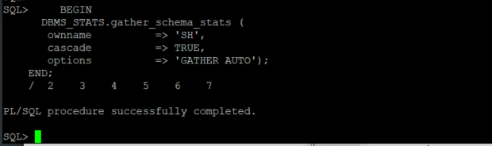

2.  Verify the tables in SALES HISTORY schema: the number of rows, partitioned or not, and if partitioned are they using Hybrid Partitioning.

    ````
    <copy>
    SET LINESIZE 120

    col TABLE_NAME format a27

	select TABLE_NAME, NUM_ROWS, PARTITIONED, HYBRID from USER_TABLES;

    </copy>
    ````

	

## Conclusion

In this lab, you had an opportunity to try out Hybrid Partitioning.

Oracle hybrid partitioned tables combine classical internal partitioned tables with Oracle external partitioned tables to form a more general partitioning called hybrid partitioned tables.

Hybrid partitioned tables enable you to easily integrate internal partitions and external partitions (those residing on sources outside the database) into a single partition table. Using this feature also enables you to easily move non-active partitions to external files for a cheaper storage solution.

Partitions of hybrid partitioned tables can reside on both Oracle tablespaces and external sources, such as Linux files with comma-separated values (CSV) records or files on Hadoop Distributed File System (HDFS) with Java server. Hybrid partitioned tables support all existing external table types for external partitions: ORACLE\_DATAPUMP, ORACLE\_LOADER, ORACLE\_HDFS, ORACLE\_HIVE. External table types for external partitions use the following access driver types:

- ORACLE\_DATAPUMP
- ORACLE\_LOADER
- ORACLE\_HDFS
- ORACLE\_HIVE

## **Acknowledgements**

- **Author** - Valentin Tabacaru, Database Product Management, Oracle PTS
- **Contributors** - Troy Anthony, Anoosha Pilli,  Dylan McLeod
- **Last Updated By/Date** - Kay Malcolm, August 2020
