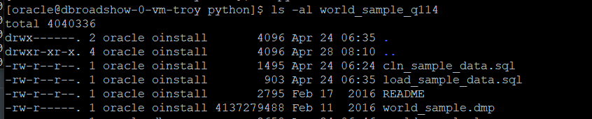
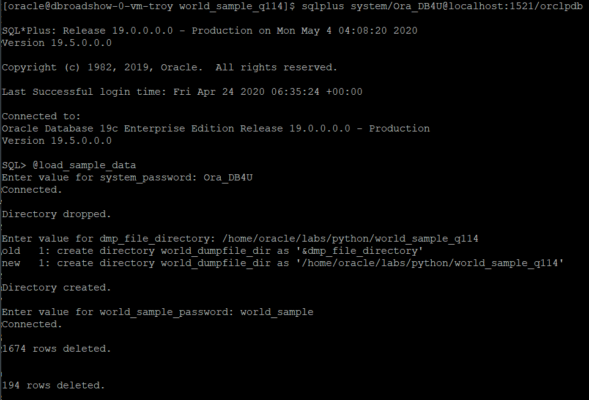
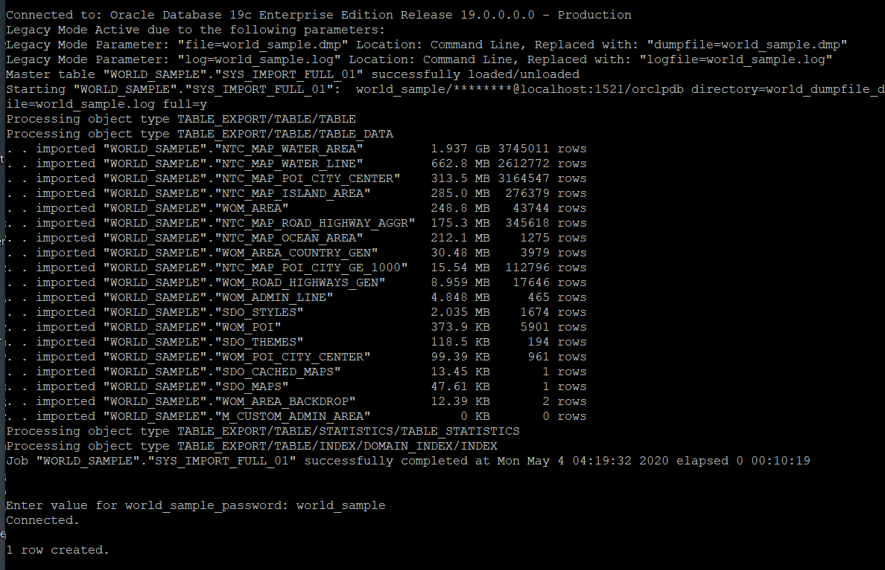
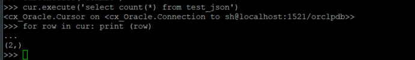
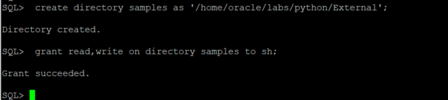
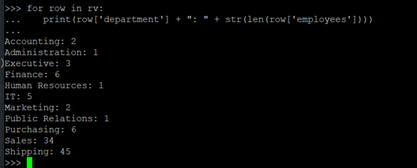

# Python Programming

## Introduction

Oracle Spatial and Graph supports the object-relational model for representing geometries. This model stores an entire geometry in the Oracle native spatial data type for vector data, SDO_GEOMETRY. An Oracle table can contain one or more SDO_GEOMETRY columns. The object-relational model corresponds to a "SQL with Geometry Types" implementation of spatial feature tables in the Open GIS ODBC/SQL specification for geospatial features.

The benefits provided by the object-relational model include:

    Support for many geometry types, including arcs, circles, compound polygons, compound line strings, and optimized rectangles

    Ease of use in creating and maintaining indexes and in performing spatial queries

    Index maintenance by the Oracle database

    Geometries modeled in a single column

Oracle Spatial and Graph is designed to make spatial data management easier and more natural to users of location-enabled applications and geographic information system (GIS) applications. Once spatial data is stored in an Oracle database, it can be easily manipulated, retrieved, and related to all other data stored in the database.

A common example of spatial data can be seen in a road map. A road map is a two-dimensional object that contains points, lines, and polygons that can represent cities, roads, and political boundaries such as states or provinces. A road map is a visualization of geographic information. The location of cities, roads, and political boundaries that exist on the surface of the Earth are projected onto a two-dimensional display or piece of paper, preserving the relative positions and relative distances of the rendered objects.

The data that indicates the Earth location (such as longitude and latitude) of these rendered objects is the spatial data. When the map is rendered, this spatial data is used to project the locations of the objects on a two-dimensional piece of paper. A GIS is often used to store, retrieve, and render this Earth-relative spatial data.

In the previous lab you have seen how easy it is to use Python against the Oracle Database. Python can also take advantage of other features of the Oracle Database. In this lab we will work with Oracle spatial objects in Python. Python is also able to work with SDO_GEOMETRY objects stored in the Oracle 19c database.

### Objectives

-   Learn how to use Python with Spatial Data in the Oracle Database

### Prerequisites

This lab assumes you have completed the following labs:
* Lab: Login to Oracle Cloud
* Lab: Generate SSH Key
* Lab: Environment Setup
* Lab: Sample Schema Setup
* Lab: Python Programming


## Task 1: Download HERE archive world sample data

You will need to download the HERE (Formerly NAVTEQ) archive, a sample geographical dataset available from the Oracle Technology Network website: http://www.oracle.com/technetwork/middleware/mapviewer/downloads/navteq-lic-168395.html. Download the World Sample Data Bundle.
**Note:** The World Sample Data Bundle (world_sample_q114.zip) is 1.5 GB.

1. Extract the World Sample Bundle in the directory /home/opc/labs/python

        ````
        <copy>
        cd /home/opc/labs/python

        unzip world_sample_q114.zip
        </copy>
        ````

2.	The directory created from the zip file is named *world_sample_q114* and the directory will contain a dump file, a README and 2 SQL files

````
    ls -al /home/opc/labs/python/world_sample_q114
````



3. Create the user *world_sample* in the database and a DIRECTORY object named *world_sample*
Connect to the *orclpdb* database as the SYS user
````
    sqlplus sys/Ora_DB4U@localhost:1521/orclpdb as sysdba
````
and create the following user and directory

````
<copy>
CREATE USER world_sample IDENTIFIED BY world_sample DEFAULT TABLESPACE example TEMPORARY TABLESPACE temp;
GRANT connect, resource to world_sample;
GRANT UNLIMITED TABLESPACE TO world_sample;
CREATE DIRECTORY world_dupfile_dir AS '/home/oracle/labs/python/world_sample_q114';
GRANT READ, WRITE ON DIRECTORY world_dumpfile_dir TO world_sample;
</copy>
````

**Note:** If the world sample zip file creates a different directory name than *world_sample_q114*, please modify the CREATE DIRECTORY statement above

## Task 2: Edit the two SQL files and run load_sample_data.sql from SQL*Plus:

1. The SQL files *cln_sample_data.sql* and *load_sample_data.sql* need to be edited:

in cln_data_sample.sql replace
    connect world_sample/&world_sample_password
with
````
<copy>
connect world_sample/"&world_sample_password"@localhost:1521/orclpdb
</copy>
````

In load_sample_data.sql replace

    connect system/&system_password

    drop directory world_dumpfile_dir;
    create directory world_dumpfile_dir as '&dmp_file_directory';


    @@cln_sample_data.sql

    host impdp world_sample/world_sample directory=world_dumpfile_dir file=world_sample.dmp log=world_sample.log full=y

    connect world_sample/&world_sample_password

with
````
<copy>
connect system/"&system_password"@localhost:1521/orclpdb

drop directory world_dumpfile_dir;
create directory world_dumpfile_dir as '&dmp_file_directory';


@@cln_sample_data.sql

host impdp world_sample/world_sample@localhost:1521/orclpdb directory=world_dumpfile_dir file=world_sample.dmp log=world_sample.log full=y

connect world_sample/"&world_sample_password"@localhost:1521/orclpdb
</nocopy>
````

2. Connect to sqlplus as the SYSTEM user and run load_sample_data.sql. Input the SYSTEM password 'Ora_DB4U' (no quotes) and the path to world_dumpfile_dir '/home/oracle/labs/python/world_sample_q114' (no quotes) and the password for the user world_sample 'world_sample' (no quotes), twice

````
<copy>
cd /home/oracle/labs/python/world_sample_q114

sqlplus system/Ora_DB4U@localhost:1521/orclpdb

SQL>> @load_sample_data

</copy>
````





There are 3745011 rows inserted in to the table NTC_MAP_WATER_AREA table.


## Task 3: Points in a Polygon

Two-dimensional points are elements composed of two ordinates, X and Y, often corresponding to longitude and latitude. Line strings are composed of one or more pairs of points that define line segments. Polygons are composed of connected line strings that form a closed ring, and the area of the polygon is implied. For example, a point might represent a building location, a line string might represent a road or flight path, and a polygon might represent a state, city, zoning district, or city block.


Define a rectangular polygon with vertices at the Geografisk Midpunkt, near Slusegardens Molle in Denmark (latitude 57.0, longitude 15.0) and the Gorges du Haut Lison hiking trail in France (latitude 47.0, longitude 6.0). Identify all the points contained within this Polygon

1.  Become the Oracle user and launch the Python interpreter

````
<copy>
sudo su - oracle
$. oraenv
    ORACLE_SID = [ORCL] ? ORCLPDB
   The Oracle base remains unchanged with value /u01/app/oracle
$ python3
   >>>
</copy>
````
2.  Connect to the Oracle database and execute a statement that returns all the points within a defined Polygon
**Note:**  Oracle Locator and Oracle Spatial require that you place the longitude value before the latitude value

````
<copy>
import cx_Oracle

con = cx_Oracle.connect('world_sample/world_sample@localhost:1521/orclpdb')

cur=con.cursor()

res = cur.execute('select * from table( sdo_pointinpolygon(cursor(select p.geometry.sdo_point.x lon, p.geometry.sdo_point.y lat, poi_id id, name from wom_poi p), sdo_geometry (2003,8307,null,mdsys.sdo_elem_info_array(1, 1003, 3),mdsys.sdo_ordinate_array(6.0, 47.0, 15.0, 55.0)),0.05))')

for r in res: print(r)

cur.close()

con.close()
</copy>
````   


## Task 4: Finding Nearest Neighbours

Find the 5 nearest major cities to the The Chocolate Lily Bed and Breakfast (latitude -36.93, longitude 144.34)

1.  Connect to the Oracle database as the world_sample user and identify the 5 cities nearest the specified coordinates


````
<copy>

import cx_Oracle

con = cx_Oracle.connect('world_sample/world_sample@localhost:1521/orclpdb')

cur = con.cursor()

cur.execute('select official_name from wom_poi_city_center p where sdo_nn(p.geometry, sdo_geometry(2001,8307, sdo_point_type(144.34, -36.93, null), null, null), \'sdo_num_res=5\') = \'TRUE\'')

for row in cur:
   print (row)

cur.close()

con.close()
</copy>    
````


## Task 5: Display Points on a Map with PYTHON

Python allows for displaying geo-coordinates on a map. To illustrate this capability, we will use the Python’s Basemap library and the list of points generated in the Points in Polygon exercise completed in Step 2.

1. The following libraries are required for map support in Python:
   matplotlib 1.0.0 or later
   basemap-1.0.7 or later
   numpy 1.2.1 or later

Install these libraries as the *opc* user:

````
<copy>
sudo yum install geos.x86_64
sudo yum install geos-devel
sudo yum install gcc-c++
sudo yum install python-devel.x86_64
sudo yum install numpy
</copy>
````

For this exercise we also need the basemap package. The latest version of basemap package can be retrieved from: http://sourceforge.net/projects/matplotlib/files/matplotlib-toolkits/, but the one we have is good enough. Extract the basemap source tar.gz file to a directory under Downloads.

````
import cx_Oracle

con = cx_Oracle.connect('sh/Ora_DB4U@localhost:1521/orclpdb')

cur = con.cursor()

cur.execute('create table test_json (id number generated always as identity, json_data clob)')

````


2. Query the table data.

**Note** the three spaces in front of the *‘print row’* command. These three spaces are a code indentation that indicate a block of code in Python, you must indent each line of the block by the same amount. In this case, ‘print row’ is the block of code we execute in the loop ‘for row in cur:’. Make sure you have those spaces when you execute the command. Hit Enter to close the block of code in the loop.

````
<copy>
cur.execute('select * from test_json')
for row in cur:
   print (row)       
</copy>
````


Python returns an empty row

3. Insert a row in to the table

````
cur.execute('insert into test_json(json_data) values (\'{rating: "3.0 out of 5 stars",title: "Quality product",customer_name: "Geir Gjorven",date: "on 29 January 2020",colour: "Colour Name: Envoy colour",purchase_type: "Verified Purchase",comment: "Good service"}\')')

cur.execute('commit')
````


4. Query the table again

````
<copy>
cur.execute('select * from test_json')
for row in cur:
   print (row)       
</copy>
````

We retrieve the LOB pointer

5. Retrieve the *rating* portion of the JSON document

````
<copy>
cur.execute('select json_value(json_data, \'$.rating\') from test_json')       
</copy>
````

6. Print the current cursor (the rating information)
````
<copy>
for row in cur:
   print (row)       
</copy>
````


7. Retrieve the *comment titles*

````
<copy>
cur.execute('select json_value(json_data, \'$.title\') from test_json')

for row in cur:
   print (row)       
</copy>
````


7. JSON_VALUE and JSON_QUERY
To retrieve a single value of a JSON document, the JSON_VALUE function was used. JSON_VALUE retrieves only one value. JSON_VALUE uses dot-notation syntax – JSON Path Expression – to navigate through a JSON document hierarchy. The dot-notation syntax is a table alias (represented by the ‘$’ sign) followed by a dot (.) and the name of a JSON column we want to retrieve (or more if the document structure includes nested values).
Every cursor.execute() call has to be committed to the database with a ‘commit’ statement. Finally, the results of the query are retrieved by a simple print row call.
Now try retrieving the complete JSON document using JSON_VALUE:

````
<copy>
cur.execute('select json_value(json_data, \'$\') from test_json')

for row in cur:
   print (row)       
</copy>
````


You will notice that no records are returned even though we know they have been populated with data. This is due to JSON_VALUE being able to work only with scalar SQL data types (that is, not an object or collection data type). To retrieve fragments of a JSON document, JSON_QUERY has to be used:

````
<copy>
cur.execute('select json_query(json_data, \'$\') from test_json')

for row in cur:
   print (row)       
</copy>
````


8. Is it JSON? Or NOT?

Insert a second row in to the  *test_json* table in a non-JSON formatted

````
<copy>
cur.execute('insert into test_json (json_data) values (\'<rating> 3.0 out of 5 stars </rating> <title> Quality product </title> <customer_name> "Geir Gjorven </customer_name> <date> on 29 September 2014 </date> <colour> Colour Name: Envoy colour </colour> <purchase_type> Verified Purchase </purchase_type> <comment> Good service </comment>\')')

cur.execute('commit')
</copy>
````
The record is committed to the database without an error because the table does not specifically define its input has to be of JSON format. Check that the record has been added to the table by counting the number of rows *test_json*:

````
<copy>
cur.execute('select count(*) from test_json')

for row in cur: print (row)       

</copy>
````


You can filter out records that do not follow JSON format with IS JSON and IS NOT JSON SQL extensions. First, check if there are any non-JSON records in the table:
````
<copy>
cur.execute('select id from test_json where json_data IS NOT JSON')

for row in cur: print (row)       
</copy>
````

**Note** that the index number may be different in the query executed, in which case change the id from *2* specified in the delete statement following.
Delete the non-JSON row(s) from *test_json*

````
<copy>
cur.execute('delete from test_json where id=2')

cur.execute('commit')
</copy>
````

9. Close the cursor and close the connection
````
<copy>
cur.close()

con.close()
</copy>
````
## Task 6: Load JSON data into a table using PYTHON
It is likely that rather than writing one JSON row at a time to the database, you will want to load many JSON records at once. In this example we will leverage Oracle External Tables functionality to do this.

In the following section we will create a new JSON external table that points to a JSON document and query the records from Python’s shell.

The access driver requires that a DIRECTORY object is defined to specify the location from which to read and write files. A DIRECTORY object assigns a name to a directory name on the file system. For example, the following statement creates a directory object named downloads that is mapped to a directory located at */home/oracle/labs/python/External*. Usually, all directories are created by the SYSDBA user, DBAs, or any user with the CREATE ANY DIRECTORY privilege.

**Note** If you have already completed the HYBRID PARTITIONINING lab the *SH* user has been granted the CREATE ANY DIRECTORY privilege.

1. Connect to the database as SYS and create a new DIRECTORY object
````
sqlplus sys/Ora_DB4U@localhost:1521/orclpdb as sysdba
````

````
<copy>
create directory samples as '/home/oracle/labs/python/External';

grant read,write on directory samples to sh;
</copy>
````


2. Open the python interpreter and connect to the Oracle database as the SH user. Open a cursor

````
python3
````

````
import cx_Oracle

con = cx_Oracle.connect('sh/Ora_DB4U@localhost:1521/orclpdb')

cur=con.cursor()
````
3. To create an external table pointing to the JSON document *departments.dmp*, execute the following in the Python shell:

````
<copy>
cur.execute('create table empdept (deptdoc clob) organization external (type oracle_loader default directory samples access parameters (records delimited by newline nobadfile nologfile fields (doc char(50000))) location (samples:\'departments.dmp\')) parallel reject limit unlimited')
</copy>
````

4. Query the JSON table retrieving all the documents
````
<copy>
cur.execute('select json_query(deptdoc, \'$\') from empdept')

for row in cur: print (row)
</copy>
````


5. The data in the file *departments.dmp* is not a single JSON document. Each row is JSON data consisting of a *Department* object which contains an array of *employees* objects. Each employees object has a Name, a Job Title and a Hire Date. The Oracle database can manipulate JSON directly, as you have seen with the SQL/JSON operator json_query. Other operators include json_value, json_table and so on.

Use Python to retrieve the data from our table, load it in to an array and print the first department name (the indentation is important):

````
<copy>
rv = []

cur.execute('select to_char(deptdoc) from empdept')

for r in cur:
    rv.append(loads(r[0]))

print(rv[0]['department'])

for row in cur: print(row)
</copy>
````


6. Now determine how many employees there are per department:
````
<copy>
for row in rv:
   print (row['department'] + ": " + str(len(row['employees'])))


</copy>
````

## Conclusion

In this lab you had an opportunity to try out connecting Python in the Oracle Database.
The guide shows the Developer how to use the Python Interpreter to interact with the Oracle Database through the Python API. We start by introducing Python and then review its installation requirements and tools required to run the demo. TThe Python API cx_Oracle is an open source Python package that Oracle contributes to. It is used to access an Oracle Database from Python.
The second part of the guide goes through a number of demo cases available through the Python API, including a simple Hello World application, and retrieving records from the Oracle Database using the cursor technology. There is a module on working with JSON data: loading the records to the database and querying them.
An additional lab on using Python with Spatial data is also available elsewhere in this module.

## Acknowledgements

- **Author** - Troy Anthony
- **Last Updated By/Date** - Troy Anthony, April 2020

