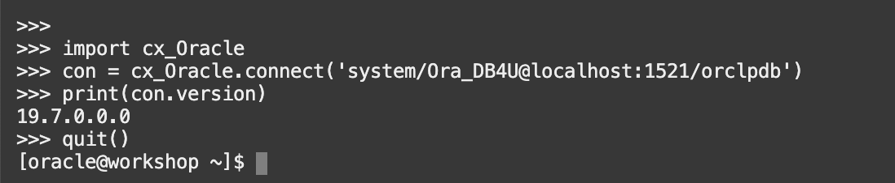
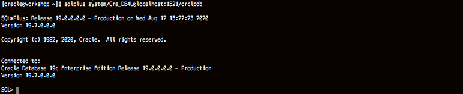

# Python Programming

## Introduction

In this lab, you will explore the various capabilities available when developing with Python against the Oracle Database.

Estimated Lab Time:  20 minutes

### About Python and Oracle

PL/SQL is ideal for programming tasks within Oracle Database. Most Oracle professionals, however, aren't confined to working strictly within the database itself.

Python is easy to use but also easy to use well, producing code that is readable and well organized. This way, when you return to a piece of code months after it was written, you can understand it, modify it, and reuse it. Python's clean, elegant syntax is sometimes called "executable pseudocode," for its nearly self-documenting appearance. It is highly object-oriented and makes it easy to learn and follow a good programming style, even for those of us without formal training in software engineering. Its smooth learning curve makes it appeal to novices and experts alike.

Python's capabilities span the whole range of software needs; the language's simplicity doesn't imply shallowness or narrowness. You won't run up against gaps in Python's abilities that send you looking for a third language.

Python is open-source, cross-platform, and free of cost. There's no excuse not to give Python a try!

To learn about how to connect to an oracle database from python, watch the video below.

[](youtube:C9op6I-4WM0)

### Objectives

-   Learn how to use Python in the Oracle Database
-   Learn how to validate Python operations

### Prerequisites

This lab assumes you have completed the following labs:
* Lab: Login to Oracle Cloud
* Lab: Generate SSH Key
* Lab: Environment Setup
* Lab: Sample Schema Setup

## Task 1: Install Python

Python comes preinstalled on most Linux distributions, and it is available as a package on others. The Python packages can be obtained from the software repository of your Linux distribution using the package manager.

1.  Open up the Oracle Cloud shell (or terminal of your choice) and ssh into your compute instance as the *opc* user.

    ````
    ssh -i ~/.ssh/<sshkeyname> opc@<Your Compute Instance Public IP Address>
    ````

2.  Check if python3 has been installed by running the command.

    ````
    <copy>
    python -V
    </copy>
    ````

3.  If Python is not installed then install it. There is no harm in running this command multiple times, the system will either install packages or let you know they are already installed.

    ````
    <copy>
    sudo yum -y install python3 python3-tools
    </copy>
    ````

    

    

## Task 2: The Python Interpreter

There are several ways to execute Python code. In this step, we start with two examples on how to execute Python code from the command line. The first example executing code from the command prompt i.e. executing commands directly in the interpreter. The second example to save your code in a .py file and invoke the interpreter to execute the file.

1.  To execute code from command line open the Python command-line editor and type the following commands, one by one (each line is one command).

    ````
    <copy>
    python3
    var1 = "Hello World"
    var1
    </copy>
    'Hello World'
    ````

    

    To quit from the Python interpreter type *quit()* in the command-line editor.

2.  To create a simple script, open up a text editor (like vi) as *vi test.py* and enter the following script.

    ````
    <copy>
    var1 = "Hello World"
    print(var1)
    </copy>
    ````

3.  Save the file as *test.py* in the /home/oracle directory.

    ````
    <copy>
    $ python3 /home/oracle/test.py
    </copy>
    ````

    

## Task 3: Install Python Oracle module and connect to a database

*cx\_Oracle* is a python module that enables access to Oracle databases. This module is supported by Oracle 11.2 and higher and works for both Python 2.X and 3.X. There are various ways in which cx\_Oracle can be installed. In this example, we will use pip (installed by default for python 3.4 and up). For more ways to install cx\_Oracle (like yum) check the documentation on [https://yum.oracle.com/oracle-linux-python.html#Aboutcx_Oracle](https://yum.oracle.com/oracle-linux-python.html#Aboutcx_Oracle "documentation").

1.  Since our client libraries are installed in our VM under the oracle user, we will now 'sudo' into the oracle user. (If you have an environment that does not have client libraries accessible to the user running the python3 script, install the Oracle instant client as described in the documentation.) Become the *Oracle* user.

    ````
    <copy>
    sudo su - oracle
    </copy>
    ````
    

2.  Install the *cx\_Oracle* module using python3 and pip for the oracle user.

    ````
    <copy>
    python3 -m pip install --user cx_Oracle
    </copy>
    ````

    

3.  Test your install by launching the python console and list the available modules.

    ````
    <copy>
    . oraenv
    </copy>
    ORACLE_SID = [ORCL] ? ORCL
    The Oracle base remains unchanged with value /u01/app/oracle
    ````
    

    ````
    <copy>
    python3
    help('modules')
    </copy>
    ````

    This command will show you a list of installed modules that should include the cx\_Oracle module we installed in the previous step.

    

4.  Connect to the Oracle database and print the version of the database via python. (This confirms you are connected to an Oracle instance and returns the database version.)

    ````
    <copy>
    import cx_Oracle
    con = cx_Oracle.connect('system/Ora_DB4U@localhost:1521/orclpdb')
    print(con.version)
    </copy>
    19.7.0.0.0
    <copy>
    quit()
    </copy>
    ````

    

## Task 4: Querying the Oracle database

Retrieving records from Oracle database using cursors is a simple as embedding a SQL statement within a cursor().execute statement. For this example, we will use an existing table from the *SH* sample schema.

1.  Create a script called /home/oracle/db_connect.py with the following contents.

    ````
    <copy>
    import cx_Oracle

    con = cx_Oracle.connect('sh/Ora_DB4U@localhost:1521/orclpdb')

    cur = con.cursor()

    cur.execute('select cust_first_name, cust_last_name,  cust_street_address, cust_city from customers where rownum < 100')

    for row in cur:
            print (row)

    cur.close()

    con.close()
    </copy>
    ````

2.  Execute the script and check the result.

    ````
    <copy>
    python3 /home/oracle/db_connect.py
    </copy>
    ````

    The result should be a list of customers.

    

Querying Oracle database from Python leverages cursor technology and follows the standard cursor execution cycle: opening a cursor, the fetching stage, and closing a cursor to flush the allocated memory. The cursor syntax cx_Oracle uses can be found under: [http://cx-oracle.readthedocs.org/en/latest/index.html](https://cx-oracle.readthedocs.io/en/latest/api_manual/cursor.html#cursor-object "documentation")

Retrieving records from the Oracle database using cursors is a simple as embedding the SQL statement within the cursor().execute statement.

**Note**: Closing the cursor is considered good practice. Oracle will automatically close the cursor after the execution of its parent block finishes.

## Task 5: Query a JSON table from PYTHON

This section provides detail on how to work with JSON data in Oracle Database 19c using Python’s interface. The exercises include creating a table in the pluggable database ORCLPDB, loading data into the table, validating documents with IS JSON check, and querying data from Python.

1.  Open the Python interpreter and enter the following statements one by one to create a table to hold our data.

    ````
    <copy>
    python3
    </copy>
    ````

    

    ````
    <copy>
    import cx_Oracle

    con = cx_Oracle.connect('sh/Ora_DB4U@localhost:1521/orclpdb')

    cur = con.cursor()

    cur.execute('create table test_json (id number generated always as identity, json_data clob)')
    </copy>
    ````

    

2.  Query the table data.

    **Note**: Ensure to have three spaces in front of the *‘print row’* command. These three spaces are a code indentation that indicates a block of code in Python, you must indent each line of the block by the same amount. In this case, ‘print row’ is the block of code we execute in the loop ‘for row in cur:’. Make sure you have those spaces when you execute the command. Hit Enter to close the block of code in the loop.

    ````
    <copy>
    cur.execute('select * from test_json')

    for row in cur:
       print (row)
    </copy>
    ````

    

    Python returns an empty row.

3.  Insert a row into the table.

    ````
    <copy>
    cur.execute('insert into test_json(json_data) values (\'{rating: "3.0 out of 5 stars",title: "Quality product",customer_name: "Geir Gjorven",date: "on 29 January 2020",colour: "Colour Name: Envoy colour",purchase_type: "Verified Purchase",comment: "Good service"}\')')

    cur.execute('commit')
    </copy>
    ````

    

4.  Query the table again.

    ````
    <copy>
    cur.execute('select * from test_json')

    for row in cur:
       print (row)
    </copy>
    ````

    

    We retrieve the LOB pointer.

5.  Retrieve the *rating* portion of the JSON document.

    ````
    <copy>
    cur.execute('select json_value(json_data, \'$.rating\') from test_json')
    </copy>
    ````

    

6.  Print the current cursor (the rating information).

    ````
    <copy>
    for row in cur:
       print (row)
    </copy>
    ````

    

7.  Retrieve the *comment titles*.

    ````
    <copy>
    cur.execute('select json_value(json_data, \'$.title\') from test_json')

    for row in cur:
       print (row)
    </copy>
    ````

    

8.  *JSON\_VALUE* and *JSON\_QUERY*.

    To retrieve a single value of a JSON document, the JSON\_VALUE function was used. JSON\_VALUE retrieves only one value. JSON\_VALUE uses dot-notation syntax – JSON Path Expression – to navigate through a JSON document hierarchy. The dot-notation syntax is a table alias (represented by the ‘$’ sign) followed by a dot (.) and the name of a JSON column we want to retrieve (or more if the document structure includes nested values).

    Every cursor.execute() call has to be committed to the database with a ‘commit’ statement.

    Finally, the results of the query are retrieved by a simple print row call. Now try retrieving the complete JSON document using JSON\_VALUE.

    ````
    <copy>
    cur.execute('select json_value(json_data, \'$\') from test_json')

    for row in cur:
       print (row)
    </copy>
    ````

    

    You will notice that no records are returned even though we know they have been populated with data. This is due to JSON\_VALUE being able to work only with scalar SQL data types (that is, not an object or collection data type). To retrieve fragments of a JSON document, JSON\_QUERY has to be used.

    ````
    <copy>
    cur.execute('select json_query(json_data, \'$\') from test_json')

    for row in cur:
       print (row)
    </copy>
    ````

    

9.  *Is it JSON? Or NOT?*

    Insert a second row into the  *test\_json* table in a non-JSON formatted.

    ````
    <copy>
    cur.execute('insert into test_json (json_data) values (\'<rating> 3.0 out of 5 stars </rating> <title> Quality product </title> <customer_name> "Geir Gjorven </customer_name> <date> on 29 September 2014 </date> <colour> Colour Name: Envoy colour </colour> <purchase_type> Verified Purchase </purchase_type> <comment> Good service </comment>\')')

    cur.execute('commit')
    </copy>
    ````

    

    The record is committed to the database without an error because the table does not specifically define its input has to be of the JSON format. Check that the record has been added to the table by counting the number of rows *test\_json*.

    ````
    <copy>
    cur.execute('select count(*) from test_json')

    for row in cur: print (row)

    </copy>
    ````

    

    You can filter out records that do not follow JSON format with IS JSON and IS NOT JSON SQL extensions. First, check if there are any non-JSON records in the table.

    ````
    <copy>
    cur.execute('select id from test_json where json_data IS NOT JSON')

    for row in cur: print (row)
    </copy>
    ````

    

    **Note**: The index number may be different in the query executed, in which case change the id from *2* specified in the delete statement following.

    Delete the non-JSON row(s) from *test_json*.

    ````
    <copy>
    cur.execute('delete from test_json where id=2')

    cur.execute('commit')
    </copy>
    ````

    

10. Close the cursor and close the connection.

    ````
    <copy>
    cur.close()

    con.close()
    </copy>
    ````

    

## Task 6: Load JSON data into a table using PYTHON

It is likely that rather than writing one JSON row at a time to the database, you will want to load many JSON records at once. In this example, we will leverage Oracle External Tables functionality to do this.

In the following section, we will create a new JSON external table that points to a JSON document and query the records from Python’s shell.

The access driver requires that a DIRECTORY object is defined to specify the location from which to read and write files. A DIRECTORY object assigns a name to a directory name on the file system. For example, the following statement creates a directory object named downloads that is mapped to a directory located at */home/oracle/labs/python/External*. Usually, all directories are created by the SYSDBA user, DBAs, or any user with the CREATE ANY DIRECTORY privilege.

**Note**: If you have already completed the HYBRID PARTITIONING lab the *SH* user has been granted the CREATE ANY DIRECTORY privilege.

You need to create a file-system directory and place a JSON document in this directory.

1. Create a directory as the **oracle** user

    ````
    <copy>
    mkdir -p /home/oracle/labs/python/External
    </copy>
    ````

2. Download a ZIP file containing *departments.dmp* and expand this in the directory you have just created

    ````
    <copy>
    cd /home/oracle/labs/python/External
    wget https://objectstorage.us-ashburn-1.oraclecloud.com/p/jyHA4nclWcTaekNIdpKPq3u2gsLb00v_1mmRKDIuOEsp--D6GJWS_tMrqGmb85R2/n/c4u04/b/livelabsfiles/o/labfiles/deptJSON.zip
    unzip deptJSON.zip
    </copy>
    ````

3.  Connect to the database as SYS and create a new DIRECTORY object.

    ````
    <copy>
    sqlplus sys/Ora_DB4U@localhost:1521/orclpdb as sysdba
    </copy>
    ````
    

    ````
    <copy>
    create directory samples as '/home/oracle/labs/python/External';

    grant read,write on directory samples to sh;
    </copy>
    ````

    

4.  Open the python interpreter and connect to the Oracle database as the *SH* user. Open a cursor.

    ````
    <copy>
    python3
    </copy>
    ````

    ````
    <copy>
    import cx_Oracle

    con = cx_Oracle.connect('sh/Ora_DB4U@localhost:1521/orclpdb')

    cur=con.cursor()
    </copy>
    ````

    

5.  To create an external table pointing to the JSON document *departments.dmp*, execute the following in the Python shell.

    ````
    <copy>
    cur.execute('create table empdept (deptdoc clob) organization external (type oracle_loader default directory samples access parameters (records delimited by newline nobadfile nologfile fields (deptdoc char(5000))) location (\'departments.dmp\')) parallel 5 reject limit unlimited')
    </copy>
    ````

6.  Query the JSON table retrieving all the documents.

    ````
    <copy>
    cur.execute('select json_query(deptdoc, \'$\') from empdept')

    for row in cur: print (row)
    </copy>
    ````

    

7.  The data in the file *departments.dmp* is not a single JSON document. Each row is JSON data consisting of a *Department* object which contains an array of *employees* objects. Each employees object has a Name, a Job Title, and a Hire Date. The Oracle database can manipulate JSON directly, as you have seen with the SQL/JSON operator json\_query. Other operators include json\_value, json\_table, and so on.

    Use Python to retrieve the data from our table, load it into an array, and print the first department name (the indentation is important).

    ````
    <copy>
    from json import loads

    rv = []

    cur.execute('select to_char(deptdoc) from empdept')

    for r in cur:
       rv.append(loads(r[0]))

    print(rv[0]['department'])
    </copy>
    ````

    

8.  Now determine how many employees there are per department.

    ````
    <copy>
    for row in rv:
       print (row['department'] + ": " + str(len(row['employees'])))
    </copy>
    ````

    

## Conclusion

In this lab, you had an opportunity to try out connecting Python in the Oracle Database.
The guide shows the Developer how to use the Python Interpreter to interact with the Oracle Database through the Python API. We start by introducing Python and then review its installation requirements and tools required to run the demo. TThe Python API cx_Oracle is an open-source Python package that Oracle contributes to. It is used to access an Oracle Database from Python.

The second part of the guide goes through a number of demo cases available through the Python API, including a simple Hello World application, and retrieving records from the Oracle Database using the cursor technology. There is a module on working with JSON data: loading the records to the database and querying them.

An additional lab on using Python with Spatial data is also available elsewhere in this module.

## **Acknowledgements**

- **Author** - Troy Anthony
- **Contributors** - Anoosha Pilli, Dylan McLeod, Arabella Yao
- **Last Updated By/Date** - Troy Anthony, November 2021

