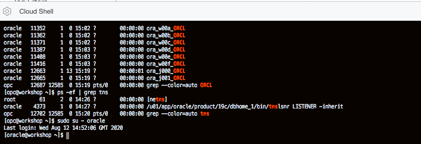
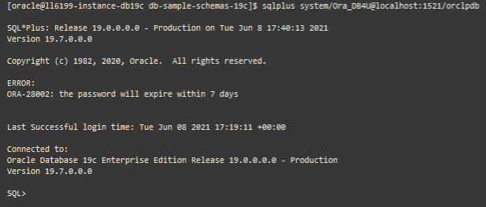
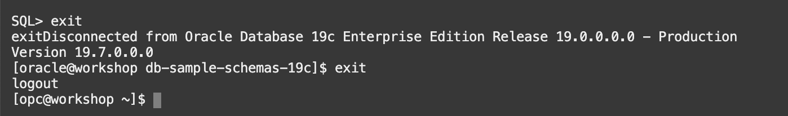

# Sample Schema Setup

## Introduction
This lab will show you how to setup your database schemas for the subsequent labs.

Estimated Time: 10 minutes

### Objectives
 
In this lab, you will setup sample schema:
* Set the environment variables 
* Get the Database sample schemas and unzip them
* Install the Sample Schemas

### Prerequisites 
This lab assumes you have:

* A LiveLabs Cloud account and assigned compartment
* The IP address and instance name for your DB19c Compute instance
* Successfully logged into your LiveLabs account
* A Valid SSH Key Pair

## Task: Install Sample Data

In this step, you will install a selection of the Oracle Database Sample Schemas.  For more information on these schemas, please review the Schema agreement at the end of this lab.

By completing the instructions below the sample schemas **SH**, **OE**, and **HR** will be installed. These schemas are used in Oracle documentation to show SQL language concepts and other database features. The schemas themselves are documented in Oracle Database Sample Schemas [Oracle Database Sample Schemas](https://www.oracle.com/pls/topic/lookup?ctx=dblatest&id=COMSC).

1. Run a *whoami* to ensure the value *oracle* comes back.)

    Note: If you are running in Windows using putty, ensure your Session Timeout is set to greater than 0.
    ```
    <copy>whoami</copy>
    ```

2. If you are not the oracle user, log back in:
    ````
    <copy>
    sudo su - oracle
    </copy>
    ````
    
    

4.  Set the environment variables to point to the Oracle binaries.  When prompted for the SID (Oracle Database System Identifier), enter **ORCL**.
    ````
    <copy>
    . oraenv
    </copy>
    ORCL
    ````
    

5. Get the Database sample schemas and unzip them. Then set the path in the scripts.

    ````
    <copy>
    wget https://github.com/oracle/db-sample-schemas/archive/v19c.zip
    unzip v19c.zip
    cd db-sample-schemas-19c
    perl -p -i.bak -e 's#__SUB__CWD__#'$(pwd)'#g' *.sql */*.sql */*.dat
    </copy>
    ````

    

6.  Login using SQL*Plus as the **oracle** user.  

    ````
    <copy>
    sqlplus system/Ora_DB4U@localhost:1521/orclpdb
    </copy>
    ````
    

7.  Install the Sample Schemas by running the script below.

    ````
    <copy>
    @mksample Ora_DB4U Ora_DB4U Ora_DB4U Ora_DB4U Ora_DB4U Ora_DB4U Ora_DB4U Ora_DB4U users temp /home/oracle/db-sample-schemas-19c/ localhost:1521/orclpdb
    </copy>
    ````

    

8. Exit SQL Plus and exit the oracle user to return to the opc user.

    ```
    <copy>exit
    exit
    </copy>
    ```

    

Congratulations! Now you have the environment to run the labs.

You may now *proceed to the next lab*.

## Oracle Database Sample Schemas Agreement

Copyright (c) 2019 Oracle

Permission is hereby granted, free of charge, to any person obtaining a copy of this software and associated documentation files (the "Software"), to deal in the Software without restriction, including without limitation the rights to use, copy, modify, merge, publish, distribute, sublicense, and/or sell copies of the Software, and to permit persons to whom the Software is furnished to do so, subject to the following conditions:

The above copyright notice and this permission notice shall be included in all copies or substantial portions of the Software.

*THE SOFTWARE IS PROVIDED "AS IS", WITHOUT WARRANTY OF ANY KIND, EXPRESS OR IMPLIED, INCLUDING BUT NOT LIMITED TO THE WARRANTIES OF MERCHANTABILITY, FITNESS FOR A PARTICULAR PURPOSE AND NONINFRINGEMENT. IN NO EVENT SHALL THE AUTHORS OR COPYRIGHT HOLDERS BE LIABLE FOR ANY CLAIM, DAMAGES OR OTHER LIABILITY, WHETHER IN AN ACTION OF CONTRACT, TORT OR OTHERWISE, ARISING FROM, OUT OF OR IN CONNECTION WITH THE SOFTWARE OR THE USE OR OTHER DEALINGS IN THE SOFTWARE.*

## **Acknowledgements**

- **Author** - Troy Anthony, DB Product Management
- **Contributors** - Anoosha Pilli, Kay Malcolm, Madhusudhan Rao
* **Last Updated By/Date** -  Madhusudhan Rao, Feb 2022 