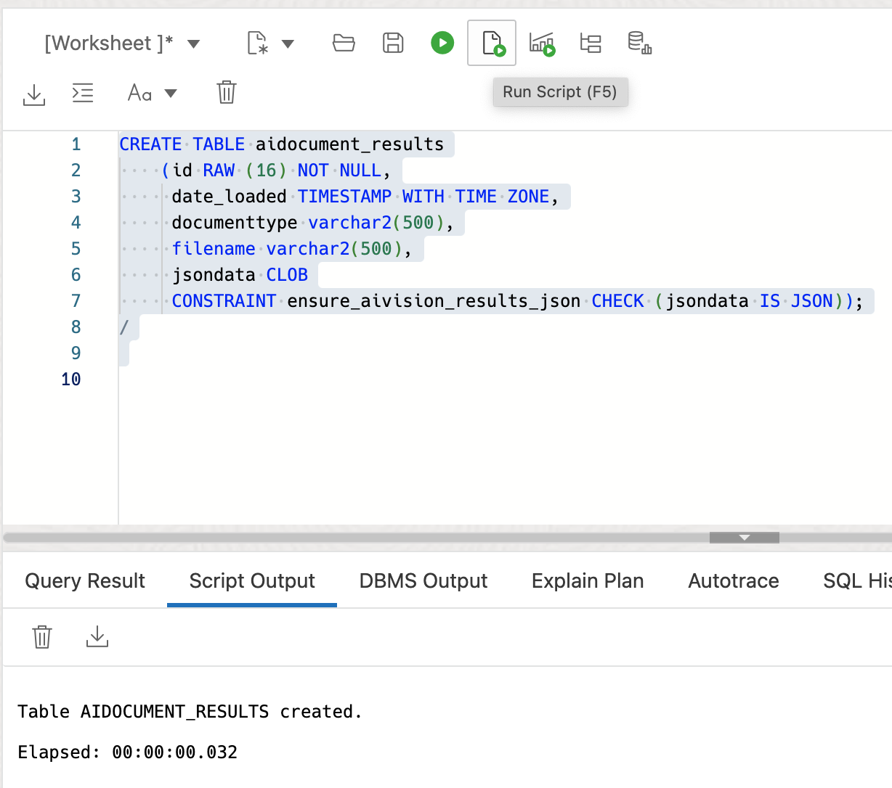
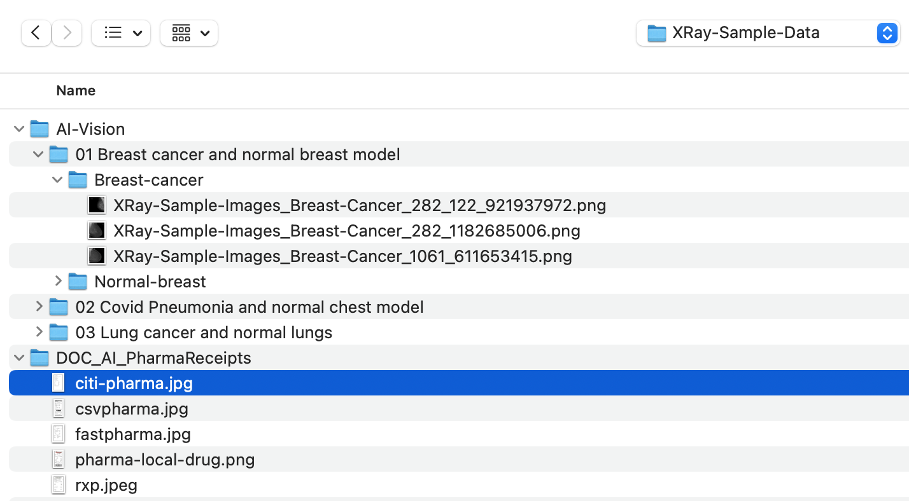
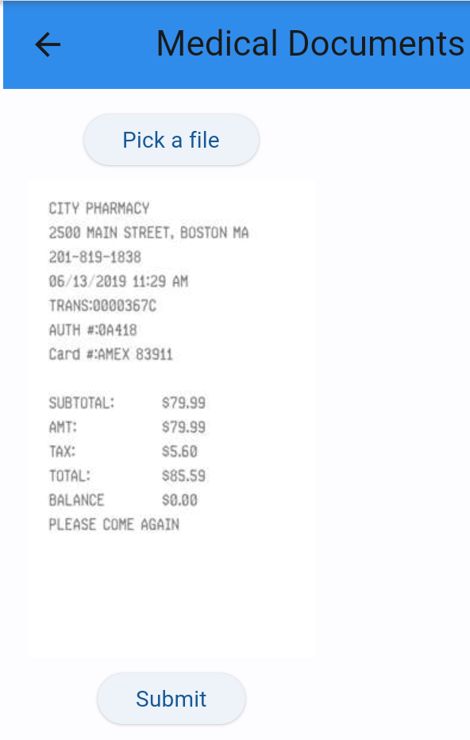
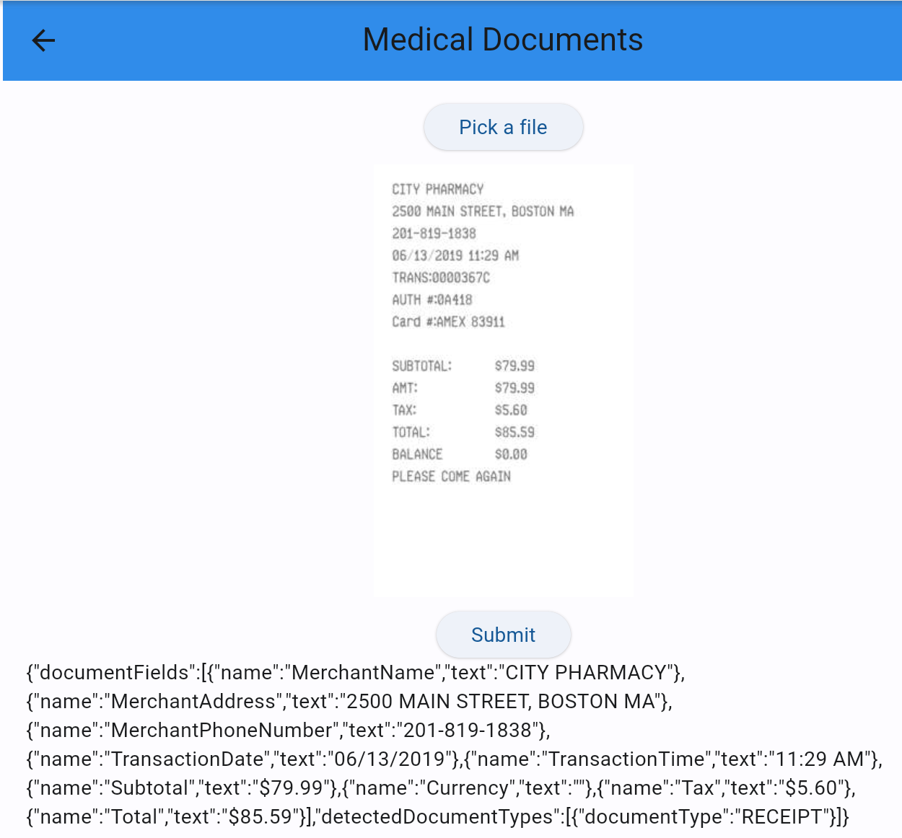
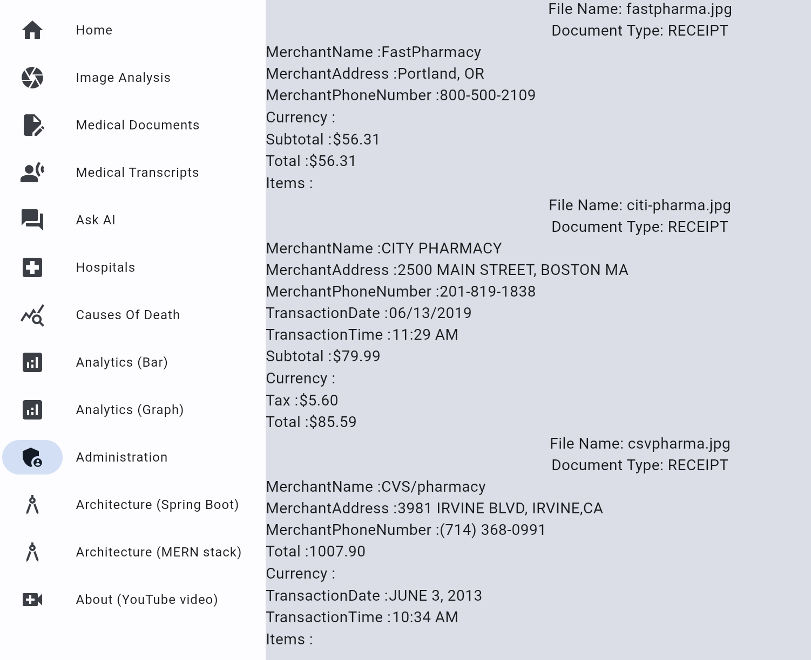

# Full Stack Application for Medical Receipt Processing

## Introduction

This lab will show you how to use Oracle Database, Object Storage, and OCI Vision/Document AI to detect text in medical documents and store accordingly (for example as an expense report).

Estimated Time: 5 minutes.

### Objectives

* Upload the image from the local file system to the OCI object storage bucket using OCI Object storage rest APIs
* Input this image to the AI Vision Document model and receive the JSON results.
* Receive the response JSON and parse it.
* Present the results in Flutter frontend.
* Understand the backend and frontend code.

### Prerequisites

- Completion of Setup lab

## Task 1: Create the table that will store the results of the processed documents.
   1. Open the SQL workshop tab for your database, copy and paste the contents of the `aiuser-aidocument_table.sql` file in the workshop source code `sql` and click the `Run Script` button.
      

## Task 2: Run the application

   1. Open the frontend via your preferred method as was done in setup and select the `Medical Documents` item from the sidebar menu.
      

   2. Click the `Pick a File` button and Select a receipt image file. Example files are provided
      

   3. You will see the image file you selected. Now click `Submit`
      

   4. Notice the results of the Oracle Document AI processing and parsed key/value fields.
      

   5. Select the `Administration` item from the sidebar menu.
      

   6. Notice the results of the query for the documents that were stored in the database after AI processing.
      

## Task 3: Understand the code

   1. Notice the `/flutter-frontend/lib/medicaldocs.dart` source code and how it creates a request to the Spring Boot backend and parses the JSON response into a resultant fields.

   2. Notice the `/springboot-backend/src/main/java/oracleai/MedicalDocsController.java` and related source code and how it creates a request to the document model deployed in the OCI Vision service and passes the JSON response back to the frontend.

You may now **proceed to the next lab.**..

## Acknowledgements

* **Author** - Paul Parkinson, Architect and Developer Advocate, Oracle Database
* **Last Updated By/Date** - 2024