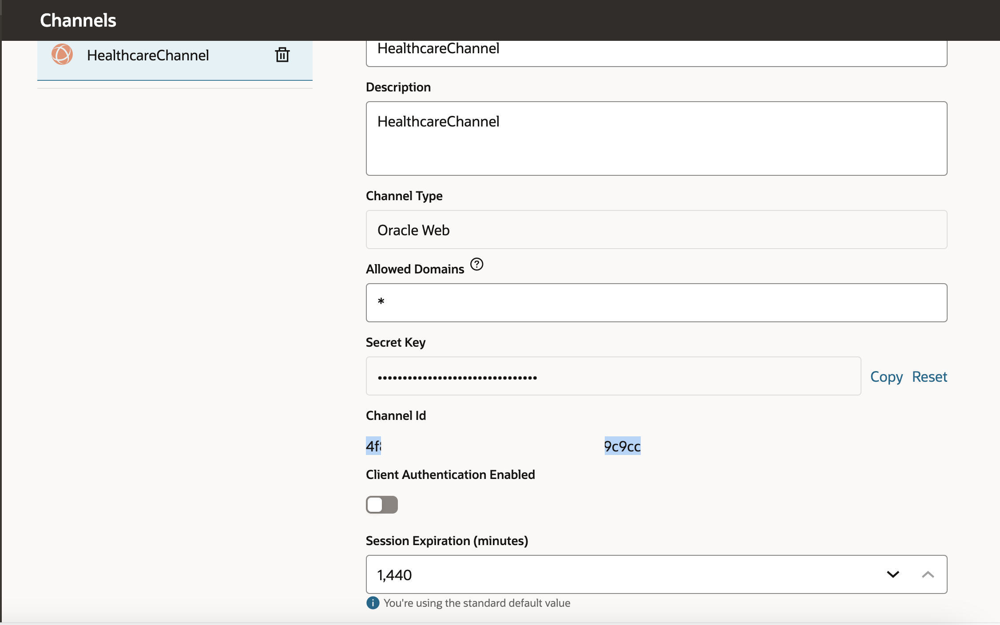

# Full Stack Application with Oracle Digital Assistant

## Introduction

This Lab walks you through the process of adding Oracle Digital Chatbot to your Full Stack Application 

Estimated Time: 10 minutes.

### Objectives

* Download ODA Oracle Native Client SDK
* Get channel id from ODA console
* Configure settings.js file in your application source
* Upload CSS, Image and JS files to Oracle APEX
* Run the application and use the chat bot

### Prerequisites

- Completion of Setup lab and ODA Setup lab

## Task 1: Download ODA Oracle Native Client SDK
 
1. From Oracle Digital Assistant (ODA) and Oracle Mobile Cloud (OMC) Downloads [Downloads](https://www.oracle.com/downloads/cloud/amce-downloads.html) Under **Web SDK** download latest client **Oracle Web SDK 23.04 - Latest**

    Extract **Oracle Digital Assistant - Oracle Native Client SDK 23.4.1** zip file, please note version number might change

    

2. Run the index.html file from your web browser, This will show the disconnected status

    

## Task 2: Get channel id from ODA console. 

1. Login to ODA and under Channels, copy the channel id

    

## Task 3: Configure settings.js file

1. Edit **settings.js** file under scripts folder, 

    

    In **chatWidgetSettings** update **URI** and **channelId**
 
    ```javascript
    <copy>
    const chatWidgetSettings = {
            URI: 'https://oda-your-instance-.data.digitalassistant.oci.oraclecloud.com/',         
            clientAuthEnabled: isClientAuthEnabled,     
            channelId: '4f877adf-your-channelid',    
            userId: '<userID>',                          
            enableAutocomplete: true,               
            enableBotAudioResponse: true,             
            enableClearMessage: true,                 
            enableSpeech: true,                   
            showConnectionStatus: true,        
        };
    </copy>
    ```

    

2. Now the chatbot is connected with ODA channel.

    

3. You can see Auto complete questions and get corresponding answers.

    

## Task 4: Copy Java and Styles

1. Copy and paste the ODA `script` and `styles` folders under the `springboot-backend/src/main/resources/static/` directory of the workshop source (this will overwrite existing files).


2. Re-build and run the `springboot-backend` service as you did in lab 1 and 2.
   


3. Open the frontend via your preferred method as was done in setup and select the `Digital Assistant` item from the sidebar menu.
   


4. Enter questions and view results.

   


## Task 5: Understand the code

1. Notice the `/springboot-backend/src/main/resource/static/oda.html` source code and how it creates a request to the document model deployed in the OCI Vision service and passes the JSON response back to the frontend.


## Learn More

* [Analyze Document](https://docs.oracle.com/en-us/iaas/tools/oci-cli/3.28.0/oci_cli_docs/cmdref/ai-vision/analyze-document.html)
* [Document Understanding](https://docs.oracle.com/en-us/iaas/document-understanding/document-understanding/using/home.htm)

## Acknowledgements

* **Author** - Madhusudhan Rao B M, Principal Product Manager, Oracle Database
* **Author** - Paul Parkinson, Architect and Developer Advocate, Oracle Database
* **Last Updated By/Date** - 2024