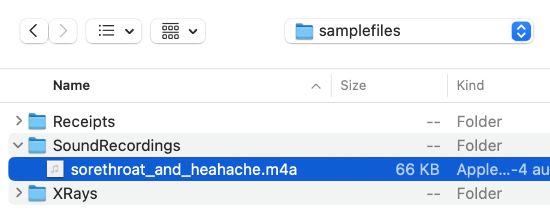
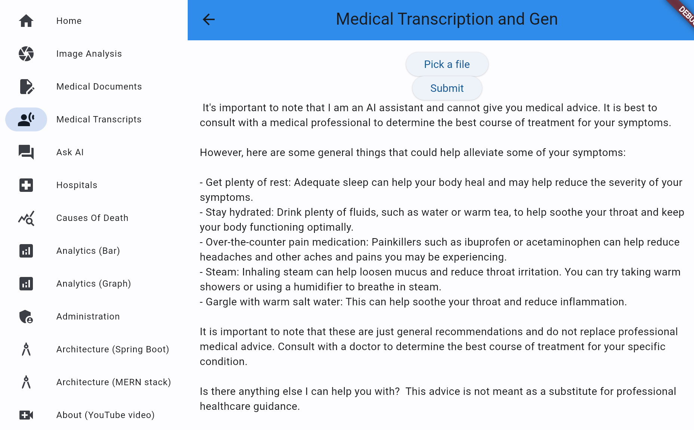

# Oracle Full Stack for Breast Cancer Detection

## Introduction

This lab will show you how to use Oracle Database, Object Storage, Speech AI and Gen AI to detect text in medical documents and store acoordingly (for example as an expense report).

Estimated Time: 5 minutes.

### Objectives

* Upload the image from the local file system to the OCI object storage bucket using OCI Object storage rest APIs
* Input this image to the Oracle AI Speech service and receive the JSON results.
* Parse and send the Speech AI results (question) to Oracle Gen AI service.
* Present the results in Flutter frontend.
* Understand the backend and frontend code.

### Prerequisites

- Completion of Setup lab

## Task 1: Run the application

1. Open the frontend via your preferred method as was done in setup and select the `Image Analysis` item from the sidebar menu.
   

2. Click the `Pick a File` button and select an audio file (the contents of which as a question). Example files are provided
   

3. Now click `Submit`

4. Notice the results of the Speech AI and Gen AI processing (reply to the question asked).
   

## Task 2: Understand the code

1. Notice the `/flutter-frontend/lib/medicaltranscripts.dart` source code and how it creates a request to the Spring Boot backend and parses the JSON response into a resultant fields.

2. Notice the `/springboot-backend/src/main/java/oracleai/MedicalTranscriptsController.java` source code and how it creates a request to the document model deployed in the OCI Vision service and passes the JSON response back to the frontend.

You may now **proceed to the next lab.**..

## Acknowledgements

* **Author** - Paul Parkinson, Architect and Developer Advocate, Oracle Database
* **Last Updated By/Date** - 2024.