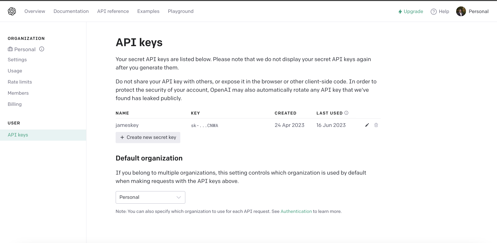
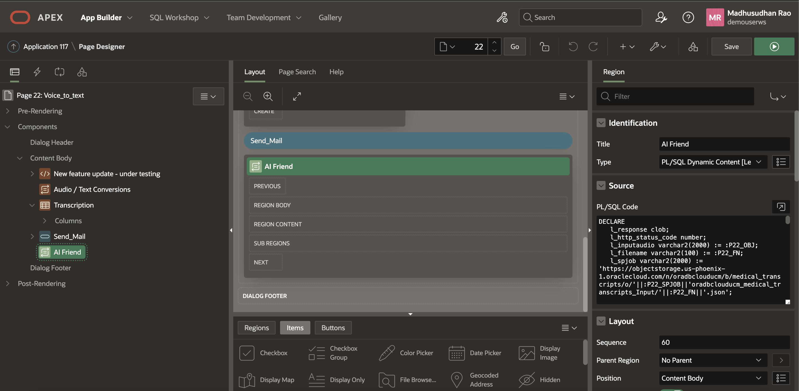
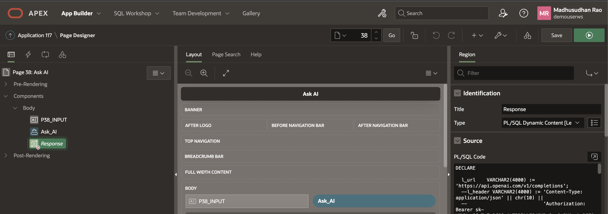
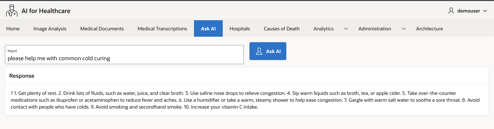
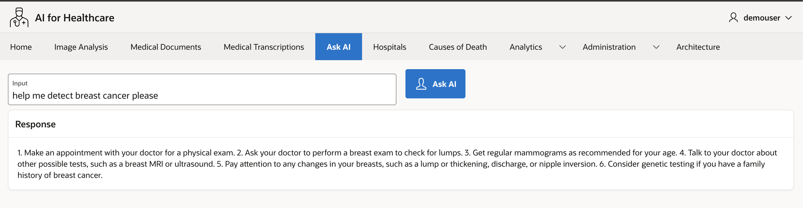
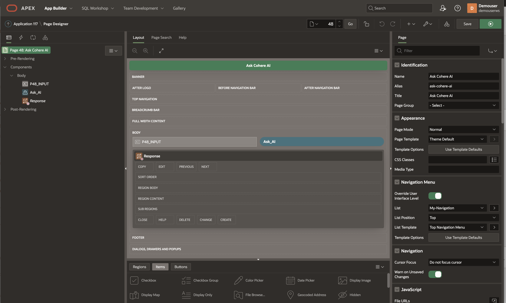
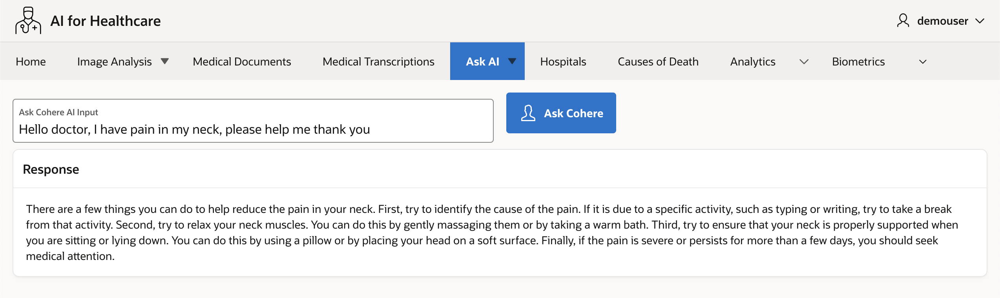
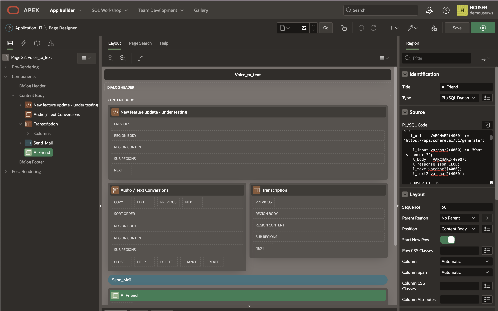
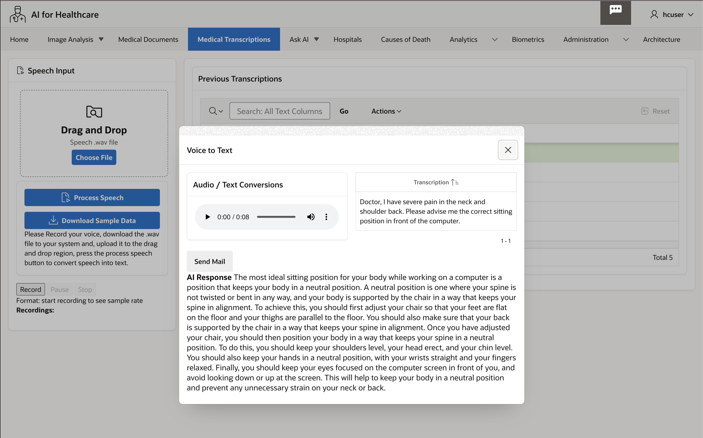
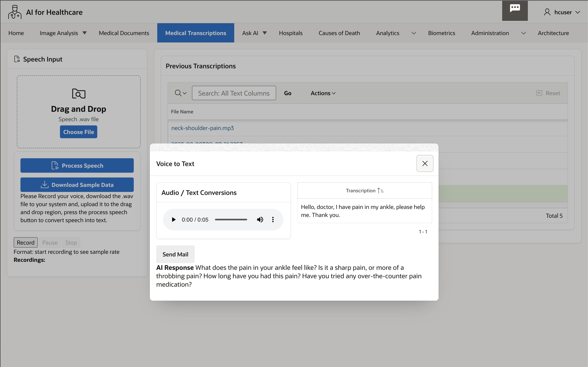

# OCI Speech with Oracle Gen AI Integration

## Introduction

In this Lab, we will see how to integrate [OCI AI Speech](https://www.oracle.com/artificial-intelligence/speech/) Input as prompts to [Oracle Gen AI](https://cohere.com/) AI Service.
   
You can ask Questions like 

Example 1
  
*please help me with common cold curing*

Oracle Gen AI would respond back as

*1. Get plenty of rest. 2. Drink lots of fluids, such as water, juice, and clear broth. 3. Use saline nose drops to relieve congestion. 4. Sip warm liquids such as broth, tea, or apple cider. 5. Take over-the-counter medications such as ibuprofen or acetaminophen to reduce fever and aches. 6. Use a humidifier or take a warm, steamy shower to help ease congestion. 7. Gargle with warm salt water to soothe a sore throat. 8. Avoid contact with people who have colds. 9. Avoid smoking and secondhand smoke. 10. Increase your vitamin C intake.*

Example 2

*Hello doctor, I have pain in my neck, please help me thank you*

Oracle Gen AI would respond back as

*There are a few things you can do to help reduce the pain in your neck. First, try to identify the cause of the pain. If it is due to a specific activity, such as typing or writing, try to take a break from that activity. Second, try to relax your neck muscles. You can do this by gently massaging them or by taking a warm bath. Third, try to ensure that your neck is properly supported when you are sitting or lying down. You can do this by using a pillow or by placing your head on a soft surface. Finally, if the pain is severe or persists for more than a few days, you should seek medical attention.*
 
Estimated Time: 30 minutes.

### [About Oracle Gen AI](https://cohere.com/)

Oracle Gen AI is the leading AI platform for enterprise. Its world-class AI is uniquely suited to the needs of business, unlocking unprecedented ease-of-use, accessibility, and data privacy. Oracle Gen AI’s platform is cloud-agnostic, accessible through API as a managed service, and can be deployed on virtual private cloud (VPC) or even on-site to meet companies where their data is, offering the highest levels of flexibility and control. Founded by Google Brain alumni and a co-author of the seminal Transformer research paper, Oracle Gen AI is on a mission to transform enterprises and their products with AI that unlocks a more intuitive way to generate, search, and summarize information than ever before.
  
### Objectives

In this lab, you will:

* Create Oracle Gen AI Key
* Understand Oracle Gen AI Authentication  
* Integrating Oracle Speech AI Output with Oracle Gen AI
* Oracle Gen AI Integration with Oracle APEX without using OCI Speech AI

### Prerequisites

This lab assumes you have:

* Completed previous labs under Speech AI series. (Lab 11 to Lab 13)
* Intermediate knowledge of Oracle APEX and PL/SQL
 
<!-- 
## Task 1: Create OpenAI Key

1. Create an Account at OpenAI and Create a Key at [OpenAI](https://platform.openai.com/account/api-keys).
  
    
  
## Task 2: Understand OpenAI Authentication 

1. If you want to specifically enable OpenAI plugins to work with your API, you can provide a client secret during the plugin installation flow. This means that all traffic from OpenAI plugins will be authenticated but not on a user level. This flow benefits from a simple end user experience but less control from an API perspective.

    * To start, select "Develop your own plugin" in the ChatGPT plugin store, and enter the domain where your plugin is hosted.
    * In ai-plugin.json, set auth.type to "service_http" as is shown in our service level auth example.
    * You will be prompted for your service access token, which is a string specified in your code.
        * We securely store an encrypted copy of your service access token to enable plugin installation without additional authentication.
        * The service access token is sent in the Authorization header for plugin requests.
    * Once you add your service access token into the ChatGPT UI, you will be presented with a verification token.
    * Add the verification token to your ai-plugin.json file under the auth section as shown Python code below.

    ```python
        <copy>
            "auth": 
            {
            "type": "service_http",
            "authorization_type": "bearer",
                "verification_tokens": {
                    "openai": "OpenAI's Key"
                }
            } 
        </copy>
        ```

2. OAuth Code Snippet. In the below example of what the OAuth configuration inside of the ai-plugin.json file might look like:
 
    ```json
    <copy>
    "auth": {
            "type": "oauth",
            "client_url": "https://example.com/authorize",
            "scope": "",
            "authorization_url": "https://example.com/auth/",
            "authorization_content_type": "application/json",
            "verification_tokens": {
                "openai": "OpenAI's Key"
            }
        }
    </copy>
    ```
 
## Task 3: Integrating Oracle Speech AI Output with OpenAI

1. Create PL/SQL Dynamic Web Content

    

    ```sql
        <copy>
            DECLARE 
            l_response clob;
            l_http_status_code number;
            l_inputaudio varchar2(2000) := :P22_OBJ;
            l_filename varchar2(100) := :P22_FN;
            l_spjob varchar2(2000) := 'https://objectstorage.us-phoenix-1.oraclecloud.com/n/your-namespace/b/your-bucket/o/'||:P22_SPJOB||'your-namespace_your-bucket_Input/'||:P22_FN||'.json';
            l_url    varchar2(1000) := 'https://api.openai.com/v1/completions'; 
            l_input varchar2(4000) := 'What is cancer?';
            l_body   varchar2(4000); 
            l_response_json CLOB;
            l_text varchar2(4000);
            l_text2 varchar2(4000);

            CURSOR C1  IS 
            SELECT jt.* 
            FROM   JSON_TABLE(l_response, '$' 
                    COLUMNS (transcription VARCHAR2(2000)  PATH '$.transcriptions[0].transcription' )) jt; 

            CURSOR C2  IS 
            SELECT jt.* 
            FROM   JSON_TABLE(l_response_json, '$' 
                    COLUMNS (text VARCHAR2(2000)  PATH '$.choices[0].text' )) jt; 

            
            
        BEGIN 
            apex_web_service.g_request_headers.delete(); 
            apex_web_service.g_request_headers(1).name  := 'Content-Type'; 
            apex_web_service.g_request_headers(1).value := 'application/json';  

            l_response := apex_web_service.make_rest_request(    
            p_url => l_spjob,
            p_http_method => 'GET' 
            ); 

            -- write speach AI json response to rest collection --
            l_http_status_code := apex_web_service.g_status_code; 
            if l_http_status_code = 200 then 
            apex_collection.create_or_truncate_collection( 'REST_COLLECTION' ); 
            apex_collection.add_member( 
                p_collection_name => 'REST_COLLECTION', 
                p_clob001 =>         l_response  ); 
            end if;     

            -- From rest collection get speech AI text 
            -- (Audio to Text converted by Speech AI Transcription Job) --
            For row_1 In C1 Loop
                l_text := row_1.transcription; 
            End Loop;

            -- Authenticate against OpenAI 
            -- Replace your-openAI-key below
            apex_web_service.g_request_headers(1).name := 'Content-Type';
            apex_web_service.g_request_headers(1).value := 'application/json';
            apex_web_service.g_request_headers(2).name := 'Authorization';
            apex_web_service.g_request_headers(2).value := 'Bearer sk-your-openAI-key';

            -- Construct the body --
            l_body := '{
                        "model": "text-davinci-003",
                        "prompt": "'||l_text||'",
                        "temperature": 0.7,
                        "max_tokens": 128,
                        "top_p": 1,
                        "frequency_penalty": 0,
                        "presence_penalty": 0
                        }'; 

            if l_text is not null then 

            -- Invoke OpenAI service -- 
            l_response_json := apex_web_service.make_rest_request( 
                p_url => l_url, 
                p_http_method => 'POST', 
                p_body => l_body  
            );

            -- Print OpenAI response --
            For row_2 In C2 Loop
                    l_text2 := row_2.text;
                    Htp.p(  '<b>AI Response </b>'|| l_text2 );  
                End Loop;

            end if; 

            -- Thats all folks --
        END;
        </copy>
        ```

    

## Task 4: OpenAI Integration with Oracle APEX without using OCI Speech AI
 
1. Create PL/SQL Dynamic Content

    

2. 1st example of AI Input

    

3. 2nd example of AI Input

    


    ```sql
        <copy>
        DECLARE

        l_url   varchar2(4000) := 'https://api.openai.com/v1/completions'; 
        l_input varchar2(4000) := :P38_INPUT;
        l_body  varchar2(4000) := '{
                    "model": "text-davinci-003",
                    "prompt": "'||l_input||'",
                    "temperature": 0.7,
                    "max_tokens": 256,
                    "top_p": 1,
                    "frequency_penalty": 0,
                    "presence_penalty": 0
                    }'; 
        l_response_json CLOB;
        l_text varchar2(4000);

        CURSOR C1  IS 
            SELECT jt.* 
            FROM   JSON_TABLE(l_response_json, '$' 
                    COLUMNS (text VARCHAR2(2000)  PATH '$.choices[0].text' )) jt; 

        BEGIN

        if l_input is not null then

                apex_web_service.g_request_headers(1).name := 'Content-Type';
                apex_web_service.g_request_headers(1).value := 'application/json';
                apex_web_service.g_request_headers(2).name := 'Authorization';
                apex_web_service.g_request_headers(2).value := 'Bearer sk-your-openai-key';

                l_response_json := apex_web_service.make_rest_request( 
                p_url => l_url, 
                p_http_method => 'POST', 
                p_body => l_body  
                );
                

                For row_1 In C1 Loop
                        l_text := row_1.text;
                        Htp.p(  l_text );  
                End Loop;

            end if;

        END; 
        </copy>
        ```
-->
## Task 1: Create Oracle Gen AI Key  

1. Sign up and Sign in and [generate AI API Key](https://dashboard.cohere.ai/api-keys)  

2. Generate Oracle Gen AI API Key and read API key [limitations](https://docs.cohere.com/docs/going-live)

     

## Task 2: Getting AI Response from Oracle Gen AI 

1. Review the request JSON, Call API end point at https://api.cohere.ai/v1/generate

    ```json
    <copy> 
        {  
            "model": "command",
            "prompt": "Your input text here",
            "max_tokens": 300,
            "temperature": 0.9,
            "k": 0,
            "stop_sequences": [],
            "return_likelihoods": "NONE"
    }   
    </copy>
    ```

2. Review the response JSON

    ```json
    <copy> 
        {
            "id": "2c5fd5d6-743c-4a52-****-*****",
            "generations": [
                {
                    "id": "46907fbb-1d86-40fc-ba70-806d658ee901",
                    "text": "\n your answer goes here  "
                }
            ],
            "prompt": "your question goes here",
            "meta": { "api_version": 
                        { 
                            "version": "1" 
                        } 
                    }
    }
    </copy>
    ```

3. PL/SQL Code to send request and get response back from Oracle Gen AI, you can create an Oracle APEX Dynamic Region to display the results taking input from a page item after submitting the page. Construct PL/SQL Code block, Replace this code in the PL/SQL Dynamic content window, use [JSON_TABLE](https://docs.oracle.com/en/database/oracle/oracle-database/19/sqlrf/JSON_TABLE.html) to create a PL/SQL cursor 


     

1. Response Dynamic PL/SQL block code

    ```sql
    <copy> 
        DECLARE
    
        l_url    VARCHAR2(4000) := 'https://api.cohere.ai/v1/generate';  
        l_input VARCHAR2(4000) := :P48_INPUT;
        
            l_body   VARCHAR2(4000) := '{
                "model": "command",
                "prompt": "'||l_input||'",
                "max_tokens": 300,
                "temperature": 0.9,
                "k": 0,
                "stop_sequences": [],
                "return_likelihoods": "NONE"
                }';
            l_response_json CLOB;
            l_text VARCHAR2(4000);

        CURSOR C1  IS 
            SELECT jt.* 
            FROM   JSON_TABLE(l_response_json, '$' 
                    COLUMNS (text VARCHAR2(2000)  PATH '$.generations[0].text' )) jt; 

        BEGIN

        if l_input is not null then

        apex_web_service.g_request_headers(1).name := 'Content-Type';
            apex_web_service.g_request_headers(1).value := 'application/json';
            apex_web_service.g_request_headers(2).name := 'Authorization';
            apex_web_service.g_request_headers(2).value := 'Bearer Your-cohere-API-Key';

        l_response_json := apex_web_service.make_rest_request( 
            p_url => l_url, 
            p_http_method => 'POST', 
            p_body => l_body  
        );

        --Htp.p(l_response_json ); 

            For row_1 In C1 Loop
                l_text := row_1.text;
                    Htp.p(  l_text );  
            End Loop;

            end if;

        END;     
    </copy>
    ```

     

## Task 3: Oracle Gen AI Integration with OCI Speech AI
 
1. Create PL/SQL Dynamic Content, This will open Speech AI Job file, Extract the Voice to text converted content from the JSON file. feed this as Input to Oracle Gen AI prompt and display results back from cohere.

    
 
2. PL/SQL Code block
   
    ```sql
        <copy>
        DECLARE 
            l_response clob;
            l_http_status_code number;
            l_inputaudio varchar2(2000) := :P22_OBJ;
            l_filename varchar2(100) := :P22_FN;
            -- please check this URL will vary in your object storage settings
            l_spjob varchar2(2000) := 'https://objectstorage.us-phoenix-1.oraclecloud.com/n/tenancyname/b/bucketname/o/'||:P22_SPJOB||'bucketname_Input/'||:P22_FN||'.json';
            
            l_url    VARCHAR2(4000) := 'https://api.cohere.ai/v1/generate';  
        
            l_input varchar2(4000) := 'What is cancer?';
            l_body   VARCHAR2(4000); 
            l_response_json CLOB;
            l_text varchar2(4000);
            l_text2 varchar2(4000);

            CURSOR C1  IS 
                SELECT jt.* 
                FROM   JSON_TABLE(l_response, '$' 
                        COLUMNS (transcription VARCHAR2(2000)  PATH '$.transcriptions[0].transcription' )) jt; 
            
                CURSOR C2  IS 
                SELECT jt.* 
                FROM   JSON_TABLE(l_response_json, '$' 
                        COLUMNS (text VARCHAR2(2000)  PATH '$.generations[0].text' )) jt; 
            
                BEGIN  
                        apex_web_service.g_request_headers.delete(); 
                        apex_web_service.g_request_headers(1).name  := 'Content-Type'; 
                        apex_web_service.g_request_headers(1).value := 'application/json';  

                        l_response := apex_web_service.make_rest_request(    
                        p_url => l_spjob,
                        p_http_method => 'GET' 
                        ); 
                
                        l_http_status_code := apex_web_service.g_status_code; 
                        if l_http_status_code = 200 then 
                            apex_collection.create_or_truncate_collection( 'REST_COLLECTION' ); 
                            apex_collection.add_member( 
                                p_collection_name => 'REST_COLLECTION', 
                                p_clob001 =>         l_response  ); 
                        end if;     
                
                        For row_1 In C1 Loop
                        l_text := row_1.transcription; 
                        End Loop;
                
                    apex_web_service.g_request_headers(1).name := 'Content-Type';
                    apex_web_service.g_request_headers(1).value := 'application/json';
                    apex_web_service.g_request_headers(2).name := 'Authorization';
                    apex_web_service.g_request_headers(2).value := 'Bearer Your-Oracle Gen AI-API-Key';
                
                    l_body  := '{
                        "model": "command",
                        "prompt": "'||l_text||'",
                        "max_tokens": 300,
                        "temperature": 0.9,
                        "k": 0,
                        "stop_sequences": [],
                        "return_likelihoods": "NONE"
                        }';

                    if l_text is not null then 

                    l_response_json := apex_web_service.make_rest_request( 
                        p_url => l_url, 
                        p_http_method => 'POST', 
                        p_body => l_body  
                    );

                    For row_2 In C2 Loop
                            l_text2 := row_2.text;
                            Htp.p(  '<b>AI Response </b>'|| l_text2 );  
                        End Loop;

                    end if; 

                END; 
        </copy>
        ```

3. 1st example of AI Input

    

4. 2nd example of AI Input

    
   
    > **Congratulations**, you have completed **OCI Speech with Oracle Gen AI Integration** Lab. The subsequent labs are optional, however, please proceed to the next lab to learn more about **Setup Oracle Digital Assistant**. 

## Learn More
  
* [JSON Developer Guide](https://docs.oracle.com/en/database/oracle/oracle-database/19/adjsn/function-JSON_TABLE.html#GUID-0172660F-CE29-4765-BF2C-C405BDE8369A)
* [Oracle to Deliver Powerful and Secure Generative AI Services for Business](https://www.oracle.com/in/news/announcement/oracle-to-deliver-powerful-and-secure-generative-ai-service-for-business-2023-06-13/)

## Acknowledgements
* **Author** - Madhusudhan Rao B M, Principal Product Manager, Oracle Database
* **Last Updated By/Date** - May 23rd, 2023.