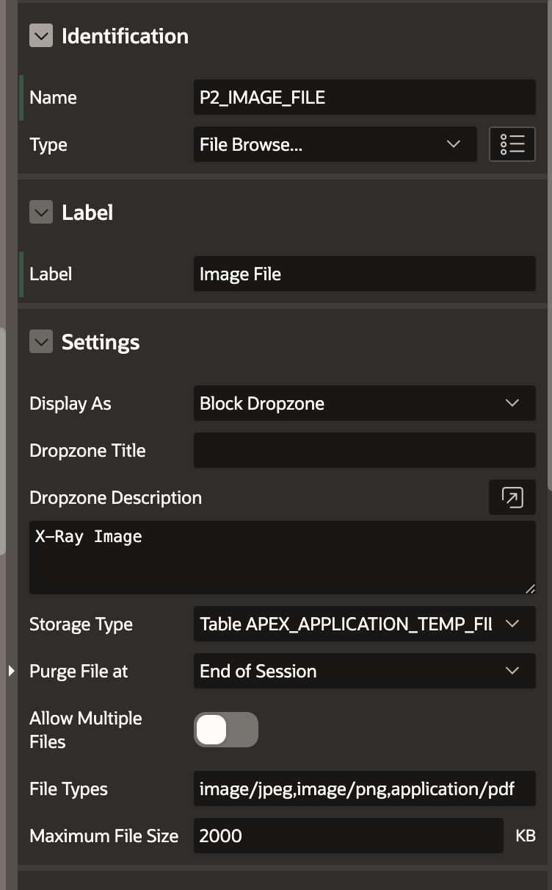
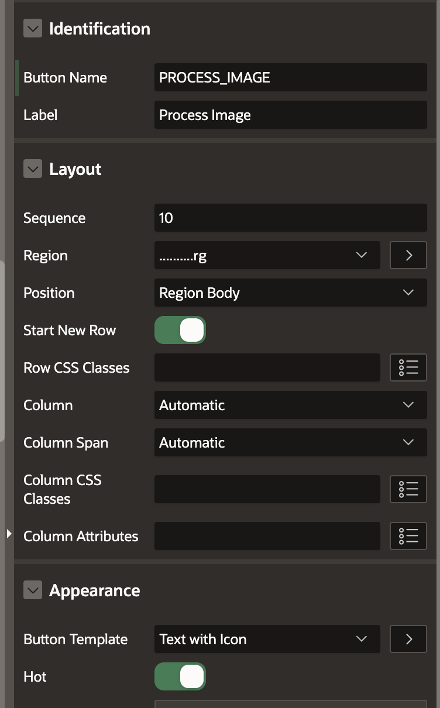
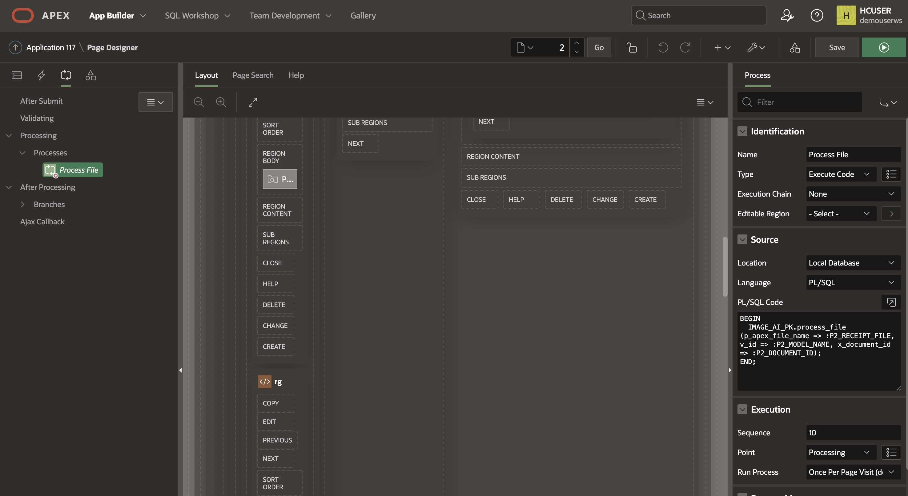
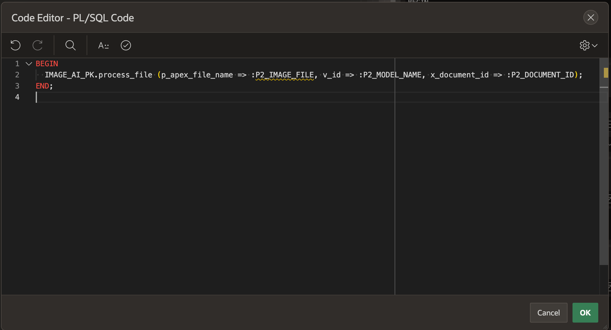
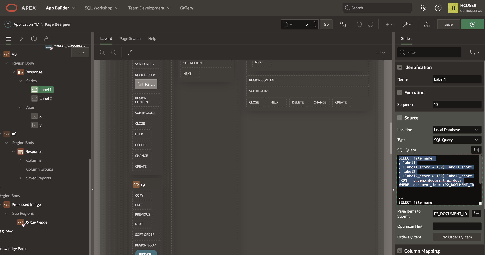
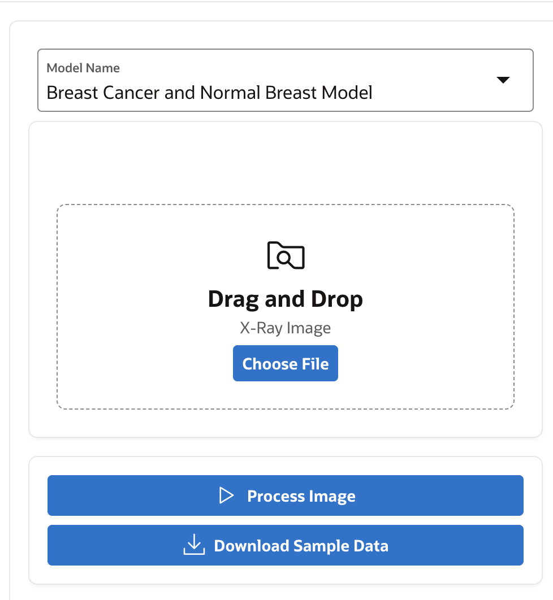
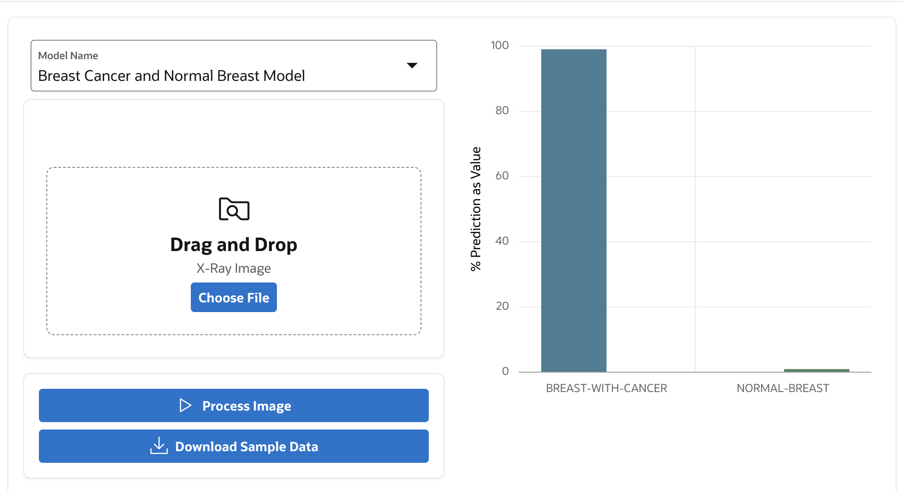
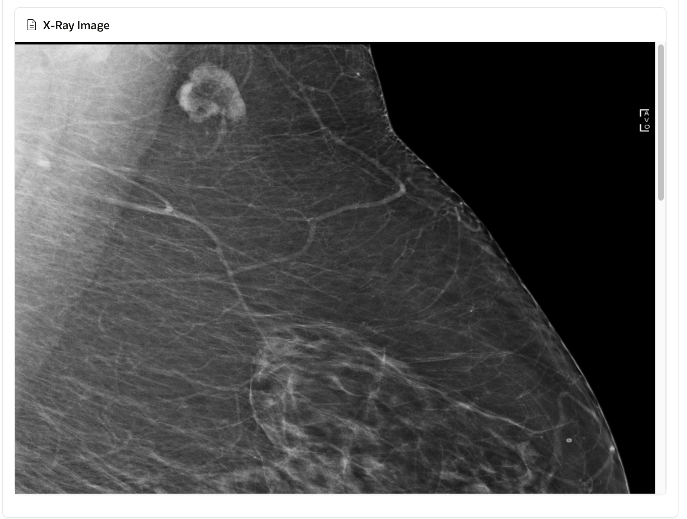

# Oracle APEX Application for Breast Cancer Detection

## Introduction

This Lab walks you through the process of creating the Oracle APEX front-end Application. Oracle APEX is a low-code Application development platform. This application will work as a front end for Breast cancer detection using AI Vision. This basically follows 4 step process.

* Upload the image from the local file system to the OCI object storage bucket using OCI Object storage rest APIs
* Input this image to the AI Vision model and verify it against the model by creating request JSON dynamically and leveraging OCI AI Vision rest APIs
* Receive the response JSON and parse it to get the confidence score against the label as a key-value pair, 
* Generate an Oracle APEX chart using the JSON response's key-value pair.

[Youtube video on Oracle APEX User Interface](youtube:n-p6ohGn5xM:large)

Estimated Time: 30 minutes.

### About Oracle APEX

Oracle APEX is the world's most popular enterprise low-code application platform that enables you to build scalable, secure enterprise apps, with world-class features. These apps can be deployed anywhere - cloud or on-premises

Using APEX, developers can quickly develop and deploy compelling apps that solve real problems and provide immediate value. You don't need to be an expert in a vast array of technologies to deliver sophisticated solutions. Focus on solving the problem and let APEX take care of the rest.

### Objectives

In this lab, you will:
 
* Create required schema - 
    * Tables: MACHINE LEARNING CONFIGS, VISION AI DOCS, VISION AI FIELDS
    * PL/SQL Procedure IMAGE\_AI\_PK, Triggers etc.
* Create Oracle APEX Page
* Verify Oracle APEX File upload settings
* Display results 

### Prerequisites

This lab assumes you have:

* Completed previous labs of this workshop.
* You have an Oracle APEX workspace already created.
* Intermediate or Advanced knowledge of Oracle APEX and PL/SQL
   
## Task 1: Create Table - MACHINE LEARNING CONFIGS

We can directly code Object storage bucket location, Web Credential Name, Request JSON etc., directly in PL/SQL code to validate XRay Image. However, it is a good practice to store this in a database table so that we can easily update this and add more models in future, so we create a machine learning configuration table for this purpose.

1. Create **MACHINE\_LEARNING\_CONFIGS** to store Machine Learning Configuration Details.

    ```sql
    <copy>
    CREATE TABLE  "MACHINE_LEARNING_CONFIGS" 
    (	
        "ID" NUMBER GENERATED ALWAYS AS IDENTITY MINVALUE 1 MAXVALUE 9999999999999999999999999999 
        INCREMENT BY 1 START WITH 2 CACHE 20 NOORDER  NOCYCLE  NOKEEP  NOSCALE  NOT NULL ENABLE, 
        "CLASSIFICATION" VARCHAR2(500 CHAR) COLLATE "USING_NLS_COMP", 
        "GC_OCI_OBJ_STORE_BASE_URL" VARCHAR2(500 CHAR) COLLATE "USING_NLS_COMP", 
        "GC_OCI_DOC_AI_URL" VARCHAR2(500 CHAR) COLLATE "USING_NLS_COMP", 
        "GC_OCI_DOC_AI_TIMEOUT_SECS" NUMBER, 
        "GC_WC_CREDENTIAL_ID" VARCHAR2(100 CHAR) COLLATE "USING_NLS_COMP", 
        "GC_OCI_REQ_AI_PAYLOAD" VARCHAR2(3800 CHAR) COLLATE "USING_NLS_COMP", 
        "GC_OCI_RESP_AI_PAYLOAD" VARCHAR2(3800 CHAR) COLLATE "USING_NLS_COMP", 
        "ANALYSIS_NAME" VARCHAR2(200) COLLATE "USING_NLS_COMP", 
        CONSTRAINT "MACHINE_LEARNING_C_ID_PK" PRIMARY KEY ("ID")
        USING INDEX  ENABLE
    )  DEFAULT COLLATION "USING_NLS_COMP"  
    </copy>
    ```

    **Sample Configuration Data** in the table.

    ANALYSIS\_NAME = Breast Cancer

    GC\_OCI\_OBJ\_STORE\_BASE\_URL = https://objectstorage.your-region.oraclecloud.com/n/your-tenancy/b/Your-Bucket-Name/o/ImageAI/

    CLASSIFICATION = IMAGE_CLASSIFICATION

    GC\_OCI\_REQ\_AI\_PAYLOAD = 

    ```json
    <copy>
    { 
        "compartmentId": "ocid1.compartment.oc1..aaaaaaaaud6t-your-compartment-ocid-4viqyneyroixcmj54u32q", 
        "image": { "source": "OBJECT_STORAGE", 
        "namespaceName": "Your-Tenancy-Name", 
        "bucketName": "Your-Bucket-Name", 
        "objectName": "ImageAI/#FILE_NAME#" }, 
        "features": [ 
            { 
                "modelId": "ocid1.aivisionmodel.oc1.phx.amaaaaaaknuwtji-your-model-ocid-hmazehr5ora75wq", 
                "featureType": "IMAGE_CLASSIFICATION", 
                "maxResults": 5 
            } ] 
    }
    </copy>
    ```
    
    Your-Bucket-Name is the Bucket Name where Image will be temporarily uploaded.

## Task 2: Create Table - VISION AI DOCS
 
1. Create **VISION\_AI\_DOCS** Table. VISION\_AI\_DOCS table is primarily used to store the JSON response after uploading the image to object storage, querying the image against a trained OCI Vision model. The JSON response contains the OCI Labels and their corresponding confidence scores. 

    ```sql
        <copy> 
        CREATE TABLE  "VISION_AI_DOCS" 
        (	
            "DOCUMENT_ID" NUMBER GENERATED BY DEFAULT ON NULL AS IDENTITY MINVALUE 1 MAXVALUE 9999999999999999999999999999 
            INCREMENT BY 1 START WITH 1 CACHE 20 NOORDER  NOCYCLE  NOKEEP  NOSCALE  NOT NULL ENABLE, 
            "FILE_NAME" VARCHAR2(100) COLLATE "USING_NLS_COMP" NOT NULL ENABLE, 
            "MIME_TYPE" VARCHAR2(100) COLLATE "USING_NLS_COMP" NOT NULL ENABLE, 
            "OBJECT_STORE_URL" VARCHAR2(1000) COLLATE "USING_NLS_COMP" NOT NULL ENABLE, 
            "DOC_AI_JSON" CLOB COLLATE "USING_NLS_COMP", 
            "LANGUAGE_CODE" VARCHAR2(10) COLLATE "USING_NLS_COMP", 
            "LANGUAGE_SCORE" NUMBER, 
            "DOCUMENT_TYPE_CODE" VARCHAR2(50) COLLATE "USING_NLS_COMP", 
            "DOCUMENT_TYPE_SCORE" NUMBER, 
            "PAGE_COUNT" NUMBER, 
            "STATUS_CODE" VARCHAR2(25) COLLATE "USING_NLS_COMP" DEFAULT ON NULL 'WIP' NOT NULL ENABLE, 
            "CREATION_DATE" TIMESTAMP (6) WITH LOCAL TIME ZONE NOT NULL ENABLE, 
            "CREATED_BY" VARCHAR2(255) COLLATE "USING_NLS_COMP" NOT NULL ENABLE, 
            "LAST_UPDATE_DATE" TIMESTAMP (6) WITH LOCAL TIME ZONE NOT NULL ENABLE, 
            "LAST_UPDATED_BY" VARCHAR2(255) COLLATE "USING_NLS_COMP" NOT NULL ENABLE, 
            "LABEL1" VARCHAR2(100) COLLATE "USING_NLS_COMP", 
            "LABEL1_SCORE" NUMBER, 
            "LABEL2" VARCHAR2(100) COLLATE "USING_NLS_COMP", 
            "LABEL2_SCORE" NUMBER, 
            "AISPEECHTRANS_JOBID" VARCHAR2(1000) COLLATE "USING_NLS_COMP", 
            "AISPEECH_PREFIX" VARCHAR2(1000) COLLATE "USING_NLS_COMP", 
            CONSTRAINT "VISION_AI_DOCS_PK" PRIMARY KEY ("DOCUMENT_ID")
            USING INDEX  ENABLE
        )  DEFAULT COLLATION "USING_NLS_COMP"
    </copy>
    ```     

    ```sql
        <copy>
        CREATE OR REPLACE EDITIONABLE TRIGGER  "VISION_AI_DOCS_BIU" 
        BEFORE INSERT OR UPDATE ON VISION_AI_DOCS FOR EACH ROW
        BEGIN
        IF INSERTING THEN
            :new.created_by       := COALESCE(SYS_CONTEXT('APEX$SESSION','APP_USER'),SYS_CONTEXT('USERENV', 'SESSION_USER'));
            :new.creation_date    := current_timestamp;
            :new.last_updated_by  := COALESCE(SYS_CONTEXT('APEX$SESSION','APP_USER'),SYS_CONTEXT('USERENV', 'SESSION_USER'));
            :new.last_update_date := current_timestamp;
        ELSIF UPDATING THEN
            :new.last_updated_by  := COALESCE(SYS_CONTEXT('APEX$SESSION','APP_USER'),USER);
            :new.last_update_date := current_timestamp;
        END IF;
        END;
    </copy>
    ```

    ```sql
        <copy>
        ALTER TRIGGER  "VISION_AI_DOCS_BIU" ENABLE 
    </copy>
    ```

## Task 3: Create Table - VISION AI FIELDS

VISION\_AI\_FIELDS table is used to store the labels and corresponding scores. This is what we get after the parsing of the JSON response.

1. Create **VISION\_AI\_FIELDS** .

    ```sql
    <copy> 
    CREATE TABLE  "VISION_AI_FIELDS" 
    (	
    "WORD_ID" NUMBER GENERATED BY DEFAULT ON NULL AS IDENTITY MINVALUE 1 MAXVALUE 9999999999999999999999999999 INCREMENT BY 1 START WITH 1 CACHE 20 NOORDER  NOCYCLE  NOKEEP  NOSCALE  NOT NULL ENABLE, 
	"DOCUMENT_ID" NUMBER NOT NULL ENABLE, 
	"FIELD_TYPE_CODE" VARCHAR2(50) COLLATE "USING_NLS_COMP" NOT NULL ENABLE, 
	"FIELD_LABEL" VARCHAR2(100) COLLATE "USING_NLS_COMP", 
	"LABEL_SCORE" NUMBER, 
	"FIELD_VALUE" VARCHAR2(1000) COLLATE "USING_NLS_COMP", 
	"CREATION_DATE" TIMESTAMP (6) WITH LOCAL TIME ZONE NOT NULL ENABLE, 
	"CREATED_BY" VARCHAR2(255) COLLATE "USING_NLS_COMP" NOT NULL ENABLE, 
	"LAST_UPDATE_DATE" TIMESTAMP (6) WITH LOCAL TIME ZONE NOT NULL ENABLE, 
	"LAST_UPDATED_BY" VARCHAR2(255) COLLATE "USING_NLS_COMP" NOT NULL ENABLE, 
	"EXPENSE" VARCHAR2(50) COLLATE "USING_NLS_COMP", 
	 CONSTRAINT "VISION_AI_FIELDS_PK" PRIMARY KEY ("WORD_ID")
  USING INDEX  ENABLE
   )  DEFAULT COLLATION "USING_NLS_COMP"
    </copy>
    ```

    ```sql
    <copy> 
    CREATE INDEX  "VISION_AI_FIELDS_N1" ON  "VISION_AI_FIELDS" ("DOCUMENT_ID")
    </copy>
    ``` 

    ```sql
    <copy> 
    CREATE OR REPLACE EDITIONABLE TRIGGER  "VISION_AI_FIELDS_BIU" 
    BEFORE INSERT OR UPDATE ON VISION_AI_FIELDS FOR EACH ROW
    BEGIN
    IF INSERTING THEN
        :new.created_by       := COALESCE(SYS_CONTEXT('APEX$SESSION','APP_USER'),SYS_CONTEXT('USERENV', 'SESSION_USER'));
        :new.creation_date    := current_timestamp;
        :new.last_updated_by  := COALESCE(SYS_CONTEXT('APEX$SESSION','APP_USER'),SYS_CONTEXT('USERENV', 'SESSION_USER'));
        :new.last_update_date := current_timestamp;
    ELSIF UPDATING THEN
        :new.last_updated_by  := COALESCE(SYS_CONTEXT('APEX$SESSION','APP_USER'),USER);
        :new.last_update_date := current_timestamp;
    END IF;
    END;
    </copy>
    ``` 

    ```sql
    <copy>
    ALTER TRIGGER  "VISION_AI_FIELDS_BIU" ENABLE
    </copy>
    ```
   
## Task 4: Create PL/SQL Backend Procedure

You can login to Oracle APEX Workspace and select SQL worksheet to run any of the SQL commands or Create Tables or Packages.

1. Create PL/SQL Package Specs.

    ```sql
    <copy>
    create or replace PACKAGE IMAGE_AI_PK AS 
      
    GC_WC_CREDENTIAL_ID        CONSTANT VARCHAR2(50)   := 'Ind_OCI_WebCred';  
    
    --- Dynamic variables ---------
    v_GC_OCI_OBJ_STORE_BASE_URL  MACHINE_LEARNING_CONFIGS.GC_OCI_OBJ_STORE_BASE_URL%TYPE;
    v_GC_OCI_DOC_AI_URL          MACHINE_LEARNING_CONFIGS.GC_OCI_DOC_AI_URL%TYPE;
    v_GC_OCI_DOC_AI_TIMEOUT_SECS  MACHINE_LEARNING_CONFIGS.GC_OCI_DOC_AI_TIMEOUT_SECS%TYPE;
    v_GC_WC_CREDENTIAL_ID  MACHINE_LEARNING_CONFIGS.GC_WC_CREDENTIAL_ID%TYPE;
    v_GC_OCI_REQ_AI_PAYLOAD MACHINE_LEARNING_CONFIGS.GC_OCI_REQ_AI_PAYLOAD%TYPE;
    --PROCEDURE initialize;
    
    
    GC_OCY_DOC_AI_PAYLOAD      CONSTANT VARCHAR2(32000) := '{
    "compartmentId": "ocid1.compartment.oc1..aaaaaaaaud6tkdn6-your-compartment-ocid-neyroixcmj54u32q",
    "image": {
        "source": "OBJECT_STORAGE",
        "namespaceName": "Your-Tenancy-Name", 
        "bucketName": "Your-Bucket-Name", 
        "objectName": "ImageAI/#FILE_NAME#"
    },
    "features": [
        {
        "modelId": "ocid1.aivisionmodel.oc1.phx.amaaaaaaknuwtji-your-vision-model-ocid-v6liheupktfthw3gakucq",
        "featureType": "IMAGE_CLASSIFICATION",
        "maxResults": 5
        }
    ]
    }'; 

    PROCEDURE process_file 
    (p_apex_file_name  IN VARCHAR2, 
    v_id IN MACHINE_LEARNING_CONFIGS.ID%TYPE,
    x_document_id    OUT VISION_AI_DOCS.document_id%TYPE); 
    
    PROCEDURE render_document 
    (x_document_id  IN VISION_AI_DOCS.document_id%TYPE); 
    
    END IMAGE_AI_PK; 

    </copy>
    ```

    Create Package Body

    ```sql
    <copy>
    create or replace PACKAGE BODY IMAGE_AI_PK  
    IS 
    
    PROCEDURE initialize (v_id IN MACHINE_LEARNING_CONFIGS.ID%TYPE) AS
    -- -----------------------------------------------------------------
            BEGIN
            SELECT GC_OCI_OBJ_STORE_BASE_URL,
                    GC_OCI_DOC_AI_URL,
                    GC_OCI_DOC_AI_TIMEOUT_SECS,
                    GC_WC_CREDENTIAL_ID,
                    GC_OCI_REQ_AI_PAYLOAD
            INTO   v_GC_OCI_OBJ_STORE_BASE_URL,
                    v_GC_OCI_DOC_AI_URL,
                    v_GC_OCI_DOC_AI_TIMEOUT_SECS,
                    v_GC_WC_CREDENTIAL_ID,
                    v_GC_OCI_REQ_AI_PAYLOAD
            FROM   MACHINE_LEARNING_CONFIGS WHERE ID = v_id;
            END initialize;
    
    ----------------------------------------------------------------------
    ----------------------------------------------------------------------
    PROCEDURE put_file 
    (p_mime_type         IN VARCHAR2, 
    p_file_blob         IN BLOB, 
    p_file_name         IN VARCHAR2, 
    x_object_store_url OUT VARCHAR2) IS 
    
    l_response            CLOB; 
    
    BEGIN 
    
    -- Build the full Object Storage URL. 
    --x_object_store_url := GC_OCI_OBJ_STORE_BASE_URL || p_file_name;
    x_object_store_url := IMAGE_AI_PK.v_GC_OCI_OBJ_STORE_BASE_URL || p_file_name;  
    
    -- Set Mime Type of the file in the Request Header. 
    apex_web_service.g_request_headers.DELETE; 
    apex_web_service.g_request_headers(1).name  := 'Content-Type'; 
    apex_web_service.g_request_headers(1).value := p_mime_type; 
    
    -- Call Web Service to PUT file in OCI. 
    l_response := apex_web_service.make_rest_request 
    (p_url                  => UTL_URL.ESCAPE(x_object_store_url), 
        p_http_method          => 'PUT', 
        p_body_blob            => p_file_blob, 
        --p_credential_static_id => GC_WC_CREDENTIAL_ID); 
        p_credential_static_id => GC_WC_CREDENTIAL_ID); 
    
    IF apex_web_service.g_status_code != 200 then 
        raise_application_error(-20111,'Unable to Upload File to OCI.'); 
    END IF; 
    
    EXCEPTION WHEN OTHERS THEN 
    RAISE; 
    END put_file; 
    
    ----------------------------------------------------------------------
    ----------------------------------------------------------------------
    PROCEDURE upload_file 
    (p_apex_file_name    IN VARCHAR2, 
    x_file_name        OUT VARCHAR2, 
    x_object_store_url OUT VARCHAR2, 
    x_document_id      OUT VISION_AI_DOCS.document_id%TYPE) IS 
    
    CURSOR cr_file_info IS 
        SELECT filename 
        ,      blob_content 
        ,      mime_type 
        FROM   apex_application_temp_files 
        WHERE  name = p_apex_file_name; 
    
    lr_file_info          cr_file_info%ROWTYPE; 
    
    BEGIN 
    
    -- Get the File BLOB Content and File Name uploaded from APEX. 
    OPEN  cr_file_info; 
    FETCH cr_file_info INTO lr_file_info; 
    CLOSE cr_file_info; 
    
    x_file_name := lr_file_info.filename; 
    
    -- Post file to OCI Object Store. 
    put_file 
    (p_mime_type        => lr_file_info.mime_type, 
        p_file_blob        => lr_file_info.blob_content, 
        p_file_name        => lr_file_info.filename, 
        x_object_store_url => x_object_store_url); 
    
    -- Create Document Record 
    INSERT INTO VISION_AI_DOCS (file_name, mime_type, object_store_url) 
    VALUES (lr_file_info.filename, lr_file_info.mime_type, x_object_store_url)  
    RETURNING document_id INTO x_document_id; 
    
    EXCEPTION WHEN OTHERS THEN 
    RAISE; 
    END upload_file; 
    
    ----------------------------------------------------------------------
    ----------------------------------------------------------------------
    PROCEDURE document_ai 
    (p_file_name   IN VARCHAR2, 
    p_document_id IN VISION_AI_DOCS.document_id%TYPE) IS 
    
    CURSOR cr_document_data (cp_json IN CLOB) IS 
        SELECT jt.* 
        FROM   JSON_TABLE(cp_json, '$' 
                COLUMNS (label1      VARCHAR2(100)  PATH '$.labels[0].name', 
                        label1_score     NUMBER        PATH '$.labels[0].confidence', 
                        label2           VARCHAR2(100)  PATH '$.labels[1].name', 
                        label2_score          NUMBER        PATH '$.labels[1].confidence' )) jt; 
    
    
    CURSOR cr_document_fields (cp_json IN CLOB) IS 
        SELECT jt.* 
        FROM   JSON_TABLE(cp_json, '$.pages[*]' 
                COLUMNS (page_number       NUMBER        PATH '$.pageNumber', 
                        NESTED PATH '$.documentFields[*]' COLUMNS 
                        (field_type_code VARCHAR2(50)   PATH '$.fieldType', 
                            field_label     VARCHAR2(100)  PATH '$.fieldLabel.name', 
                            label_score     NUMBER         PATH '$.fieldLabel.confidence', 
                            field_value     VARCHAR2(1000) PATH '$.fieldValue.value' 
                            ))) jt 
        WHERE  jt.field_type_code = 'KEY_VALUE'; 
        
    l_request_json        VARCHAR2(32000); 
    l_response_json       CLOB; 
    lr_document_data      cr_document_data%ROWTYPE; 
    
    BEGIN 
    
    -- Replace the uploaded filename in the JSON payload to be sent to Vision AI. 
    l_request_json := REPLACE(v_GC_OCI_REQ_AI_PAYLOAD, '#FILE_NAME#', p_file_name); 
    
    -- Set Content-Type in the Request Header. This is required by the Vision AI REST Service. 
    apex_web_service.g_request_headers.DELETE; 
    apex_web_service.g_request_headers(1).name  := 'Content-Type'; 
    apex_web_service.g_request_headers(1).value := 'application/json'; 
    
    -- Call the Vision AI analyze REST Web Service. 
    --v_GC_OCI_OBJ_STORE_BASE_URL
    l_response_json := apex_web_service.make_rest_request 
    (p_url                  => v_GC_OCI_DOC_AI_URL, 
        p_http_method          => 'POST', 
        p_body                 => l_request_json, 
        p_credential_static_id => GC_WC_CREDENTIAL_ID); 
    
    IF apex_web_service.g_status_code != 200 then 
        raise_application_error(-20112,'Unable to call OCI Document AI.'); 
    END IF; 
    
    -- Get Document Level Data from the JSON response. 
    OPEN  cr_document_data (cp_json => l_response_json); 
    FETCH cr_document_data INTO lr_document_data; 
    CLOSE cr_document_data; 
    
    -- Get Key Value Fields from JSON and populate table. 
    FOR r_field IN cr_document_fields (cp_json => l_response_json) LOOP 
        INSERT INTO VISION_AI_FIELDS (document_id,field_type_code,field_label,label_score,field_value) 
        VALUES (p_document_id,r_field.field_type_code,r_field.field_label,r_field.label_score,r_field.field_value); 
    END LOOP; 
        
    UPDATE VISION_AI_DOCS 
    SET    doc_ai_json         = l_response_json 
    ,      label1       = lr_document_data.label1 
    ,      label1_score      = lr_document_data.label1_score 
    ,      label2  = lr_document_data.label2 
    ,      label2_score = lr_document_data.label2_score  
    WHERE  document_id         = p_document_id; 
    
    EXCEPTION WHEN OTHERS THEN 
    RAISE; 
    END document_ai; 
    
    ----------------------------------------------------------------------
    ----------------------------------------------------------------------
    PROCEDURE process_file 
    (p_apex_file_name  IN VARCHAR2, 
    v_id IN MACHINE_LEARNING_CONFIGS.ID%TYPE,
    x_document_id    OUT VISION_AI_DOCS.document_id%TYPE) IS 
    
    l_object_store_url    VARCHAR2(1000); 
    l_file_name           VARCHAR2(100); 
    
    BEGIN 

    initialize(v_id);
    
    -- Get file and upload to OCI Object Storage. 
    upload_file 
    (p_apex_file_name   => p_apex_file_name,  
        x_file_name        => l_file_name, 
        x_object_store_url => l_object_store_url, 
        x_document_id      => x_document_id); 
    
    -- Call OCI Vision AI and parse the results. 
    document_ai 
        (p_file_name   => l_file_name, 
        p_document_id => x_document_id); 
    
    EXCEPTION WHEN OTHERS THEN 
    RAISE; 
    END process_file; 
    
    ----------------------------------------------------------------------
    ----------------------------------------------------------------------
    FUNCTION get_file (p_request_url IN VARCHAR2) RETURN BLOB IS 
    
    l_file_blob           BLOB; 
    
    BEGIN 
    
    -- Call OCI Web Service to get the requested file. 
    l_file_blob := apex_web_service.make_rest_request_b 
    (p_url                  => UTL_URL.ESCAPE(p_request_url), 
        p_http_method          => 'GET', 
        p_credential_static_id => GC_WC_CREDENTIAL_ID); 
    
    IF apex_web_service.g_status_code != 200 then 
        raise_application_error(-20112,'Unable to Get File.'); 
    END IF; 
    
    RETURN l_file_blob; 
    
    EXCEPTION WHEN OTHERS THEN 
    RAISE; 
    END get_file; 
    
    ----------------------------------------------------------------------
    ----------------------------------------------------------------------
    PROCEDURE render_document 
    (x_document_id  IN VISION_AI_DOCS.document_id%TYPE) IS 
    
    CURSOR cr_document IS 
        SELECT mime_type 
        ,      object_store_url 
        FROM   VISION_AI_DOCS 
        WHERE  document_id = x_document_id; 
    
    lr_document           cr_document%ROWTYPE; 
    l_file_blob           BLOB; 
    
    BEGIN 
    
    -- Get the OCI URL and Mimetytpe of the receipt file. 
    OPEN  cr_document; 
    FETCH cr_document INTO lr_document; 
    CLOSE cr_document; 
    
    -- Get the file BLOB from OCI Object Storage. 
    l_file_blob := get_file (p_request_url => lr_document.object_store_url); 
    
    -- Output the file so it shows in APEX. 
    owa_util.mime_header(lr_document.mime_type,false); 
    htp.p('Content-Length: ' || dbms_lob.getlength(l_file_blob));  
    owa_util.http_header_close;   
    wpg_docload.download_file(l_file_blob); 
    
    EXCEPTION WHEN OTHERS THEN 
    RAISE; 
    END render_document; 
    
    END; 
     
    </copy>
    ```

## Task 5: Verify File upload settings

In the Oracle APEX page, we will use the file upload Dropzone plugin, or we can also use the regular file upload page item. If you would like to know more about [Dropzone plugin installation](https://github.com/Dani3lSun/apex-plugin-dropzone) please follow the link. 

1. In APEX page add page item of type file upload. You can optionally use Block dropzone plugin for better look and feel.

    

2. Add a page item of type **Button** and label it as **Process Image**, The default action for this button will be page **submit**. 

    

3. Create a page process by name **Process File**. 

    

4. Once the button is clicked this will invoke a process by name **Process File**

    

    ```sql
    <copy>
    BEGIN
    IMAGE_AI_PK.process_file (p_apex_file_name => :P2_IMAGE_FILE, v_id => :P2_MODEL_NAME, x_document_id => :P2_DOCUMENT_ID);
    END; 
    </copy>
    ```

4. Query to show APEX Bar chart based on Confidence score. please update the table name to match your transactional data table name which contains Image AI JSON response data and confidence scores for an uploaded image file.
5. Bar chart column Mapping will be as follows: 
   
   Label will be **Label1** and Value will be **Label1_score**, similarly there will be another bar with column mapping 
   Label will be **Label2** and Value will be **Label2_score**

    

    ```sql
    <copy>
    SELECT file_name 
    , label1
    , (label1_score * 100) label1_score
    , label2
    , (label2_score * 100) label2_score
    FROM   vision_ai_docs
    WHERE  document_id = :P2_DOCUMENT_ID 
    </copy>
    ```
 
## Task 6: Create Oracle APEX Page 
 
There are 3 main sections on this page

> **Note:** Please check the above video incase you have issues in creating this page. 

1. File Upload

    

2. Process Image

    

3. Review Results and uploaded image

    
  
## Troubleshooting Checklist for APEX Developers

1. Comment the PL/SQL Package IMAGE\_AI\_PK code and run it stepwise to debug.
2. Check if you are able to upload image into OCI Object storage (yes/no)
3. Check if the APEX web credentials are correct and as per your OCI configurations (yes/no)
4. Check if any policies are missing (yes/no)
5. Check if you are able to get JSON response from the Machine Learning Model (yes/no)
6. Check if new Document Id has been generated (yes/no)
7. Check if the data has been written into Transactional table VISION\_AI\_DOCS (yes/no)
8. Check if the SQL queries are correct (yes/no)
9. Check if the OCIDs are correct (yes/no)
10. Print the Request JSON from APEX and see if it matches the Request JSON in cloud.oracle.com under Machine Learning Model Test page (yes/no)

    > **Congratulations**, you have completed **Breast Cancer Detection** Labs. The subsequent labs are optional, however, please proceed to the next lab to learn more about **Document Understanding Features**.  
  
## Learn More

* [OCI Vision](https://docs.oracle.com/en-us/iaas/vision/vision/using/home.htm)
* [WPG_DOCLOAD](https://docs.oracle.com/en/database/oracle/oracle-database/19/arpls/WPG_DOCLOAD.html)

## Acknowledgements

* **Author** - Madhusudhan Rao B M, Principal Product Manager, Oracle Database
* **Last Updated By/Date** - August 11th, 2023.