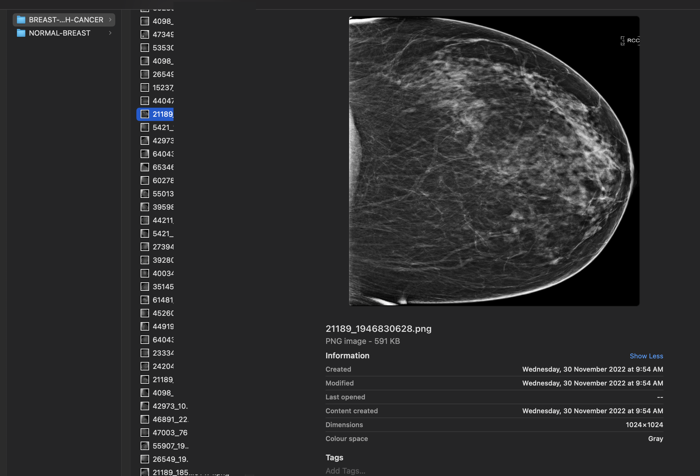
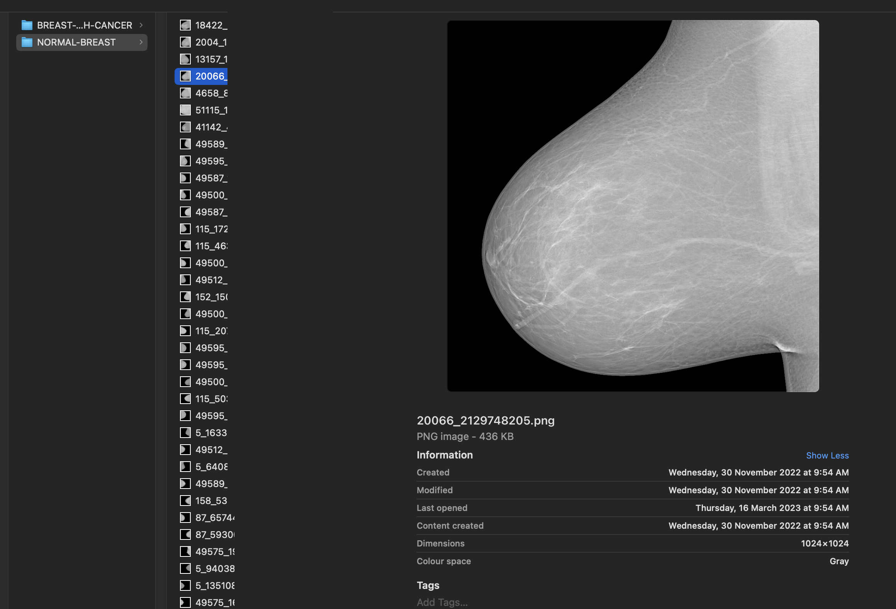
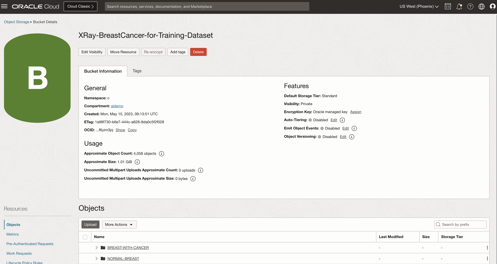

# Create Image Library to Detect Breast Cancer

## Introduction

This lab walks you through organizing an image library in OCI Object Storage. You will load images to Object Storage directly from your laptop using OCI CLI. There are other options to upload images to object storage, such as using OCI Cloud Shell.

Estimated time: 30 minutes

### Objectives

In this lab, you will:
 
* Data Preparation by Classifying Images. 
* Load images to Object Storage using OCI CLI
* Verify images are correctly loaded

### Prerequisites

This lab assumes you have:

* Completed **Setup environment** and **Setup OCI CLI** lab and already logged into OCI console
 
[Youtube video on Create Image Library](youtube:Y3xsaFSwRmA:large)

> **Note:**  In this lab, we will use our local desktop or laptop terminal or command prompt to upload images directly to OCI object storage using OCI CLI. This lab does not show how to upload images to the OCI cloud shell and, from there, use OCI commands to upload images to OCI object storage. Using a local laptop gives us a finer edge in cleaning up the image data and preparing folders locally rather than doing the same on Cloud shell before uploading
 
### **Computer vision**

**Gain insights from visual data**

Automatically extract textual or visual information from images and use that to power analytic applications. Combine visual information from images with additional inputs, such as product sales history and customer reviews to gain a holistic sense of trends, such as product availability and popularity.

**Digital asset management**

Enrich image-based files with metadata, including objects and colors for better indexing and retrieval in a digital asset management system or larger data warehouse. Easily retrieve images for uses ranging from intelligent search to retail management.

**Important**

This workshop provides a basic example of using OCI Vision and other AI services. This example is for illustration and demonstration purposes only and isn't intended to replace any medical imagery analysis tool or official diagnosis recommendation made by a professional. Users need to receive the proper regulated compliance and approvals before using medical and diagnostic use.

## Task 1: What is a Mammogram?

   A mammogram is an X-ray picture of the breast. Doctors use a mammogram to look for early signs of breast cancer. Regular mammograms are the best tests doctors have to find breast cancer early, sometimes up to three years before it can be felt. Patients should continue to get mammograms according to recommended time intervals. Mammograms work best when they can be compared with previous ones. This allows the radiologist to compare them to look for changes in your breasts.

## Task 2: How does Breast Cancer look like on a Mammogram?

   Any area that does not look like normal tissue is a possible cause for concern. The radiologist will look for areas of white, high-density tissue and note its size, shape, and edges. A lump or tumour is a focused white area on a mammogram. Tumours can be cancerous or benign.

   If a tumour is benign, it is not a health risk and is unlikely to grow or change shape. Most tumours found in the breasts are non-cancerous.

   Small white specks are usually harmless. The radiologist will check their shape and pattern, as they can sometimes be a sign of cancer.

## Task 3: Other Breast abnormalities

   As well as dense breast tissue and possible tumours, a radiologist will look for anything unusual on a mammogram.

   Other abnormalities include:

   * Cysts, which are small fluid-filled sacs. Most are simple cysts, which have a thin wall and are not cancerous. If a doctor cannot classify a cyst as a simple cyst, they may do further tests to ensure that it is not cancerous.
   * Calcifications, which are deposits of calcium. Larger deposits of calcium are called macrocalcifications, and they usually occur as a result of ageing. Smaller deposits are called microcalcifications. Depending on the appearance of the microcalcifications, a doctor may test them for possible signs of cancer.
   * Fibroadenomas are benign tumours in the breast. They are round and may feel like marble. People in their 20s and 30s are more likely to have a fibroadenoma, but they can occur at any age.
   * Scar tissue, which often appears white on a mammogram. It is best to inform a doctor of any scarring on the breasts beforehand.
 
## Task 4: Normal Breast Mammogram

   1. Sample image of Normal Breast.

        

        
  
## Task 5: Breast Cancer Mammogram  

   1. Sample images of most likely Breast Cancer.

        

        

        
 
## Task 6: Data Preparation by Classifying Images. 

   1. Create folder **XRayBreastCancer** under this, create two folders **NORMAL\_BREAST** and **BREAST\_WITH\_CANCER**, and place the files in their respective folder

   2. Images with Breast Cancer

        

   3. Images with Normal Breast

        

       > **Note:** From Google search, look for *Breast Cancer Detection Dataset* and download from any of your favourite data sources or bring your own data. Please refer to the previous lab on how to differentiate between an XRay image with Breast cancer and one with Normal Breast Tissue.
 
## Task 7: Load images to Object Storage using OCI CLI

   1. Upload images from main folder into OCI Object storage, subfolders will be automatically created
  
       > **Note :** if you have errors in data labelling ensure that you provide content type as *image/jpeg* or *image/png* .Check the OCI CLI [Command Reference](https://docs.oracle.com/en-us/iaas/tools/oci-cli/3.29.2/oci_cli_docs/cmdref/os/object/bulk-upload.html) 

       ```text
       <copy>oci os object bulk-upload --namespace < my-namespace > -bn < bucket_name > --src-dir < local folder > --overwrite --content-type image/png </copy>
       ```
  
   2. Replace < my-namespace > with your namespace, bucket_name and local folder as per your settings, for example

       ```text
       <copy>oci os object bulk-upload --namespace < my-namespace > -bn X-Rays-BreastCancer-for-Training --src-dir /Users/myuser/XRayBreastCancer --overwrite --content-type image/png </copy>
       ```
 
## Task 8: Verify images are correctly loaded

   1. You can now verify the objects in the bucket by using OCI CLI or just by accessing the bucket in the OCI console. delete any hidden files like .DS files which get uploaded if you are using macOS

       ```text
       <copy>oci os object list --namespace <object_storage_namespace> --bucket-name <bucket_name></copy>
       ```

   2. On OCI Console under Bucket that you have created, you can view the newly created folders and files

        
 
This concludes this lab. You can **proceed now to the next lab**.

## Learn More

* [OCI Object Storage](https://docs.oracle.com/en-us/iaas/Content/Object/home.htm)
* [OCI CLI Command Reference](https://docs.oracle.com/en-us/iaas/tools/oci-cli/3.22.3/oci_cli_docs/oci.html)
 
## Acknowledgements

* **Author** - Madhusudhan Rao B M, Principal Product Manager, Oracle Database
* **Last Updated By/Date** - May 23rd, 2023.