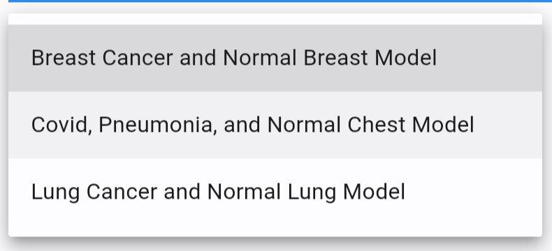
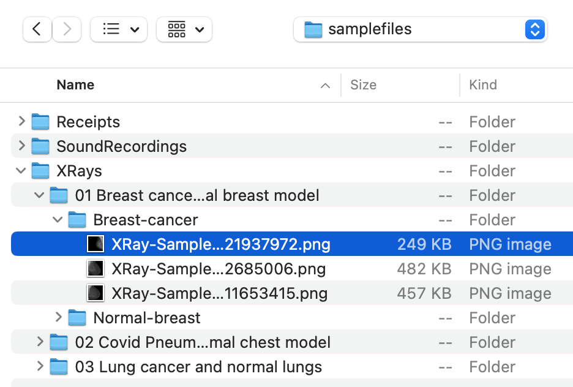
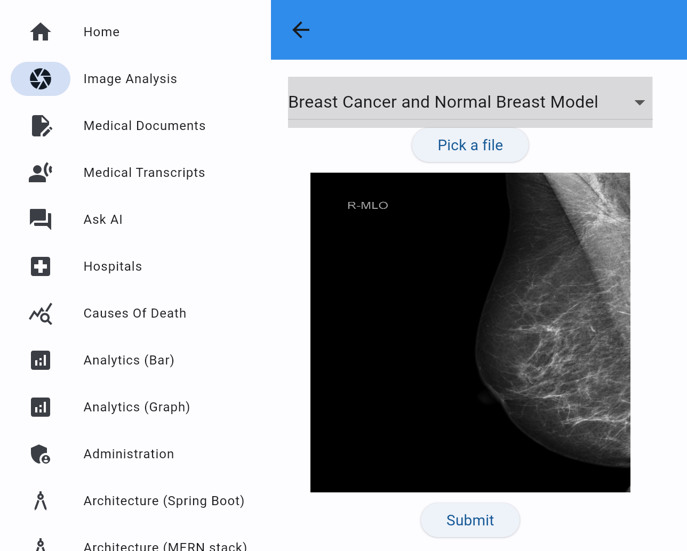
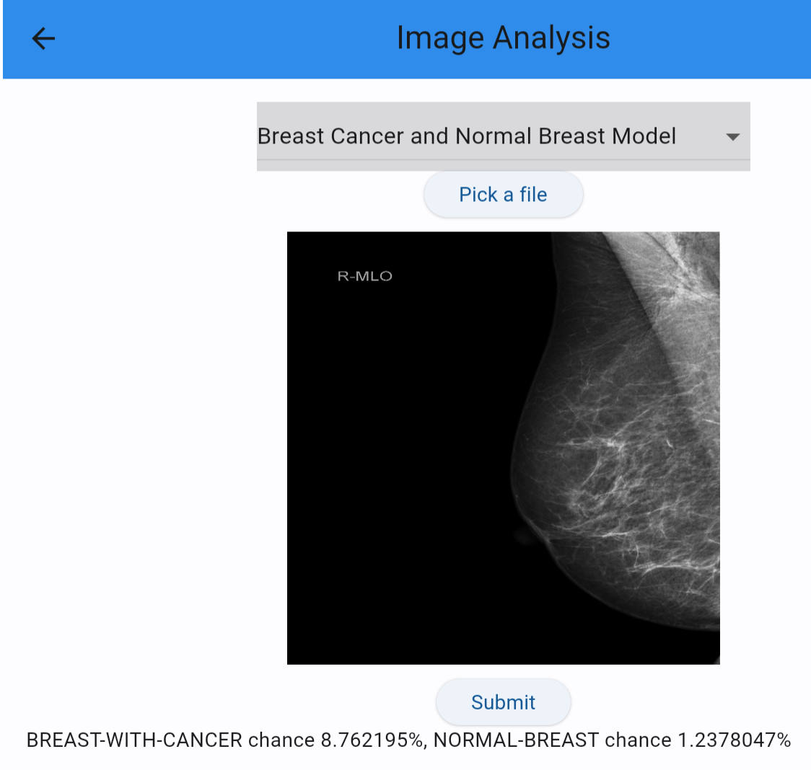

# Full Stack Application for Breast Cancer Detection

## Introduction

This lab will show you how to use Oracle Database, Object Storage, and OCI Vision AI to determine the likelihood of conditions such as breast cancer in X-Ray, etc. images.

Estimated Time: 5 minutes.

### Objectives

* Upload the image from the local file system to the OCI object storage bucket using OCI Object storage rest APIs.
* Input this image to the AI Vision model and verify it against the model by creating request JSON dynamically and leveraging OCI AI Vision rest APIs.
* Receive the response JSON and parse it to get the confidence score against the label as a key-value pair.
* Present the results in Flutter frontend.
* Understand the backend and frontend code.

### Prerequisites

- Completion of Setup lab 

## Task 1: Run the application

   1. Open the frontend via your preferred method as was done in setup and select the `Image Analysis` item from the sidebar menu.
      

   2. Select the `Breast Cancer and Normal Breast Model` item from the `Model Name` drop-down list.
      

   3. Click the `Pick a File` button and Select an X-Ray image file. Example files are provided
      

   4. You will see the model and image file you selected. Now click `Submit`
      

   5. Notice the results of the Vision AI processing which has given a percentage confidence as to whether the X-Ray shows symptoms of breast cancer . 
      

## Task 2: Understand the code

   1. Notice the `/flutter-frontend/lib/imageanalysis.dart` source code and how it creates a request to the Spring Boot backend and parses the JSON response into a resultant chart.
   2. Notice the `/springboot-backend/src/main/java/oracleai/ImageAnalysisController.java` source code and how it creates a request to the breast cancer model deployed in the OCI Vision service and passes the JSON response back to the frontend.

You may now **proceed to the next lab.**..

## Acknowledgements

* **Author** - Paul Parkinson, Architect and Developer Advocate, Oracle Database
* **Last Updated By/Date** - 2024.