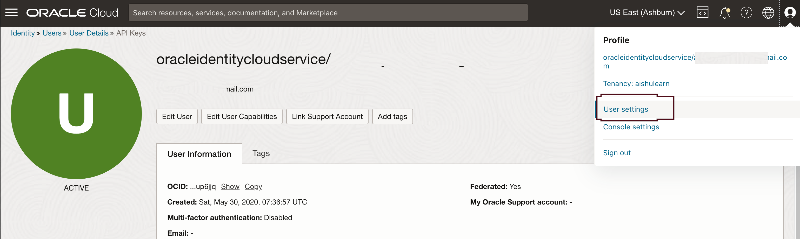
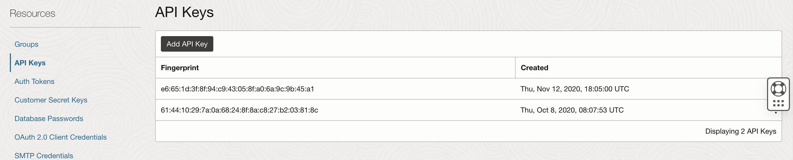
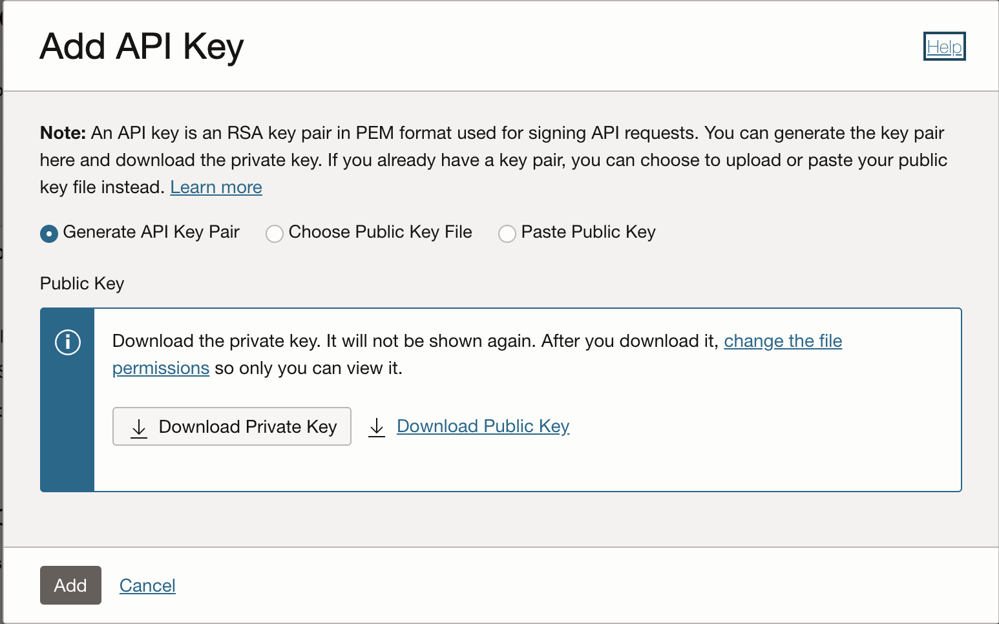
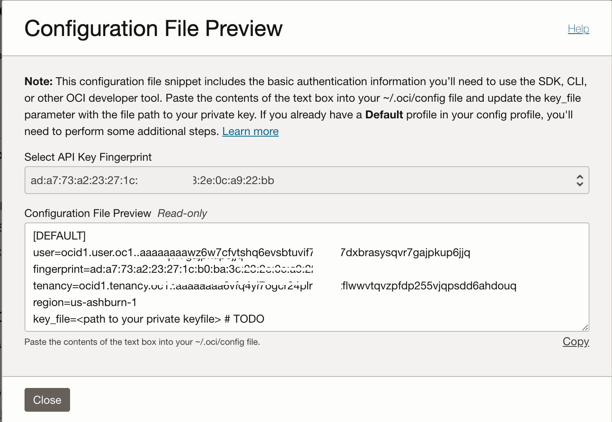
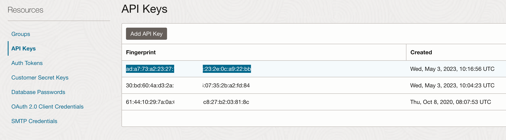

# Setup OCI CLI - Command Line Interface

## Introduction

In this Lab, we will set up the OCI command line interface. This will help us upload images to the Object storage bucket. Later, we will use details such as User OCID, Fingerprint and others in the Oracle APEX front-end development lab.  

[Youtube video on Installing OCI CLI](youtube:nqMAXuqtlW8:large)

### About OCI CLI

The CLI is a small-footprint tool you can use on its own or with the Console to complete Oracle Cloud Infrastructure tasks. The CLI provides the same core functionality as the Console, plus additional commands. Some of these, such as the ability to run scripts, extend Console functionality.

Estimated time: 20 minutes

### Objectives

In this lab, you will:

* Get User's OCID
* Add User's API Key
* Generate and Download RSA Key Pair in PEM format
* Install OCI Command Line Interface
* Update OCI Configuration file
* List all Buckets in a Compartment using OCI CLI

### Prerequisites

This lab assumes:

* You have an Oracle Cloud account with OCI and IDCS administration privileges or
* Your OCI tenancy administrator can perform steps in this lab for you.

> **Note:** Please refer [Quickstart Installation guide on OCI CLI](https://docs.oracle.com/en-us/iaas/Content/API/SDKDocs/cliinstall.htm) for various operating systems, you can **optionally skip this Lab** if you have already installed OCI CLI on your laptop or desktop machine.


## Task 1: Get User's OCID

1. After logging into cloud console, click on User Settings under top right navigation, this will take to **User Details** page,
Copy the OCID into a text file we will need this later.

   

## Task 2: Add User's API Key

1. Under the same page click on **Add API Key** button

   

## Task 3: Generate and Download RSA Key Pair in PEM format

1. Choose an Option to Generate a new key pair, if you already have keys generated you can upload them here, most important is when you generate the key pair download both of them, Click **Add** button

   

2. You should now be able to see the Configuration file, copy paste this into a file we will need it later in Task 5 below.

   

Click on **Close** button

3. We can now see our newly created fingerprint

   

## Task 4: Install OCI Command Line Interface (CLI)

The CLI is a small-footprint tool that you can use on its own or with the Console to complete Oracle Cloud Infrastructure tasks. The CLI provides the same core functionality as the Console, plus additional commands. Some of these, such as the ability to run scripts, extend Console functionality.

1. **Install OCI CLI on MAC OS**

2. If you have not installed brew on your MacOS please refer their official guide [Install Brew on Mac](https://docs.brew.sh/Installation)

    ```text
    <copy>/bin/bash -c "$(curl -fsSL https://raw.githubusercontent.com/Homebrew/install/HEAD/install.sh)"</copy>
    ``` 

    ```text
    <copy>brew update && brew install oci-cli</copy>
    ``` 
3. **Install OCI CLI on Windows OS**
4. Open the PowerShell console using the Run as Administrator option. The installer enables auto-complete by installing and running a script. To allow this script to run, you must enable the RemoteSigned execution policy.

    To configure the remote execution policy for PowerShell, run the following command.

    Download the installer script

    ```text
    <copy>Set-ExecutionPolicy RemoteSigned</copy>
    ```

5. Force PowerShell to use TLS 1.2 for Windows 2012 and Windows 2016:

    ```text
    <copy>[Net.ServicePointManager]::SecurityProtocol = [Net.SecurityProtocolType]::Tls12 </copy>
    ```

6. Download the installer script:

    ```text
    <copy>Invoke-WebRequest https://raw.githubusercontent.com/oracle/oci-cli/master/scripts/install/install.ps1 -OutFile install.ps1
    </copy>
    ```

7. To run the installer script without prompting the user, accepting the default settings, run the following command:
8. ```text
    <copy>./install.ps1 -AcceptAllDefaults  
    </copy>
    ```

9. **On Linux and Unix**

    ```text
    <copy>bash -c "$(curl -L https://raw.githubusercontent.com/oracle/oci-cli/master/scripts/install/install.sh)"</copy>
    ```

10. **Verifying the OCI CLI Installation**

    ```text
    <copy>oci --version</copy>
    ```

    Output will be similar to this version number might vary

    ```text
    <copy>3.23.4</copy>
    ```

## Task 5: Update OCI Configuration file

1. Update DEFAULT values as per your OCI parameters

    ```text
    <copy>vi ~/.oci/config</copy>
    ```
    
    ```text
    <copy>[DEFAULT]
    user=< user OCID >
    fingerprint=< finger print >
    key_file=< Path to .pem Private Key file generated from Task 3>
    tenancy=< Tenancy OCID >
    region=< region ></copy>
    ```

    for example the completed file might look like this, please replace the User OCID, fingerprint, Tenancy OCID, Home region, key_file as per your tenancy and local file path for the key file

    ```text
    <copy>[DEFAULT]
    user=ocid1.user.oc1..aaaaaaaaompu-user-ocid-x63smy6knndy5q
    fingerprint=ad:a7:73:a2:23:-user-fingerprint-:0c:a9:22:bb
    tenancy=ocid1.tenancy.oc1..aaaaaaaa6v-tenancy-ocid-sdd6ahdouq
    region=us-ashburn-1
    key_file=/Users/-user-name-/.oci/oci_api_key.pem
    </copy>
    ```

## Task 6: List all Buckets in a Compartment using OCI CLI

1. Reality check if we can list all buckets in a compartment to check if all configurations are correct. provide your compartment ocid where the OCI buckets have been created

    ```text
    <copy> 
    oci os bucket list --compartment-id ocid1.compartment.oc1..aaaaaaaaud6t-compartment-ocid-xs6n4hgg</copy>
    ```

    The Output will be something like this

    ```text
    <copy>{
      "data": [
        {
          "compartment-id": "ocid1.compartment.oc1..aaaaaaaaud6tkdyourcompartmentocidxs6n4hgg",
          "created-by": "ocid1.saml2idp.oc1..aaaaaaaaiq5whocreated3y2l5hw3a/username@mail.com",
          "defined-tags": null,
          "etag": "fbd9e9e7-abc5-425c-9e10-d8009eb72662",
          "freeform-tags": null,
          "name": "Bucket1",
          "namespace": "yournamespace",
          "time-created": "2023-03-16T08:39:35.619000+00:00"
        },
        {
          "compartment-id": "ocid1.compartment.oc1..aaaaaaaaud6tkdyourcompartmentocidxs6n4hgg",
          "created-by": "ocid1.saml2idp.oc1..aaaaaaaaiq5whocreated3y2l5hw3a/username@mail.com",
          "defined-tags": null,
          "etag": "509b095f-3b9d-4f1f-a2b5-3490a3a8b1fb",
          "freeform-tags": null,
          "name": "Bucket2",
          "namespace": "yournamespace",
          "time-created": "2023-03-15T13:34:40.356000+00:00"
        }
      ]
    }</copy>
    ```

## Task 7: Make note of OCI CLI configuration file

1. We will be using this config file path and OCIDs here in later labs, please make a note of them  

    ```text
    <copy>cat ~/.oci/config</copy>
    ```

    In other operating systems you can open the file using text editor such as Notepad or Vi editor.

    > **Congratulations:** You have now completed the **Common Labs**, which is required for most of the following parts and labs. Now you can proceed to any other Parts of this workshop. All parts are independent of each other.

## Troubleshooting

1. Unable to list OCI Buckets through OCI CLI
   
  Solution 1: Check for all the OCIDs and Fingerprint in the configuration file if it matches with the one in the tenancy settings.

  Solution 2: Check if the buckets have been created in same compartment as the one that you are querying from OCI CLI


You may now **proceed to the next lab**.

## Learn More
 
* [OCI Documentation](https://docs.oracle.com/en-us/iaas/Content/home.htm)
* [Data Labeling Service](https://docs.oracle.com/en-us/iaas/data-labeling/data-labeling/using/about.htm)
* [Configure OCI CLI](https://docs.oracle.com/en-us/iaas/Content/API/SDKDocs/cliconfigure.htm)
* [Install Brew on Mac](https://brew.sh/)

## Acknowledgements

* **Author** - Paul Parkinson, Architect and Developer Advocate
* **Author** - Madhusudhan Rao B M, Principal Product Manager, Oracle Database
* **Last Updated By/Date** - 2023.