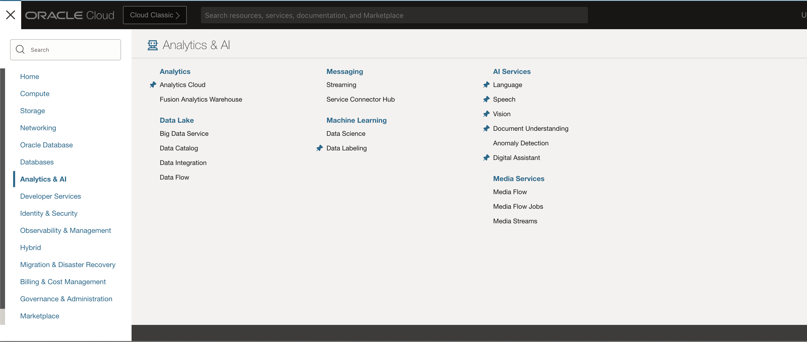

# Train the model using Image Classification AI model

## Introduction

This lab walks you through the steps to train custom Image Classification model and to perform basic testing using OCI Vision.

[Youtube video on Create Image Library](youtube:Y3xsaFSwRmA:large)

Estimated Time: 30 minutes.  (Excluding Model Training)

### About OCI Vision

OCI Vision is a serverless, cloud native service that provides deep learning-based, prebuilt, and custom computer vision models over REST APIs. OCI Vision helps you identify and locate objects, extract text, and identify tables, document types, and key-value pairs from business documents like receipts.

### Objectives

In this lab, you will:
 
* Create OCI Vision Project
* Create and Train Vision Model
* Analyze and evaluate your Model
* Review Request and Response JSON

### Prerequisites

This lab assumes you have:

* Completed previous labs of this workshop: **Setup environment**, **Create image library** and **Label images**.

## Task 1: Create OCI Vision Project

In the previous lab, you have labeled all images (records) in your dataset, which is prerequisite to start working with **Vision** service. In this lab, you will create your first **vision**, image classification, model and you will run some tests to confirm it is working properly.

1. Navigate to Vision page, Using **Navigator** (on the left) navigate to **Analytics & AI** and then choose **Vision**.

    

    
 
2. Continue with AI Vision project setup. Click **Projects** on the left side menu list, confirm you are in correct **Compartment** and click **Create Project** provide project name and description.

    

3. Verify that the Project Status is **Active**

    
 
## Task 2: Create and Train Vision Model
 
1. Create a new AI Vision model
 
    Click **Create Model**, select model type as **Image classification**, under training data **choose existing dataset**

2. Under Data Source choose the dataset that we had created in our previous lab. click **Next**

    

3. Train model. Provide the Model display name and description, training duration can be **Recommended mode**. 
    
    > **Note:** Higher the number of images & higher the training duration better the AI model. Typically 2000+ images under same folder would create a good model. I would recommend minimum of 100 images in a folder, Also the recommended mode completes in less than a few hours, between 2 to 3 hours for approximately 2500 images of 1024 × 1024 pixel resolution.  

    

    Click **Next** to proceed to the second step.

4. Review the settings, click on **Create and train** button

    

    This will create a work request which you can monitor for percentage completed.
    
    You can also monitor the progress by reviewing **Log Messages**.

5. Click on the Project to Verify if the Model Status is **Active**

    
   
## Task 3: Analyze and Evaluate your Model

1. Test you model using few random test images from your previously downloaded X-Ray images 
 
    Click **Local File** and upload image

    

2. Image will be uploaded and automatically analyzed. **Image** and prediction **Results** are displayed.  

     

    This is clearly showing **BREAST\-WITH\-CANCER** with **99% confidence**
  
3. You can repeat this for any other image upload 

    

    This is showing it is **NORMAL\-BREAST** with **76% confidence**.
 
    > **Note:**  As an alternative you can create a bucket upload the testing images to that bucket, get the par url and use **Object storage** radio button, this will also bring same result but request JSON will change for input source element.
 
## Task 4: Review Request and Response JSON

Review Request and Response JSON this will be essential for us while building Application front end

1. Analyze predictions, confidence, requests and responses

    You have already checked **Results** on the right side of the page. 

    Beside a table showing **Prediction Confidence** for each of the **Labels** you can see two additional items in the **Results** area: *Request* and *Response*.

    Expand *Request*. This is request code for JSON call which is requesting prediction to be performed on the selected image (some values are masked).

    ```json
    <copy>{
    "compartmentId": "ocid1.compartment.oc1..aaaaaaaaud6tkdn-your-comparment-ocid-4viqyneyroixcmj54u32q",
    "image": {
        "source": "INLINE",
        "data": "......"
    },
    "features": [
        {
        "modelId": "ocid1.aivisionmodel.oc1.phx.amaaaaaaknuwtj-your-model-id-yaxywphmazehr5ora75wq",
        "featureType": "IMAGE_CLASSIFICATION",
        "maxResults": 5
        }
    ]
    }</copy>
    ```

    Expand *Response* and observe the JSON response with prediction results.

    ```json
    <copy>{
    "imageObjects": null,
    "labels": [
        {
        "name": "NORMAL-BREAST",
        "confidence": 0.7636917
        },
        {
        "name": "BREAST-WITH-CANCER",
        "confidence": 0.23630832
        }
    ],
    "ontologyClasses": [
        {
        "name": "BREAST-WITH-CANCER",
        "parentNames": [],
        "synonymNames": []
        },
        {
        "name": "NORMAL-BREAST",
        "parentNames": [],
        "synonymNames": []
        }
    ],
    "imageText": null,
    "detectedFaces": null,
    "imageClassificationModelVersion": "version",
    "objectDetectionModelVersion": null,
    "textDetectionModelVersion": null,
    "faceDetectionModelVersion": null,
    "errors": []
    }</copy>
    ```

    This concludes this lab and you can **proceed to the next lab**.

## Learn More

* [OCI Vision](https://docs.oracle.com/en-us/iaas/vision/vision/using/home.htm)

## Acknowledgements

* **Author** - Madhusudhan Rao B M, Principal Product Manager, Oracle Database
* **Last Updated By/Date** - Aug 11th, 2023.