# Oracle APEX Integration with ODA

## Introduction

This Lab walks you through the process of adding Oracle Digital Chatbot into your Apex Application and show some of the important things like making a bot initiated conversation and styling the bot and its placements on the APEX page.

Estimated Time: 30 minutes.
  
### Objectives

In this lab, you will:

* Download ODA Oracle Native Client SDK
* Get channel id from ODA console
* Configure settings.js file
* Upload CSS, Image and JS files to Oracle APEX 
* HTML Code to add ODA chatbot on APEX page
* Bot Initiated Conversation
* Update YAML flow in ODA
* Demo of Chatbot in Oracle APEX Page

### Prerequisites

This lab assumes you have:

* Completed previous labs of this workshop.
* You have an Oracle APEX workspace already created.
* Intermediate knowledge of Oracle APEX and PL/SQL

## Task 1: Download ODA Oracle Native Client SDK
 
1. From Oracle Digital Assistant (ODA) and Oracle Mobile Cloud (OMC) Downloads [Downloads](https://www.oracle.com/downloads/cloud/amce-downloads.html) Under **Web SDK** download latest client **Oracle Web SDK 23.04 - Latest**

    Extract **Oracle Digital Assistant - Oracle Native Client SDK 23.4.1** zip file, please note version number might change

    

2. Run the index.html file from your web browser, This will show the disconnected status

    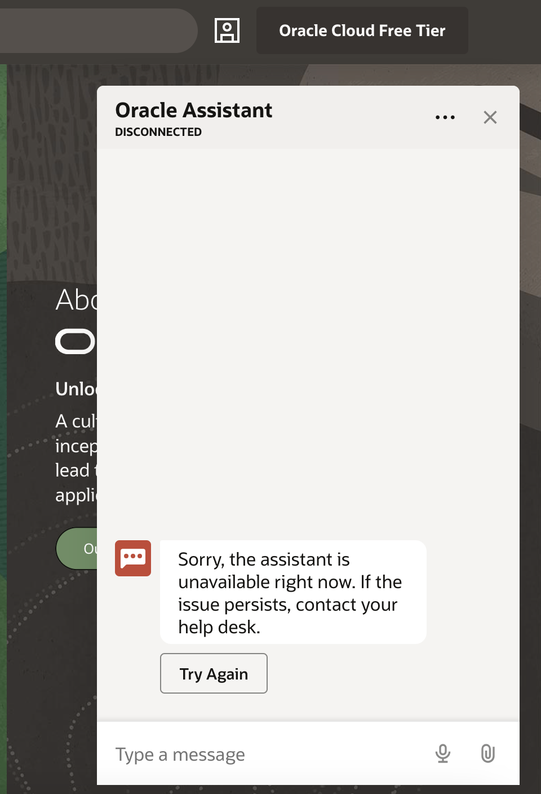

## Task 2: Get channel id from ODA console. 

1. Login to ODA and under Channels, copy the channel id

    

## Task 3: Configure settings.js file

1. Edit **settings.js** file under scripts folder, 

    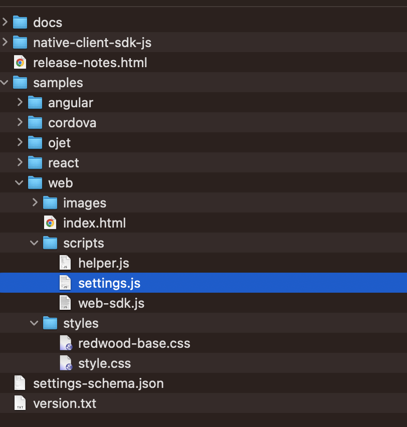

    In **chatWidgetSettings** update **URI** and **channelId**
 
    ```javascript
    <copy>
    const chatWidgetSettings = {
            URI: 'https://oda-your-instance-.data.digitalassistant.oci.oraclecloud.com/',         
            clientAuthEnabled: isClientAuthEnabled,     
            channelId: '4f877adf-your-channelid',    
            userId: '<userID>',                          
            enableAutocomplete: true,               
            enableBotAudioResponse: true,             
            enableClearMessage: true,                 
            enableSpeech: true,                   
            showConnectionStatus: true,        
        };
    </copy>
    ```

    

2. Now the chatbot is connected with ODA channel.

    

3. You can see Auto complete questions and get corresponding answers.

    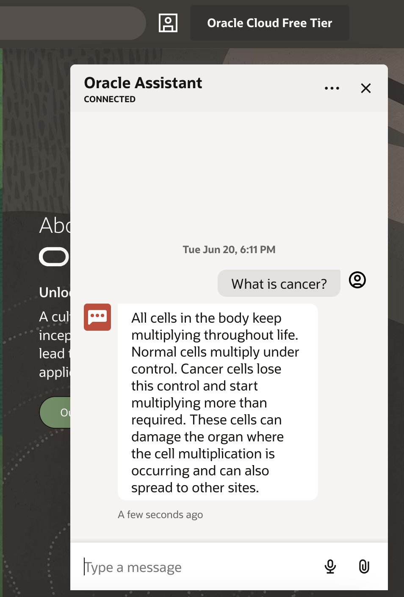

## Task 4: Upload CSS, Image and JS files to Oracle APEX 

1. Upload CSS, Image and JS files to Oracle APEX under \Shared Components\Static Application Files

    

    

2. CSS file can be customized for placement of chat icon and colors. 

    ```css 
        <copy>
        /* chatbot style  */  
        .oda-chat-wrapper {
            --color-branding: #0572ce !important;
        }
        .oda-chat-wrapper.oda-chat-redwood-dark.oda-chat- {
            --color-branding: #0572ce!important;
        } 
        .oda-chat-wrapper .oda-chat-widget  { 
            bottom: calc(var(--position-bottom) * -1)!important; 
            border-radius: 6px 6px 0 0!important;
            box-shadow: 0px -4px 32pxrgba(0,0,0,.1);
            right: calc(var(--position-right) * -1)!important; 
        }  
        .oda-chat-wrapper.oda-chat-redwood-dark {
            color-branding: red;
            color-launch-icon-background: maroon;
        } 
        .oda-chat-wrapper .oda-chat-button { 
        background-color: #514C47;
        border-radius: 0;
        overflow: visible;
        } 
        .oda-chat-wrapper {
            color-branding: #3f41c0;
            color-launch-icon-background: #3f41c0;
        } 
        /* readmore style */
        .readMore {
            color: #fff !important;
            background-color: red;
            font-size: 12pt;
            padding: 4px;
            outline: 0;
            -moz-outline: 0;
            border: 0;
        } 
        .readMore:hover {
            color: #fff !important;
            background-color: #606060 !important;
        }
        .more {
        display: none;
        } 
    </copy>
    ```

## Task 5: HTML Code to add ODA chatbot on APEX page. 

1. Add **Static Content** under APEX Body region

    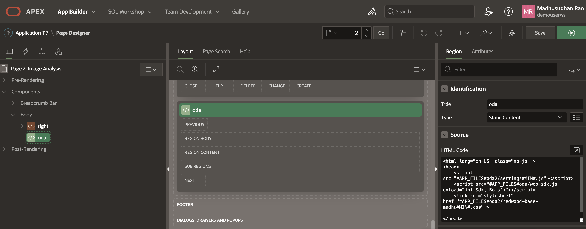

    ```html 
        <copy>
        <head>
        <script src="#APP_FILES#oda2/settings#MIN#.js"></script>
        <script src="#APP_FILES#oda/web-sdk.js" onload="initSdk('Bots')"></script>
        <link rel="stylesheet" href="#APP_FILES#oda2/redwood-base-style#MIN#.css" >  
        </head>
        </copy>
    ```

## Task 6: Bot Initiated Conversation (Optional step).

1. Instead of user initiating conversation, you can have bot initiate the conversation, to do this update settings.js with following 

    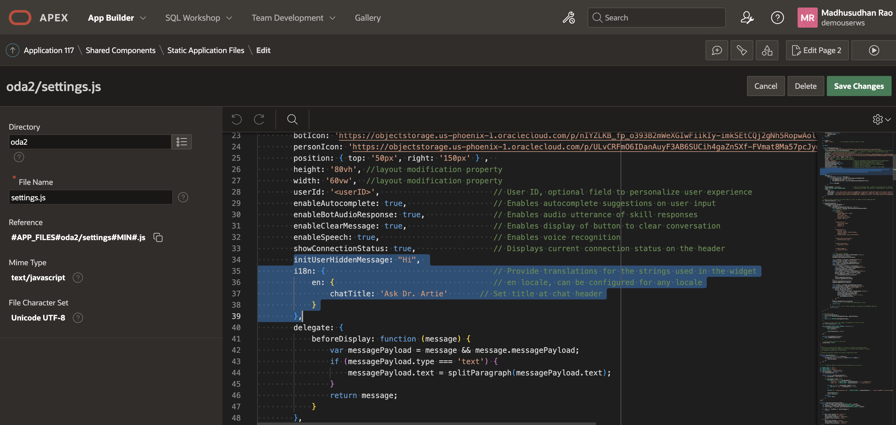

    ```javascript 
        <copy>
            initUserHiddenMessage: "Hi", 
            i18n: {                                     
                // Provide translations for the strings used in the widget
                en: {                                   
                    // en locale, can be configured for any locale
                    chatTitle: 'Ask Dr. Artie'       
                    // Set title at chat header
                }
            }, 
        </copy>
    ```

## Task 7: Update YAML flow in ODA (Optional step)

1. If you want bot initiated conversation instead of user initiated conversation, then the bot should send message to the client browser once it is connected, this we can acheive by updating YAML flow in ODA as shown below.

    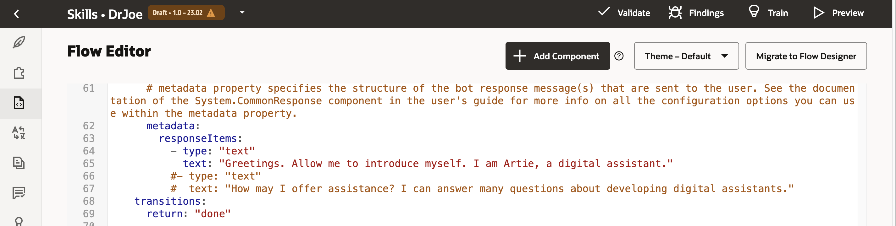

2. Use a good YAML editor like Visual Studio Code to edit and format YAML file and copy paste into ODA Flow.

    ```yaml 
        <copy>
            main: true
            name: DrArtie
            context:
            
            variables: 
                greeting: "Greeting"
                iResult: "nlpresult"
                searchWord: "string"
                cardsRangeStart: "int"
            
            states:

            setCardsRangeStart:
                component: "System.SetVariable"
                properties:
                variable: "cardsRangeStart"
                value: 0
                transitions: {}

            intent:
                component: "System.Intent"
                properties: 
                variable: "iResult" 
                transitions:
                actions: 
                    unresolvedIntent: "cancelGreeting" 
                next: "printGreeting"
                
            printGreeting:
                component: "System.CommonResponse"
                properties: 
                metadata:
                    responseItems:
                    - type: "text"
                        text: "Greetings. Allow me to introduce myself. I am Artie, a digital assistant." 
                transitions:
                return: "done"  

            cancelGreeting:
                component: "System.CommonResponse"
                properties:
                metadata:
                    responseItems:
                    - type: "text"
                        text: "Sorry, I am still learning - \nplease contact us with your queries "
                transitions:
                return: "done"

            # A couple of necessary outputs

            finish:
                component: "System.CommonResponse"
                properties:
                processUserMessage: false
                metadata:
                    responseItems:
                    - type: "text"
                    text: "Hope it was of help"
                transitions:
                return: "done"
        </copy>
    ```

3. Add 2 intents one for **Greeting** 

    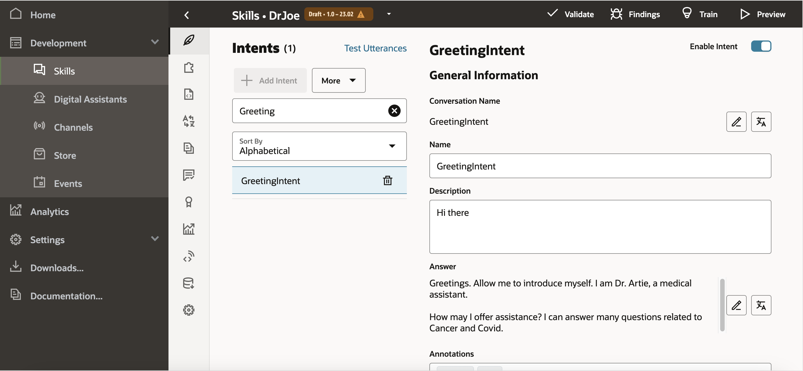

4. Another intent for **exit**.

    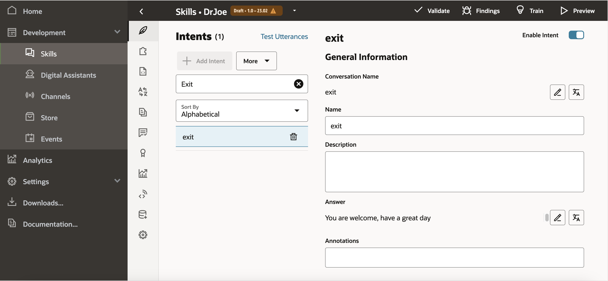

## Task 8: Demo of Chatbot in Oracle APEX Page

1. Click on chat icon to launch chat. Bot will initiate conversation with message

    *Greetings. Allow me to introduce myself. I am Dr. Artie, a medical assistant.*

    *How may I offer assistance? I can answer many questions related to Cancer and Covid.*
    
    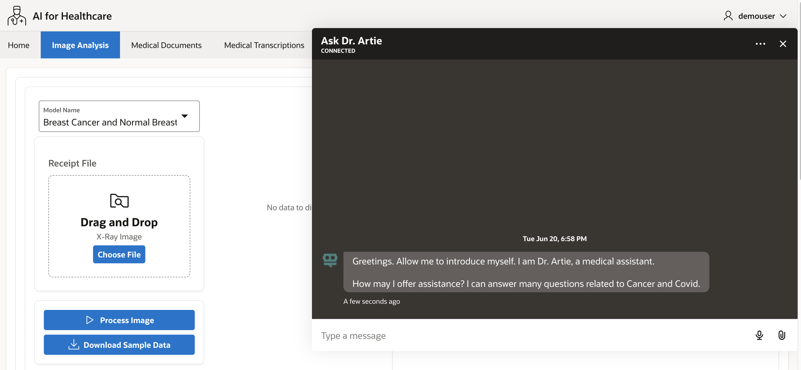

2. From the auto complete questions user selects

    *What is Cancer?*

    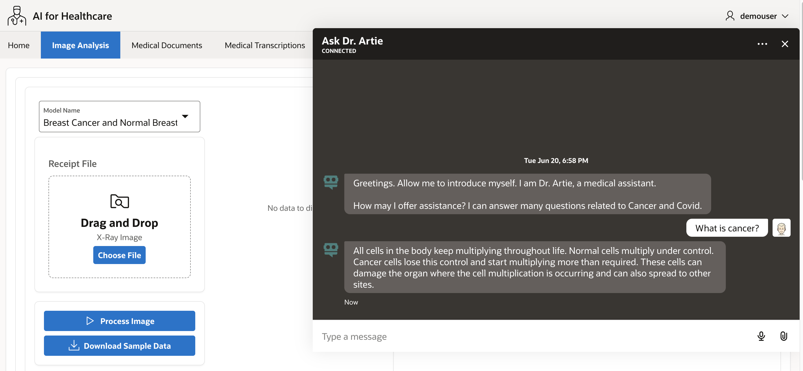

    Bot replies back with answer

    *All cells in the body keep multiplying throughout life. Normal cells multiply under control. Cancer cells lose this control and start multiplying more than required. These cells can damage the organ where the cell multiplication is occurring and can also spread to other sites.*

    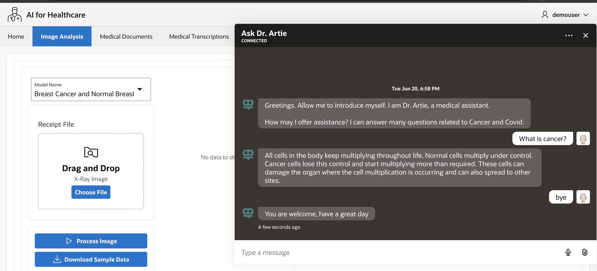

3. User says *Bye* and Bot understands the **exit intent**

    replies back with a greeting

    *You are welcome, have a great day*
 
    > **Congratulations**, you have completed **Oracle APEX Integration with ODA** Lab. The subsequent labs are optional, however, please proceed to the next lab to learn more about **Oracle APEX Maps and Spatial queries to Locate Hospitals**.  

## Learn More

* [Analyze Document](https://docs.oracle.com/en-us/iaas/tools/oci-cli/3.28.0/oci_cli_docs/cmdref/ai-vision/analyze-document.html)
* [Document Understanding](https://docs.oracle.com/en-us/iaas/document-understanding/document-understanding/using/home.htm)

## Acknowledgements

* **Author** - Madhusudhan Rao B M, Principal Product Manager, Oracle Database
* **Last Updated By/Date** - May 23rd, 2023