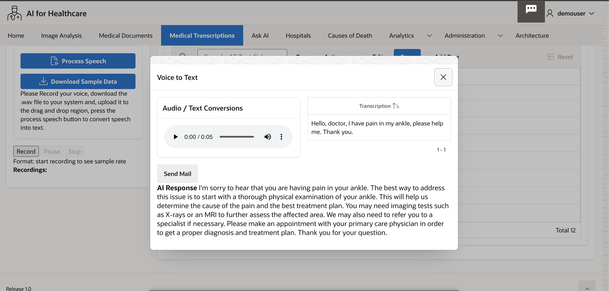

# Oracle APEX Application for Speech Transcription

## Introduction

In this Oracle APEX Application, we will upload an Audio file and let Speech AI convert that into a text file using OCI Speech AI Service.
 
Estimated Time: 30 minutes.
  
### Objectives

In this lab, you will:
 
* Create required schema - 
    * Tables: MACHINE LEARNING CONFIGS, SPEECH AI DOCS, SPEECH AI FIELDS
    * PL/SQL Procedure SPEECH\_AI\_PK, Triggers etc.
* Create Oracle APEX Page
* Verify Oracle APEX File upload settings
* Upload the audio file from the local file system to the OCI object storage bucket using OCI Object storage rest APIs.
* Create Speech Transcription Job
* Review Audio file and Transcribed text content of Audio file
 
### Prerequisites

This lab assumes you have:

* Completed previous labs of this workshop.
* You have an Oracle APEX workspace already created.
 
## Task 1: Create Table - MACHINE LEARNING CONFIGS

We can directly code Object storage bucket location, Web Credential Name, Request JSON etc. However, it is a good practice to store this in a database table so that we can easily update this and add more models in future, so we create a machine learning configuration table for this purpose.

1. Create **MACHINE\_LEARNING\_CONFIGS** to store Machine Learning Configuration Details.

    ```sql
    <copy>
    CREATE TABLE  "MACHINE_LEARNING_CONFIGS" 
   (	
    "ID" NUMBER GENERATED ALWAYS AS IDENTITY MINVALUE 1 MAXVALUE 9999999999999999999999999999 INCREMENT BY 1 START WITH 2 CACHE 20 NOORDER  NOCYCLE  NOKEEP  NOSCALE  NOT NULL ENABLE, 
	"CLASSIFICATION" VARCHAR2(500 CHAR) COLLATE "USING_NLS_COMP", 
	"GC_OCI_OBJ_STORE_BASE_URL" VARCHAR2(500 CHAR) COLLATE "USING_NLS_COMP", 
	"GC_OCI_DOC_AI_URL" VARCHAR2(500 CHAR) COLLATE "USING_NLS_COMP", 
	"GC_OCI_DOC_AI_TIMEOUT_SECS" NUMBER, 
	"GC_WC_CREDENTIAL_ID" VARCHAR2(100 CHAR) COLLATE "USING_NLS_COMP", 
	"GC_OCI_REQ_AI_PAYLOAD" VARCHAR2(3800 CHAR) COLLATE "USING_NLS_COMP", 
	"GC_OCI_RESP_AI_PAYLOAD" VARCHAR2(3800 CHAR) COLLATE "USING_NLS_COMP", 
	"ANALYSIS_NAME" VARCHAR2(200) COLLATE "USING_NLS_COMP", 
	 CONSTRAINT "MACHINE_LEARNING_C_ID_PK" PRIMARY KEY ("ID")
  USING INDEX  ENABLE
   )  DEFAULT COLLATION "USING_NLS_COMP"
    /
    </copy>
    ```

    **Sample Configuration Data** in the table.

    ANALYSIS\_NAME = SPEECH\_AI

    GC\_OCI\_OBJ\_STORE\_BASE\_URL = https://objectstorage.us-phoenix-1.oraclecloud.com/n/your-tenancy/b/your-bucket/o/Input/

    CLASSIFICATION = SPEECH\_AI

    GC\_OCI\_REQ\_AI\_PAYLOAD = 

    ```json
    <copy>
    {
    "compartmentId": "ocid1.compartment.oc1..aaaaaaaaud6tk-your-compartment-roixcmj54u32q",
    "definedTags": null,
    "description": "Medical Transcription",
    "displayName": "Medical Transcription",
    "freeformTags": null,
    "inputLocation": {
        "locationType": "OBJECT_LIST_INLINE_INPUT_LOCATION",
        "objectLocations": [
        {
            "bucketName": "your-bucket",
            "namespaceName": "your-tenancy-namespace",
            "objectNames": [
            "Input/#FILE_NAME#"
            ]
        }
        ]
    },
    "modelDetails": {
        "domain": "GENERIC",
        "languageCode": "en-US"
    },
    "normalization": null,
    "outputLocation": {
        "bucketName": "your-bucket",
        "namespaceName": "your-tenancy-namespace",
        "prefix": "Output/"
    }
    }
    </copy>
    ```
    
    Your-Bucket-Name is the Bucket Name where Image will be temporarily uploaded.

## Task 2: Create Table - DOCUMENT AI DOCS
 
1. Create **DOCUMENT\_AI\_DOCS** Table.

    DOCUMENT\_AI\_DOCS table is primarily used to store the JSON response after uploading the audio file to object storage and creating Speech AI Transcription Job. The JSON response contains the OCI Labels and their corresponding confidence scores. you can also name this table as **SPEECH\_AI\_DOCS**

    ```sql
    <copy> 
    CREATE TABLE  "DOCUMENT_AI_DOCS" 
    (	
        "DOCUMENT_ID" NUMBER GENERATED BY DEFAULT ON NULL AS IDENTITY MINVALUE 1 MAXVALUE 9999999999999999999999999999 INCREMENT BY 1 START WITH 1 CACHE 20 NOORDER  NOCYCLE  NOKEEP  NOSCALE  NOT NULL ENABLE, 
        "FILE_NAME" VARCHAR2(100) COLLATE "USING_NLS_COMP" NOT NULL ENABLE, 
        "MIME_TYPE" VARCHAR2(100) COLLATE "USING_NLS_COMP" NOT NULL ENABLE, 
        "OBJECT_STORE_URL" VARCHAR2(1000) COLLATE "USING_NLS_COMP" NOT NULL ENABLE, 
        "DOC_AI_JSON" CLOB COLLATE "USING_NLS_COMP", 
        "LANGUAGE_CODE" VARCHAR2(10) COLLATE "USING_NLS_COMP", 
        "LANGUAGE_SCORE" NUMBER, 
        "DOCUMENT_TYPE_CODE" VARCHAR2(50) COLLATE "USING_NLS_COMP", 
        "DOCUMENT_TYPE_SCORE" NUMBER, 
        "PAGE_COUNT" NUMBER, 
        "STATUS_CODE" VARCHAR2(25) COLLATE "USING_NLS_COMP" DEFAULT ON NULL 'WIP' NOT NULL ENABLE, 
        "CREATION_DATE" TIMESTAMP (6) WITH LOCAL TIME ZONE NOT NULL ENABLE, 
        "CREATED_BY" VARCHAR2(255) COLLATE "USING_NLS_COMP" NOT NULL ENABLE, 
        "LAST_UPDATE_DATE" TIMESTAMP (6) WITH LOCAL TIME ZONE NOT NULL ENABLE, 
        "LAST_UPDATED_BY" VARCHAR2(255) COLLATE "USING_NLS_COMP" NOT NULL ENABLE, 
        "LABEL1" VARCHAR2(100) COLLATE "USING_NLS_COMP", 
        "LABEL1_SCORE" NUMBER, 
        "LABEL2" VARCHAR2(100) COLLATE "USING_NLS_COMP", 
        "LABEL2_SCORE" NUMBER, 
        "AISPEECHTRANS_JOBID" VARCHAR2(1000) COLLATE "USING_NLS_COMP", 
        "AISPEECH_PREFIX" VARCHAR2(1000) COLLATE "USING_NLS_COMP", 
        CONSTRAINT "DOCUMENT_AI_DOCS_PK" PRIMARY KEY ("DOCUMENT_ID")
    USING INDEX  ENABLE
    )  DEFAULT COLLATION "USING_NLS_COMP"
    /

    CREATE OR REPLACE EDITIONABLE TRIGGER  "DOCUMENT_AI_DOCS_BIU" 
    BEFORE INSERT OR UPDATE ON DOCUMENT_AI_DOCS FOR EACH ROW
    BEGIN
    IF INSERTING THEN
        :new.created_by       := COALESCE(SYS_CONTEXT('APEX$SESSION','APP_USER'),SYS_CONTEXT('USERENV', 'SESSION_USER'));
        :new.creation_date    := current_timestamp;
        :new.last_updated_by  := COALESCE(SYS_CONTEXT('APEX$SESSION','APP_USER'),SYS_CONTEXT('USERENV', 'SESSION_USER'));
        :new.last_update_date := current_timestamp;
    ELSIF UPDATING THEN
        :new.last_updated_by  := COALESCE(SYS_CONTEXT('APEX$SESSION','APP_USER'),USER);
        :new.last_update_date := current_timestamp;
    END IF;
    END;

    /

    ALTER TRIGGER  "DOCUMENT_AI_DOCS_BIU" ENABLE
    /
     
    </copy>
    ```

## Task 3: Create Table - DOCUMENT AI FIELDS

**DOCUMENT\_AI\_FIELDS** table is used to store the labels and corresponding scores. This is what we get after the parsing of the JSON response. You can also name this table as **SPEECH\_AI\_FIELDS** if you would like to create a seperate table just to handle Speech AI Data.

1. Create **DOCUMENT\_AI\_FIELDS** .

    ```sql
    <copy> 
    CREATE TABLE  "DOCUMENT_AI_FIELDS" 
    (	"WORD_ID" NUMBER GENERATED BY DEFAULT ON NULL AS IDENTITY   MINVALUE 1 MAXVALUE 9999999999999999999999999999 
        INCREMENT BY 1 START WITH 1 CACHE 20 NOORDER  NOCYCLE  NOKEEP  NOSCALE  NOT NULL ENABLE, 
        "DOCUMENT_ID" NUMBER NOT NULL ENABLE, 
        "FIELD_TYPE_CODE" VARCHAR2(50) COLLATE "USING_NLS_COMP" NOT NULL ENABLE, 
        "FIELD_LABEL" VARCHAR2(100) COLLATE "USING_NLS_COMP", 
        "LABEL_SCORE" NUMBER, 
        "FIELD_VALUE" VARCHAR2(1000) COLLATE "USING_NLS_COMP", 
        "CREATION_DATE" TIMESTAMP (6) WITH LOCAL TIME ZONE NOT NULL ENABLE, 
        "CREATED_BY" VARCHAR2(255) COLLATE "USING_NLS_COMP" NOT NULL ENABLE, 
        "LAST_UPDATE_DATE" TIMESTAMP (6) WITH LOCAL TIME ZONE NOT NULL ENABLE, 
        "LAST_UPDATED_BY" VARCHAR2(255) COLLATE "USING_NLS_COMP" NOT NULL ENABLE, 
        "EXPENSE" VARCHAR2(50) COLLATE "USING_NLS_COMP", 
        CONSTRAINT "DOCUMENT_AI_FIELDS_PK" PRIMARY KEY ("WORD_ID")
        USING INDEX  ENABLE
    )  DEFAULT COLLATION "USING_NLS_COMP"
    </copy>
    ```

    ```sql
    <copy> 
    CREATE INDEX  "DOCUMENT_AI_FIELDS_N1" ON  "DOCUMENT_AI_FIELDS" 
    ("DOCUMENT_ID")
    </copy>
    ```

    ```sql
    <copy> 
    CREATE OR REPLACE EDITIONABLE TRIGGER  "DOCUMENT_AI_FIELDS_BIU" 
    BEFORE INSERT OR UPDATE ON DOCUMENT_AI_FIELDS FOR EACH ROW
    BEGIN
    IF INSERTING THEN
        :new.created_by       := COALESCE(SYS_CONTEXT('APEX$SESSION','APP_USER'),SYS_CONTEXT('USERENV', 'SESSION_USER'));
        :new.creation_date    := current_timestamp;
        :new.last_updated_by  := COALESCE(SYS_CONTEXT('APEX$SESSION','APP_USER'),SYS_CONTEXT('USERENV', 'SESSION_USER'));
        :new.last_update_date := current_timestamp;
    ELSIF UPDATING THEN
        :new.last_updated_by  := COALESCE(SYS_CONTEXT('APEX$SESSION','APP_USER'),USER);
        :new.last_update_date := current_timestamp;
    END IF;
    END;
    </copy>
    ```

    ```sql
    <copy> 
    ALTER TRIGGER  "DOCUMENT_AI_FIELDS_BIU" ENABLE 
    </copy>
    ```
   
## Task 4: Create PL/SQL Package

You can login to Oracle APEX Workspace and select SQL worksheet to run any of the SQL commands or Create Tables or Packages.

1. Create PL/SQL Package Specs.

    ```sql
    <copy>
    create or replace PACKAGE SPEECH_AI_PK AS  
    GC_WC_CREDENTIAL_ID        CONSTANT VARCHAR2(50)   := 'Your-Apex-Credentials';  
    
    --- Dynamic variables ---------
    v_GC_OCI_OBJ_STORE_BASE_URL  MACHINE_LEARNING_CONFIGS.GC_OCI_OBJ_STORE_BASE_URL%TYPE;
    v_GC_OCI_DOC_AI_URL          MACHINE_LEARNING_CONFIGS.GC_OCI_DOC_AI_URL%TYPE;
    v_GC_OCI_DOC_AI_TIMEOUT_SECS  MACHINE_LEARNING_CONFIGS.GC_OCI_DOC_AI_TIMEOUT_SECS%TYPE;
    v_GC_WC_CREDENTIAL_ID  MACHINE_LEARNING_CONFIGS.GC_WC_CREDENTIAL_ID%TYPE;
    v_GC_OCI_REQ_AI_PAYLOAD MACHINE_LEARNING_CONFIGS.GC_OCI_REQ_AI_PAYLOAD%TYPE;
    --PROCEDURE initialize;
    
    PROCEDURE process_file 
    (p_apex_file_name  IN VARCHAR2, 
    v_id IN MACHINE_LEARNING_CONFIGS.ID%TYPE,
    x_document_id    OUT document_ai_docs.document_id%TYPE); 
    
    PROCEDURE render_document 
    (x_document_id  IN document_ai_docs.document_id%TYPE); 
    
    END SPEECH_AI_PK;
 
    </copy>
    ``` 

    Create Package Body

    ```sql
    <copy> 
    create or replace PACKAGE BODY SPEECH_AI_PK  
    IS 
    
    PROCEDURE initialize (v_id IN MACHINE_LEARNING_CONFIGS.ID%TYPE) AS
    --------------------------------------------------------- 
    BEGIN
    SELECT GC_OCI_OBJ_STORE_BASE_URL,
            GC_OCI_DOC_AI_URL,
            GC_OCI_DOC_AI_TIMEOUT_SECS,
            GC_WC_CREDENTIAL_ID,
            GC_OCI_REQ_AI_PAYLOAD
    INTO   v_GC_OCI_OBJ_STORE_BASE_URL,
            v_GC_OCI_DOC_AI_URL,
            v_GC_OCI_DOC_AI_TIMEOUT_SECS,
            v_GC_WC_CREDENTIAL_ID,
            v_GC_OCI_REQ_AI_PAYLOAD
    FROM   MACHINE_LEARNING_CONFIGS WHERE ID = v_id;
    END initialize;
    
    --------------------------------------------------------- 
    --------------------------------------------------------- 

    PROCEDURE put_file 
    (p_mime_type         IN VARCHAR2, 
    p_file_blob         IN BLOB, 
    p_file_name         IN VARCHAR2, 
    x_object_store_url OUT VARCHAR2) IS 
    
    l_response            CLOB; 
    
    BEGIN 
    
    -- Build the full Object Storage URL.  
    x_object_store_url := SPEECH_AI_PK.v_GC_OCI_OBJ_STORE_BASE_URL || p_file_name;  
    
    -- Set Mime Type of the file in the Request Header. 
    apex_web_service.g_request_headers.DELETE; 
    apex_web_service.g_request_headers(1).name  := 'Content-Type'; 
    apex_web_service.g_request_headers(1).value := p_mime_type; 
    
    -- Call Web Service to PUT file in OCI. 
    l_response := apex_web_service.make_rest_request 
    (p_url                  => UTL_URL.ESCAPE(x_object_store_url), 
        p_http_method          => 'PUT', 
        p_body_blob            => p_file_blob,  
        p_credential_static_id => GC_WC_CREDENTIAL_ID); 
    
    IF apex_web_service.g_status_code != 200 then 
        raise_application_error(-20111,'Unable to Upload File to OCI.'); 
    END IF; 
    
    EXCEPTION WHEN OTHERS THEN 
    RAISE; 
    END put_file; 
    
    --------------------------------------------------------- 
    --------------------------------------------------------- 

    PROCEDURE upload_file 
    (p_apex_file_name    IN VARCHAR2, 
    x_file_name        OUT VARCHAR2, 
    x_object_store_url OUT VARCHAR2, 
    x_document_id      OUT document_ai_docs.document_id%TYPE) IS 
    
    CURSOR cr_file_info IS 
        SELECT filename 
        ,      blob_content 
        ,      mime_type 
        FROM   apex_application_temp_files 
        WHERE  name = p_apex_file_name; 
    
    lr_file_info          cr_file_info%ROWTYPE; 
    
    BEGIN 
    
    -- Get the File BLOB Content and File Name uploaded from APEX. 
    OPEN  cr_file_info; 
    FETCH cr_file_info INTO lr_file_info; 
    CLOSE cr_file_info; 
    
    x_file_name := lr_file_info.filename; 
    
    -- Post file to OCI Object Store. 
    put_file 
    (p_mime_type        => lr_file_info.mime_type, 
        p_file_blob        => lr_file_info.blob_content, 
        p_file_name        => lr_file_info.filename, 
        x_object_store_url => x_object_store_url); 
    
    -- Create Document Record 
    INSERT INTO document_ai_docs (file_name, mime_type, object_store_url) 
    VALUES (lr_file_info.filename, lr_file_info.mime_type, x_object_store_url)  
    RETURNING document_id INTO x_document_id; 
    
    EXCEPTION WHEN OTHERS THEN 
    RAISE; 
    END upload_file; 
    
    --------------------------------------------------------- 
    --------------------------------------------------------- 
    
    PROCEDURE speech_ai 
    (p_file_name   IN VARCHAR2, 
    p_document_id IN document_ai_docs.document_id%TYPE) IS 
    
        CURSOR cr_document_data (cp_json IN CLOB) IS 
        SELECT jt.* 
        FROM   JSON_TABLE(cp_json, '$' 
                COLUMNS (AISPEECHTRANS_JOBID      VARCHAR2(1000)        PATH '$.id', 
                        AISPEECH_PREFIX          VARCHAR2(1000)        PATH '$.outputLocation.prefix'  )) jt; 

    
    CURSOR cr_document_fields (cp_json IN CLOB) IS 
        SELECT jt.* 
        FROM   JSON_TABLE(cp_json, '$.pages[*]' 
                COLUMNS (page_number       NUMBER        PATH '$.pageNumber', 
                        NESTED PATH '$.documentFields[*]' COLUMNS 
                        (field_type_code VARCHAR2(50)   PATH '$.fieldType', 
                            field_label     VARCHAR2(100)  PATH '$.fieldLabel.name', 
                            label_score     NUMBER         PATH '$.fieldLabel.confidence', 
                            field_value     VARCHAR2(1000) PATH '$.fieldValue.value' 
                            ))) jt 
        WHERE  jt.field_type_code = 'KEY_VALUE'; 
        
    l_request_json        VARCHAR2(32000); 
    l_response_json       CLOB; 
    lr_document_data      cr_document_data%ROWTYPE; 
    
    BEGIN 
    
    -- Replace the uploaded filename in the JSON payload to be sent to Document AI. 
    l_request_json := REPLACE(v_GC_OCI_REQ_AI_PAYLOAD, '#FILE_NAME#', p_file_name);
    
    -- Set Content-Type in the Request Header. 
    apex_web_service.g_request_headers.DELETE; 
    apex_web_service.g_request_headers(1).name  := 'Content-Type'; 
    apex_web_service.g_request_headers(1).value := 'application/json'; 
    
    -- Call the Speecj AI  REST Web Service.  
    l_response_json := apex_web_service.make_rest_request 
    (p_url                  => v_GC_OCI_DOC_AI_URL, 
        p_http_method          => 'POST', 
        p_body                 => l_request_json, 
        p_credential_static_id => GC_WC_CREDENTIAL_ID);  
    
    IF apex_web_service.g_status_code != 200 then 
        raise_application_error(-20112,'Unable to call OCI Document AI.'); 
    END IF; 
    
    -- Get Document Level Data from the JSON response. 
    OPEN  cr_document_data (cp_json => l_response_json); 
    FETCH cr_document_data INTO lr_document_data; 
    CLOSE cr_document_data; 
    
    -- Get Key Value Fields from JSON and populate table. 
    FOR r_field IN cr_document_fields (cp_json => l_response_json) LOOP 
        INSERT INTO document_ai_fields (document_id,field_type_code,field_label,label_score,field_value) 
        VALUES (p_document_id,r_field.field_type_code,r_field.field_label,r_field.label_score,r_field.field_value); 
    END LOOP; 
        
    UPDATE document_ai_docs 
    SET    doc_ai_json         = l_response_json 
    ,      AISPEECHTRANS_JOBID       = lr_document_data.AISPEECHTRANS_JOBID 
    ,      AISPEECH_PREFIX      = lr_document_data.AISPEECH_PREFIX  
    WHERE  document_id         = p_document_id; 
    
    EXCEPTION WHEN OTHERS THEN 
    RAISE; 
    END speech_ai; 

    --------------------------------------------------------- 
    ---------------------------------------------------------  

    PROCEDURE process_file 
    (p_apex_file_name  IN VARCHAR2, 
    v_id IN MACHINE_LEARNING_CONFIGS.ID%TYPE,
    x_document_id    OUT document_ai_docs.document_id%TYPE) IS 
    
    l_object_store_url    VARCHAR2(1000); 
    l_file_name           VARCHAR2(100); 
    
    BEGIN 
    initialize(v_id);
    
    -- Get file and upload to OCI Object Storage. 
    upload_file 
    (p_apex_file_name   => p_apex_file_name,  
        x_file_name        => l_file_name, 
        x_object_store_url => l_object_store_url, 
        x_document_id      => x_document_id); 
    
    -- Call speech AI 
    speech_ai 
    (p_file_name   => l_file_name, 
        p_document_id => x_document_id); 
    
    EXCEPTION WHEN OTHERS THEN 
    RAISE; 
    END process_file; 
    
    --------------------------------------------------------- 
    --------------------------------------------------------- 

    FUNCTION get_file (p_request_url IN VARCHAR2) RETURN BLOB IS 
    
    l_file_blob           BLOB; 
    
    BEGIN 
    
    -- Call OCI Web Service to get the requested file. 
    l_file_blob := apex_web_service.make_rest_request_b 
    (p_url                  => UTL_URL.ESCAPE(p_request_url), 
        p_http_method          => 'GET', 
        p_credential_static_id => GC_WC_CREDENTIAL_ID); 
    
    IF apex_web_service.g_status_code != 200 then 
        raise_application_error(-20112,'Unable to Get File.'); 
    END IF; 
    
    RETURN l_file_blob; 
    
    EXCEPTION WHEN OTHERS THEN 
    RAISE; 
    END get_file; 
    
    --------------------------------------------------------- 
    --------------------------------------------------------- 

    PROCEDURE render_document 
    (x_document_id  IN document_ai_docs.document_id%TYPE) IS 
    
    CURSOR cr_document IS 
        SELECT mime_type 
        ,      object_store_url 
        FROM   document_ai_docs 
        WHERE  document_id = x_document_id; 
    
    lr_document           cr_document%ROWTYPE; 
    l_file_blob           BLOB; 
    
    BEGIN 
    
    -- Get the OCI URL and Mimetytpe of the receipt file. 
    OPEN  cr_document; 
    FETCH cr_document INTO lr_document; 
    CLOSE cr_document; 
    
    -- Get the file BLOB from OCI Object Storage. 
    l_file_blob := get_file (p_request_url => lr_document.object_store_url); 
    
    -- Output the file so it shows in APEX. 
    owa_util.mime_header(lr_document.mime_type,false); 
    htp.p('Content-Length: ' || dbms_lob.getlength(l_file_blob));  
    owa_util.http_header_close;   
    wpg_docload.download_file(l_file_blob); 
    
    EXCEPTION WHEN OTHERS THEN 
    RAISE; 
    END render_document; 
    
    
    END;

    </copy>
    ```

## Task 5: Verify File upload settings

In the Oracle APEX page, we will use the file upload Dropzone plugin, or we can also use the regular file upload page item.

1. In the APEX page add page item of type file upload

    

2. Add Process Audio button

    

3. This will invoke a process by name **Process File**

    

    ```sql
    <copy>
    BEGIN
    SPEECH_AI_PK.process_file (p_apex_file_name => :P34_RECEIPT_FILE, v_id => 62, x_document_id => :P34_DOCUMENT_ID);
    END;
    </copy>
    ```

## Task 6: Create Oracle Apex Page to Upload file and display results
 
There are 4 main sections on this page

1. Create Audio File.

    

2. Record audio feature and save the audio file on disk.

    

3. Upload Audio file saved on disk and click on **Process Speech** buton. View the current speech job that has been submitted by the user.

    

4. Edit view to list current speech job.

    

5. Once the Job execution has been completed, view the speech converted to text. You can also feed this response text as input to AI (which we will about talk in next lab)

    

    

6. The Query to extract current speech job is listed below. please update according to your environment.
 
    ```sql
    <copy>
        DECLARE
    l_max_sal NUMBER;
    audio_url varchar2(500) := 'https://objectstorage.us-phoenix-1.oraclecloud.com/n/your-namespace/b/your-bucket/o/'||:P22_OBJ;
    myext varchar2(500) := :P22_OBJ;
    cnt number := 0;
    cntw number := 0;
    fulljsonurl varchar2(2000) := 'https://objectstorage.us-phoenix-1.oraclecloud.com/n/your-namespace/b/your-bucket/o/'||:P22_OBJ;
    --p_clob001 clob;
    l_response clob;
    l_http_status_code number;
    l_inputaudio varchar2(2000) := :P22_OBJ;
    l_filename varchar2(100) := :P22_FN;
    l_spjob varchar2(2000) := 'https://objectstorage.us-phoenix-1.oraclecloud.com/n/your-namespace/b/your-bucket/o/'||:P22_SPJOB||'your-namespace_medical_transcripts_Input/'||:P22_FN||'.json';
        
    BEGIN 
        cnt := INSTR(:P22_OBJ, '.json');
        cntw := INSTR(:P22_OBJ, '.wav');  
            
        apex_web_service.g_request_headers.delete(); 
        apex_web_service.g_request_headers(1).name  := 'Content-Type'; 
        apex_web_service.g_request_headers(1).value := 'application/json';  

        l_response := apex_web_service.make_rest_request(  
        p_url => l_spjob,
        p_http_method => 'GET' 
            ); 
    
        -- add response object to apex collection --
        --and display collection using classic report query --
        l_http_status_code := apex_web_service.g_status_code; 
        if l_http_status_code = 200 then 
        apex_collection.create_or_truncate_collection( 'REST_COLLECTION' ); 
        apex_collection.add_member( 
            p_collection_name => 'REST_COLLECTION', 
            p_clob001 =>         l_response  ); 
        end if;      

        -- display audio file on browser --
        htp.p('<audio controls preload>
            <source src="'||audio_url||'" type="audio/mpeg">
        </audio>');
    
    END;
        </copy>
        ```

7. Display APEX Collection to view Transcription reponse

    

    ```sql
    <copy>
        select 
        j."transcription"  
        from apex_collections c, json_table(
        c.clob001 format json,
        '$.transcriptions[*]'
        columns (
        "transcription"      VARCHAR2(4000)  path '$.transcription' 
        )
        ) j
        where c.collection_name = 'REST_COLLECTION'  
    </copy>
    ```

    > **Congratulations**, you have completed **Creating APEX Application for Speech Transcription** Labs. The subsequent labs are optional, however, please proceed to the next lab to learn more about **OCI Speech with Cohere AI Integration**. 

## Learn More

* [OCI Vision](https://docs.oracle.com/en-us/iaas/vision/vision/using/home.htm)
* [WPG_DOCLOAD](https://docs.oracle.com/en/database/oracle/oracle-database/19/arpls/WPG_DOCLOAD.html)

## Acknowledgements

* **Author** - Madhusudhan Rao B M, Principal Product Manager, Oracle Database
* **Last Updated By/Date** - May 23rd, 2023.