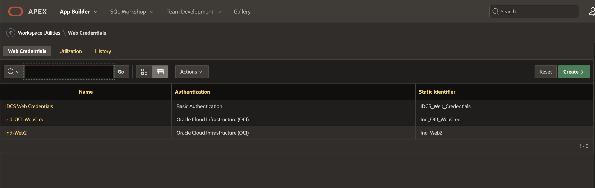

# Create an Oracle Autonomous Database and Oracle APEX How-to's

## Introduction

Learn how to provision Autonomous Database using the OCI console.

Estimated Time: 5 minutes

### Objectives

In this lab, you will:

- Learn how to provision a new Oracle Autonomous Database
- Learn some of the important Oracle APEX How to's (This is Optional)

### Prerequisites

- This lab requires completion of the Get Started section in the Contents menu on the left.

## Task 1: Create or select a compartment
 
A compartment is a collection of cloud assets, like compute instances, load balancers, databases, and so on. By default, a root compartment was created for you when you created your tenancy (for example, when you registered for the trial account). It is possible to create everything in the root compartment, but Oracle recommends that you create sub-compartments to help manage your resources more efficiently.

If you are using an Oracle LiveLabs-provided sandbox, you don't have privileges to create a compartment and should skip this first task. Oracle LiveLabs has already created a compartment for you and you should use that one. Even though you can't create a compartment, you can review the steps below to see how it is done.

> **Note:**  If you already have a compartment created, you can **optionally skip this Task**.


1. Click the three-line menu on the top left of the console. Scroll down to the bottom of the menu, click **Identity & Security -> Compartments**.

    

    Then, click the **Create Compartment** button to create a sub-compartment.

    

2. Give the compartment a name and description. Be sure your root compartment appears as the parent compartment. Press the blue **Create Compartment** button.

    

    The compartment is created and you can use it for your cloud services!

## Task 2: Choose Autonomous Database from the OCI services menu
 
1. Once logged into Oracle Cloud, click the navigation menu in the upper left to show top level navigation choices:

    

    Then, select **Oracle Database -> [](var:db_workload_type)**:   

    

2. You can use the List Scope fields on the left to control the list of Autonomous Databases that are displayed. This is useful when you are managing many Autonomous Databases:

    

    - **Compartment**: OCI resources are organized into compartments. Select the compartment where you want to create your Autonomous Database. <if type="livelabs">To quickly locate the compartment that has been assigned to you for this workshop, enter the first part of your user name (e.g. `LL185`) in the Search Compartments field.</if>
    - **Workload Type**: Filter the Autonomous Database list by selecting your workload type. Select *All* to view all databases
    - **State**: View databases that are available, stopped, terminated and more.

<if type="freetier">

   > **Note:** Avoid the use of the `ManagedCompartmentforPaaS` compartment as this is an Oracle default used for Oracle Platform Services.

</if>

<if type="freetier">
3. If you are using a Free Trial or Always Free account, and you want to use Always Free Resources, you need to be in a region where Always Free Resources are available. You can see your current default **region** in the top, right hand corner of the page.

    
</if>

## Task 3: Create the Autonomous Database instance
 
1. Click **Create Autonomous Database** to start the instance creation process.

    

2.  This brings up the **Create Autonomous Database** screen where you will specify the configuration of the instance.


    


3. Give basic information for the autonomous database:

<if type="freetier">
    - **Choose a compartment** - Select the compartment you just created.
    - **Display Name** - Enter a memorable name for the database for display purposes. For this lab, use **[](var:db_display_name)**.
    - **Database Name** - Use letters and numbers only, starting with a letter. Maximum length is 14 characters. (Underscores not supported.) For this lab, use **[](var:db_name)**.

    
</if>
<if type="livelabs">
    - **Choose a compartment** - Use the default compartment created for you.
    - **Display Name** - Enter a memorable name for the database for display purposes. For this lab, use **[](var:db_display_name)**.
    - **Database Name** - Use letters and numbers only, starting with a letter. Maximum length is 14 characters. (Underscores not supported.) For this lab, use **[](var:db_name_livelabs)**, for example, **[](var:db_name_livelabs_example)**.

    
</if>

4. Choose a workload type. Select the workload type for your database from the choices:

    - **Data Warehouse** - designed to support all standard SQL and business intelligence (BI) tools, and provides all of the performance of the market-leading Oracle Database in an environment that is tuned and optimized for data warehouse workloads
    - **Transaction Processing** - provides all of the performance of the market-leading Oracle Database in an environment that is tuned and optimized to meet the demands of a variety of applications, including: mission-critical transaction processing, mixed transactions and analytics, IoT, and JSON document store
    - **JSON Database** - is Oracle Autonomous Transaction Processing, but designed for developing NoSQL-style applications that use JavaScript Object Notation (JSON) documents. You can store up to 20 GB of data other than JSON document collections. There is no storage limit for JSON collections.
    - **APEX** - is a low cost, Oracle Cloud service offering convenient access to the Oracle APEX platform for rapidly building and deploying low-code applications

    For this workshop, choose **Data Warehouse**.

    

5. Choose a deployment type. Select the deployment type for your database from the choices:

    - **Shared Infrastructure** - For this lab, choose **Shared Infrastructure** as the deployment type.
    - **Dedicated Infrastructure**

    

6. Configure the database:

    - **Always Free** - If your Cloud Account is an Always Free account, you can select this option to create an always free autonomous database. An always free database comes with 1 OCPU and 20 GB of storage. For this lab, we recommend you leave Always Free unchecked.
    - **Choose database version** - Select **19c** as the database version.
    - **OCPU count** - Number of OCPUs for your service. For this lab, specify **[](var:db_ocpu)**. If you choose an Always Free database, it comes with 1 OCPU.
    - **Storage (TB)** - Select your storage capacity in terabytes. For this lab, specify **[](var:db_storage)** of storage. Or, if you choose an Always Free database, it comes with 20 GB of storage.
    - **OCPU auto Scaling** - For this lab, keep auto scaling enabled, to enable the system to automatically use up to three times more OCPU and IO resources to meet workload demand.
    - **Storage auto scaling** - For this lab, there is no need to enable storage auto scaling, which would allow the system to expand up to three times the reserved storage.

    > **Note:** You cannot scale up/down an Always Free autonomous database.

    

7. Create administrator credentials:

    - **Password and Confirm Password** - Specify the password for ADMIN user of the service instance. The password must meet the following requirements:
    - The password must be between 12 and 30 characters long and must include at least one uppercase letter, one lowercase letter, and one numeric character.
    - The password cannot contain the username.
    - The password cannot contain the double quote (") character.
    - The password must be different from the last 4 passwords used.
    - The password must not be the same password that you set less than 24 hours ago.
    - Re-enter the password to confirm it. Make a note of this password.

    

8. Choose network access:
    - For this lab, accept the default, **Secure access from everywhere**.
    - If you want to allow traffic only from the IP addresses and VCNs you specify - where access to the database from all public IPs or VCNs is blocked, select **Secure access from allowed IPs and VCNs only** in the Choose network access area.
    - If you want to restrict access to a private endpoint within an OCI VCN, select **Private endpoint access only** in the Choose network access area.
    - If the **Require mutual TLS (mTLS) authentication** option is selected, mTLS will be required to authenticate connections to your Autonomous Database. TLS connections allow you to connect to your Autonomous Database without a wallet, if you use a JDBC thin driver with JDK8 or above. See the [documentation for network options](https://docs.oracle.com/en/cloud/paas/autonomous-database/adbsa/support-tls-mtls-authentication.html#GUID-3F3F1FA4-DD7D-4211-A1D3-A74ED35C0AF5) for options to allow TLS, or to require only mutual TLS (mTLS) authentication.

    

9. Choose a license type. <if type="freetier">For this lab, choose **License Included**.</if><if type="livelabs">For this lab, choose **Bring Your Own License (BYOL)**.</if> The two license types are:
    - **Bring Your Own License (BYOL)** - Select this type when your organization has existing database licenses.
    - **License Included** - Select this type when you want to subscribe to new database software licenses and the database cloud service.

<if type="freetier">
    
</if>
<if type="livelabs">
    
</if>

10. For this lab, do not provide a contact email address. The "Contact Email" field allows you to list contacts to receive operational notices and announcements as well as unplanned maintenance notifications.

    

11. Click **Create Autonomous Database**.

12.  Your instance will begin provisioning.

    

    In a few minutes, the state will turn from Provisioning to Available. At this point, your Autonomous Database instance is ready to use! Have a look at your instance's details - including its name, database version, OCPU count, and storage size.

    

## Task 4: How to create an Oracle APEX Workspace

1. Once the Autonomous Database has been fully provisioned, return to the *Autonomous Database* page, locate the instance's display name, and then click on it to view the ADB's details page. Click the *Tools* tab. 
2. Click the *Copy* button to copy the URL to launch the Oracle APEX development environment. Open the link in a new browser window or tab.

3. For new Autonomous Database instances, this should launch the **Administration Services** login screen. Enter the password for the *admin* user and click the **Sign In to Administration** button.

4. Again, for new Autonomous Database instances, after a successful login, the browser will redirect to the page shown below. Click the **Create Workspace** button.

5. Click and select the **New Schema** option.

1. Enter the desired **Workspace Name** and **Workspace Username**. The will be used to create an Oracle Database user account. Also, provide a new **Workspace Password** that conforms to the same password policy. Click the **Create Workspace** button to create the workspace.

1. After the workspace has been successfully provisioned, click the button on the top-right, and then click the **Sign out** button to return to the App Builder login screen.

1. Enter the workspace name, username, and password set earlier when creating the workspace. Click the **Sign In** button to access the newly created workspace.

1. After successful authentication, the browser will redirect to the default App Builder landing page where workspace administrators and developers will have access to various functionalities to develop and manage APEX applications.


## Task 5: How to run SQL queries in Oracle APEX

There are several ways to run SQL queries, few most frequently used techniques are listed below.

1. You can run SQL queries in APEX Workspace under **SQL Workshop** in top navigation and select Option **SQL Commands**
2. Copy paste SQL queries in the editor window and click on **Run** button

    

3. Some times you might need to run SQL queries within an APEX page for example displaying data from a table, such SQL queries can be written in SQL Query Editor, this query executes during the page runtime. 

    

4. Some times you might need to run SQL queries based on a button click, in that case create **Dynamic Action** under the button, and add **Execute server side code**

    

## Task 6: How to setup Oracle APEX Web Credentials

Oracle APEX Web Credentials provides a convenient and secure mechanism for storing the following types of credentials:

* Basic Authentication (Username & password)
* OAuth2 Client Credentials (Client ID & Client Secret)
* OCI Native Authentication (Access Oracle Cloud Resources, e.g., Object Storage)
* HTTP Header (The credential is added to the REST request as an HTTP Header)
* URL Query String (The credential is added to the URL of the REST request as a Query String Parameter).

We will be using OCI Native Authentication required to connect with Object Storage

1. In the APEX top navigation Select **App Builder**, Click on **Workspace Utilities**   

    

    Select **Web Credentials**

    

    Click on **Create**

    

    Provide **User OCID**, **Tenancy OCID**, **Fingerprint**, **Private Key** and authentication type as **Oracle Cloud Infrastructure**

    

    > **Note:** If you are new to OCI, Information on how to get these OCIDs is provided in next Lab **Setup OCI CLI**.

## Task 7: How to login to Oracle APEX

We will see how to login to Oracle APEX environment

1. Typically Oracle APEX Urls will be like this 
   
    ```text
    <copy>
    https://randomid-dbname.dbtype.regionid.oraclecloudapps.com/ords/f?p=appnumber:pagenumber:sessionid 
    </copy>
    ``` 

    For example 

    ```text
    <copy>
    https://doesnotmatter.adb.us-phoenix-1.oraclecloudapps.com/ords/f?p=4550:1:714943545900442
    </copy>
    ``` 

3. Login with the Workspace name, Username and Password as provided by the Workspace Administrator

    

## Task 8: How to create Blank Oracle APEX page

1. First you need to create Blank Application or Application that uses sample Apps, from there you can create APEX pages
2. Click on the Application that has been created.
3. Click **Create Page** button blank APEX page

    

    Select **Blank Page** and Click **Next**

    

    Provide page name and **Create Page**

    

## Task 9: How to Create Low-Code Data Driven APEX page with CRUD Operations

Similarly, if you want to create a no-code data driven page that allows you to perform CRUD operations on a table, 

1. Select **Interactive Grid** Template

    

    Provide page name, Include page form

    

    Page mode can be Drawer or Normal. Select the database table on which you would like to do CRUD Operations (Create, Read, Update and Delete records)

    

    This automatically picks up the primary key of that table.

    

    Two Pages are Automatically Generated, first one will display data and second one will be a record edit page. 

    

    Click on the Run button at top right with an arrow symbol. This will display page in run mode. 

    

    Click on the Edit Icon on extreme left of a record, this will open a popup

    

## Task 10: How to Create Dynamic Actions 

Sometimes, you may want to create Dynamic Actions on a table data or on a button click, such as executing a server side code that invokes a PL/SQL procedure or runs a Javascript code or just submits a page.

1. Select **Dynamic Actions**, Create a new Dynamic Action
2. Select an Event type for example Click, Double Click, Selection Change etc..
  
    

3. Create **True** Action, In this example we will select **Alert** if a record is selected.

    

## Task 11: How to Create APEX Chart

Sometimes, you may want to display data in a chart for example Bar Chart or Pie Chart or Stacked Bar chart etc. for this the SQL Query should contain a Label and a Numeric Value 

1. Create a new **Region**
2. Drag and Drop **Chart** into that newly created region.
  
    

3. Write a SQL Query and select Label and Value

    ```sql
    <copy>
        Select ENAME, SAL from EMP;
    </copy>
    ``` 

    

4. Run the page (Pages are Automatically saved when you run them)

    

## Task 12: How to Create a Page Process

Sometimes, you may want to execute a PL/SQL code block immediately after a page has been submitted and before next page loads, This you can do by adding a process that invokes PL/SQL procedure on a button click or page submit

1. Click on the 3rd Icon in top left navigation of the APEX page, Expand the process tree, Under Processes add a new process. On the right side.

    

    Sample PL/SQL Code block

    ```sql
    <copy>
    BEGIN
        IMAGE_AI_PK.process_file 
            (p_apex_file_name => :P2_RECEIPT_FILE, 
            v_id => :P2_MODEL_NAME, 
            x_document_id => :P2_DOCUMENT_ID);
    END;
    </copy>
    ``` 
 
2. Apex Button that Submits page.

    

## Task 13: How to configuring Oracle APEX Applications to Send Email

1. Before you can send email from an Application Builder application, you must:

    * Log in to Oracle Application Express Administration Services and configure the email settings on the Instance Settings page. See [APEX Mail](https://docs.oracle.com/database/apex-5.1/AEAPI/APEX_MAIL.htm#AEAPI341)

    The most efficient approach to sending email is to create a background job (using the DBMS\_JOB or DBMS\_SCHEDULER package) to periodically send all mail messages stored in the active mail queue. To call the APEX\_MAIL package from outside the context of an Application Express application, you must call apex\_util.set\_security\_group\_id as in the following example

    ```sql
    <copy>
     for c1 in (
            select workspace_id
            from apex_applications
            where application_id = p_app_id )
        loop
        apex_util.set_security_group_id(p_security_group_id => c1.workspace_id);
        end loop;
    </copy>
    ```

## Task 14: How to send mail in Plain Text format  

1. In the APEX Page add following PL/SQL Dynamic Action on Button click to send mail.

    ```sql
    <copy>
        DECLARE
        l_body      CLOB;
        BEGIN
            l_body := 'Thank you for your interest in the APEX_MAIL 
        package.'||utl_tcp.crlf||utl_tcp.crlf;
            l_body := l_body ||'  Sincerely,'||utl_tcp.crlf;
            l_body := l_body ||'  The Application Express Team'||utl_tcp.crlf;
            apex_mail.send(
                p_to       => 'some_user@somewhere.com',  
                 -- change to your email address
                p_from     => 'some_sender@somewhere.com', 
                -- change to a real senders email address
                p_body     => l_body,
                p_subj     => 'APEX_MAIL Package - Plain Text message');
        END;
        / 
    </copy>
    ```

## Task 15: How to send mail in Text / HTML message

1. In the APEX Page add following PL/SQL Dynamic Action on Button click to send mail.

    ```sql
    <copy>
        DECLARE
        l_body      CLOB;
        l_body_html CLOB;
        BEGIN
            l_body := 'To view the content of this message, please use an HTML enabled mail client.'||utl_tcp.crlf;

            l_body_html := '<html>
                <head>
                    <style type="text/css">
                        body{font-family: Arial, Helvetica, sans-serif;
                            font-size:10pt;
                            margin:30px;
                            background-color:#ffffff;}

                        span.sig{font-style:italic;
                            font-weight:bold;
                            color:#811919;}
                    </style>
                </head>
                <body>'||utl_tcp.crlf;
            l_body_html := l_body_html ||'<p>Thank you for your interest in the <strong>APEX_MAIL</strong> package.</p>'||utl_tcp.crlf;
            l_body_html := l_body_html ||'  Sincerely,<br />'||utl_tcp.crlf;
            l_body_html := l_body_html ||'  <span class="sig">The Application Express Dev Team</span><br />'||utl_tcp.crlf;
            l_body_html := l_body_html ||'</body></html>'; 
            apex_mail.send(
            p_to   => 'some_user@somewhere.com',    
            p_from => 'some_sender@somewhere.com',  
            p_body      => l_body,
            p_body_html => l_body_html,
            p_subj      => 'APEX_MAIL Package - HTML formatted message');
        END;
        /  
    </copy>
    ```
  
You may now **proceed to the next lab**.

## Learn more

- See the [Autonomous Database GetStarted Guide](https://docs.oracle.com/en/cloud/paas/autonomous-database/adbsa/getting-started.html)  for using Autonomous Data Warehouse.
- Go to the [Data Warehousing Insider blog](https://blogs.oracle.com/datawarehousing/) for more information on network connectivity options mentioned in this workshop.

## Acknowledgements

- **Author** - Madhusudhan Rao, Oracle Database Product Manager 
- **Last Updated By/Date** - Madhusudhan Rao on 15th Aug 2023