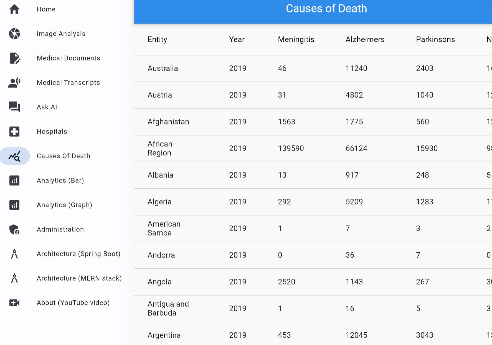
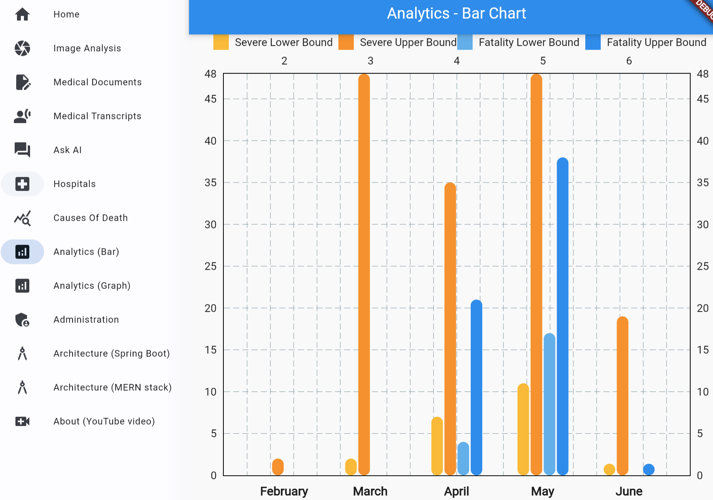
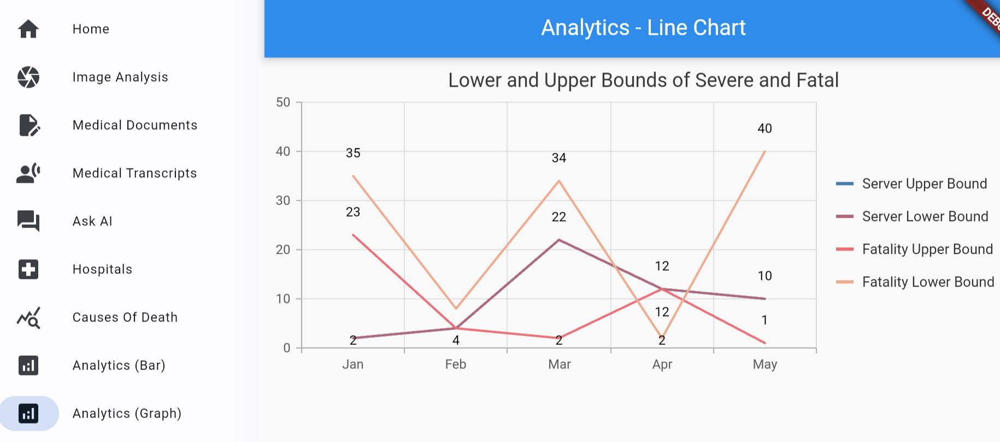

# Full Stack Application for Analytics

## Introduction

This lab will show you how view analytics of AI call results and other data stored in the Oracle database.

Estimated Time: 5 minutes.

### Objectives

* View analytics of AI information stored in the database.
* Understand the backend and frontend code.

### Prerequisites

- Completion of Setup lab

## Task 1: Run the application

   1. Open the frontend via your preferred method as was done in setup and select the `Causes of Death` item from the sidebar menu and notice the analytics.
      

   2. Select the `Analytics (Bar)` item from the sidebar menu and notice the analytics.
      

   3. Select the `Analytics (Graph)` item from the sidebar menu and notice the analytics.
      

## Task 2: Understand the code

   1. Notice the `/flutter-frontend/lib/analytics*.dart and hospitals.dart` source code and how it creates a request to the Spring Boot backend and parses the JSON response into a resultant analytics formats.

   2. Notice the `/springboot-backend/src/main/java/oracleai/HealthDataController.java` source code and how it creates a requests to the database and passes the JSON response back to the frontend.

You may now **proceed to the next lab.**..

## Acknowledgements

* **Author** - Paul Parkinson, Architect and Developer Advocate, Oracle Database
* **Last Updated By/Date** - 2024