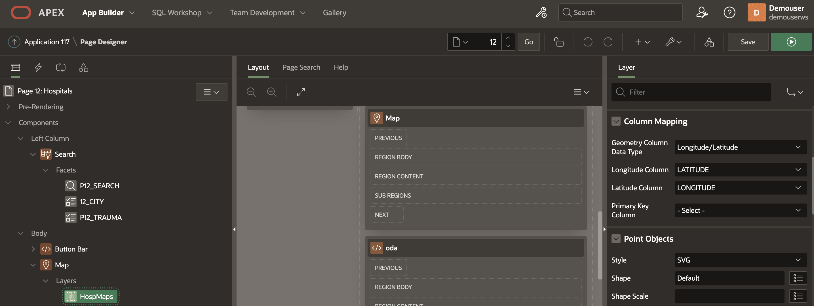

# Oracle APEX Maps and Spatial queries to locate nearest Hospitals

## Introduction

This workshop walks you through the steps of locating Hospitals based on location and patient trauma.

Estimated Time: 20 minutes.  
 
### Objectives

In this lab, you will:
 
* Create the required schema
* Update SDO_GEOMETRY Column
* Create Oracle APEX Faceted Search
* Create Oracle APEX Map and Map Layer
* Demo of finding Hospital on Map based on Location and Trauma selected.
* Query to locate the nearest Hospital within a given radius
  
### Prerequisites

This lab assumes you have:

* Completed previous labs of this workshop: **Setup environment** and logged into **Oracle APEX workspace**

### About Spatial Geometry Objects

Spatial geometry objects are drawn on the background map based on data in a table. That table can be sourced from local table or a SQL query. Maps created using the Create Page Wizard or in Page Designer, support both local database tables, REST Enabled SQL, and from REST Data Sources. Maps support a rich set of built-in marker icons and shapes. Supported spatial geometry objects include:
* Points - Points (for example, customer or supplier locations) display as markers.
* Lines - Lines represent features like roads or paths.
* Polygons - Polygons represent areas like parcels, states or countries.
* Heat Map - Heat Maps are used to visualize the point density. The more points that are clustered together, the more intense the color becomes. Use this option to visualize the spatial distribution of population or incidents.
* Extruded Polygons - Display as three-dimensional, extruded, objects. The height of the 3D object visualizes a column value.

You can source spatial geometry objects from either:

* Geometry Column - Supported datatypes include SDO_GEOMETRY, VARCHAR2, or CLOB. VARCHAR2 and CLOB columns must contain geometry information in GeoJSON format.
Two Numeric Columns - These columns must contain longitude and latitude values. This option only applies to Point and Heat Map objects.

### About Spatial Data
Oracle Database stores spatial data (points, lines, polygons) in a native data type called SDO_GEOMETRY. Oracle Database also provides a native spatial index for high performance spatial operations. This spatial index relies on spatial metadata that is entered for each table and geometry column storing spatial data. Once spatial data is populated and indexed, robust APIs are available to perform spatial analysis, calculations, and processing.

The SDO_GEOMETRY type has the following general format:

  ```sql
<copy>
    SDO_GEOMETRY( 
        [geometry type],           --ID for point/line/polygon
        [coordinate system],       --ID of coordinate system
        [point coordinate],        --for points only
        [line/polygon info],       --for lines/polygons only
        [line/polygon coordinates] --for lines/polygons only
    )
</copy>
```
  
## Task 1: Create the required schema

1. From **APEX workspace** select **SQL Workshop** and **SQL Commands** option.
 
    
  
    ```sql
    <copy>
    CREATE TABLE  "US_HOSPITALS" 
    (	
        "ID_1" NUMBER GENERATED BY DEFAULT ON NULL AS IDENTITY MINVALUE 1 MAXVALUE 9999999999999999999999999999 INCREMENT BY 1 START WITH 1 CACHE 20 NOORDER  NOCYCLE  NOKEEP  NOSCALE  NOT NULL ENABLE, 
        "LATITUDE" NUMBER, 
        "LONGITUDE" NUMBER, 
        "OBJECTID" NUMBER, 
        "ID" NUMBER, 
        "NAME" VARCHAR2(255) COLLATE "USING_NLS_COMP", 
        "ADDRESS" VARCHAR2(255) COLLATE "USING_NLS_COMP", 
        "CITY" VARCHAR2(50) COLLATE "USING_NLS_COMP", 
        "STATE" VARCHAR2(50) COLLATE "USING_NLS_COMP", 
        "ZIP" NUMBER, 
        "TELEPHONE" VARCHAR2(50) COLLATE "USING_NLS_COMP", 
        "TYPE" VARCHAR2(50) COLLATE "USING_NLS_COMP", 
        "STATUS" VARCHAR2(50) COLLATE "USING_NLS_COMP", 
        "POPULATION" NUMBER, 
        "COUNTY" VARCHAR2(50) COLLATE "USING_NLS_COMP", 
        "COUNTYFIPS" NUMBER, 
        "COUNTRY" VARCHAR2(50) COLLATE "USING_NLS_COMP",  
        "NAICS_CODE" NUMBER, 
        "NAICS_DESC" VARCHAR2(255) COLLATE "USING_NLS_COMP", 
        "SOURCE" VARCHAR2(255) COLLATE "USING_NLS_COMP", 
        "WEBSITE" VARCHAR2(255) COLLATE "USING_NLS_COMP", 
        "OWNER" VARCHAR2(255) COLLATE "USING_NLS_COMP", 
        "TTL_STAFF" NUMBER, 
        "BEDS" NUMBER, 
        "TRAUMA" VARCHAR2(50) COLLATE "USING_NLS_COMP", 
        "SHAPE" "SDO_GEOMETRY", 
        PRIMARY KEY ("ID_1")
    USING INDEX  ENABLE
    )  DEFAULT COLLATION "USING_NLS_COMP" 
    VARRAY "SHAPE"."SDO_ELEM_INFO" STORE AS SECUREFILE LOB 
    VARRAY "SHAPE"."SDO_ORDINATES" STORE AS SECUREFILE LOB
        
    </copy>
    ```

    > **Note** 1: For Hospital data you can google search for *us hospital dataset with latitude and longitude* and choose the dataset of your choice that contains the required table columns below. Other columns are optional

    * LATITUDE
    * LONGITUDE
    * NAME or HOSPITAL NAME
    * TRAUMA
    * STATE or CITY

## Task 2: Update SDO_GEOMETRY Column

1. The **Shape** column in the above table is of type **SDO_GEOMETRY** which can be generated by Latitude and Longitude data of a row by using update query. sample data of that column are.

    ```sql
    <copy>
        [Point (40.7283,-111.8780)]
    </copy>
    ```

    Where 40.7283 is LONGITUDE and -111.8779698 is LATITUDE

    ```sql
    <copy>
        update US_HOSPITALS
        set x = sdo_geometry( 2001,null,
                    sdo_point_type( LONGITUDE ,LATITUDE,null),
                    null,null )
        where LATITUDE is not null;
        commit;
    </copy>
    ```

## Task 3: Create Oracle APEX Faceted Search

1. Create [**Oracle APEX Faceted**](https://docs.oracle.com/en/database/oracle/apex/22.1/htmdb/creating-a-faceted-search-manually.html) search with 2 database columns, that is Trauma and City

    

## Task 4: Create Oracle APEX Map and Map Layer

1. Create Oracle APEX Map that has datasource coming from US_HOSPITALS table, 

    

2. Create **Map Layer** that has been mapped to **LONGITUDE** and **LONGITUDE** columns under Column Mapping, Layer type should be **Point**. Enable **Advanced Formatting**, HTML Source code display Hospital details are as shown below.

    ```html
    <copy>
        <b>&NAME.</b><br/>
        &TRAUMA.</br>
        &CITY.&STATE. &COUNTY. &ZIP.<br/>  
        {if WEBSITE/}
        Web: &WEBSITE. <br>
        {endif/}
        {if TELEPHONE/}
        Phone: &TELEPHONE.<br>
        {endif/} 
    </copy>
    ```

    

## Task 5: Demo of finding Hospital on Map based on Location and Trauma selected.

1. Select Location and Hospital

    

2. Click on Map pin to find details about the Hospital such as Contact number, specialization, website, address and other required details

    

## Task 6: Query to locate the nearest Hospital within a given radius (Optional)

1. Sometimes you will have coordinates of the source location, that is, the place where a patient is currently located, and you would want to find the nearest hospital within a radius of a few kilometres from the source (patient). In that case, use the below query.
 
    ```sql
    <copy>
        select a.ID_1, b.NAME, b.TRAUMA 
        from 
        US_HOSPITALS A,
        US_HOSPITALS B
        where A.ID_1 = id_var
        AND SDO_WITHIN_DISTANCE(
        GET_GEOMETRY(A.LONGITUDE, A.LATITUDE),
        A.SHAPE,
        'distance=dist_var unit=km') = 'TRUE' 
    </copy>
    ```

    Replace id\_var and dist\_var as per your requirement. where dist_var is the radius distance of hospital to patient location.  for example 

    ```sql
    <copy>
    select a.ID_1, b.NAME, b.TRAUMA 
    from 
    US_HOSPITALS A,
    US_HOSPITALS B
    where A.ID_1 = 93 AND TRAUMA='GENERAL MEDICAL'
    AND SDO_WITHIN_DISTANCE(
    GET_GEOMETRY(A.LONGITUDE, A.LATITUDE),
    A.SHAPE,
    'distance=1 unit=km') = 'TRUE'
    </copy>
    ```

       
 
 
    > **Congratulations**, you have completed **Oracle APEX Maps and Spatial queries to Locate Hospitals** Lab. The subsequent labs are optional, however, please proceed to the next lab to learn more about **Oracle Analytics Cloud for Clinical Data Analysis**. 

## Learn More

* [Spatial queries involving lattitude and longitude](https://asktom.oracle.com/pls/apex/f?p=100:11:::::P11_QUESTION_ID:9539156000346599825)
* [Oracle APEX Product homepage](https://apex.oracle.com/)
* [Oracle Spatial Product homepage](https://www.oracle.com/database/spatial)

## Acknowledgements
* **Author** - Madhusudhan Rao B M, Principal Product Manager, Oracle Database
* **Last Updated By/Date** - May 23rd, 2023.