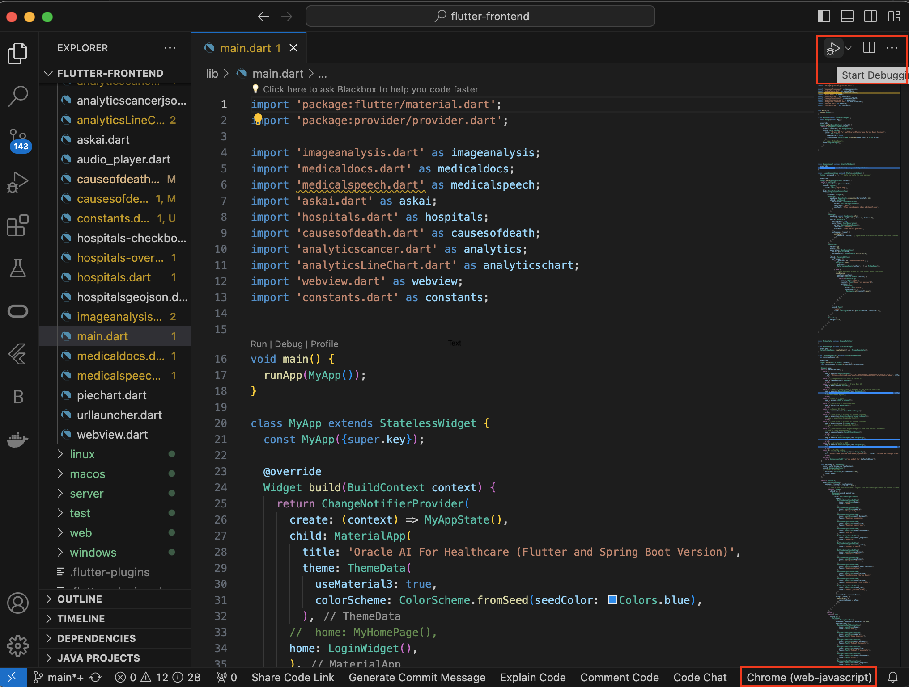
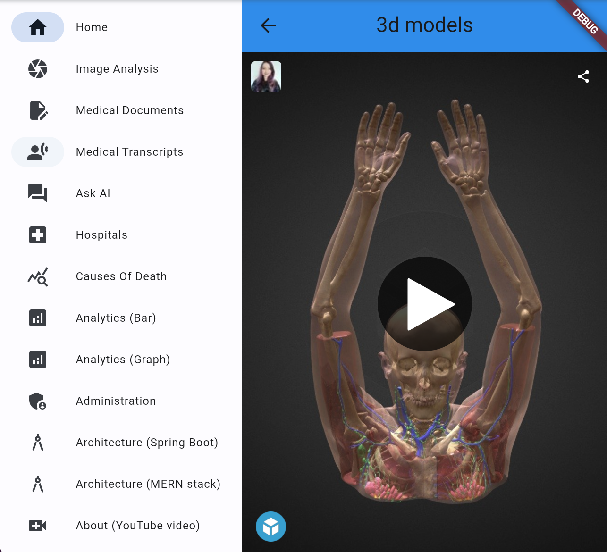

# Clone, Build, and Test Run the Workshop Source

## Introduction

This lab will show you how to clone/download and build the source code for the open source AI application.

Estimated Time:  10 minutes

### Objectives

-   Clone the workshop source code
-   Build the microservices
-   Run the frontend and backend microservice and make a test call from frontend to the backend

### Prerequisites

- Completion of Setup lab
- Many build options are provided
  - Build using the code environment you are comfortable with such as Maven and Java with IntelliJ, Flutter with VS Code, etc.
  - Build the code as part of the Docker image creation process.  In this case, the only prerequisite is to have Docker.
  - The last lab in the workshop also shows how you can deploy the application to Kubernetes within minutes.  If you decide to go this route, then you have another option to use the OCI Shell and IDE to build and run the entire workshop in your browser.

## Task 1: Clone workshop source code

   1. Clone workshop code

    Download the src to a location on your computer using the follow git clone command:

    ```
    <copy>git clone https://github.com/paulparkinson/oracle-ai-for-sustainable-dev.git</copy>
    ```

    The code you will work with throughout the workshop is in the `health` directory of the source you cloned/downloaded.

    BE SURE TO NOTE THE LOCATION OF THIS `health` FOLDER AS YOU WILL NEED IT IN THE NEXT STEPS.  WE WILL REFER TO THIS LOCATION AS `[WORKSHOP_SRC_DIR]` IN THE REMAINDER OF THIS LAB.

   2. Create an .env file in the `health` directory in a text editor. You will populate the values in this file as part of this lab. It will look something like this (also see the .env.examples file):

    ```code
    <copy>
      OCICONFIG_FILE=~/.oci/config
      OCICONFIG_PROFILE=DEFAULT
      COMPARTMENT_ID=ocid1.compartment.oc1..mycompartmentvalue
      OBJECTSTORAGE_NAMESPACE=myobjectstorenamespacename
      OBJECTSTORAGE_BUCKETNAME=myobjectstorebucketname
      ORDS_ENDPOINT_URL=https://myordsendpointurl
      ORDS_ENDPOINT_URL=https://my-aidatabaseworkshop.adb.us-ashburn-1.oraclecloudapps.com/ords/aiuser/_sdw/
      OCI_VISION_SERVICE_ENDPOINT=https://vision.aiservice.myregion.oci.oraclecloud.com
      OCI_SPEECH_SERVICE_ENDPOINT=https://speech.aiservice.myregion.oci.oraclecloud.com
      OCI_GENAI_SERVICE_ENDPOINT=https://genai.aiservice.us-chicago-1.oci.oraclecloud.com
    </copy>
    ```

## Task 2: Build the microservices

   1. Decide whether you'd like to build using your own development environment (eg Java and Maven, Flutter, ...) or build the source within the Docker container.  
      You can also do a combination.  For example if you are a frontend developer, you can build the Java Spring Boot backend within the Docker image itself and build the Flutter frontend using VS Code.

   2. If you'd like to build within Docker image itself, issue the following commands (replacing [WORKSHOP_SRC_DIR] accordingly)

    ```
    <copy>cd [WORKSHOP_SRC_DIR]/springboot-backend/ ; ./buildInDocker.sh</copy>
    ```

    ```
    <copy>cd [WORKSHOP_SRC_DIR]/flutter-frontend/ ; ./buildInDocker.sh</copy>
    ```


   3. If you'd like to build using your own development environment, issue the following commands

    ```
    <copy>cd [WORKSHOP_SRC_DIR]/springboot-backend/ ; ./build.sh</copy>
    ```
    
    or you can open `[WORKSHOP_SRC_DIR]/springboot-backend/` in an IDE such as IntelliJ and issue the maven clean, package, etc. commands from there.

    ```
    <copy>cd [WORKSHOP_SRC_DIR]/flutter-frontend/ ; ./build.sh</copy>
    ```

      or you can open `[WORKSHOP_SRC_DIR]/flutter-frontend/` in an IDE such as VS Code, select the `lib/main.dart`, select the platform/device in the bottom right, and select build/run/debug in the upper right.

      


## Task 3: Run the microservices and make a test call from the frontend to the backend

   1. Depending on whether you are running using a Docker image or language native commands, you will issue either `runDocker.sh` or `run.sh` commands in the same `springboot-backend` and `flutter-frontend` directories or, as mentioned in the previous task, you can run from within the IDE. The service should be listening on port 8080 by default.


   2. Open your browser, if not automatically opened, and go to `http://localhost:5000`


   3. You should see a homepage such as the following.  If you see a 3D model in the main view pane then both frontend and backend are running successfully and you have connectivity between the two.

       

We must of course setup the AI components for the application to be fully functional, however, we now have an open source full stack application to build our AI functionality upon.

You may now **proceed to the next lab.**..

## Acknowledgements

* **Author** - Paul Parkinson, Architect and Developer Advocate, Oracle Database

* **Last Updated By/Date** - Ramona Magadan, Technical Program Manager, October 2024