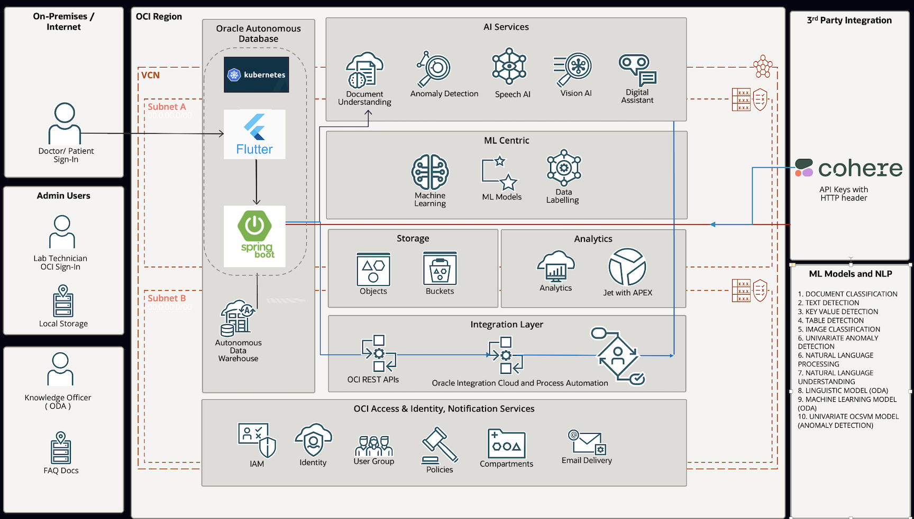
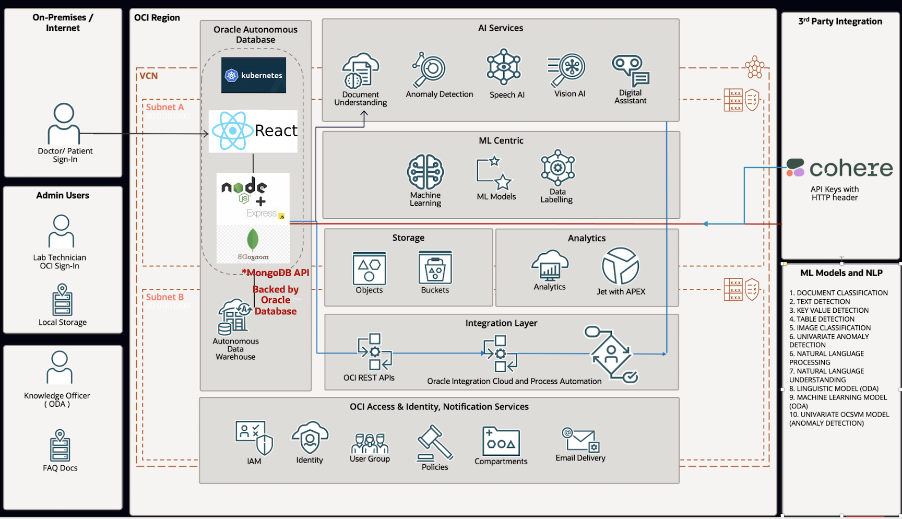

# Introduction

## About this workshop

Machine Learning and Artificial Intelligence tools are creating unprecedented innovation in modern healthcare. 

In this workshop, we will show how Oracle AI and Database Services help facilitate this change and will do so using an array of Open Source languages, platforms, and stacks including the following.

*AI for Healthcare - Flutter And Spring Boot Stack*

*AI for Healthcare - (in future version) MERN (MongoDB, Express, React, NodeJS) Stack*

*Estimated Workshop Time will vary depending upon the Labs that you choose to do*

Estimated Workshop Time: 4 hours

### Objectives

In this workshop, you will learn how to:
* Provision and populate an Oracle Autonomous Database.
* Setup OCI configuration for access to OCI AI services from outside the database.
* Understand Oracle OCI AI services including Vision AI, Speech AI, Language AI, and Gen AI in a number of different ways including the Oracle Database to achieve an optimal architectural solution.
* Train Vision AI models and use Oracle Vision AI classification to detect issues such as breast cancer in X-Rays.
* Use Oracle Vision AI text detection and document understanding to create reports from medical bill receipts, etc.
* Use Oracle Speech AI transcriptions as a prompt to Oracle Gen AI in order to obtain medical advice.
* Train Oracle Data Assistant (ODA) models and use them for conversational AI based on medical information.
* Use Oracle Spatial to identify the location of hospitals with certain capabilities on a map.
* Optionally deploy your AI full stack application as microservices in a Kubernetes cluster.

### Prerequisites 
 
This lab assumes you have the following:

* An Oracle account

## Important

This workshop provides a basic example of using OCI Vision and other AI services. This example is for illustration and demonstration purposes only and isn't intended to replace any medical imagery analysis tool or official diagnosis recommendation made by a professional. Users need to receive the proper regulated compliance and approvals before using for medical and diagnostic use.

You may now **proceed to the next lab**.
    
## Acknowledgements

* **Author** - Paul Parkinson, Architect and Developer Advocate
* **Last Updated By/Date** - Paul Parkinson, 2023