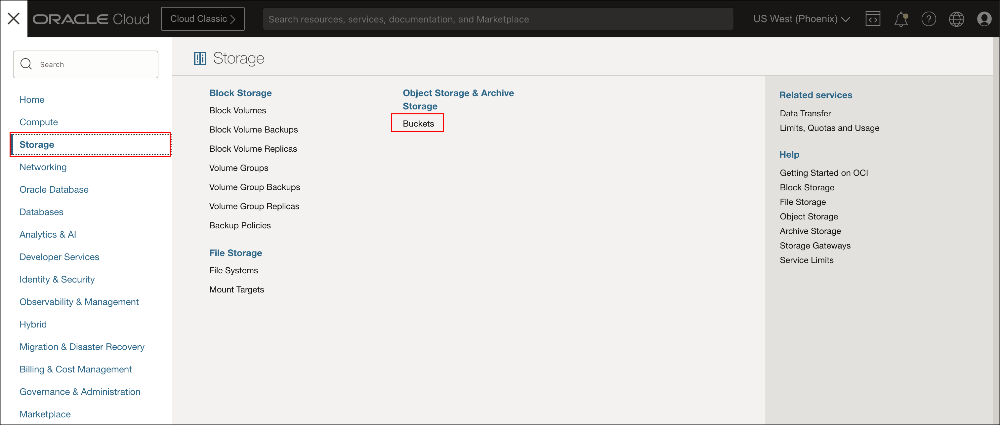
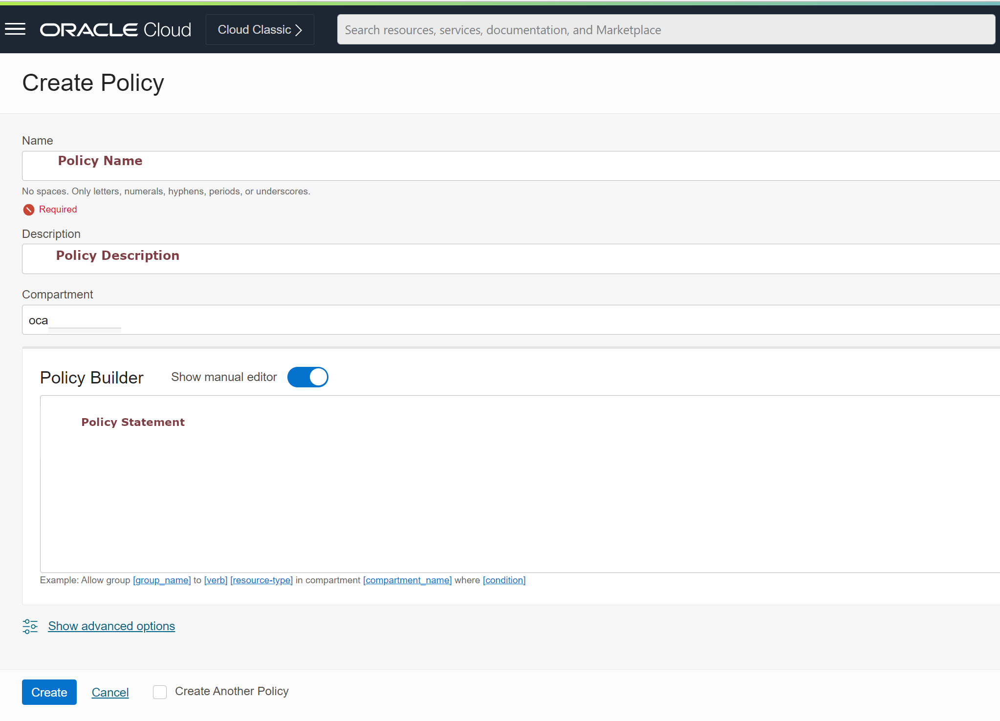
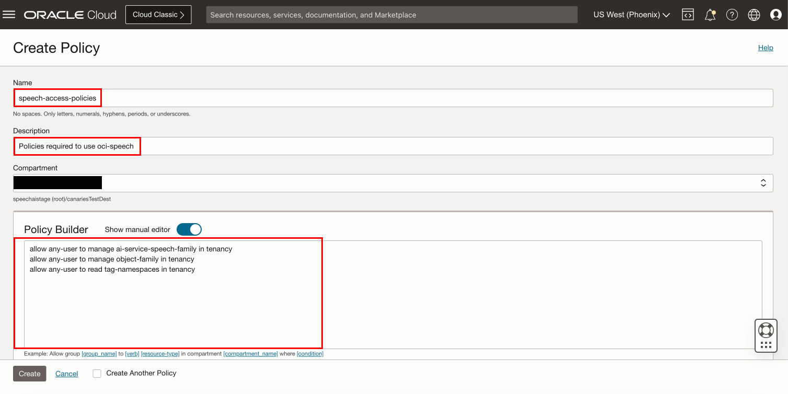
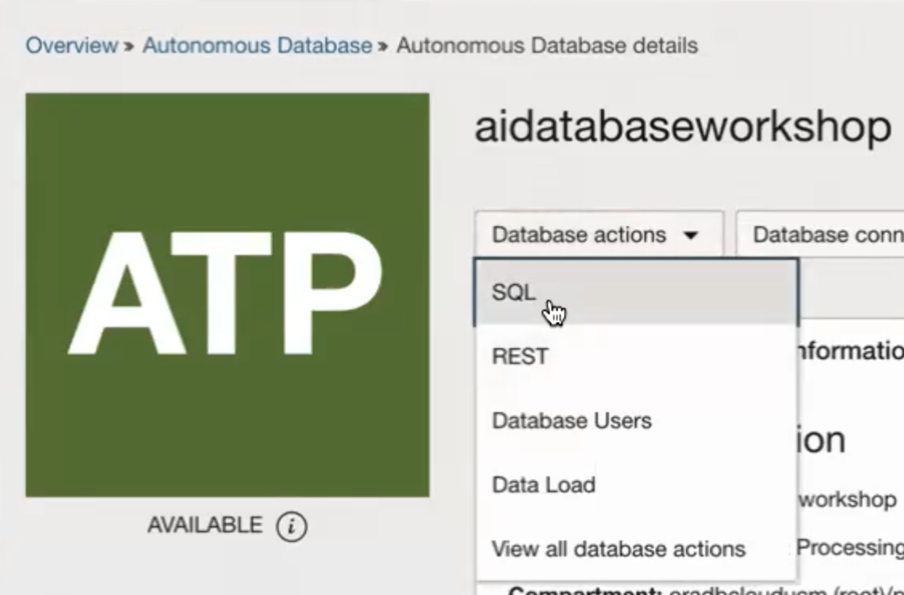

# Provision Database, Setup OCI, and Configure Application

## Introduction

In this lab, we will set up the required policies to run through the workshop as non-administrative users. However, you can skip most parts of this lab if you have administrative access.

### About OCI Policies

If you're just trying out Oracle Cloud Infrastructure or doing a proof-of-concept project with infrastructure resources, you may not need more than a few administrators with full access to everything. In that case, you can simply create any new users you need and add them to the Administrators group. The users will be able to do anything with any kind of resource. And you can create all your resources directly in the tenancy (the root compartment). You don't need to create any compartments yet, or any other policies beyond the Tenant Admin Policy, which automatically comes with your tenancy and can't be changed.

Please read more about [OCI Policies](https://docs.oracle.com/en-us/iaas/Content/Identity/Concepts/policygetstarted.htm) before creating or changing any OCI policies.

Estimated time: 5 to 40 minutes depending on requirements

### Objectives

In this lab, you will:

* Clone workshop source code
* Create OCI Bucket
* Create a new compartment
* Setup policies for Compartment management
* Setup policies for OCI AI Services
* Create the Oracle Database
* Create database user, tables, and functions/stored procedures and expose as ORDS Rest endpoints
* Configure access to Oracle Cloud services including keys and config file
* Populate the env.properties file with values gathered during setup to provide the application with the information needed to access the Oracle Database and Oracle AI Services.


### Prerequisites

This lab assumes:

* You have an Oracle Cloud account with OCI and Tenancy administration privileges to create policies and compartments. 

    > **Note:**  Policies are only required if you cannot create or use a OCI resources. If you are a tenancy administrator, you will have access to all the resources, and you can **optionally skip policy creations in this lab**.
  
## Task 1: Clone workshop source code

   1. Clone workshop code

      Verify you have cloned/downloaded the src as instructed in the [Clone and Build lab](../clone-and-build/clone-and-build.md). 
      And verify you are working in the `health` directory of the source you cloned/downloaded.

      ```
## Task 2: Log into OCI 

   1. Login into OCI

       To setup environment, you need OCI administrator's privileges. If you've got these privileges, login into OCI at [cloud.oracle.com](https://www.oracle.com/cloud/sign-in.html). the below image indicates SSO Login as an administrative user. If you have administrative privileges and complete access over a tenancy then you need not create any of the policies below steps.
   
       
   
       If you do not have administrative privileges into tenancy, you might have to login as federated user, that is the user created by the administrator
   
       
   
       In case you haven't got OCI administrator's privileges, you should ask your OCI administrator to perform the rest of the tasks in this lab.


## Task 3: Configure access to Oracle Cloud services including keys and config file

   If you have not already done so, configuring client access to OCI Services is an extremely convenient way to develop and test and is required by this workshop.

   If you have setup client/CLI access then you may skip this task.

   1. First create a location to store the keys and config file which is generally `~/.oci`
   
   ```
       <copy>mkdir ~/.oci</copy>
   ```

   2. You will create a key_file and a `config` file and place them in this directory. The config file will take the following format.

   ``` text
       [DEFAULT]
         user=ocid1.user.oc1..<unique_ID>
         fingerprint=<your_fingerprint>
         key_file=~/.oci/oci_api_key.pem
         tenancy=ocid1.tenancy.oc1..<unique_ID>
         region=us-ashburn-1
   ```

   3. Directions for creating the key and fingerprint can be found here: https://docs.oracle.com/en-us/iaas/Content/API/Concepts/apisigningkey.htm#apisigningkey_topic_How_to_Generate_an_API_Signing_Key_Console
   and the region, tenancy, and user OCIDs can be found in the OCI console. Simply paste them and save the `config` file.

      


   4. If you have not used default values, modify the values for OCICONFIG\_FILE and OCICONFIG\_PROFILE in the env.properties file


## Task 4: Create OCI Bucket
  
   You need to upload the audio files into Oracle object storage, to be used in the transcription job(s) in next steps.

   1. Create an Object Storage Bucket (This step is optional in the case where the bucket is already created)

       First, From the OCI Services menu, click Object Storage.
       
   
       Then, Select Compartment from the left dropdown menu. Choose the compartment matching your name or company name.
       
   
       Next click Create Bucket.
       
   
       Next, fill out the dialog box:
       * Bucket Name: Provide a name <br/>
       * Storage Tier: STANDARD
   
       Then click Create
       


   2. Provide the values for OBJECTSTORAGE\_NAMESPACE and OBJECTSTORAGE\_BUCKETNAME in the env.properties file

## Task 5: Create a new compartment

   You will use one compartment for all required objects in this workshop, hence you need to use an existing one or create one.

   1. Navigate to Compartments page
   
       In OCI console, open the **Navigator** menu. Navigate to **Identity & Security** and then choose **Compartments**.
   
       

   2. Create a new compartment if necessary

       The list of all active compartments is displayed. Click **Create Compartment** to start creating a new compartment.
   
       

   3. Review compartment details

       Provide the value for COMPARTMENT_ID OCID in the env.properties file
   
       
    
## Task 6: Setup policies for Compartment management

   If not already present or not running with admin privileges, you need to create a **policy** which grants manage privileges in a new compartment to the new OCI group.

   1. Navigate to **Policies** page

       Use **Navigator** to navigate to **Identity & Security** and choose **Policies**.
   
       

   2. Create a new policy

       In the **Policies** page click **Create Policy**.
   
       

   3. Define a new policy

       Provide a new Policy **Name** and **Description**.
   
       This policy is set at the *root* compartment level, therefore select the *root* compartment of your tenancy.
   
       In **Policy Builder** section, search for **Let compartment admins manage the compartment** in the **Common policy templates** pulldown list.
   
       Make sure **Groups** option is selected and then choose your newly created OCI Group from the list of available OCI Groups. For **Location**, select parent compartment which can also be *root* compartment.
    
       Your policy should look like this:
   
      ```text
      <copy>Allow group < group name > to manage all-resources in compartment < compartment name > </copy>
      ```
      
       for example, 
   
       ```text
        <copy>Allow group AIDEMOGroup to manage all-resources in compartment aidemo</copy>
       ```

## Task 7: Setup policies for OCI Vision service

   Similarly to Data Labeling service, you will require some privileges to use OCI Vision service. 

   > **Note:** Please refer [OCI AI Vision Policies](https://docs.oracle.com/en-us/iaas/vision/vision/using/about_vision_policies.htm) for more information related to this policy.

   1. Navigate to **Policies** page. In the **Navigator** to navigate to **Identity & Security** and now choose **Policies**.

      

   2. Create a new policy

       In the **Policies** page click **Create Policy**.
   
       
  
   3. Define policies to access Vision service

       Provide a name of a new policy and description in **Create Policy** dialog page. In the **Policy Builder** section enable **Show manual editor** and enter the following policy, You can provide any name and description for this policy
   
       Policy statement 
    
       ```text
       <copy>allow group AIDEMOGroup to manage ai-service-vision-family in tenancy
       allow group AIDEMOGroup to manage object-family in tenancy</copy>
       ``` 
   
       
   
       Click **Create**. 
   
       You are now ready to start using OCI Vision service.
   4. Set the value of `OCI_VISION_SERVICE_ENDPOINT` in the env.properties file to the appropriate value. This simply entails replacing `myregion` with your region, such as `us-ashburn-1`.
  
## Task 8: Setup policies for OCI Speech

   Before you start using OCI Speech, your tenancy administrator should set up the following policies by following below steps:

   > **Note:** Please refer [OCI Speech Policies](https://docs.oracle.com/en-us/iaas/Content/speech/using/policies.htm) for more information related to this policy.

   1. Create a new policy with the following statements:

       If you want to allow all the users in your tenancy to use speech service, create a new policy with the below statement:
   
       ```
       <copy>
       allow any-user to manage ai-service-speech-family in tenancy
       allow any-user to manage object-family in tenancy
       allow any-user to read tag-namespaces in tenancy
       allow any-user to use ons-family in tenancy
       allow any-user to manage cloudevents-rules in tenancy
       allow any-user to use virtual-network-family in tenancy
       allow any-user to manage function-family in tenancy
       </copy>
       ```
       
   
       If you want to limit access to a user group, first create a group
   
       Navigate to OCI groups:
           
   
       Click "Create Group"
           
   
       Add group name and description, click create
           
   
       To add users click "Add User to Group" and select user from dialog
           
   
       Create a new policy with the below statement, replace  group-name with your group name
   
       ```
           <copy>
           allow group <group-name> to manage ai-service-speech-family in tenancy
           allow group <group-name> to manage object-family in tenancy
           allow group <group-name> to read tag-namespaces in tenancy
           allow group <group-name> to use ons-family in tenancy
           allow group <group-name> to manage cloudevents-rules in tenancy
           allow group <group-name> to use virtual-network-family in tenancy
           allow group <group-name> to manage function-family in tenancy
           </copy>
      ```
   
        
   2. Set the value of `OCI_SPEECH_SERVICE_ENDPOINT` in the env.properties file to the appropriate value. This simply entails replacing `myregion` with your region, such as `us-ashburn-1`.


## Task 9: Create an Oracle Autonomous Database if necessary

If you have a database instance already, you may skip this task.

   1. From the OCI console select `Oracle Database` and then `Autonmous Transaction Processing`.
      
   2. Click the `Create Autonomous Database` button.
      
   3. Select the appropriate compartment to place the database in and provide a database name (any name will suffice).
      
   4. Provide a password for the `ADMIN` user.
      
   5. Click the `Create Autonomous Database` button.
      
   6. The database will begin provisioning. Notice the `Database actions` button.
      
   7. Click the `Database actions` button and the `SQL` item from the drop-down list. After a moment the SQL Worksheet will appear.
      

 
## Task 10: Create the database user, tables, functions, etc. to use for the workshop

Policy creation steps for this service is same as all other services defined in above tasks, only the statement would change


   1. Copy and paste the contents of the `create_aiuser.sql` file in the `sql` directory of the source you cloned/downloaded earlier and replace `[Yourpassword]` with a password for the `AIUSER`.  (If you have a database user already, you may remove the first line that creates the user and replace references to it with your user.)
      
   2. Select the run script button to execute the SQL statements.
      
   3. Click the upper left drop-down menu and select `Database Users`.
      
   4. Find the `AIUSER` create, click the options drop-down menu (three dots) and select `Enable Rest`.
      
   5. On the screen that pops up simply click `REST Enable User`.
      
   6. Select the `Copy to clipboard` button at the bottom right of the panel. Paste this as the value for `ORDS_ENDPOINT_URL` in the `env.properties` file, however, remove the trailing `_sdw/` so that the value is similar to `https://yourdatabaseserviceid.adb.yourregion.oraclecloudapps.com/ords/aiuser/`
      
   7. Select the drop-down menu in the upper right (which should currently show as `ADMIN`), and click `Sign Out`.
      
   8. Now log back in as the `AIUSER`.
      
   9. Under **Database actions**, Select **SQL** from the options on the screen.
      <!--  Commented by Madhu -->  
      
      You can view various navigation options available, select **SQL**
      
   10. Copy and paste the contents of the `aiuser-tables-indexes-functions.sql` file in the `sql` directory of the source you cloned/downloaded earlier
      
   11. Replace the values in the dbms\_cloud.create\_credential call with those in your oci config file from earlier. Note you can read the private_key in from file or paste the 
      
   12. Select the run script button to execute the SQL statements.
      
   13. Verify the SQL statements ran correctly. We will describe what each of these tables, functions, etc. does in the 
      
 
Congratulations. You have now set up an elaborate and robust cloud, AI, and database infrastructure and configured a full stack application to use it. 

You should also have all of the necessary values in the env.properties file and the rest of workshop will now show off these features and architecture.

This concludes this lab. You can **proceed now to the next lab**.
   
## Learn More

* [OCI Documentation](https://docs.oracle.com/en-us/iaas/Content/home.htm)
* [Data Labeling Service](https://docs.oracle.com/en-us/iaas/data-labeling/data-labeling/using/about.htm)
* [Configure OCI CLI](https://docs.oracle.com/en-us/iaas/Content/API/SDKDocs/cliconfigure.htm)
* [OCI Speech Policies](https://docs.oracle.com/en-us/iaas/Content/speech/using/policies.htm)
* [OCI Object Storage](https://docs.oracle.com/en-us/iaas/Content/Object/Concepts/objectstorageoverview.htm)
* [Anomaly Detection Policies](https://docs.oracle.com/en-us/iaas/Content/anomaly/using/policies.htm)
 
## Acknowledgements

* **Author** - Madhusudhan Rao B M, Principal Product Manager, Oracle Database
* **Author** - Paul Parkinson, Architect and Developer Advocate, Oracle Database

* **Last Updated By/Date** - June 2024.
* **Update** - Database Actions screen